# Architecture

## Goal

Make `gh copilot` and `copilot` CLI on a developer laptop hit a **customer-private**
Azure OpenAI / Microsoft Foundry deployment instead of GHCP SaaS, without the laptop
ever talking to a public model endpoint. The developer authenticates to the private
APIM gateway with **one of two interchangeable credentials** — a per-developer **APIM
subscription key** (the default) or a per-developer **Entra JWT** — and APIM is the only
party that ever holds backend access.

## Trust boundary

The diagram below shows the whole system: the developer credential choice
(`authMode`), the backend choice (Foundry vs AOAI vs both), and the GitHub-SaaS path
(config-only, off by default). Solid lines are the **default** path; dashed lines are
**optional / config-selectable**.

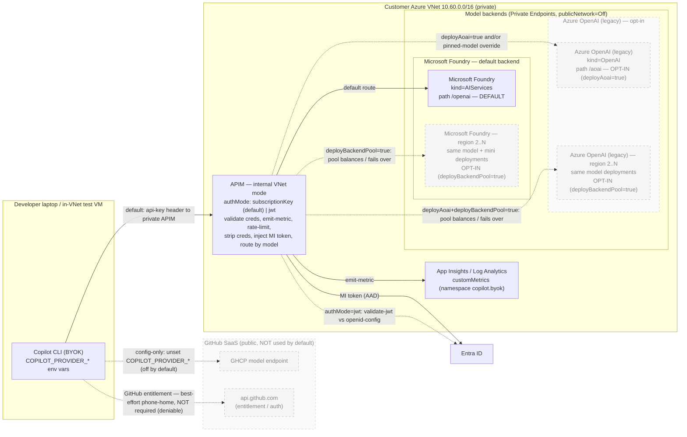

> Greyed/dashed boxes are **opt-in** — nothing in the default deployment creates them. The
> **region 2…N** Foundry box turns on with `deployBackendPool=true` (and a `foundryRegions` list);
> the whole **Azure OpenAI** column (primary + its region 2…N) is off unless you set
> `deployAoai=true` (legacy path), and its secondary region needs `deployBackendPool=true` as well.
> When enabled, APIM fronts each backend's primary plus every regional account through a single
> load-balanced **Pool** backend — see
> [Multi-region backend pools (opt-in)](#multi-region-backend-pools-opt-in).

Key points the diagram encodes:

- **APIM is the only entity that holds backend access.** Its system-assigned managed
  identity is granted `Cognitive Services OpenAI User` on each deployed account.
- **Foundry is the default backend** (APIM path `/openai`); **AOAI is optional** (path
  `/aoai`) and can be deployed alongside Foundry, instead of it, or not at all.
- **The GitHub-SaaS model path is off by default** — it is only used if the developer
  does *not* set the `COPILOT_PROVIDER_*` env vars. The BYOK wrapper sets them, pointing
  the CLI at the private APIM gateway.
- **GitHub entitlement traffic is best-effort, not required** — empirically (Gov test VM,
  2026-06-01) the CLI runs BYOK end-to-end with **no GitHub login, no Copilot subscription,
  and `api.github.com` egress denied**. The `api.github.com` phone-home is attempted by
  default but is not a hard dependency, so a fully-private deployment denies it at the
  network layer. See [github-egress-allowlist.md](github-egress-allowlist.md). Either way it
  is auth/licensing, not model traffic.

## Why the classic APIM Developer SKU (the AI gateway is tier-agnostic)

A frequent question is whether this should use the “APIM v2 AI gateway” instead. Two facts,
both from Microsoft Learn, settle it:

1. **The AI gateway is not a v2 feature — it applies to *all* API Management tiers.** The
   [AI gateway capabilities](https://learn.microsoft.com/en-us/azure/api-management/genai-gateway-capabilities)
   doc is headed *“APPLIES TO: All API Management tiers”* and states the AI gateway *“extends
   API Management's existing API gateway; it's not a separate offering.”* The token-limit,
   token-metric, content-safety, backend load-balancing, and semantic-caching policies all run
   on the classic **Developer** SKU. This design already uses them — the policy applies the
   official `azure-openai-token-limit` AI-cost guard and emits per-developer token metrics.
2. **APIM v2 tiers are not available in Azure Government.** The
   [v2 tiers region-availability](https://learn.microsoft.com/en-us/azure/api-management/api-management-region-availability)
   table lists commercial regions only — no `USGov`/`USDoD` regions — so Gov runs on the
   **classic** tiers (Consumption, Developer, Basic, Standard, Premium). The Developer SKU is
   the right pilot choice there; production can scale to classic Standard/Premium.

What genuinely *is* v2-only doesn't affect this scenario: the **Anthropic Messages API schema**
(*“currently supported in API Management v2 tiers”*), some portal import wizards, and the
**Foundry-embedded AI gateway (preview)**. Copilot CLI speaks the OpenAI Chat Completions /
Responses schema, which the classic tiers support fully.

The dev laptop has:

1. A per-developer credential — an **APIM subscription key** (default) or a short-lived
   **Entra JWT** (`authMode=jwt`).
2. The Copilot CLI configured via `COPILOT_PROVIDER_*` env vars to send that credential
   as the "API key" to a private APIM hostname.

## Authentication modes

The gateway accepts exactly one caller credential, chosen at deploy time by the
`authMode` parameter. **Both modes deliver the same per-developer telemetry and
rate-limiting; they differ in how the developer's identity is established and how the
secret is managed.** The credential always rides in the `api-key` header, because the
Copilot CLI cannot send custom headers (issue #3399) and that is the only header slot it
exposes.

| `authMode` | Caller credential | How identity is established |
|---|---|---|
| `subscriptionKey` **(default)** | Per-developer **APIM subscription key** | APIM validates the key natively; developer identity = the APIM **subscription** (Id/Name) |
| `jwt` | Per-developer **Entra JWT** (`az account get-access-token`) | `validate-jwt` against Entra; developer identity = `oid`/`preferred_username` claims |

### Why subscription-key is the default

`authMode=subscriptionKey` is the **recommended starter default** — a proposal, not a
mandate. It standardizes on **one APIM subscription key per developer**, which most teams
can adopt with zero changes on the developer side (a long-lived static key fits the CLI's
static-credential model and any keys already in their tooling). It also sidesteps the
**~1-hour Entra token expiry**: a subscription key is long-lived, so there is no
per-invocation token mint and no token-refresh wrapper to run. Teams that want
cryptographic per-user identity should evaluate `authMode=jwt` below.

`authMode=jwt` is retained as an opt-in **stronger control** (true per-user identity,
short-lived tokens, instant revocation). Switching modes is a single parameter flip plus
redeploy — no structural change, because both policy variants and all named values are
always present.

> **`authMode=jwt` validated end-to-end in Azure US Government (2026-06-03).** A live probe
> from the in-VNet test VM against the Gov gateway (`copilot-byok-foundry`, Internal VNet)
> returned **HTTP 200** with a `gpt-5.1` completion when a Gov Entra JWT was supplied in the
> `api-key` header, and **HTTP 401** ("invalid Entra token") for a bad token — confirming
> `validate-jwt` enforcement and the full chain *CLI → APIM (validate-jwt) → strip creds →
> APIM system-MI token for `cognitiveservices.azure.us` → private-endpoint Foundry*. The CLI's
> lack of custom-header support (github/copilot-cli#3399) is **not** a blocker: the JWT rides
> in the single `api-key` header slot and the policy re-injects it as `Authorization: Bearer`.
> Tokens mint with `az account get-access-token --scope "<AppId>/.default"` (v2 `aud` = the
> app client-ID GUID). Gov OIDC metadata resolves at `login.microsoftonline.us`. Note: `gpt-5.1`
> requires `max_completion_tokens` (not `max_tokens`).

### Mode A — subscription key (default)

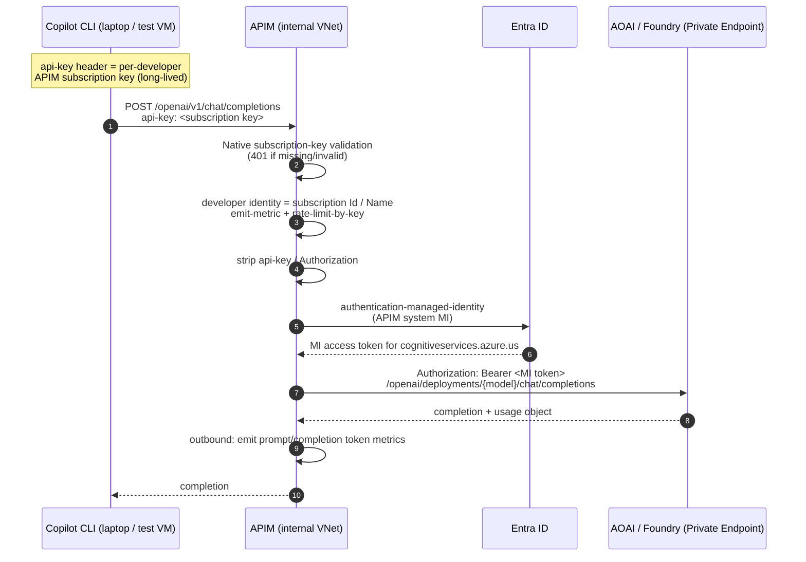

### Mode B — Entra JWT (opt-in stronger control)

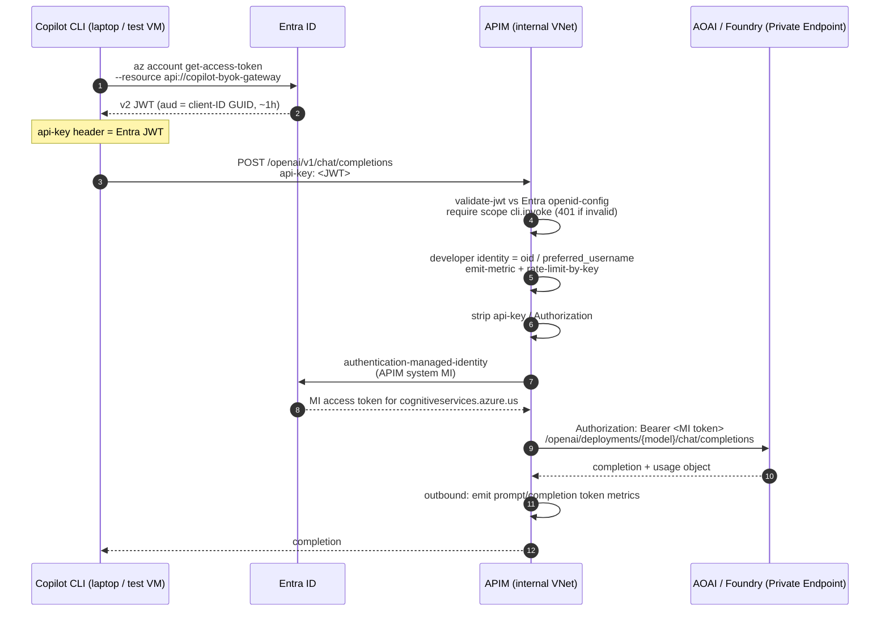

### Side-by-side comparison

| Dimension | `subscriptionKey` (default) | `jwt` |
|---|---|---|
| Recommended posture | ✅ Recommended starter default | Opt-in stronger control / upgrade |
| Per-developer identity | Per **subscription** (one key = one dev, by convention) | Per **Entra user** (cryptographic `oid`) |
| Secret lifetime | Long-lived key (rotate manually) | ~1 hour, minted per invocation |
| Secret on disk | Yes — key sits in CLI config | No — token is ephemeral |
| Revocation | Disable/rotate the APIM subscription | Disable user / remove app-role in Entra (instant) |
| Token-refresh wrapper needed | No | Yes (mint before each session) |
| Works around 1h Entra expiry | ✅ | N/A (that is the 1h) |
| Header slot used | `api-key` | `api-key` |
| Native gateway enforcement | ✅ APIM validates the key | Policy `validate-jwt` |
| Telemetry dimensions | `developer_oid`/`developer_upn` = subscription Id/Name | `developer_oid`/`developer_upn` = Entra `oid`/`upn` |

Because the metric **dimension names are identical** in both modes, the workbook and the
`monitoring/kql/*.kql` queries work unchanged regardless of `authMode` — only the
*values* of `developer_oid`/`developer_upn` differ (subscription identity vs Entra
identity).

### Two tokens, two issuers (`authMode=jwt`)

> This subsection applies to `authMode=jwt`. In the default `subscriptionKey` mode there
> is only **one** token in play — APIM's MI token for the backend hop — and the caller
> presents a long-lived subscription key instead of a JWT.

In `jwt` mode there are deliberately **two different Entra tokens** in play, and neither
is minted by APIM's own logic:

| Hop | Token | Minted by | Proves |
|---|---|---|---|
| Client → APIM | Entra JWT (caller identity) | Entra, via `az account get-access-token` on the dev's machine | *This developer* may use the gateway |
| APIM → AOAI | Entra JWT (APIM managed identity) | Entra, via the `authentication-managed-identity` policy | *APIM* may call AOAI |

APIM **cannot** mint the caller's JWT — a JWT is signed by Entra's private key, and the
whole purpose of `validate-jwt` is to verify a token APIM did **not** issue against
Entra's published public keys (`openid-config`). If APIM issued the token it verified,
the check would be circular and prove nothing. APIM only mints its *own* MI token for
the backend hop.

End-to-end the flow is:

1. Dev runs `az account get-access-token --scope "<clientId>/.default"` → Entra returns
   a v2 JWT (`aud` = client-ID GUID).
2. The wrapper puts that JWT in the `api-key` header and POSTs to APIM.
3. APIM `validate-jwt` verifies it against Entra `openid-config` and checks scope
   `cli.invoke`.
4. APIM strips the dev's credential, then `authentication-managed-identity` → Entra
   issues APIM's **own** MI token for AOAI.
5. APIM attaches the MI token as `Authorization: Bearer` and forwards to the private
   AOAI endpoint.

### Upstream CLI dependencies & the token-refresh gap (`authMode=jwt`)

Two distinct Copilot CLI limitations shape `jwt` mode. They are often conflated — they
are not the same problem.

| Limitation | Effect on this design | Upstream issue |
|---|---|---|
| **No custom headers** — the CLI exposes only the `api-key` slot | The JWT is *smuggled* in the `api-key` header and the policy re-injects it as `Authorization: Bearer` so `validate-jwt` can read it (steps 1–2 of [byok-foundry-policy.xml](../policies/byok-foundry-policy.xml)) | [github/copilot-cli#3399](https://github.com/github/copilot-cli/issues/3399) *(open, Feature)* |
| **Static credential, read once at startup** — no refresh hook | The ~60–90 min Entra token expires mid-session → APIM returns **401** with no way for the CLI to re-mint. Requires an external refresh mechanism (a local token-refreshing sidecar proxy) | *No upstream issue exists yet* — see [docs/feature-request-byok-credential-refresh.md](feature-request-byok-credential-refresh.md) |

**If #3399 ships (custom headers):** the change is *cosmetic cleanup only*. The JWT moves
into a real `Authorization: Bearer <jwt>` header (e.g. `COPILOT_EXTRA_HEADERS`), and the
policy's api-key→Bearer re-injection (steps 1–2) can be deleted because `validate-jwt`
reads `Authorization` natively. **The expiry cliff is unchanged** — custom headers are
still read once at startup, so the sidecar is still required.

**The transformational fix is the missing one** — a credential *refresh* capability (a
per-request credential command, a file-backed credential the CLI re-reads, or native
OAuth client-credential refresh). That would let us **delete the sidecar** and make `jwt`
mode seamless. It is *not* #3399 and *not* #3448 (extra request params); it does not yet
exist upstream, so we draft it in [feature-request-byok-credential-refresh.md](feature-request-byok-credential-refresh.md).

Until then the decision matrix is unchanged: **`subscriptionKey` stays the default**
(long-lived, no refresh machinery), and **`jwt` is the opt-in stronger control** that
ships with a token-refreshing sidecar.


## Wire format

GitHub Copilot CLI (>= 1.0.20, `azure` provider type) sends an **OpenAI-style v1**
request with the model/deployment in the request **body**, not the URL:

```
POST {COPILOT_PROVIDER_BASE_URL}/v1/chat/completions
api-key: <whatever was in COPILOT_PROVIDER_API_KEY>
Content-Type: application/json

{ "model": "gpt-5.1", "messages": [ ... ] }
```

`COPILOT_PROVIDER_BASE_URL` includes the `/openai` path, so the full frontend path
APIM exposes is `/openai/v1/{chat/completions,completions,embeddings}`.

APIM accepts this and:

1. Reads the `api-key` header. (CLI cannot send custom headers — issue #3399.) In
   `subscriptionKey` mode the API has `subscriptionRequired: true` with
   `subscriptionKeyParameterNames.header = api-key`, so APIM validates the key
   **natively** (401 on missing/invalid) before the policy runs; in `jwt` mode the
   header carries the Entra JWT and `validate-jwt` is the credential check.
2. (`jwt` mode only) `validate-jwt` against Entra OpenID metadata, require scope
   `cli.invoke`, audience = our API app's **client-ID GUID** (with v2 access tokens the
   `aud` claim is the appId GUID, not the `api://` URI).
3. Establish the developer identity — in `jwt` mode from the `oid` and
   `preferred_username` claims; in `subscriptionKey` mode from the APIM subscription
   Id/Name — and parse the `model` field from the request body to get the target
   deployment name.
4. `emit-metric` `copilot_byok_request` with dimensions `developer_oid`,
   `developer_upn`, `deployment_name`.
5. Delete `api-key` and `Authorization` headers.
6. `authentication-managed-identity resource="{{aoai-mi-audience}}"` — APIM mints
   an AAD token for AOAI and attaches it as `Authorization: Bearer ...`.
7. `rewrite-uri` to the classic AOAI deployment-scoped path
   `/openai/deployments/{model}/{chat/completions|completions|embeddings}` and
   set the `api-version` query param (override).
8. Route to private AOAI FQDN (resolved via privatelink zone in the VNet).

> **Failure mode — model parsing.** The deployment name is derived solely from the
> `model` field in the request body. If the body is not valid JSON (a common shell
> quoting mistake — see the deployment guide), the parse falls back to `"unknown"`,
> APIM rewrites to `/openai/deployments/unknown/...`, and AOAI returns
> `DeploymentNotFound`. The policy guards this by returning a `400` with a clear
> message when the model cannot be parsed, so the failure is not mistaken for a
> missing deployment.

> **Failure mode — `api-version` too old.** The injected `api-version` comes from the
> `aoai-default-api-version` named value (Bicep param `defaultAoaiApiVersion`, default
> `2025-04-01-preview`). The `gpt-4.1` / `gpt-5.1` model families require
> `2025-04-01-preview` or later — an older value (e.g. `2024-10-21`) makes the backend
> return `404 Resource not found` even though the deployment exists. If you see a 404
> from a deployment you know is live, check this named value first.

> **Failure mode — `max_tokens` vs `max_completion_tokens`.** The `gpt-5.x` family
> rejects `max_tokens` with a `400` (`'max_tokens' is not supported with this model; use
> 'max_completion_tokens'`). `gpt-4.1-mini` still accepts `max_tokens`. Because the
> sentinel `auto` route can land on either tier, clients that set a token cap should send
> `max_completion_tokens` so the request works regardless of which tier the prompt routes to.

## Backend & routing choices

There are three independent "where does the model live" choices. Two are baked at deploy
time (Bicep params); the third is a pure developer-side config decision.

| Choice | Controlled by | Default | Notes |
|---|---|---|---|
| **Microsoft Foundry** (kind=AIServices) | `deployFoundry` (Bicep) | **`true` (default backend)** | Exposed at APIM path `/openai`. This is what new traffic hits and the recommended/standard backend. |
| **Azure OpenAI** (kind=OpenAI, legacy) | `deployAoai` (Bicep) | **`false` (opt-in)** | Exposed at APIM path `/aoai`. Disabled by default — only enable for a legacy `/aoai` path. Can run alongside Foundry or instead of it. |
| **GitHub SaaS model** | `COPILOT_PROVIDER_*` env vars (developer config) | **not used** | Only used if the developer does *not* point the CLI at the private gateway. |

### Decision flow

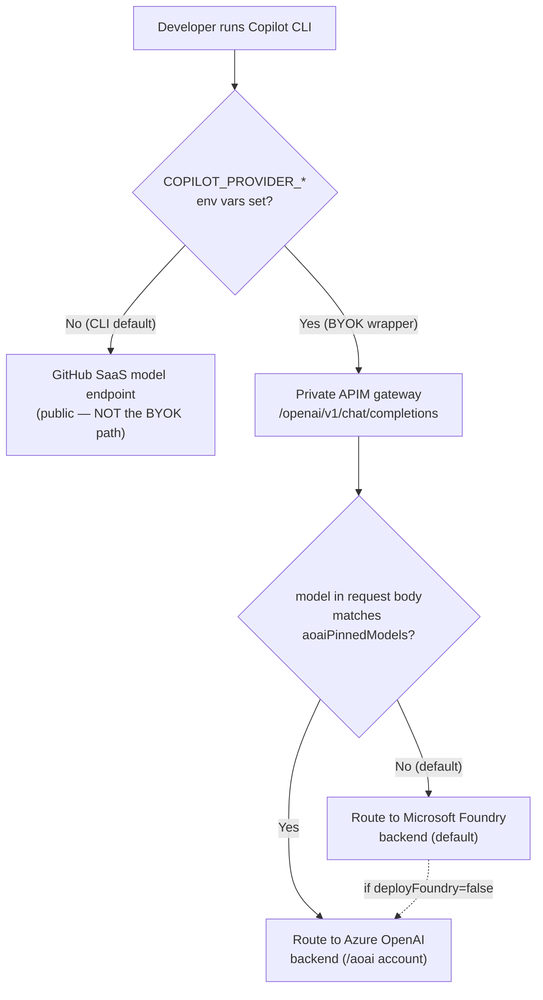

- **Foundry is the default route.** On the default API (`/openai`), every request goes to
  the Foundry backend unless its `model` matches `aoaiPinnedModels`.
- **`aoaiPinnedModels`** (comma-separated, case-insensitive) lets specific model names be
  rerouted from Foundry to the classic AOAI backend *in policy*, without the caller
  changing URLs. This is on top of the separate legacy `/aoai` path.
- **Foundry-only is the default**, and both single-backend modes are valid: `deployAoai`
  defaults to `false` so Foundry runs alone; set `deployAoai=true` to add the legacy AOAI
  backend, or `deployFoundry=false` to run only the legacy AOAI backend.
- **Foundry uses the OpenAI-compatible surface**, so its MI audience and role are
  identical to classic AOAI (`Cognitive Services OpenAI User` on
  `cognitiveservices.azure.*`). The native Foundry surface (`ai.azure.*`) is not used.
- **GitHub SaaS is never the BYOK default.** The whole point of the BYOK wrapper is to
  set `COPILOT_PROVIDER_*` so traffic goes to the private gateway. Leaving those unset is
  the only way the CLI falls back to GitHub's public model endpoint.

### Tiered auto model-routing

A developer can send the **sentinel model `auto`** (instead of a concrete model name) to let
the gateway pick the cheapest deployment that can handle the request. This deploys a second,
smaller **"mini" deployment** on each backend (the cheap tier) alongside the full model, and
adds a routing block to the APIM policy. Explicit model names always bypass routing.

| Tier | Model (Gov pilot) | Used when |
|---|---|---|
| **Full** | `gpt-5.1` (DataZoneStandard) | Coding/debugging, long or technical prompts, ambiguous prompts (fail-safe) |
| **Mini** | `gpt-4.1-mini` (DataZoneStandard) | Short, non-coding, conversational prompts |

The decision is two levels:

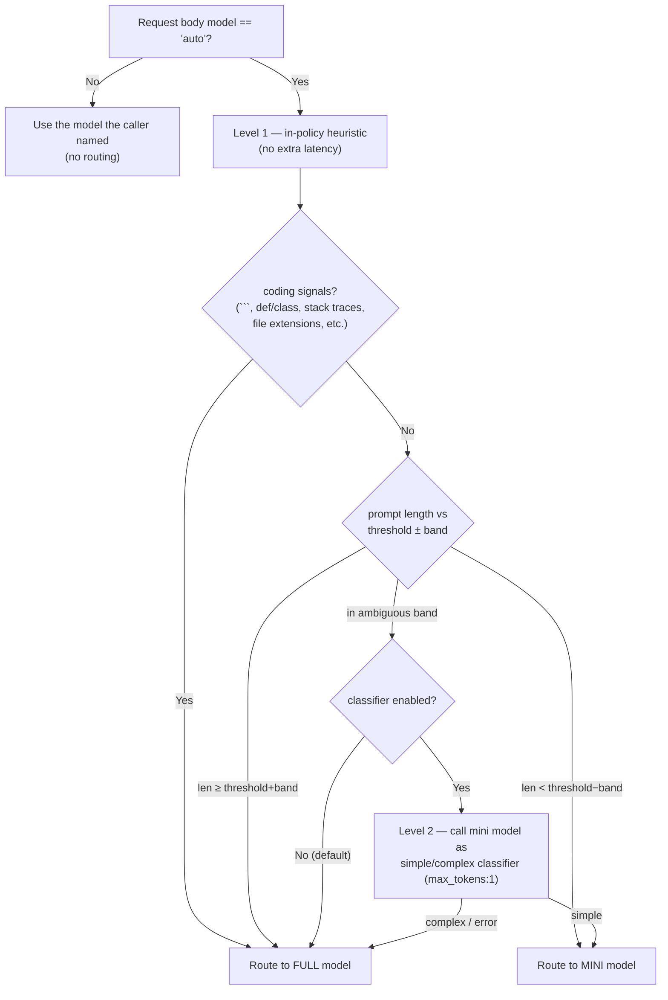

- **Level 1 (heuristic)** runs entirely in the APIM policy with zero added round-trips: it
  concatenates all `messages[].content`, scans for coding signals via regex, and compares the
  total length to `autoRouteLengthThreshold` (default 500 chars) with a ± `autoRouteAmbiguousBand`
  (default 200) dead-zone.
- **Level 2 (classifier)** is **off by default** (`autoRouteClassifierEnabled=false`). When on,
  *only* ambiguous-band prompts trigger a single `max_tokens:1` call to the mini deployment that
  replies `simple` or `complex`; any non-200/error fails safe to the full model. This adds one
  round-trip **only** on the ambiguous band.
- The resolved deployment name overwrites the body `model`, so the token metrics and
  `rewrite-uri` see the real model. An `auto_route` dimension on the request metric records the
  decision (`mini` / `full` / `ambiguous` / `none`) for cost analysis.
- Routing is present in **all four** policy variants (subscription-key and JWT × Foundry and AOAI).
  Tuning knobs are APIM **named values** (`auto-route-*`), so the threshold, band, and classifier
  toggle can be changed without redeploying Bicep.

## How APIM reaches the backend: managed identity vs API key

There are two ways to wire APIM to a Foundry/AOAI backend, and the Azure portal "Import
Azure OpenAI / Foundry" wizard picks the *other* one from what this project uses. They are
**two orthogonal choices** the wizard happens to bundle together:

| Axis | Portal wizard default | **This project (chosen)** |
|---|---|---|
| **Auth to the backend** | Foundry/AOAI **API key**, stored as an APIM named value / Backend secret | **Entra managed-identity bearer token** (`authentication-managed-identity` → `Authorization: Bearer`) |
| **Backend reference** | APIM **Backend entity** (Backends tab) → `set-backend-service backend-id="…"` | APIM **Backend entity** by `set-backend-service backend-id="{{…-backend-id}}"` — a single Url backend by default, a load-balanced **Pool** when multi-region is enabled |

The two axes are independent: a Backend entity can *also* carry a managed identity, and an
inline `base-url` could *also* use a key. The wizard simply ties "Backend entity" to "key".
This project deliberately uses **managed identity + a Backend entity** — taking the wizard's
resiliency-capable Backend reference but keeping MI auth instead of a key.

### Pattern A — Portal wizard: Backend entity + API key

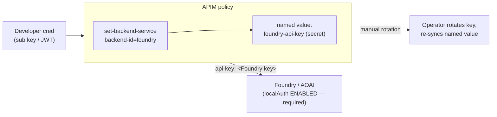

**Pros:** one-click in the portal; the Backend *entity* unlocks built-in **circuit breaker**
rules and load-balanced **backend pools** (priority/weight) for multi-region or PTU→PAYG
failover. **Cons:** requires `disableLocalAuth=false` on the account (a standing secret
exists); the key must be rotated and the named value re-synced (a classic silent-outage
source); backend logs attribute calls to an anonymous shared key, not a named identity.

### Pattern B — This project: managed identity + Backend entity

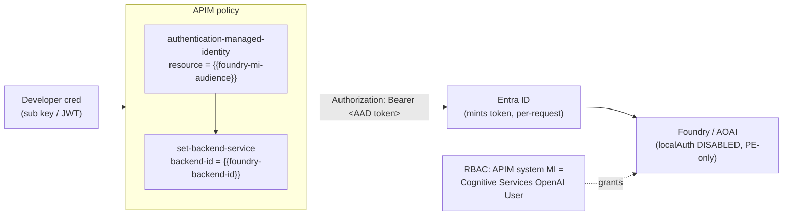

**Pros:** **no secret exists** — the account runs with `disableLocalAuth=true`, so there is
nothing to leak or rotate; tokens are minted per-request and auto-rotated by the platform;
the backend attributes every call to the APIM MI **principal** (real audit identity) gated by
least-privilege `Cognitive Services OpenAI User` RBAC; it composes cleanly with the PE-only,
zero-trust posture this design already enforces. Because routing goes through a Backend
entity, **circuit breakers and load-balanced pools are available without re-architecting** —
see the opt-in multi-region section below. **Cons:** a Backend entity is one extra resource
per account vs an inline URL (negligible), and pooling requires granting the MI RBAC on every
regional member.

### Why this project leans on managed identity

On the **auth axis the choice is decisive**: managed identity is strictly better for this
threat model. The wizard's key approach would force us to *re-enable* local auth on a PE-only
account — directly weakening the design — and add a rotation/drift burden for no benefit.
Managed identity is also Microsoft's recommended production pattern in the GenAI / AI-gateway
reference architectures. So we keep MI everywhere (all four policy variants use
`authentication-managed-identity`).

On the **backend-reference axis**, every policy now targets an APIM **Backend entity** by
`backend-id` (a named value: `foundry-backend-id` / `aoai-backend-id`). With pooling off this
is a single **Url backend** — functionally identical to the old inline base-url, but it gives
us the seam to attach resiliency primitives (circuit breaker, load-balanced pools) without
touching the policies. **Managed identity stays the auth method in every case**, single-region
or pooled: one Entra token (audience = the shared Cognitive Services audience) is valid against
*every* regional account, so pooling composes with MI for free. The only thing that ever
changes is which backend the `backend-id` named value points at.

### Multi-region backend pools (opt-in)

Set `deployBackendPool: true` and list extra regions in `foundryRegions` (and/or `aoaiRegions`)
to deploy regional AI accounts and have APIM load-balance / fail over across them — while the
managed-identity auth route is unchanged.

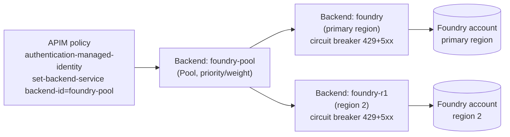

What the opt-in does, end to end:

- **Accounts** — `foundryRegions` / `aoaiRegions` each deploy a secondary Cognitive Services
  account (`infra/modules/foundry.bicep` / `aoai.bicep`, disambiguated by a `regionTag`) with
  the **same** model and mini deployment names/versions as the primary, so explicit-model and
  auto-route requests work against any member. Private endpoints land in the primary VNet's PE
  subnet (cross-region PE is supported) and register in the shared private DNS zones.
- **Backends + pool** — `infra/modules/apim-backends.bicep` creates one **Url backend** per
  region plus a **Pool backend** (`foundry-pool` / `aoai-pool`). The `backendPoolStrategy` param
  controls member distribution: `weighted` = **active/active** (every region priority 1, weight
  100 → load-balanced round-robin); `priority` (default) = **active/passive** (primary priority 1,
  secondaries priority 2+ → they serve only when higher tiers trip/are down). The
  `foundry-backend-id` named value flips from `foundry` to `foundry-pool` automatically.
- **Circuit breaker** — `enableBackendCircuitBreaker` (default on when pooling) trips a member
  out of rotation on **429 + 5xx** within `breakerInterval` and **honors `Retry-After`**, so a
  PTU 429 spills over to the next region promptly instead of failing the caller. Tune with
  `breakerFailureCount` / `breakerTripDuration`.
- **In-request retry** — the policy `<backend>` wraps `<forward-request>` in a `<retry>` on
  transient **429/5xx** (`count=2`, `first-fast-retry`). The circuit breaker isolates a bad
  region *across* requests; this retry re-selects the next healthy pool member *within the same*
  request so a single transient failure doesn't surface to the caller. It is a no-op for a single
  Url backend, so it ships safely in every deployment.
- **RBAC — the must-not-forget step** — because MI mints one token valid against all accounts,
  `infra/modules/rbac.bicep` grants the APIM MI **Cognitive Services OpenAI User** on *every*
  regional account. A member the MI lacks rights on returns 401/403 and silently poisons the
  pool.

Two caveats this design accepts: the auto-route **Level-2 classifier** still calls the
*primary* base URL directly (via `foundry-private-base-url`, retained for exactly this reason),
not the pool — fine for a `max_tokens:1` probe; and the secondary regional accounts must host
the same deployment names for routing to be uniform. With `deployBackendPool: false` (default)
none of this is created and behavior is identical to a single transparent Url backend.

#### Workflow 1 — load distribution (`backendPoolStrategy: weighted`, active/active)

Every region has equal priority/weight, so APIM round-robins each request across all members.
This spreads token throughput over multiple regional capacities (useful when one region's PTU /
quota can't absorb the whole developer fleet). The managed-identity hop is unchanged — the same
MI token is valid against every member.

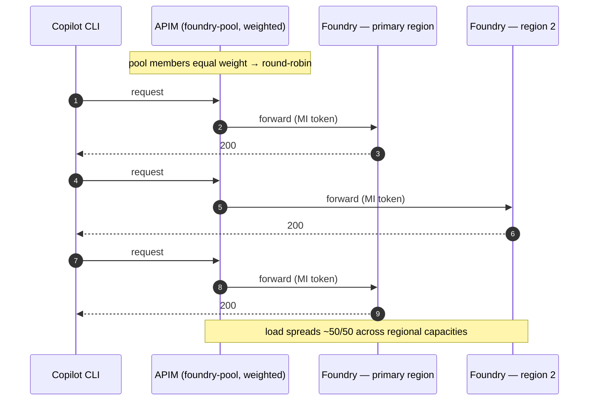

> **Verifying the split.** App Insights stamps each dependency with the **gateway's** region
> (constant), *not* the backend's — so don't judge distribution by the dependency "Region"
> property. Use the backend **host** instead (`<acct>` = primary, `<acct>r1/r2…` = regional
> members): [`monitoring/kql/requests-per-backend-region.kql`](../monitoring/kql/requests-per-backend-region.kql)
> buckets requests by `parse_url(target).Host` to show the true per-region counts.

#### Workflow 2 — resiliency / automatic failover

Two independent mechanisms keep a failing region from reaching the caller:

- **In-request retry** (every deployment, even single-region): the policy `<retry>` re-forwards a
  transient **429/5xx** onto the next healthy pool member *within the same request*, so one
  blip never surfaces.
- **Circuit breaker** (default-on with the pool): after `breakerFailureCount` failures
  (429 + 5xx) in `breakerInterval`, APIM **trips the member out of rotation** for
  `breakerTripDuration` and honors any `Retry-After`. With `backendPoolStrategy: priority` the
  secondary is **active/passive** — it serves *only* while the primary is tripped, then traffic
  returns to the primary automatically when the breaker resets.

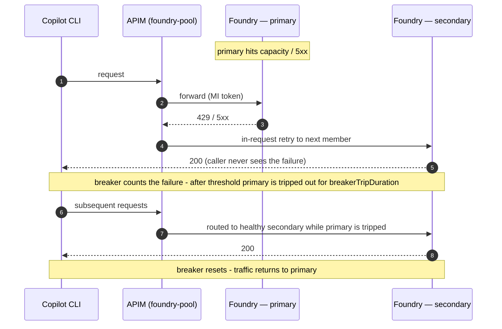

With `backendPoolStrategy: priority` this is classic **active/passive DR**; with `weighted` it is
**active/active** that simply drops the tripped member from the rotation until it recovers.

#### Does splitting a conversation across regions break consistency?

No — and it's worth understanding *why*, because it's a common worry. Chat completions are
**stateless**: the model holds no server-side memory between calls, and the client (Copilot CLI)
resends the **entire conversation** in the `messages` array on every turn. So if turn 1 lands in
region A and turn 2 lands in region B, turn 2's request already carries turn 1's question *and*
answer — region B reconstructs the full context from scratch, exactly as region A would have.
There is nothing per-region to "share."

| Factor | Shared across regions? | Why it's fine |
| --- | --- | --- |
| Conversation history | Yes — lives in the **client**, resent each turn | the stateless contract guarantees it |
| Model weights / version | Yes — same model + pinned version in every region | identical deployments |
| System prompt / sampling params | Yes — set by the caller per request | caller-controlled |
| KV-cache / attention state | No — per-request, never persisted | rebuilt from `messages` every call |

The only thing that could make regions *diverge* is a **model-version skew** — which is exactly
why every regional account must host the **same model, version, and deployment names** as the
primary (the example parameter files and the pool routing both depend on this). Output wording can
still vary run-to-run because sampling is non-deterministic (`temperature > 0`), but that is
inherent to the model, not caused by multi-region — pin `temperature: 0` + a fixed `seed` if you
need reproducibility. This design uses plain stateless completions only; it does **not** rely on
any server-side stateful feature (e.g. Assistants/`responses` threads or region-pinned prompt
caching), so traffic is safe to spread across regions.

## Cloud parameterization

The template runs in **both** Azure commercial (`AzureCloud`) and Azure Government
(`AzureUSGovernment`). A single `cloudEnv` param drives a `cloudVars` map in
[`infra/main.bicep`](../infra/main.bicep) that derives every cloud-specific endpoint;
no module hardcodes a `.us` or `.com` host. The pilot defaults to Gov because that is
the first customer — switching to Commercial is a parameter change, not a code change
(see [Targeting a different cloud](#targeting-a-different-cloud)).

| Concept | AzureCloud (Commercial) | AzureUSGovernment | Where it's set |
|---|---|---|---|
| `cloudEnv` value | `AzureCloud` | `AzureUSGovernment` | param |
| Entra login host | `login.microsoftonline.com` | `login.microsoftonline.us` | `cloudVars` |
| Microsoft Graph (scripts) | `graph.microsoft.com` | `graph.microsoft.us` | `az cloud show` (derived) |
| Resource Manager (CLI) | `management.azure.com` | `management.usgovcloudapi.net` | `az cloud set` |
| CogSvc / OpenAI MI audience | `https://cognitiveservices.azure.com` | `https://cognitiveservices.azure.us` | `cloudVars` |
| OpenAI public DNS suffix | `openai.azure.com` | `openai.azure.us` | `cloudVars` |
| OpenAI privatelink zone | `privatelink.openai.azure.com` | `privatelink.openai.azure.us` | `cloudVars` |
| Cognitive privatelink zone | `privatelink.cognitiveservices.azure.com` | `privatelink.cognitiveservices.azure.us` | `cloudVars` |
| `services.ai` privatelink zone | `privatelink.services.ai.azure.com` | *(none — Gov has no services.ai zone)* | `cloudVars` (`''` = skip) |
| APIM gateway DNS zone | `azure-api.net` | `azure-api.us` | `cloudVars` |
| Typical model deployment SKU | `GlobalStandard` | `DataZoneStandard` (GlobalStandard N/A in usgovvirginia) | param |

The Bicep takes a single `cloudEnv` param (`AzureCloud` | `AzureUSGovernment`)
and derives everything in the `cloudVars` map (`var v = cloudVars[cloudEnv]`); every
module is fed `v.*` values. **Identical across both clouds:** the RBAC role-definition
GUIDs, the injected `api-version`, the APIM Developer SKU, and all four policy XML files
(they reference cloud values only through APIM named values).

### Targeting a different cloud

Because the cloud abstraction already exists, retargeting is a values exercise, not a
rewrite. To stand the gateway up in **Commercial**:

1. **Sign in to the right cloud** before anything else:
   ```pwsh
   az cloud set --name AzureCloud      # (AzureUSGovernment for Gov)
   az login
   az account set --subscription "<commercial sub id>"
   ```
   The Entra setup and developer wrapper scripts read the active cloud automatically
   (`setup-entra` derives the Graph endpoint from `az cloud show`; the wrappers mint
   tokens via `az account get-access-token`), so no script edits are needed.
2. **Use the commercial parameters profile.** Copy
   [`infra/main.parameters.commercial.example.json`](../infra/main.parameters.commercial.example.json)
   → `infra/main.parameters.json` and fill in the `<PLACEHOLDER>` values. The important
   deltas from the Gov example are already set for you: `cloudEnv = AzureCloud`, a
   commercial `location`, and `modelDeploymentSku = GlobalStandard`.
3. **Pick a region that hosts your model + SKU.** Model availability and the
   `GlobalStandard` vs `DataZoneStandard` choice are region-specific; confirm with
   `az cognitiveservices account list-skus` / the model availability table before
   deploying.
4. **Validate first.** Run `az deployment sub what-if` (see the deployment guide). In
   Commercial this additionally exercises the **`services.ai` privatelink zone** and the
   Foundry PE A-record in it — a code path Gov never hits — so inspect the what-if to
   confirm that zone and link are planned.

Everything else (RBAC, policies, named values, networking, metrics) is cloud-neutral and
needs no change.

### Gov pilot — deployed values

| Concept | Value |
|---|---|
| Region | `usgovvirginia` |
| Model | `gpt-5.1` (version `2025-11-13`) |
| Deployment SKU | `DataZoneStandard`, capacity 50 |
| Why not GlobalStandard | `GlobalStandard` is **not available** in usgovvirginia |
| AOAI deployment name | `gpt-5.1` (this is what callers put in the `model` body field) |

### Gov pilot — resource naming convention

All resources share a per-deployment suffix `<suffix>` derived from
`substring(uniqueString(subscription().id, resourceGroup name), 0, 6)`, so the actual
values differ per environment. The pattern is:

| Resource | Name pattern |
|---|---|
| Resource group | `rg-copilot-byok-<env>` |
| VNet | `vnet-copilot-byok-<env>-<suffix>` |
| APIM | `apim-copilot-byok-<env>-<suffix>` (private IP `10.60.1.4`) |
| APIM gateway URL | `https://apim-copilot-byok-<env>-<suffix>.azure-api.us` |
| AOAI account | `aoaicopilotbyok<env><suffix>` (`https://<account>.openai.azure.us`) |
| App Insights | `appi-copilot-byok-<env>-<suffix>` |
| Test VM / Bastion | `vm-copilot-byok` (`10.60.5.4`) / `bas-copilot-byok-<env>-<suffix>` |
| Entra app | client ID + appIdUri `api://copilot-byok-gateway-<tenant-short>` (from `setup-entra`) |
| Resource suffix | `<suffix>` (e.g. the first 6 chars of `uniqueString(...)`) |


## Network

- **VNet**: `10.60.0.0/16`
- **snet-apim** `10.60.1.0/27` — APIM internal VNet integration, mandatory NSG rules.
- **snet-pe** `10.60.2.0/24` — AOAI Private Endpoint (and any future PEs).
- **snet-dns-in** `10.60.3.0/28` — reserved for future Azure Private DNS Resolver
  inbound endpoint (so VPN/on-prem clients can resolve the private names via NRPT).
- **GatewaySubnet** `10.60.255.0/27` — P2S VPN gateway (conditional, `deployVpnGateway`).
- **snet-vm** `10.60.5.0/27` — optional Windows test VM NIC (conditional, `deployTestVm`).
- **AzureBastionSubnet** `10.60.6.0/26` — optional Azure Bastion (conditional, `deployTestVm`).

### Network topology

This is the view for the customer's infrastructure team: subnets, private endpoints,
private DNS zones, and the two ways a developer reaches the gateway (P2S VPN today, the
in-VNet test VM for pre-VPN validation). Dashed = conditional / optional components.

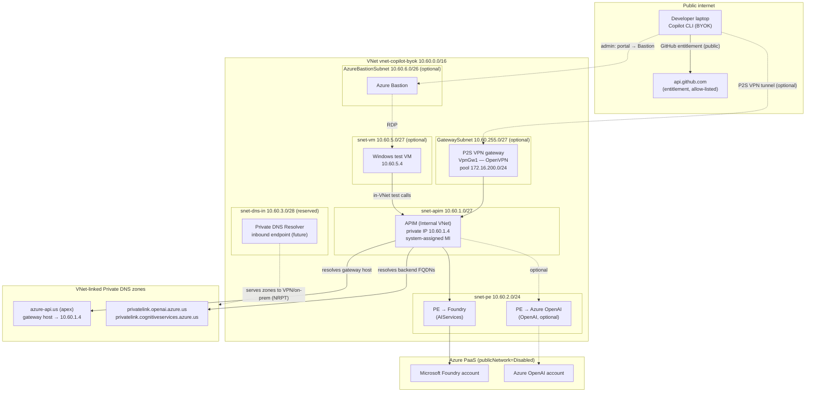

### DNS resolution of the APIM gateway

APIM in **Internal VNet mode** does not auto-register its gateway hostname. To let
in-VNet clients resolve it, a VNet-linked **Private DNS zone** (`azure-api.us` for Gov,
`azure-api.net` for Commercial) holds an A record for the gateway host → APIM's private
IP. This is the apex zone, **not** a `privatelink` zone. With the zone linked, the test
VM (and any in-VNet client) resolves the gateway through `168.63.129.16` — no hosts
entry, no DNS resolver needed.

For **off-VNet** clients (laptops over the P2S VPN), add an Azure Private DNS Resolver
inbound endpoint in `snet-dns-in` and an NRPT rule scoping `azure-api.us` (and the AOAI
`privatelink` suffix) to that resolver IP. The resolver simply serves the same
VNet-linked private zones. Gated by `deployApimPrivateDns` (default true).

### Manual test rig (ephemeral)

When `deployTestVm=true`, a Windows Server VM (`snet-vm`) plus Azure Bastion
(`AzureBastionSubnet`) are deployed so the pipeline can be exercised **from inside the
VNet before** the P2S VPN exists. With the APIM private DNS zone linked, the VM resolves
the gateway hostname directly and can call `/openai/v1/chat/completions`. This rig is
cost-gated and meant to be torn down once the VPN path is validated.

## Identity (out-of-band — Graph, not Bicep)

There are **two distinct identities** in this system, and they are independent of each
other and of which model backend serves a request:

- **Developer → gateway** (inbound): how a caller proves they may use the gateway. This
  depends on `authMode` — an Entra app + JWT (`jwt` mode, below) or an APIM subscription
  key (`subscriptionKey` mode, the default, which needs **no** app registration).
- **Gateway → backend** (outbound): the APIM managed identity, covered in [RBAC](#rbac).
  Identical for Foundry and AOAI.

The app registration below is only relevant in **`jwt` mode**. In the default
`subscriptionKey` mode you can skip `setup-entra` entirely.

`scripts/setup-entra.ps1` creates:

1. App registration `copilot-byok-gateway`.
2. Application ID URI `api://copilot-byok-gateway-<tenant>`.
3. Scope `cli.invoke` (admin consent, user assignable).
4. **Pre-authorized client**: Azure CLI = `04b07795-8ddb-461a-bbee-02f9e1bf7b46`
   for the `cli.invoke` scope. This is the trick that makes
   `az account get-access-token --resource api://...` succeed silently.
5. (Optional) Assign a security group to the app so only members can invoke it.

The script emits the resulting `appIdUri` and `clientId`, which feed into APIM
named values (`api-app-id-uri`) and the developer wrapper script.

> Note: although the app exposes `api://copilot-byok-gateway-<tenant>`, v2 access
> tokens carry `aud` = the **client-ID GUID**, so the APIM `api-audience` named value
> validated by `validate-jwt` is the GUID, not the `api://` URI.

## RBAC

The gateway authenticates to **both** model backends with its own system-assigned managed
identity — there is no key or connection string for either account. The same role
(`Cognitive Services OpenAI User`) is granted on **each** deployed backend, because the
APIM policy can route a request to either one (Foundry by default, AOAI for pinned models),
and `kind=AIServices` (Foundry) and `kind=OpenAI` (AOAI) both honour this role on the
`/openai/...` data plane.

| Principal | Role | Scope | Condition |
|---|---|---|---|
| APIM system-assigned MI | Cognitive Services OpenAI User | **Foundry account** (`kind=AIServices`) | `assignFoundry && deployFoundry` |
| APIM system-assigned MI | Cognitive Services OpenAI User | **AOAI account** (`kind=OpenAI`) | `assignAoai && deployAoai` |
| Deployer (you) | Cognitive Services OpenAI Contributor | Foundry account | `assignFoundry && deployerPrincipalId set` |
| Deployer (you) | Cognitive Services OpenAI Contributor | AOAI account | `assignAoai && deployerPrincipalId set` |
| Playground users/group | Cognitive Services OpenAI User | **Foundry account** | `playgroundPrincipalIds non-empty && deployFoundry` |
| Playground users/group | Cognitive Services OpenAI User | **AOAI account** | `playgroundPrincipalIds non-empty && deployAoai` |
| Deployer (you) | Contributor | Resource group | — |
| Devs | (Entra app role assignment, not Azure RBAC) | App `copilot-byok-gateway` | jwt mode only |

Both APIM-MI role assignments are gated by `assignAoaiRbac` (default true; the single
switch covers Foundry and AOAI). If the deployer lacks
`Microsoft.Authorization/roleAssignments/write`, set it false and have an Owner / User
Access Administrator grant the role out-of-band **on each deployed account**:

```pwsh
# Default backend — Foundry (kind=AIServices):
az role assignment create --assignee <apimPrincipalId> `
  --role "Cognitive Services OpenAI User" `
  --scope <foundryAccountResourceId>

# Optional legacy backend — AOAI (kind=OpenAI), only if deployAoai=true:
az role assignment create --assignee <apimPrincipalId> `
  --role "Cognitive Services OpenAI User" `
  --scope <aoaiAccountResourceId>
```

> The MI access token audience is the **same** for both backends
> (`https://cognitiveservices.azure.us` in Gov / `https://cognitiveservices.azure.com`
> in commercial), so the `authentication-managed-identity` policy step is identical
> regardless of which account the request is routed to — only the role *scope* differs.

### Direct playground / data-plane access for humans (expected 403 by design)

Both accounts are deployed with **`disableLocalAuth=true`** (API keys off) — intentional for
the BYOK posture. Only APIM's managed identity is granted a data-plane role, so the *normal*
gateway path works end-to-end. A **human** who opens the Azure AI / OpenAI **playground**, or
calls the account directly with an SDK, authenticates as *themselves* — not as APIM — and with
no role gets exactly this expected error:

> *Not authorized: Access to API keys is disabled and the account is missing Chat completion
> permissions. You will need the Cognitive Services OpenAI User role or higher.*

This is **not a bug** — it is the keys-off design working. There are two supported ways to grant
humans access, both ending in the same `Cognitive Services OpenAI User` role on **each** account:

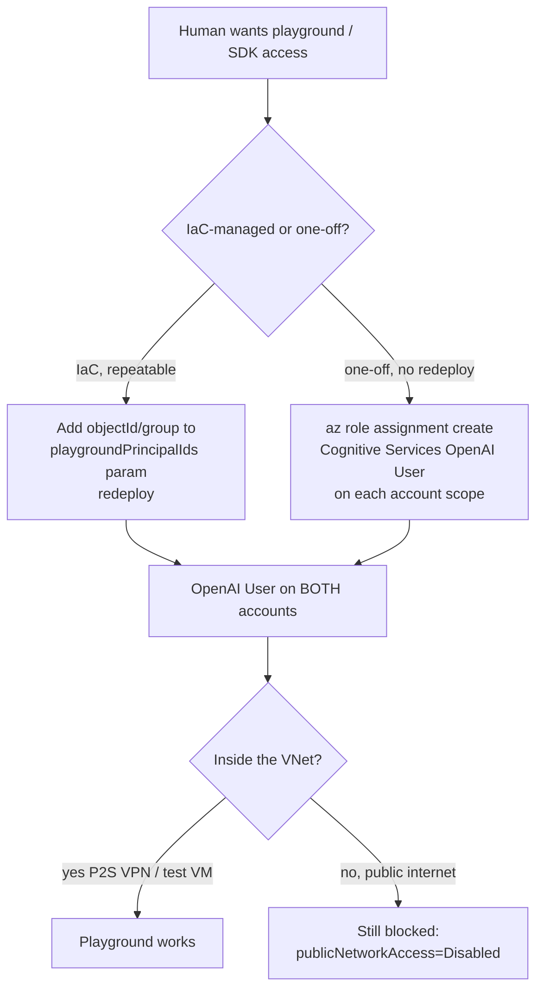

- **IaC path (recommended for a known set):** add the user/group object IDs to the
  `playgroundPrincipalIds` param (and set `playgroundPrincipalType` to `User` or `Group`).
  On deploy, each principal gets `Cognitive Services OpenAI User` on **both** the AOAI and
  Foundry accounts. Using one Entra **group** is cleanest — add/remove members in Entra with
  no redeploy. This runs even when `assignAoaiRbac=false` (the APIM-MI grant and the playground
  grant are gated independently).
- **Manual path (one-off):** `az role assignment create --assignee <upn-or-objectId> --role
  "Cognitive Services OpenAI User" --scope <accountResourceId>` on each account.
- Use **`Cognitive Services OpenAI Contributor`** instead if the person must also create/manage
  model deployments (not just run inference).

> **VNet caveat:** both accounts have `publicNetworkAccess=Disabled`. The role is necessary but
> not sufficient — the playground only reaches the data plane from **inside the VNet** (P2S VPN
> or the in-VNet test VM). A user on the open internet stays blocked even with the role.

## Metrics & observability

This section is written so a customer can both **trust** the metering (where do the
numbers come from?) and **use** it (how do I see per-developer usage?).

### How a metric is produced (end-to-end)

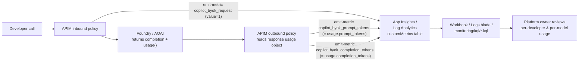

Every metric carries the same dimensions, so any of them can be sliced by developer, by
model, or (on the Foundry API) by which backend served the request. **APIM never reads
or stores prompt/response content** — token counts come straight from the backend's own
`usage` object.

### What is tracked

| Metric (namespace `copilot.byok`) | Emitted | Value | Dimensions |
|---|---|---|---|
| `copilot_byok_request` | inbound, per call | `1` | `developer_oid`, `developer_upn`, `deployment_name`, `backend`* |
| `copilot_byok_prompt_tokens` | outbound | `usage.prompt_tokens` | same |
| `copilot_byok_completion_tokens` | outbound | `usage.completion_tokens` | same |

\* `backend` (`aoai` \| `foundry`) is present on the default Foundry API so you can see
which backend a model-routed request landed on.

> **Auth-mode note:** the dimension *names* never change. In `jwt` mode
> `developer_oid`/`developer_upn` carry the Entra `oid`/`upn`; in the default
> `subscriptionKey` mode they carry the APIM **subscription Id/Name**. The same
> dashboards and queries work either way — read "developer" as "the subscription" in
> subscription-key mode.

### Where it is stored

`emit-metric` writes into the Application Insights resource
(`appi-copilot-byok-<env>-<suffix>`), which is backed by a Log Analytics workspace.
The data lands in the **`customMetrics`** table; the dimensions land in
`customDimensions`. All raw APIM gateway logs (status codes, latency, API id) also flow
to the same workspace in **`ApiManagementGatewayLogs`**.

### How to view it

1. **Workbook** (deployed with the stack) — pre-built tiles for tokens/day/developer,
   tokens/day/model, and error rate.
2. **Azure Portal → App Insights / Log Analytics → Logs** — paste any of the three saved
   queries from [monitoring/kql](../monitoring/kql).
3. **APIM analytics blade** — built-in request/latency/error charts (no custom query).

> **Gov caveat:** the App Insights **query REST API is disabled** in this Gov tenant
> (`az monitor app-insights query` fails with `AADSTS500014` — the
> `api.applicationinsights.io` service principal is disabled). Use the **portal Logs
> blade / workbook**, not the CLI query command.

### Example — per-developer usage ([tokens-per-developer.kql](../monitoring/kql/tokens-per-developer.kql))

```kusto
customMetrics
| where timestamp > ago(24h)
| where name == "copilot_byok_request"
| extend
    developer = tostring(customDimensions["developer_upn"]),
    model     = tostring(customDimensions["deployment_name"])
| summarize requests = sum(value) by bin(timestamp, 1h), developer, model
| order by timestamp asc
```

Example result (subscription-key mode — `developer` is the APIM subscription name):

| timestamp | developer | model | requests |
|---|---|---|---|
| 2026-05-30 14:00 | dev-alice | gpt-5.1 | 18 |
| 2026-05-30 14:00 | dev-bob | gpt-5.1 | 7 |
| 2026-05-30 15:00 | dev-alice | gpt-5.1 | 24 |

In `jwt` mode the same `developer` column instead shows `alice@contoso.com`.

### Example — token usage per model ([tokens-per-model.kql](../monitoring/kql/tokens-per-model.kql))

```kusto
customMetrics
| where timestamp > ago(7d)
| where name in ("copilot_byok_prompt_tokens","copilot_byok_completion_tokens")
| extend
    model = tostring(customDimensions["deployment_name"]),
    kind  = iff(name == "copilot_byok_prompt_tokens", "prompt", "completion")
| summarize tokens = sum(value) by bin(timestamp, 1d), model, kind
| order by timestamp asc
```

Example result:

| timestamp | model | kind | tokens |
|---|---|---|---|
| 2026-05-29 | gpt-5.1 | prompt | 412,300 |
| 2026-05-29 | gpt-5.1 | completion | 98,540 |
| 2026-05-30 | gpt-5.1 | prompt | 501,120 |

### Example — error rate ([error-rate.kql](../monitoring/kql/error-rate.kql))

```kusto
ApiManagementGatewayLogs
| where TimeGenerated > ago(24h)
| where ApiId == "copilot-byok-aoai"
| extend bucket = bin(TimeGenerated, 15m), status = tostring(ResponseCode)
| summarize cnt = count() by bucket, status
| order by bucket asc
```

Example result (a burst of `401`s usually means a missing/expired credential; `400`s
often mean a malformed `model` body — see the model-parsing failure mode above):

| bucket | status | cnt |
|---|---|---|
| 2026-05-30 14:00 | 200 | 142 |
| 2026-05-30 14:00 | 401 | 3 |
| 2026-05-30 14:15 | 200 | 130 |

> To chart the **default Foundry** API instead of the legacy AOAI one, change
> `ApiId == "copilot-byok-aoai"` to `ApiId == "copilot-byok-foundry"`.

## Rate limiting & per-developer governance

The gateway enforces **three independent throttles** so a single developer (or a runaway
agent) cannot burn the shared model capacity or budget:

| throttle | policy element | what it caps | why |
|---|---|---|---|
| Burst | `rate-limit-by-key` | calls per minute | stops tight request loops |
| **AI-cost guard** | `azure-openai-token-limit` | tokens/min (prompt **and** completion) | the only limit that actually bounds spend — a single huge prompt costs more than many small ones |
| Monthly ceiling | `quota-by-key` | calls per 30 days | hard stop against sustained overuse |

A request must pass **all three** counters. All three are keyed per developer (the APIM
subscription in subscriptionKey mode, the Entra `oid` in jwt mode), and each emits response
headers (`x-byok-calls-remaining`, `x-byok-tokens-remaining`, `x-byok-tokens-consumed`) so the
CLI user can see how close they are to a limit.

> A pure request-count limit (the old `calls=120`) does **not** prevent AI cost abuse — token
> limiting does, because cost scales with tokens, not request count.

### Grouping developers — where the limits live depends on auth mode

Limits live at a different policy scope per mode, so each developer gets exactly one tier with
no double-counting:

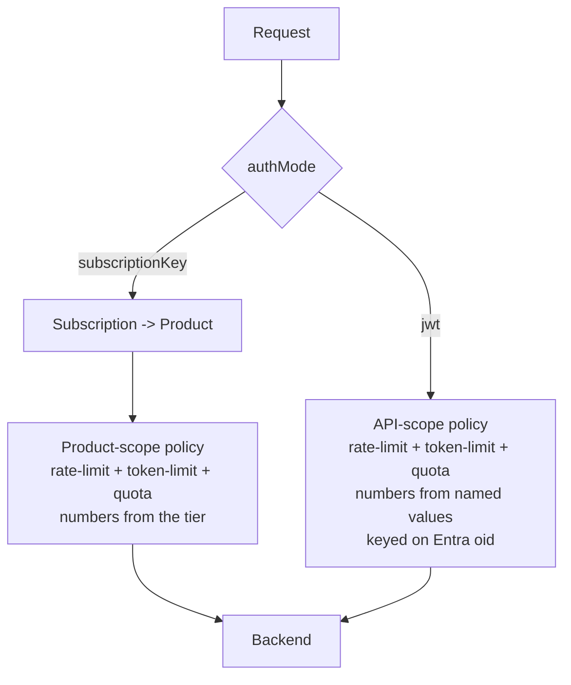

**subscriptionKey mode (default) — APIM Products = tiers.** Each tier in the `productTiers`
param becomes a published APIM **product** carrying a product-scope policy with the three
throttles. A developer is **grouped** by scoping their subscription to a product. Ship two demo
tiers:

| product | calls/min | tokens/min | monthly calls |
|---|---|---|---|
| `byok-standard` | 60 | 20,000 | 50,000 |
| `byok-power` | 120 | 60,000 | 200,000 |

`dev1` → `byok-standard`, `dev2` → `byok-power` out of the box. Move a developer between
tiers by changing the `product` on their subscription (`testSubscriptions` param) — no policy
edit. Tune a tier's numbers in `productTiers` and redeploy. Because the limits live at product
scope, the subscriptionKey API policies carry **no** rate-limit of their own (avoids
double-limiting, which would let the more restrictive scope silently win and defeat the tier
differentiation).

**jwt mode — single flat tier via named values.** There are no subscriptions/products in jwt
mode, so the jwt API policies keep their own throttles keyed on the Entra `oid`, with the
numbers sourced from named values (`jwt-calls-per-minute`, `jwt-tokens-per-minute`,
`jwt-monthly-call-quota`) set from the `jwtDefaultCallsPerMinute` / `jwtDefaultTokensPerMinute`
/ `jwtDefaultMonthlyCallQuota` params. The `Default` in the name signals there is exactly **one**
flat tier applied to every caller — jwt mode has no per-group concept. (Per-group tiers in jwt
mode would require mapping a JWT claim — e.g. a group/role — to limits; out of scope for the
pilot.)

### Where rate limiting sits between the two auth modes, and how to customize it

The two limit sets are **mutually exclusive by auth mode** — only one is ever live, so there is
no double-counting and no shared knob. Which one applies is decided entirely by the `authMode`
parameter:

| | `authMode = subscriptionKey` (default) | `authMode = jwt` |
|---|---|---|
| Where the throttle policy lives | **Product scope** (one policy per tier) | **jwt API scope** (one policy, named-value driven) |
| Per-developer key | the APIM subscription | the Entra `oid` claim |
| Grouping | **multiple tiers** (one product each) | **single flat tier** (everyone) |
| Params that set the numbers | `productTiers[].callsPerMinute` / `.tokensPerMinute` / `.monthlyCallQuota` | `jwtDefaultCallsPerMinute` / `jwtDefaultTokensPerMinute` / `jwtDefaultMonthlyCallQuota` |
| Assign a developer | set their `product` in `testSubscriptions` | n/a — all callers share the one tier |
| Active in your current config? | **yes** (`subscriptionKey`) | no (parameters exist but unused until you switch) |

**To customize in subscriptionKey mode (current):**
- Change a tier's numbers → edit the matching object in `productTiers`, redeploy.
- Add a tier → append a `{ name, displayName, description, callsPerMinute, tokensPerMinute, monthlyCallQuota }` to `productTiers`; it becomes a new product linked to all APIs.
- Move a developer between tiers → change the `product` field on their `testSubscriptions` entry.

**To customize in jwt mode:**
- Switch `authMode` to `jwt`, then set `jwtDefaultCallsPerMinute` / `jwtDefaultTokensPerMinute` /
  `jwtDefaultMonthlyCallQuota`. These flow into the `jwt-*` named values the jwt policies read,
  so no policy edit is needed.

> Both parameter sets are always present in the template regardless of mode, so flipping
> `authMode` needs no structural redeploy — the unused set simply has no effect.

> **Gov note:** `azure-openai-token-limit` is a standard APIM GenAI-gateway policy and works in
> Azure Government APIM. The TPM counter is approximate when `estimate-prompt-tokens="true"`
> (it tokenizes the prompt at ingress); completion tokens are reconciled from the backend
> response. Monthly **token** caps are not natively expressible in `quota-by-key`, so the
> monthly ceiling is call-based.

## Content filtering (responsible AI)

**What you get regardless.** Every model deployment — **both** the Azure OpenAI and the Foundry
deployment — is *always* created with a content filter; there is no "off" switch in Azure OpenAI /
Foundry. Out of the box both deployments run Microsoft's built-in `Microsoft.DefaultV2` baseline
(Hate, Sexual, Violence, Self-harm filtered at Medium on prompt **and** completion, plus prompt
shields). This ships with zero configuration and is what your current Gov deployment is running.

**It is not deployed as a custom resource by default — it is opt-in via one parameter.** What the
template deliberately does *not* author is a custom `raiPolicies` Bicep resource (custom RAI
policies and some categories behave differently in Azure Government, so a hardcoded resource risks
breaking a Gov deploy). Instead the choice is a **single parameter plus a helper script**:

- **Bicep param `raiPolicyName`** (default `Microsoft.DefaultV2`) — a **single** knob threaded
  into **both** model modules ([aoai.bicep](../infra/modules/aoai.bicep) and
  [foundry.bicep](../infra/modules/foundry.bicep)), so AOAI and Foundry always share the same
  filter. Leave it at the default for zero change; set it to a custom policy name to pin a
  tightened/loosened filter in IaC.
- **`scripts/configure-content-filter.ps1` / `.sh`** — cloud-aware (reads the ARM endpoint from
  the active cloud, Gov-safe):
  - `-Show` lists the account's `raiPolicies` and which policy each deployment uses.
  - `-Apply` creates/updates a custom `raiPolicy` from a JSON spec
    (`content-filter.sample.json`) and can repoint a deployment to it.
- **Categories** (each with a severity threshold Low/Medium/High, blocking on/off, and a
  Prompt/Completion source): Hate, Sexual, Violence, Self-harm, Jailbreak (prompt shields),
  Protected Material Text, Protected Material Code.

**What changing it does.** Because `raiPolicyName` is one shared value, repointing it affects
**both** models identically:

| You set `raiPolicyName` to… | Effect |
|---|---|
| `Microsoft.DefaultV2` (default) | Microsoft baseline on both deployments — no custom resource, nothing to maintain. |
| a custom policy name (e.g. `byok-strict`) | Both AOAI and Foundry deployments are repointed to that policy on the next deploy. The policy itself must already exist on each account (create it with the helper script's `-Apply`, or it will fail to attach). |

> If you ever need **different** filters for AOAI vs Foundry, the single `raiPolicyName` would
> need splitting into two params; today both intentionally share one policy.

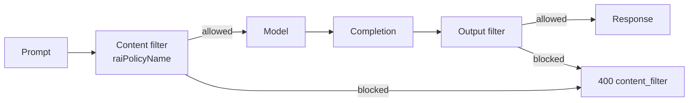

> **Approval boundary:** *Tightening* (more blocking, lower thresholds) is always allowed.
> *Loosening* below Microsoft defaults (raising a threshold to High, disabling a category)
> requires an approved Azure OpenAI modified-content-filter application; the platform rejects an
> unapproved loosened policy. The sample config tightens (thresholds at Low) as a safe example.

## Choosing between the two auth modes

The default is `authMode=subscriptionKey` because it is the simplest starter posture —
long-lived per-developer keys that fit the CLI's static-credential model and any keys a
team may already have provisioned (see [Authentication modes](#authentication-modes)). It
is a recommended default, not a fixed decision. The trade-off, stated plainly:

- **Per-developer identity.** A subscription key identifies the developer by *convention*
  — one key issued per developer, surfaced in telemetry as the subscription Id/Name. A
  JWT identifies the developer *cryptographically* by Entra `oid`, which cannot be shared
  or spoofed. If keys get shared between developers, the subscription-key identity
  guarantee weakens; the JWT one does not.
- **Secret lifetime.** A subscription key lives in a CLI config file indefinitely and is
  rotated manually. A JWT is minted per-invocation by the wrapper script and expires in
  ~1h — but that same 1h expiry is the operational friction that pushed the customer
  toward keys in the first place.
- **Revocation.** Revoking a subscription key (or disabling the subscription) locks out
  that one developer; rotating a *shared* key affects everyone. Disabling a user in Entra
  (or removing their app-role assignment) locks them out instantly in `jwt` mode.
- **Header slot.** Copilot CLI can't send custom headers (#3399), so the credential —
  key or JWT — always rides in the `api-key` header. Both modes fit the BYOK contract
  identically.

**Recommendation:** ship the pilot on `subscriptionKey` to match what the customer
already has, and offer `jwt` as the hardening upgrade when they want true per-user
identity and instant revocation. The switch is one parameter (`authMode`) plus a
redeploy — no structural change.

## Why APIM Developer SKU for the pilot

- Internal VNet mode is supported on Developer (and Premium, and Standard v2).
- No SLA; single-instance, no zone redundancy.
- ~$50/mo vs ~$2,800/mo for Premium.
- Param-switchable to Premium when moving to prod.

## What this design deliberately does NOT do

- No payload inspection / no chat logging in APIM.
- No long-lived API keys on disk; tokens are minted per-invocation.
- No custom Copilot CLI fork — we work within the BYOK contract as shipped.
- No attempt to redirect GitHub entitlement traffic through Azure. That stays
  public and is documented as a firewall allowlist in `docs/github-egress-allowlist.md`.

## Open items (pilot → prod)

- P2S VPN gateway + DNS Private Resolver inbound endpoint + NRPT not yet deployed
  (`deployVpnGateway=false`); the in-VNet test rig is used instead.
- `assignAoaiRbac=false` — APIM-MI → AOAI role granted out-of-band, not in-template.
- `playgroundPrincipalIds=[]` — no humans granted direct playground/data-plane access yet;
  add user/group object IDs (or assign the role out-of-band) per the RBAC section.
- Full `az deployment sub create` is flaky on re-run (AOAI re-PUT race,
  `AccountProvisioningStateInvalid`); modules are deployed at RG scope instead.
- Developer SKU APIM has no SLA / zone redundancy; switch to Premium for prod.
- Test VM + Bastion are billable and should be torn down post-validation.
