# Architecture

> **New to this solution / reusing it for another engagement?** Start with the
> [Delivery playbook & lessons learned](lessons-learned.md) for the non-obvious gaps and
> Gov-specific traps, then come back here for the deep mechanics. Running a deployed gateway?
> See the [Operations runbook](operations-runbook.md) for Day-2 tasks and incident triage.

## Goal

Make the developer's Copilot dev surfaces — **`gh copilot` / `copilot` CLI** *and*
**VS Code 1.122+ Copilot Chat** (via the stable Custom Endpoint provider) — hit a
**customer-private** Azure OpenAI / Microsoft Foundry deployment instead of GHCP SaaS,
without the laptop ever talking to a public model endpoint. Either client authenticates
to the private APIM gateway with **one of two interchangeable credentials** — a
per-developer **APIM subscription key** (the default, and what both clients use in practice)
or a per-developer **Entra JWT** (technically usable from either client, but neither the CLI
nor VS Code's Custom Endpoint auto-refreshes the ~1 h token yet, so it needs an external
refresh wrapper) — and APIM is the only party that ever holds backend access.

## Trust boundary

The diagram below shows the whole system: the developer credential choice
(`authMode`), the backend choice (Foundry vs AOAI vs both), and the GitHub-SaaS path
(config-only, off by default). Solid lines are the **default** path; dashed lines are
**optional / config-selectable**.

```mermaid
flowchart LR
    subgraph EdgeReg["Self-serve onboarding — private (opt-in #64)"]
        REG["Register app (ACA env + Entra Easy Auth)<br/>registerPrivateNetworking=true (default): env PNA=Disabled + Private Endpoint (snet-pe)<br/>→ reachable in-VNet only (dev envs may set =false → public edge)<br/>registerVnetIntegrated=true (pilots): egress VNet-integrated (snet-cae-register)<br/>user-assigned MI · provisions per-dev subscription via public ARM control plane<br/>+ writes client config (VS Code or CLI)"]
        KVREG["Key Vault (register) — RBAC<br/>holds Easy Auth client secret (register-easyauth-secret)<br/>Container App reads via MI reference (no secret in IaC)<br/>extensible: platform-wide secret store"]
    end

    subgraph Laptop["Copilot client surfaces (developer laptop / in-VNet test VM)"]
        CLI["Copilot CLI (BYOK)<br/>COPILOT_PROVIDER_* env vars"]
        VSC["VS Code 1.122+ Copilot Chat<br/>(Custom Endpoint provider)<br/>chatLanguageModels.json"]
        IDE["JetBrains AI Assistant &amp; other Bearer-only<br/>OpenAI-compatible IDE providers (opt-in #108)<br/>URL + API Key fields only → sends Authorization: Bearer<br/>in-VNet only (P2S VPN / test VM)"]
    end

    subgraph GH["GitHub SaaS (public, NOT used by default)"]
        SAAS["GHCP model endpoint"]
        ENT["api.github.com<br/>(entitlement / auth)"]
        GHA["GitHub Actions queue (CI/CD)<br/>smoke + deploy-dev jobs<br/>hosted runners DISABLED (EMU) → self-hosted only"]
        MCP["AI tooling — MCP servers (OPTION A: external)<br/>remote / hosted, e.g. api.githubcopilot.com/mcp<br/>separate plane: tools, not the model path — #74<br/>egress decision (allow or deny at the edge)"]
    end

    subgraph VNet["Customer Azure VNet 10.60.0.0/16 (private)"]
        APIM["AI Gateway<br/>(Azure API Management — internal VNet mode, classic Developer SKU)<br/>GenAI policies · authMode: subscriptionKey (default) | jwt<br/>validate creds, token-limit + token-metrics,<br/>strip creds, inject MI token, load-balance + route by model<br/>auto-select model in-policy when model=auto — FREE (#73)"]
        PROXY["Subkey proxy — nginx ACI in snet-aci (opt-in #108)<br/>deployFoundrySubkeyProxy=true · stable FQDN proxy.byok.internal (VNet private DNS)<br/>translates Authorization: Bearer &lt;APIM sub key&gt; → api-key header<br/>forwards to Internal APIM /openai; serves the dynamic /v1/models list"]
        subgraph Backends["Model backends (Private Endpoints, publicNetwork=Off)"]
            direction TB
            subgraph FoundryGroup["Microsoft Foundry — default backend"]
                FOUNDRY["Microsoft Foundry<br/>kind=AIServices<br/>path /openai — DEFAULT"]
                MROUTER["Foundry Model Router<br/>single 'model-router' deployment<br/>OPT-IN (deployModelRouter=true) — #76<br/>managed auto-select · slight token markup"]
                FOUNDRY2["Microsoft Foundry — region 2..N<br/>same model + mini deployments<br/>OPT-IN (deployBackendPool=true)"]
            end
            subgraph AoaiGroup["Azure OpenAI (legacy) — opt-in"]
                AOAI["Azure OpenAI (legacy)<br/>kind=OpenAI<br/>path /aoai — OPT-IN (deployAoai=true)"]
                AOAI2["Azure OpenAI (legacy) — region 2..N<br/>same model deployments<br/>OPT-IN (deployBackendPool=true)"]
            end
        end
        AI["App Insights / Log Analytics<br/>customMetrics (namespace copilot.byok)"]
        MCPVNET["AI tooling — MCP servers (OPTION B: in-VNet)<br/>customer-hosted: Functions / container / Logic App<br/>Private Endpoint, publicNetwork=Off — #80<br/>governed via APIM MCP broker — #79<br/>tools stay private, no public internet"]
        CS["Azure AI Content Safety<br/>PLANNED — Phase 1 (deployContentSafety)<br/>gateway Prompt Shields, blocks before model"]
        CB["Cost budget + token-spend alert<br/>PLANNED — Phase 2 (deployCostBudget* / deployTokenAlert)"]
        subgraph RunnerGroup["CI/CD self-hosted runner — opt-in (#57/#58)"]
            RUN["Runner pool (ACA Job, KEDA-scaled)<br/>VNet-injected snet-runner · ephemeral · outbound-only via NAT gateway<br/>caj-runner-ENV · registers per job, then exits"]
            ACRRUN["Container Registry (ACR) — pre-baked runner image (#94)<br/>github-runner:latest (built server-side by ACR Tasks)<br/>Job pulls via UAMI (AcrPull) — removes the Docker Hub egress dependency"]
            KVRUN["Key Vault (runner) — RBAC + Private Endpoint<br/>publicNetworkAccess=Disabled · reachable PE-only (snet-pe)<br/>holds runner credential (gh-pat, or gh-app-key PEM)<br/>Job reads via UAMI (keyVaultUrl) over the PE<br/>rotation = rotate-runner-pat-breakglass.ps1 (open→write→re-lock→re-resolve)"]
        end
    end

    ENTRA["Entra ID"]

    subgraph CommCloud["Commercial cloud — separate tenant, public internet (opt-in)"]
        COMMFOUNDRY["Commercial Microsoft Foundry<br/>kind=AIServices · public endpoint (NOT a private endpoint)<br/>path /openai-commercial — OPT-IN (deployFoundryCommercial=true)<br/>reached over the public internet via the NAT gateway egress IP<br/>cross-tenant service-principal token minted in the Commercial tenant"]
    end

    CLI -- "default: api-key header to private APIM" --> APIM
    CLI -. "authMode=jwt: Entra JWT in api-key header (~1h TTL; CLI can't auto-refresh yet — gh/copilot-cli#3682)" .-> APIM
    CLI -. "config-only: unset COPILOT_PROVIDER_* (off by default)" .-> SAAS
    CLI -. "GitHub entitlement — best-effort phone-home, NOT required (deniable)" .-> ENT

    VSC -- "api-key header (subscription key) to private APIM<br/>chat-completions + /responses; works without GitHub sign-in" --> APIM
    VSC -. "authMode=jwt: Entra JWT in api-key header (~1h TTL; Custom Endpoint can't auto-refresh either)" .-> APIM
    VSC -. "unselect BYOK model in picker: VS Code falls back to GHCP SaaS" .-> SAAS

    IDE -. "in-VNet only (private DNS): Bearer &lt;APIM sub key&gt; → http://proxy.byok.internal:8080 (#108)" .-> PROXY
    PROXY -- "translated api-key header → private APIM /openai (chat + dynamic /v1/models)" --> APIM

    CLI -. "MCP OPTION A: external/remote tools — public egress (#74)" .-> MCP
    VSC -. "MCP OPTION A: external/remote tools — public egress (#74)" .-> MCP
    CLI -. "MCP OPTION B: in-VNet tools via APIM broker (#79/#80)" .-> APIM
    VSC -. "MCP OPTION B: in-VNet tools via APIM broker (#79/#80)" .-> APIM
    APIM -. "deployMcpGateway=true: govern in-VNet MCP tools (PE-only, no public internet)" .-> MCPVNET

    REG -- "provisions/manages per-dev APIM subscription (sub-key)<br/>via UAMI custom role → ARM control plane (public)" --> APIM
    REG -. "writes COPILOT_PROVIDER_* env vars (CLI)" .-> CLI
    REG -. "writes chatLanguageModels.json (VS Code)" .-> VSC
    REG -- "reads Easy Auth client secret via MI (Key Vault reference)" --> KVREG
    ENTRA -. "Entra Easy Auth — sign in developer to Register app (#82, #68)" .-> REG
    ENTRA -. "setup-register-entra mints app-reg secret → stored in Key Vault" .-> KVREG

    APIM -- "MI token (AAD)" --> ENTRA
    APIM -- "default route" --> FOUNDRY
    APIM -. "deployFoundryCommercial=true: /openai-commercial → NAT egress (public IP) →<br/>cross-tenant SP token (Commercial tenant), leaves the Gov VNet" .-> COMMFOUNDRY
    APIM -. "deployAoai=true and/or pinned-model override" .-> AOAI
    APIM -. "deployBackendPool=true: pool balances / fails over" .-> FOUNDRY2
    APIM -. "deployAoai+deployBackendPool=true: pool balances / fails over" .-> AOAI2
    APIM -- "emit-metric" --> AI
    APIM -. "authMode=jwt: validate-jwt vs openid-config" .-> ENTRA
    APIM -. "PLANNED: shield-prompt before routing" .-> CS
    AI -. "PLANNED: token-spend alert + cost budget" .-> CB

    GHA -. "KEDA github-runner scaler polls api.github.com queue → scales 0→N (auth: gh-pat / App key)" .-> RUN
    RUN -. "registration token from api.github.com, connects to *.actions.githubusercontent.com broker; runs one job, deregisters" .-> GHA
    RUN -- "reads gh-pat / gh-app-key via UAMI (Key Vault reference over the PE)" --> KVRUN
    RUN -- "pulls pre-baked runner image via UAMI (AcrPull) — no Docker Hub (#94)" --> ACRRUN
    RUN -. "smoke tests reach private gateway + Foundry over the VNet" .-> APIM

    CLI -. "model selector: send model=auto (free, in-policy) or model=model-router (opt-in) (#73)" .-> APIM
    APIM -. "deployModelRouter=true: model=model-router → managed Foundry routing (#76)" .-> MROUTER
    MROUTER -. "router selects + runs the underlying model (response 'model' reveals the pick)" .-> FOUNDRY
    MROUTER -. "deployBackendPool=true: routing spreads across regions" .-> FOUNDRY2

    %% invisible links to force Foundry group to render ABOVE the AOAI group
    FOUNDRY ~~~ AOAI
    FOUNDRY2 ~~~ AOAI2
    %% keep CLI rendered above VS Code inside the Laptop subgraph
    CLI ~~~ VSC
    VSC ~~~ IDE

    classDef optin fill:#f5f5f5,stroke:#bbbbbb,stroke-dasharray:5 5,color:#888888;
    class FOUNDRY2,AOAI,AOAI2,SAAS,ENT,MROUTER,MCP,MCPVNET,GHA,RUN,ACRRUN,KVRUN,PROXY,IDE,COMMFOUNDRY optin;
    classDef planned fill:#eeeeee,stroke:#999999,stroke-dasharray:2 3,color:#777777;
    class CS,CB,REG,KVREG planned;
    %% subgraph containers are styled separately from nodes (classDef does not apply)
    style GH fill:#fafafa,stroke:#cccccc,stroke-dasharray:5 5,color:#888888;
    style AoaiGroup fill:#fafafa,stroke:#cccccc,stroke-dasharray:5 5,color:#888888;
    style EdgeReg fill:#fafafa,stroke:#cccccc,stroke-dasharray:5 5,color:#888888;
    style RunnerGroup fill:#fafafa,stroke:#cccccc,stroke-dasharray:5 5,color:#888888;
    style CommCloud fill:#fafafa,stroke:#cccccc,stroke-dasharray:5 5,color:#888888;
```

> Greyed/dashed boxes are **opt-in** — nothing in the default deployment creates them. The
> **region 2…N** Foundry box turns on with `deployBackendPool=true` (and a `foundryRegions` list);
> the whole **Azure OpenAI** column (primary + its region 2…N) is off unless you set
> `deployAoai=true` (legacy path), and its secondary region needs `deployBackendPool=true` as well.
> When enabled, APIM fronts each backend's primary plus every regional account through a single
> load-balanced **Pool** backend — see
> [Multi-region backend pools (opt-in)](#multi-region-backend-pools-opt-in).
>
> The two **`PLANNED`** boxes (`Azure AI Content Safety` and `Cost budget + token-spend alert`)
> are **not built yet** — they are the designed-but-unimplemented governance layers tracked in the
> [Roadmap](#roadmap--gateway-content-safety--budgeting-planned) (Phase 1 / Phase 2). They use a
> lighter dotted style to distinguish "planned, no code yet" from the solid-grey "opt-in but
> implemented" boxes.
>
> The **`Register app`** box (top-left) is the self-serve onboarding layer
> tracked in [`#64`](https://github.com/gwexler_microsoft/copilot-cli-byok-azure/issues/64). It
> is **logically inside the private VNet boundary** — drawn as a separate box only to keep the
> diagram readable: it is an external ACA env with `registerPrivateNetworking=true` (the default)
> setting the env `publicNetworkAccess=Disabled` and fronting it with a **Private Endpoint** in
> `snet-pe`, so the app is **reachable in-VNet only** (dev envs can flip
> `registerPrivateNetworking=false` to expose a public edge; the pilots also set
> `registerVnetIntegrated=true` to route the env's **egress** through `snet-cae-register`). It still
> provisions each developer's APIM subscription through the **public ARM control plane** with a
> least-privilege managed identity, and writes the resulting client config to the laptop —
> `COPILOT_PROVIDER_*`
> for the **CLI** or `chatLanguageModels.json` for **VS Code**. The dotted **`Entra ID → Register
> app`** edge is the **Entra Easy Auth** sign-in that fronts the app ([`#82`](https://github.com/gwexler_microsoft/copilot-cli-byok-azure/issues/82),
> [`#68`](https://github.com/gwexler_microsoft/copilot-cli-byok-azure/issues/68)) — so `Entra ID`
> plays **two** roles on this diagram: it signs the developer in to the Register app *and* it is
> the issuer APIM's MI authenticates to (and, in `jwt` mode, the `validate-jwt` authority). See
> [Self-serve developer onboarding](#self-serve-developer-onboarding-planned--64).
>
> The **`Key Vault (register)`** box is the dedicated, RBAC-mode vault that holds the Register
> app's **Easy Auth client secret**. It exists only when the register stack is deployed
> (`deployRegisterApp=true`) and is created by [register-kv.bicep](../infra/modules/register-kv.bicep).
> The two-phase bring-up keeps the secret out of source control and out of IaC parameters: the
> [setup-register-entra](../scripts/setup-register-entra.ps1) script mints the app-registration
> secret and writes it to the vault (`register-easyauth-secret`), and the Container App reads it
> back at runtime via a **managed-identity Key Vault reference** (the register user-assigned MI
> holds **Key Vault Secrets User**). Today it serves the register app alone, but it is a natural
> **platform-wide secret store** for future needs (e.g. holding the per-developer JWT-refresh
> credential in [`jwt` mode](#authentication-modes), or any backend/app secret we don't want
> flowing through Bicep params). See [Self-serve developer onboarding](#self-serve-developer-onboarding-planned--64)
> and the [register-app runbook §4](register-app-runbook.md#4-configure-entra-app-registration--easy-auth).
>
> The **`Subkey proxy`** box (in `snet-aci`) is the opt-in
> ([`deployFoundrySubkeyProxy=true`](../infra/main.bicep)) **entry point for Bearer-only,
> OpenAI-compatible IDE tools** — most notably **JetBrains AI Assistant**, whose built-in
> OpenAI-compatible provider exposes only a **URL** and an **API Key** field (no custom-header
> option) and so sends the credential as `Authorization: Bearer <key>`. Internal-mode APIM validates
> a subscription key only from the `api-key` header/query, so it can't accept a subkey delivered as a
> Bearer token. The proxy — a stock **nginx Azure Container Instance** injected into the VNet
> ([apim-subkey-proxy-aci.bicep](../infra/modules/apim-subkey-proxy-aci.bicep),
> [`#108`](https://github.com/gwexler_microsoft/copilot-cli-byok-azure/issues/108)) — bridges the
> gap: it strips `Authorization: Bearer <APIM subscription key>`, re-injects it as the `api-key`
> header, and forwards to the **private** Internal APIM `/openai` route (streaming SSE end to end).
> It has a **private IP only** and is reachable strictly **in-VNet** (P2S VPN / test VM) — no public
> exposure. Point the IDE's base URL at the **stable in-VNet hostname** `http://proxy.byok.internal:8080/openai/v1`
> with the developer's APIM subscription key in the API-Key field. That hostname is a **VNet-linked
> private DNS** A record (`proxy.byok.internal`) whose value Bicep **repoints at the ACI's current
> private IP on every provision** — so even a full reprovision that moves the (unpinnable, dynamic)
> ACI IP never changes the URL developers configure. The proxy no longer hardcodes a model list: it
> forwards
> `GET /v1/models` to APIM, whose `list-models` policy fetches the **live Foundry deployments** and
> reshapes them into the clean OpenAI shape the IDE dropdown needs, advertising the **`auto`**
> sentinel first so selecting it triggers the free in-policy tiered auto-routing. A loopback policy
> was ruled out (Internal-mode APIM can't hairpin to its own gateway VIP → 500) and a Container App
> won't work (the register env isn't VNet-injected); see
> [`#108`](https://github.com/gwexler_microsoft/copilot-cli-byok-azure/issues/108) /
> [`#102`](https://github.com/gwexler_microsoft/copilot-cli-byok-azure/issues/102).
>
> **How it's built (implementation insights).** The proxy is *entirely* one self-contained Bicep
> module ([apim-subkey-proxy-aci.bicep](../infra/modules/apim-subkey-proxy-aci.bicep)) — there is
> **no app repo, no Dockerfile, and no custom image to build or push**. It runs the **stock
> MCR-mirrored `nginx` image** (`mcr.microsoft.com/mirror/docker/library/nginx`, reachable under
> restricted egress), and the nginx configuration is authored **inline in the module** (a `nginxConf`
> variable) and mounted into the container as a **secret volume** at `/etc/nginx/conf.d/default.conf`
> — so the behavior is version-controlled as IaC, not baked into an artifact. The container group is
> a single small container (`cpu 0.5 / mem 0.5`, port 8080, **private IP**); the config is just an
> `Authorization: Bearer` → `api-key` header swap (`map $http_authorization $byok_key`) plus
> `proxy_buffering off` for SSE. Crucially, the proxy is a **dumb pass-through**: it forwards *every*
> path to APIM unchanged and contains **no per-endpoint logic**. All routing/auth/transform
> intelligence lives in the APIM `/openai` operations + policies, which means **adding new
> OpenAI-compatible paths (e.g. `GET /v1/models/{model}` or the `/v1/responses/{id}…` sub-resources)
> is APIM-only work — the proxy module never changes**. The one moving part it owns is the stable
> hostname: a VNet-linked private DNS zone (`byok.internal`) whose `proxy` A record Bicep re-points at
> the ACI's current private IP on every provision (see above). Between provisions, a scheduled
> **Container Apps Job** (`caj-proxydns`, in the runner env) self-heals the record: every ~15 min it
> reads the proxy ACI's current IP and repoints the A record if it drifted (the ACI IP moves when the
> container group is recreated out-of-band). It runs as a job, not an in-ACI sidecar, because a
> VNet-injected ACI cannot get a managed-identity token in-container (IMDS unreachable) — Container
> Apps supply it via `IDENTITY_ENDPOINT`; the job (`reconcile.py`, Python stdlib) uses that + ARM REST.
>
> The **`CI/CD self-hosted runner`** group (bottom of the VNet) is the opt-in
> ([`deployGhRunner=true`](../infra/main.bicep)) build plane tracked in
> [`#57`](https://github.com/gwexler_microsoft/copilot-cli-byok-azure/issues/57) /
> [`#58`](https://github.com/gwexler_microsoft/copilot-cli-byok-azure/issues/58). Hosted runners are
> disabled at the EMU enterprise level, so smoke/deploy workflows `runs-on:` a **VNet-injected,
> KEDA-scaled, ephemeral** runner pool implemented as an Azure Container Apps **Job**
> (`caj-runner-<env>`, [gh-runner.bicep](../infra/modules/gh-runner.bicep)). It is **outbound-only**
> (no ingress): the KEDA `github-runner` scaler polls the GitHub Actions queue and scales `0→N`, each
> replica registers ephemerally, runs exactly one job, then deregisters and exits. Being inside the
> VNet is what lets CI reach the **private** APIM gateway and Foundry data plane that have no public
> access. The runner **image** is pulled from a per-env, in-VNet **Azure Container Registry**
> (`acrreg<env>`, `useAcrRunnerImage=true`, #94) — a `github-runner` image pre-baked server-side by
> **ACR Tasks** and pulled via the runner UAMI's **AcrPull** role — so a locked-down runner never
> depends on a Docker Hub pull. (The runner still needs GitHub egress: the KEDA scaler polls
> `api.github.com` and each replica fetches a registration token there, then connects to the
> `*.actions.githubusercontent.com` broker — those endpoints are Microsoft-hosted but public.)
>
> The **`Key Vault (runner)`** box is the dedicated, RBAC-mode vault that holds the runner's GitHub
> credential, created by [runner-kv.bicep](../infra/modules/runner-kv.bicep) whenever the runner is
> deployed (the pilots additionally lock it down via `deployRunnerKvPrivateEndpoint=true` →
> `publicNetworkAccess=Disabled` + a Private Endpoint, so the vault is reachable **PE-only** from
> inside the VNet). The credential depends on **`ghRunnerAuthMode`**: the **primary** path is a **GitHub App**
> private key (`gh-app-key` secret) — the App mints **short-lived installation tokens**, so there is
> **nothing long-lived to rotate** (and a higher 15k/hr API budget); the **opt-in fallback** is a
> **PAT** (`gh-pat` secret) for customers who can't install an App. Both consumers — the KEDA scaler
> (queue polling, `appKey`/`personalAccessToken`) and the runner container (`APP_ID`+`APP_PRIVATE_KEY`
> or `ACCESS_TOKEN` for registration) — read the **same** Job secret, which is a **managed-identity
> Key Vault reference** (`keyVaultUrl`, resolved by the runner UAMI holding **Key Vault Secrets
> User**) once `ghRunnerSecretFromKeyVault=true`. This keeps the credential out of azd state.
> **Rotation** writes a new value to the vault: on a *public* vault that is a single
> `az keyvault secret set`, but the pilots' *network-locked* vaults use
> [rotate-runner-pat-breakglass.ps1](../scripts/rotate-runner-pat-breakglass.ps1), which briefly opens
> the vault, writes, re-locks, **and forces the runner Job to re-resolve** the secret. That last step
> matters: Azure Container Apps caches the KV secret reference at the **Job** level, so a freshly
> rotated value does **not** reach the runner until a Job update or ACA's periodic refresh (up to
> hours) — until then the ephemeral runner keeps failing GitHub registration with **HTTP 401** on the
> stale token. The vault URI is cloud-correct in both Azure clouds (`.vault.azure.net` vs
> `.vault.usgovcloudapi.net`). Bring-up is a
> deliberate **two-phase** flow (empty vault + placeholder Job → write the credential → flip
> `ghRunnerSecretFromKeyVault=true`). `app` is the **module default** and the **recommended path for
> org-hosted deployments**, but the **live pilot/dev param files for this repo use `pat`**: this repo
> is **user-owned under an Enterprise Managed Users (EMU) account**, and EMU only allows installing a
> user-owned GitHub App on **"This Enterprise"** (an enterprise-scoped install does **not** grant the
> repo-level Administration permission KEDA needs to register runners), so **app mode is not viable
> here**. To re-enable app mode on a future org-hosted env, the GitHub App must exist and its App
> ID/Installation ID/key must be supplied (repo Variables/Secret for dev, runner Key Vaults for
> pilots) **before** the provision; create it once with
> [setup-gh-app.ps1](../scripts/setup-gh-app.ps1) (GitHub App-manifest flow — a GitHub identity,
> **not** an Entra ID app registration; supports `-ImportExisting` for environments where the
> browser manifest flow is blocked by SSO). See the
> [operations runbook — runner credential rotation](operations-runbook.md#github-runner-pat-rotation-key-vault-backed)
> and [setup-gh-runner.ps1](../scripts/setup-gh-runner.ps1).
>
> The **model selector** is the dotted client → APIM edge plus the opt-in **`Foundry Model
> Router`** box. There are **two interchangeable ways** to let the gateway pick the model: send
> **`model: auto`** to use the **free, in-policy** APIM router (already built), or deploy the
> opt-in **Foundry Model Router** (`deployModelRouter=true`) and send **`model: model-router`** to
> use Microsoft's **managed** router (a single `model-router` deployment; **slight token markup**).
> Either way the client "selects" by the `model` value it sends — VS Code via an `id` entry in
> `chatLanguageModels.json`, the CLI via its default model. See
> [Tiered auto model-routing](#tiered-auto-model-routing) and
> [Foundry Model Router vs the free APIM router](#foundry-model-router-vs-the-free-apim-router-opt-in-76).
>
> **AI tooling (MCP) is a separate plane, not the model path.** MCP servers give the CLI / VS Code
> agent **tools**; that traffic does not flow through this model gateway by default. Where MCP
> servers land in a private BYOK deployment — client-side local, remote/hosted (an egress
> decision), gateway-governed through APIM, or private in-VNet — is covered in its own section
> with its own diagram: [AI tooling (MCP servers) in the BYOK landscape](#ai-tooling-mcp-servers-in-the-byok-landscape).
>
> **There is no direct laptop → backend path.** Every backend is `publicNetworkAccess=Off` +
> Private Endpoint and `disableLocalAuth=true`, so neither the CLI nor VS Code can reach or
> authenticate to Foundry/AOAI on its own — every call *must* transit the AI Gateway. That
> single enforced ingress is precisely what produces per-developer metrics, rate limits, and
> credential stripping; a "call Foundry directly" option would forfeit all three (see
> [Why not call Foundry directly?](#why-not-call-foundry-directly-cost--capability)).
>
> **Two dev surfaces, one gateway.** The CLI and VS Code Copilot Chat are interchangeable
> first-class clients — same APIM, same backends, same per-developer metering. Wiring differs:
> the CLI is configured by **`COPILOT_PROVIDER_*` env vars** (unset them and the CLI silently
> falls back to GHCP SaaS), while VS Code is configured by **`chatLanguageModels.json`** via
> **`Chat: Manage Language Models` → `Add Models` → `Custom Endpoint`** and falls back to GHCP
> only when the developer picks a non-BYOK model in the picker. See
> [Client surfaces](#client-surfaces) and [deployment-guide → Option C](deployment-guide.md#option-c--vs-code-via-custom-endpoint-byok-provider).
>
> The CLI reaches the gateway with **one of two interchangeable credentials** (both ride the
> `api-key` header). The solid edge is the default **`subscriptionKey`** mode; the dotted edge
> is opt-in **`authMode=jwt`**, which sends a short-lived **Entra JWT (~1 h TTL)**. The CLI
> cannot auto-refresh/mint that token on the fly today — a known, tracked limitation
> ([gh/copilot-cli#3682](https://github.com/github/copilot-cli/issues/3682)) — so `jwt` mode
> currently needs an external refresh wrapper, which is why `subscriptionKey` (long-lived key)
> is the recommended default. **VS Code's Custom Endpoint provider doesn't refresh bearer
> tokens either**, so it pins to `subscriptionKey` mode (`api-key` header) in practice. See
> [Authentication modes](#authentication-modes).

Key points the diagram encodes:

- **APIM runs as an Azure API Management _AI gateway_.** The gateway is not a plain reverse
  proxy — every request flows through the **GenAI gateway policies** (token-rate limiting,
  token-usage metric emission, backend load-balancing/failover, content safety, and
  model routing). These are first-class Azure API Management AI-gateway capabilities that run
  on the **classic Developer SKU** used here; see
  [APIM as the AI gateway](#apim-as-the-ai-gateway-and-why-the-classic-developer-sku).
- **APIM is the only entity that holds backend access.** Its system-assigned managed
  identity is granted `Cognitive Services OpenAI User` on each deployed account.
- **Foundry is the default backend** (APIM path `/openai`); **AOAI is optional** (path
  `/aoai`) and can be deployed alongside Foundry, instead of it, or not at all.
- **A parallel Commercial Foundry route is opt-in** (`deployFoundryCommercial=true`, APIM path
  `/openai-commercial`). It reaches a Commercial Microsoft Foundry endpoint over the public
  internet (egress via the NAT gateway public IP) while leaving the default `/openai` route
  untouched. See [Commercial Foundry route](commercial-foundry-route.md).
- **Model auto-selection has two flavors.** The **free** in-policy router (`model: auto`) is
  on today; the **managed** Foundry Model Router (`model: model-router`) is an opt-in backend
  deployment with a slight token markup. See
  [Tiered auto model-routing](#tiered-auto-model-routing).
- **AI tooling (MCP) rides a separate plane.** Tool traffic is orthogonal to the model path;
  four MCP postures are described in
  [AI tooling (MCP servers)](#ai-tooling-mcp-servers-in-the-byok-landscape). The diagram frames
  it as **two options**: **Option A (external)** — a greyed MCP node next to GitHub SaaS for
  remote/hosted servers (e.g. `api.githubcopilot.com/mcp`), an egress decision; and **Option B
  (in-VNet)** — a greyed MCP node *inside* the trust boundary for customer-hosted tools behind a
  Private Endpoint, governed through the APIM MCP broker, so tool calls never touch the public
  internet.
- **The GitHub-SaaS model path is off by default** — it is only used if the developer
  does *not* set the `COPILOT_PROVIDER_*` env vars. The BYOK wrapper sets them, pointing
  the CLI at the private APIM gateway.
- **GitHub entitlement traffic is best-effort, not required** — empirically (Gov test VM,
  2026-06-01) the CLI runs BYOK end-to-end with **no GitHub login, no Copilot subscription,
  and `api.github.com` egress denied**. The `api.github.com` phone-home is attempted by
  default but is not a hard dependency, so a fully-private deployment denies it at the
  network layer. See [github-egress-allowlist.md](github-egress-allowlist.md). Either way it
  is auth/licensing, not model traffic.

## APIM as the AI gateway (and why the classic Developer SKU)

**This gateway _is_ an Azure API Management AI gateway.** "AI gateway" is not a separate
product or a v2-tier-only feature — Microsoft documents it as a set of **GenAI policies** that
*"extend API Management's existing API gateway; it's not a separate offering"* and that
**APPLIES TO: All API Management tiers**
([AI gateway capabilities](https://learn.microsoft.com/en-us/azure/api-management/genai-gateway-capabilities)).
This design is built around those policies rather than treating APIM as a dumb proxy.

### GenAI gateway capabilities used by this project

| AI-gateway capability | Policy / mechanism | Where it lives | Status here |
|---|---|---|---|
| **Token-rate limiting** (TPM cost guard) | `azure-openai-token-limit` | product scope (subkey) / API scope (jwt) | **on** |
| **Token-usage metrics** (per developer + model) | `emit-metric` parsing the `usage` object | outbound policy → App Insights | **on** |
| **Backend load-balancing + failover** | APIM **backend Pool** + circuit breaker + `<retry>` | `apim-backends.bicep` + backend block | **opt-in** (`deployBackendPool=true`) |
| **Model routing / multi-backend** | `set-backend-service` by model (Foundry default, AOAI pinned) | inbound policy | **on** |
| **Content safety / Responsible AI** | Azure OpenAI content filter (`raiPolicyName`) enforced at the account | model deployment | **on** (`byok-coding`) |
| **Gateway content safety** (Prompt Shields) | `llm-content-safety` + Azure AI Content Safety backend | gateway policy | **planned** ([roadmap](#roadmap--gateway-content-safety--budgeting-planned)) |
| **Semantic caching** | `azure-openai-semantic-cache-*` | not configured | available, unused |

So the AI gateway is load-bearing in this architecture: the **token-limit** and
**token-metric** policies are the per-developer cost-guard and telemetry described in
[Rate limiting & per-developer governance](#rate-limiting--per-developer-governance) and
[What is tracked](#what-is-tracked); the **Pool** backend is the multi-region failover in
[Multi-region backend pools](#multi-region-backend-pools-opt-in). For *which* of the overlapping
policy families (generic vs `azure-openai-*` vs `llm-*`) this project uses for each job and the
pros/cons of each, see
[Policy families: which APIM policies we use, and why](#policy-families-which-apim-policies-we-use-and-why-no-llm-).

### Why the classic Developer SKU (not a v2 tier)

A frequent question is whether this should use an "APIM v2 AI gateway" instead. Two facts,
both from Microsoft Learn, settle it:

1. **The AI gateway runs on classic tiers.** Because the capability *"applies to all API
   Management tiers"* (above), the token-limit, token-metric, content-safety, backend
   load-balancing, and semantic-caching policies all run on the classic **Developer** SKU. This
   design already uses them.
2. **APIM v2 tiers are not available in Azure Government.** The
   [v2 tiers region-availability](https://learn.microsoft.com/en-us/azure/api-management/api-management-region-availability)
   table lists commercial regions only — no `USGov`/`USDoD` regions — so Gov runs on the
   **classic** tiers (Consumption, Developer, Basic, Standard, Premium). The Developer SKU is
   the right pilot choice there; production can scale to classic Standard/Premium.

What genuinely *is* v2-only doesn't affect this scenario: the **Anthropic Messages API schema**
(*“currently supported in API Management v2 tiers”*), some portal import wizards, and the
**Foundry-embedded AI gateway (preview)**. Copilot CLI speaks the OpenAI Chat Completions /
Responses schema, which the classic tiers support fully.

### "AI Gateway" vs "APIM" is a false choice — APIM *is* the AI gateway

The most common pushback is *"why stand up APIM at all — couldn't we just use the AI Gateway?"*
This framing assumes "AI Gateway" is an alternative **to** APIM. It isn't. Microsoft's own
**Foundry AI Gateway** feature
([Configure AI Gateway in your Foundry resources](https://learn.microsoft.com/en-us/azure/foundry/configuration/enable-ai-api-management-gateway-portal))
is a portal toggle that, under the hood, **provisions an Azure API Management instance and routes
every request through it** — its own docs state *"AI Gateway uses Azure API Management behind the
scenes"* and *"All requests flow through the APIM instance once associated."* When you click
**Create new**, Foundry stands up a **Basic v2 APIM**; when you click **Use existing**, it
attaches one you already own. Either way the mechanics are identical to this project: **APIM in
front, GenAI policies doing token limits / quotas / governance.**

So there is no "AI Gateway route" that avoids APIM. The only real decision is **who provisions
and owns the APIM** — the Foundry portal (managed, abstracted) or our IaC (explicit, owned). For
this scenario the managed flavor doesn't fit, for concrete reasons:

| Dimension | Foundry-managed AI Gateway | This project (APIM provisioned in IaC) |
|---|---|---|
| **APIM tier required** | **v2 only** (auto-creates Basic v2; existing must be Standard/Premium **v2**) | **classic Developer** (any classic tier) |
| **Azure Government** | ❌ v2 tiers are **not available in Gov** — blocks this entirely | ✅ classic tiers run in Gov (this pilot is Gov) |
| **Governance granularity** | **per-project** TPM/quota | **per-developer** (subscription key or Entra `oid`) |
| **Client surface** | Foundry models/projects, portal-driven | the **Copilot CLI BYOK** contract, OpenAI Chat/Responses schema |
| **Networking for private Foundry** | needs Standard/Premium **v2** + PE or VNet injection | classic Developer in **internal VNet mode** (already used here) |
| **Provisioning / lifecycle** | portal toggle, **preview**, abstracted | Bicep, versioned, fully owned and tunable |
| **Custom policy** | the managed policy surface Foundry exposes | arbitrary policy — our auth, model auto-routing, custom metrics, failover |

The decisive blocker is the first two rows: the Foundry-managed gateway **requires v2 tiers,
which do not exist in Azure Government**, so it cannot be used for this Gov pilot at all. On top
of that, its governance is **per-project**, not the **per-developer** containment this scenario
needs, and it doesn't front the Copilot CLI BYOK surface or our custom policy (JWT/key auth,
tiered model routing, `copilot.byok` telemetry, multi-region failover).

**Bottom line for the client:** we *are* doing the AI Gateway pattern — APIM in front of Foundry,
running the GenAI policies. We provision the APIM ourselves (classic Developer, internal VNet, in
IaC) instead of via the Foundry portal toggle precisely because the portal-managed version is
v2-only (unavailable in Gov), per-project rather than per-developer, and not customizable to the
Copilot CLI BYOK contract. Same mechanism, deliberately owned.

### Commercial variant: the optional Foundry-managed AI Gateway (and Gov parity)

In **commercial** regions there is a second, *optional* way to stand up the same pattern:
let the **Foundry portal provision the APIM for you** (the
[Foundry AI Gateway feature](https://learn.microsoft.com/en-us/azure/foundry/configuration/enable-ai-api-management-gateway-portal)).
This is a convenience, not a different capability — the request path is still
`Copilot CLI / VS Code → APIM (GenAI policies) → Foundry`. It is shown here so the choice is
explicit and so the Gov story is reconciled, **not** because Gov is missing anything functional.

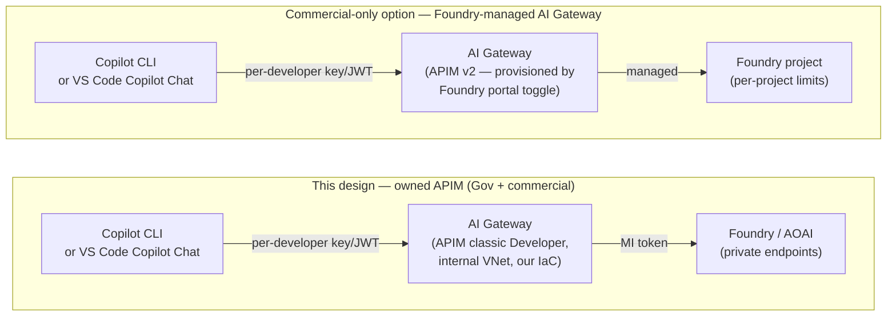

Both diagrams are the **AI Gateway pattern**; they differ only in **who owns the APIM** and
**which tier** it runs on. The table below pairs every v2 / Foundry-managed feature with the
**classic-tier equivalent this project already delivers**, so the only real differences are the
**provisioning model** and **governance granularity** — not capability:

| Capability | Foundry-managed AI Gateway (commercial, v2) | This design (classic Developer, Gov + commercial) |
|---|---|---|
| Token limits / quotas | ✅ GenAI policies on v2 | ✅ **same** GenAI policies on classic Developer |
| Token + request metrics | ✅ to App Insights | ✅ **same** — `copilot.byok` custom metrics |
| Content safety (Prompt Shields) | ✅ policy | ✅ **same** policy (Phase 1 roadmap) |
| Backend load-balancing / failover | ✅ | ✅ **same** — APIM backend pool |
| Private networking | Standard/Premium **v2** + PE or VNet injection | ✅ **classic Developer in internal VNet mode** |
| Governance granularity | **per-project** TPM/quota | ✅ **per-developer** (subscription key / Entra `oid`) — finer |
| Custom policy (BYOK auth, model auto-routing) | ⚠️ limited to Foundry's managed surface | ✅ **full control** of the policy document |
| Provisioning / lifecycle | Foundry portal toggle (**preview**) | ✅ **Bicep**, versioned, fully owned |
| **Azure Government** | ❌ v2 tiers not available today | ✅ **available now** on classic tiers |

**Reading the matrix honestly:** the Foundry-managed flavor is *more managed*, not *more
capable*. It trades **per-developer** containment for **per-project** limits and gives up custom
policy — both of which this solution depends on. So even in commercial where it *is* available,
this design's owned-APIM approach is the better fit for per-developer BYOK governance.

**Gov ↔ commercial reconciliation:** the only items that are genuinely commercial-only today are
the **v2 tiers** and therefore the **Foundry-managed provisioning convenience**. They represent a
*provisioning-model* difference, **not a functional gap** — every governance, telemetry, safety,
and routing capability is delivered identically on the classic Developer SKU that Gov supports
now. If/when v2 tiers reach Gov, adopting the managed flavor (should a client want portal-owned
lifecycle) is a **tier change, not a redesign**.

The dev laptop has:

1. A per-developer credential — an **APIM subscription key** (default) or a short-lived
   **Entra JWT** (`authMode=jwt`).
2. The Copilot CLI configured via `COPILOT_PROVIDER_*` env vars to send that credential
   as the "API key" to a private APIM hostname.

## Authentication modes

The gateway accepts exactly one caller credential, chosen at deploy time by the
`authMode` parameter. **Both modes deliver the same per-developer telemetry and
rate-limiting; they differ in how the developer's identity is established and how the
secret is managed.** The credential always rides in the `api-key` header, because the
Copilot CLI cannot send custom headers (issue #3399) and that is the only header slot it
exposes.

| `authMode` | Caller credential | How identity is established |
|---|---|---|
| `subscriptionKey` **(default)** | Per-developer **APIM subscription key** | APIM validates the key natively; developer identity = the APIM **subscription** (Id/Name) |
| `jwt` | Per-developer **Entra JWT** (`az account get-access-token`) | `validate-jwt` against Entra; developer identity = `oid`/`preferred_username` claims |

### Why subscription-key is the default

`authMode=subscriptionKey` is the **recommended starter default** — a proposal, not a
mandate. It standardizes on **one APIM subscription key per developer**, which most teams
can adopt with zero changes on the developer side (a long-lived static key fits the CLI's
static-credential model and any keys already in their tooling). It also sidesteps the
**~1-hour Entra token expiry**: a subscription key is long-lived, so there is no
per-invocation token mint and no token-refresh wrapper to run. Teams that want
cryptographic per-user identity should evaluate `authMode=jwt` below.

`authMode=jwt` is retained as an opt-in **stronger control** (true per-user identity,
short-lived tokens, instant revocation). Switching modes is a single parameter flip plus
redeploy — no structural change, because both policy variants and all named values are
always present.

### Self-serve developer onboarding (planned — `#64`)

`subscriptionKey` mode is fleet-safe (long-lived keys, no hourly expiry), but it shifts the
work to **provisioning**: at fleet scale (a representative rollout is ~150–200 developer
machines) someone has to mint a subscription per developer, assign a tier, hand out the key,
and configure each editor. Doing that by editing
[`apim-subscriptions.bicep`](../infra/modules/apim-subscriptions.bicep) and hand-pasting
[`chatLanguageModels.json`](../samples/vscode) per machine does not scale.

The planned fix is a **self-serve "register" web app**: a developer signs in once with Entra ID
and, with one click, gets their own APIM subscription **and** a ready-to-use client config
written to disk for whichever surface they use — `chatLanguageModels.json` for **VS Code** or
`COPILOT_PROVIDER_*` env vars for the **CLI** — no admin ticket, no JSON hand-editing. Tracked in
[`#64`](https://github.com/gwexler_microsoft/copilot-cli-byok-azure/issues/64) (with sub-issues
`#65`–`#72`).

> **Works on Commercial and Government, unchanged.** The app provisions via the public ARM
> control plane and authenticates with Entra ID — both exist in each cloud. Only the already-
> parameterized per-cloud endpoints differ (`*.azure-api.net` / `*.azure-api.us`,
> `login.microsoftonline.com` / `login.microsoftonline.us`). No cloud is privileged.
>
> **Subscription count is not a constraint.** APIM allows **10,000 subscriptions per instance**
> on the classic Developer SKU used here (15k Basic / 25k Standard / 75k Premium), and 1,000
> per product — a few hundred per-developer keys is well within limits. See the
> [APIM service limits](https://learn.microsoft.com/en-us/azure/azure-resource-manager/management/azure-subscription-service-limits#azure-api-management-limits).

**Onboarding flow (what the developer experiences):**

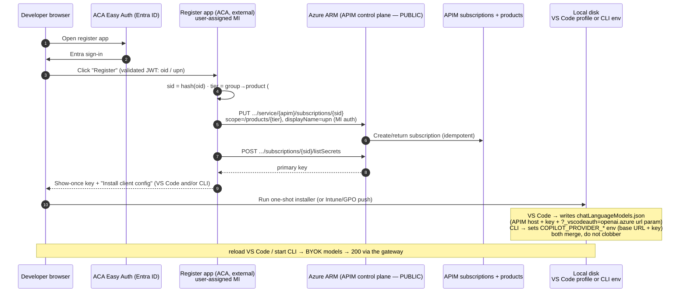

**Why it sits cleanly off to the side of the gateway (component view):**

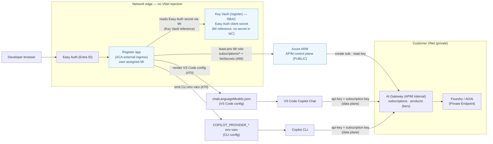

> **Key design properties** (full rationale in
> [`#64`](https://github.com/gwexler_microsoft/copilot-cli-byok-azure/issues/64)):
>
> - **Control-plane only → no VNet injection.** The app provisions via the **public ARM
>   control plane** (`Microsoft.ApiManagement/service/subscriptions`); it never touches the
>   private data-plane gateway. So it runs as a standalone **external** Container App with
>   **Entra Easy Auth** in front — sidestepping the internal-ingress L7 issue that affects
>   VNet-injected ACA. Only the *developer's* later chat traffic hits the private gateway.
> - **Least privilege** — the app's managed identity gets a **custom role** limited to
>   `subscriptions/*` + `listSecrets`, not the broad "API Management Service Contributor"
>   ([`#66`](https://github.com/gwexler_microsoft/copilot-cli-byok-azure/issues/66)).
> - **Easy Auth secret in Key Vault, never in IaC** — the app registration's client secret is
>   minted by [setup-register-entra](../scripts/setup-register-entra.ps1) and stored in a
>   dedicated **RBAC Key Vault** ([register-kv.bicep](../infra/modules/register-kv.bicep)); the
>   Container App reads it at runtime via a **managed-identity Key Vault reference**, so the
>   secret never flows through a Bicep parameter or azd state. This vault is register-only today
>   but is the natural home for any future platform secret (see the trust-boundary diagram note).
> - **Idempotent / no key sprawl** — `sid = hash(oid)`, so re-registering returns or
>   regenerates the *same* subscription rather than minting new keys
>   ([`#71`](https://github.com/gwexler_microsoft/copilot-cli-byok-azure/issues/71)).
> - **Tier governance preserved** — Entra group membership maps to the product scope
>   (`byok-standard` / `byok-power`), inheriting that tier's rate-limit / token-limit / quota
>   ([`#67`](https://github.com/gwexler_microsoft/copilot-cli-byok-azure/issues/67)).
> - **Zero hand-editing, either client** — the installer renders the developer's host + key
>   into whichever surface they use: the [`samples/vscode`](../samples/vscode) templates →
>   `chatLanguageModels.json` for **VS Code**, or the `COPILOT_PROVIDER_*` env block (base URL +
>   key) for the **CLI** — merging, not clobbering, any existing providers
>   ([`#70`](https://github.com/gwexler_microsoft/copilot-cli-byok-azure/issues/70)).
>   A developer who uses **both** surfaces gets **both** artifacts from the one registration
>   (same subscription key, two configs); both are written to **user space** — the VS Code
>   user-profile path and a per-user CLI env snippet — so no admin rights or machine-wide
>   changes are needed. The two artifacts are parallel, not interchangeable: the CLI reads only
>   the env vars and VS Code reads only the JSON.

> **`authMode=jwt` validated end-to-end in Azure US Government (2026-06-03).** A live probe
> from the in-VNet test VM against the Gov gateway (`copilot-byok-foundry`, Internal VNet)
> returned **HTTP 200** with a `gpt-5.1` completion when a Gov Entra JWT was supplied in the
> `api-key` header, and **HTTP 401** ("invalid Entra token") for a bad token — confirming
> `validate-jwt` enforcement and the full chain *CLI → APIM (validate-jwt) → strip creds →
> APIM system-MI token for `cognitiveservices.azure.us` → private-endpoint Foundry*. The CLI's
> lack of custom-header support (github/copilot-cli#3399) is **not** a blocker: the JWT rides
> in the single `api-key` header slot and the policy re-injects it as `Authorization: Bearer`.
> Tokens mint with `az account get-access-token --scope "<AppId>/.default"` (v2 `aud` = the
> app client-ID GUID). Gov OIDC metadata resolves at `login.microsoftonline.us`. Note: `gpt-5.1`
> requires `max_completion_tokens` (not `max_tokens`).

### Mode A — subscription key (default)

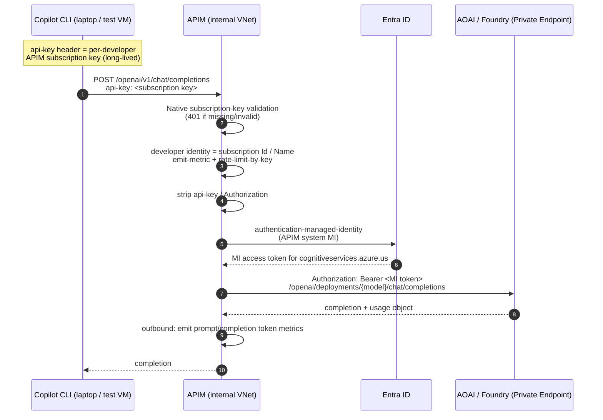

### Mode B — Entra JWT (opt-in stronger control)

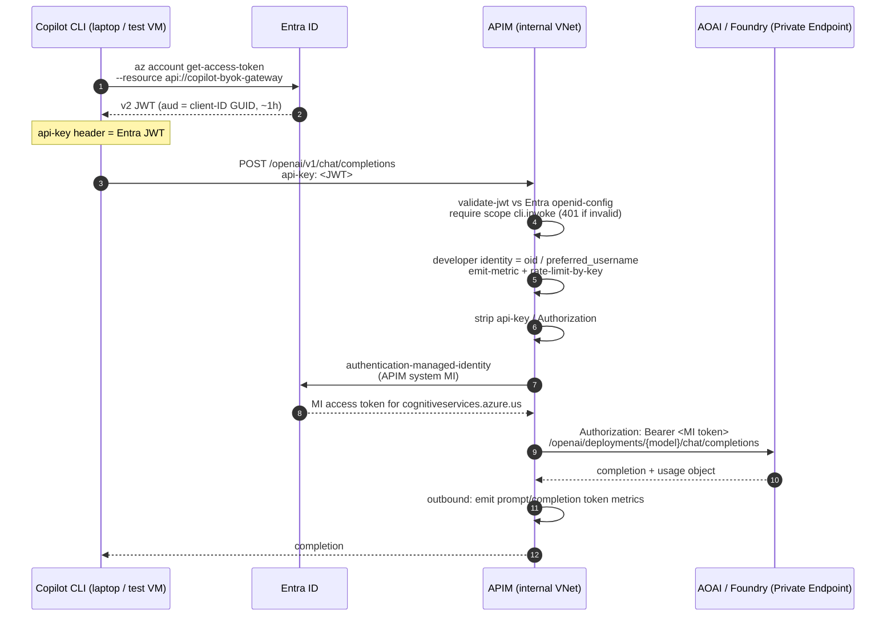

### Side-by-side comparison

| Dimension | `subscriptionKey` (default) | `jwt` |
|---|---|---|
| Recommended posture | ✅ Recommended starter default | Opt-in stronger control / upgrade |
| Per-developer identity | Per **subscription** (one key = one dev, by convention) | Per **Entra user** (cryptographic `oid`) |
| Secret lifetime | Long-lived key (rotate manually) | ~1 hour, minted per invocation |
| Secret on disk | Yes — key sits in CLI config | No — token is ephemeral |
| Revocation | Disable/rotate the APIM subscription | Disable user / remove app-role in Entra (instant) |
| Token-refresh wrapper needed | No | Yes (mint before each session) |
| Works around 1h Entra expiry | ✅ | N/A (that is the 1h) |
| Header slot used | `api-key` | `api-key` |
| Native gateway enforcement | ✅ APIM validates the key | Policy `validate-jwt` |
| Telemetry dimensions | `developer_oid`/`developer_upn` = subscription Id/Name | `developer_oid`/`developer_upn` = Entra `oid`/`upn` |

Because the metric **dimension names are identical** in both modes, the workbook and the
`monitoring/kql/*.kql` queries work unchanged regardless of `authMode` — only the
*values* of `developer_oid`/`developer_upn` differ (subscription identity vs Entra
identity).

### Two tokens, two issuers (`authMode=jwt`)

> This subsection applies to `authMode=jwt`. In the default `subscriptionKey` mode there
> is only **one** token in play — APIM's MI token for the backend hop — and the caller
> presents a long-lived subscription key instead of a JWT.

In `jwt` mode there are deliberately **two different Entra tokens** in play, and neither
is minted by APIM's own logic:

| Hop | Token | Minted by | Proves |
|---|---|---|---|
| Client → APIM | Entra JWT (caller identity) | Entra, via `az account get-access-token` on the dev's machine | *This developer* may use the gateway |
| APIM → AOAI | Entra JWT (APIM managed identity) | Entra, via the `authentication-managed-identity` policy | *APIM* may call AOAI |

APIM **cannot** mint the caller's JWT — a JWT is signed by Entra's private key, and the
whole purpose of `validate-jwt` is to verify a token APIM did **not** issue against
Entra's published public keys (`openid-config`). If APIM issued the token it verified,
the check would be circular and prove nothing. APIM only mints its *own* MI token for
the backend hop.

End-to-end the flow is:

1. Dev runs `az account get-access-token --scope "<clientId>/.default"` → Entra returns
   a v2 JWT (`aud` = client-ID GUID).
2. The wrapper puts that JWT in the `api-key` header and POSTs to APIM.
3. APIM `validate-jwt` verifies it against Entra `openid-config` and checks scope
   `cli.invoke`.
4. APIM strips the dev's credential, then `authentication-managed-identity` → Entra
   issues APIM's **own** MI token for AOAI.
5. APIM attaches the MI token as `Authorization: Bearer` and forwards to the private
   AOAI endpoint.

### Upstream CLI dependencies & the token-refresh gap (`authMode=jwt`)

Two distinct Copilot CLI limitations shape `jwt` mode. They are often conflated — they
are not the same problem.

| Limitation | Effect on this design | Upstream issue |
|---|---|---|
| **No custom headers** — the CLI exposes only the `api-key` slot | The JWT is *smuggled* in the `api-key` header and the policy re-injects it as `Authorization: Bearer` so `validate-jwt` can read it (steps 1–2 of [byok-foundry-policy.xml](../policies/byok-foundry-policy.xml)) | [github/copilot-cli#3399](https://github.com/github/copilot-cli/issues/3399) *(open, Feature)* |
| **Static credential, read once at startup** — no refresh hook | The ~60–90 min Entra token expires mid-session → APIM returns **401** with no way for the CLI to re-mint. Requires an external refresh mechanism (a local token-refreshing sidecar proxy) | *No upstream issue exists yet* — see [docs/feature-request-byok-credential-refresh.md](feature-request-byok-credential-refresh.md) |

**If #3399 ships (custom headers):** the change is *cosmetic cleanup only*. The JWT moves
into a real `Authorization: Bearer <jwt>` header (e.g. `COPILOT_EXTRA_HEADERS`), and the
policy's api-key→Bearer re-injection (steps 1–2) can be deleted because `validate-jwt`
reads `Authorization` natively. **The expiry cliff is unchanged** — custom headers are
still read once at startup, so the sidecar is still required.

**The transformational fix is the missing one** — a credential *refresh* capability (a
per-request credential command, a file-backed credential the CLI re-reads, or native
OAuth client-credential refresh). That would let us **delete the sidecar** and make `jwt`
mode seamless. It is *not* #3399 and *not* #3448 (extra request params); it does not yet
exist upstream, so we draft it in [feature-request-byok-credential-refresh.md](feature-request-byok-credential-refresh.md).

Until then the decision matrix is unchanged: **`subscriptionKey` stays the default**
(long-lived, no refresh machinery), and **`jwt` is the opt-in stronger control** that
ships with a token-refreshing sidecar.


## Wire format

GitHub Copilot CLI (>= 1.0.20, `azure` provider type) sends an **OpenAI-style v1**
request with the model/deployment in the request **body**, not the URL:

```
POST {COPILOT_PROVIDER_BASE_URL}/v1/chat/completions
api-key: <whatever was in COPILOT_PROVIDER_API_KEY>
Content-Type: application/json

{ "model": "gpt-5.1", "messages": [ ... ] }
```

`COPILOT_PROVIDER_BASE_URL` includes the `/openai` path, so the full frontend path
APIM exposes is `/openai/v1/{chat/completions,completions,embeddings,responses}`. The
**`/v1/responses`** route is included for VS Code 1.122+ Custom Endpoint clients that
prefer the Responses API; the gateway accepts both wire formats on the same hostname
and routes them to the same backend (see *Responses route* below).

APIM accepts this and:

1. Reads the `api-key` header. (CLI cannot send custom headers — issue #3399.) In
   `subscriptionKey` mode the API has `subscriptionRequired: true` with
   `subscriptionKeyParameterNames.header = api-key`, so APIM validates the key
   **natively** (401 on missing/invalid) before the policy runs; in `jwt` mode the
   header carries the Entra JWT and `validate-jwt` is the credential check.
2. (`jwt` mode only) `validate-jwt` against Entra OpenID metadata, require scope
   `cli.invoke`, audience = our API app's **client-ID GUID** (with v2 access tokens the
   `aud` claim is the appId GUID, not the `api://` URI).
3. Establish the developer identity — in `jwt` mode from the `oid` and
   `preferred_username` claims; in `subscriptionKey` mode from the APIM subscription
   Id/Name — and resolve the target deployment name: from the **URL path** when the
   caller used the legacy `/deployments/{model}/…` shape, otherwise from the `model`
   field in the request **body** (see *Two accepted request-path shapes* below).
4. `emit-metric` `copilot_byok_request` with dimensions `developer_oid`,
   `developer_upn`, `deployment_name`.
5. Delete `api-key` and `Authorization` headers.
6. `authentication-managed-identity resource="{{aoai-mi-audience}}"` — APIM mints
   an AAD token for AOAI and attaches it as `Authorization: Bearer ...`.
7. `rewrite-uri` to the data-plane path the backend expects. For
   chat/completions/embeddings this is the deployment-scoped classic path
   `/openai/deployments/{model}/{chat/completions|completions|embeddings}`. For
   Responses it is the **account-root, versionless** path `/openai/v1/responses`
   (model stays in the body, not the URL — see below). The `api-version` query param
   is set (override) for both.
8. Route to private AOAI / Foundry FQDN (resolved via privatelink zone in the VNet).

### Two accepted request-path shapes (OpenAI-compatible + legacy Azure-native)

The gateway accepts **both** URL conventions on the client-facing inference routes
(`/openai` Foundry default, `/aoai` legacy):

| Shape | Example | Deployment from | Auto-routing |
|---|---|---|---|
| **OpenAI-compatible (short)** — our default | `POST /openai/v1/chat/completions` + `{"model":"gpt-5.1"}` | request **body** | yes (`auto` / `byok-auto` sentinel) |
| **Azure-OpenAI-native (legacy / wizard)** | `POST /openai/deployments/gpt-5.1/chat/completions?api-version=…` | **URL** path segment | no (explicit deployment) |

Why both: some client fleets were provisioned by older wizard-generated policies that
hard-code the full deployment-scoped path, and re-configuring every client is impractical.
So each API defines `/deployments/{deployment}/{chat/completions,completions,embeddings}`
operations alongside the `/v1/*` ones (without them APIM would `404` — *no matching
operation*), and the policy resolves the deployment from the URL when present
(`pathHasDeployment`), otherwise from the body. Either way the shared `rewrite-uri`
produces the backend data-plane path `/openai/deployments/{model}/<op>` — identical on the
`/openai` route; the `/aoai` prefix is translated to `/openai/` on the legacy route.
Legacy-path requests still get the `api-version` normalization and the reasoning-model body
fixups (`max_tokens`→`max_completion_tokens`, sampling-param strip); they simply bypass
tiered auto-routing because an explicit deployment can't be the `auto` sentinel. The newer
`/openai-commercial` route is OpenAI-compatible (short-path) only, since its clients are
configured fresh. See issue #105.

### Responses route (`/openai/v1/responses`)

The OpenAI Responses API has a different shape than chat-completions, and the gateway
handles the differences in policy so the same caller, same credential, same backend
identity, and same telemetry pipeline apply.

| Aspect | Chat Completions | Responses |
|---|---|---|
| Frontend path | `POST /openai/v1/chat/completions` | `POST /openai/v1/responses` |
| Backend path (after `rewrite-uri`) | `/openai/deployments/{model}/chat/completions` (deployment-scoped) | `/openai/v1/responses` (account-root, versionless) |
| Model location | URL **and** body (must match) | **Body only** — `{ "model": "gpt-5.1", ... }` |
| Prompt body | `messages: [{role, content}]` (content = string or multimodal-array of `{type, text, ...}`) | `input: <string> \| [{role, content}]` (content uses `text`, `input_text`, `output_text` parts) |
| Streaming opt-in | `stream: true` + `stream_options.include_usage` (policy injects) | `stream: true` (Responses SSE has its own `response.completed` event carrying usage) |
| Usage shape | `usage.prompt_tokens` / `usage.completion_tokens` | `usage.input_tokens` / `usage.output_tokens` |
| Reasoning effort field | `reasoning_effort: "minimal"\|"low"\|"medium"\|"high"` (root) | `reasoning: { "effort": "..." }` (nested) |
| VS Code Custom Endpoint config | `apiType: "chat-completions"`, `reasoningEffortFormat: "chat-completions"` | `apiType: "responses"`, `reasoningEffortFormat: "responses"` |

The policy bridges these differences so both surfaces look the same to operators:

- **Prompt sizing / content scanning** (`autoUserText`, with `autoPromptText` fallback):
  isolates the caller's **last user turn** across both `messages[].content` and
  `input[].content` (accepting `text`, `input_text`, and `output_text` parts), so the size +
  coding-signal check reflect the actual question rather than the injected system prompt /
  context. The auto-route classifier works identically against either wire format.
- **`stream_options.include_usage` injection**: only applied when the path is **not**
  `/responses`. Responses SSE has its own `response.completed` event that carries usage,
  and may reject unknown body fields, so the body is passed through unchanged.
- **Token-metric emission**: `copilot_byok_prompt_tokens` and `_completion_tokens`
  fall back from `prompt_tokens` → `input_tokens` (and `completion_tokens` →
  `output_tokens`). Dashboards and KQL queries don't need to know which wire format
  produced a row.
- **Path rewrite**: a `<choose>` block routes Responses to `/openai/v1/responses`
  (account-root) and everything else to `/openai/deployments/{model}/<op>`
  (deployment-scoped). The same MI token works for both — both surfaces share the
  `cognitiveservices.azure.*` audience and `Cognitive Services OpenAI User` role.

> **Gov / `api-version` interplay (field-verified 2026-06-17).** Two failure modes show up
> together the moment a client moves to a newer model (e.g. `gpt-5.1`) on **Azure
> Government**, and they pull `api-version` in opposite directions:
>
> 1. **404 when the CLI omits `api-version`.** The Copilot CLI only appends
>    `?api-version=…` when `COPILOT_PROVIDER_AZURE_API_VERSION` is set. Drop that env var
>    and the deployment-scoped backend path can no longer be resolved →
>    `model '<name>' not found on provider … (http 404)`. Keep the env var set.
> 2. **400 `responses API is enabled only for api-version 2025-03-01-preview and later`.**
>    Newer clients prefer the Responses API, and that surface needs a *newer* dated preview
>    than chat-completions — while Gov's chat-completions backend still wants an *older*
>    `2024-09-01-preview` for `stream_options.include_usage` to be a recognised field
>    (inject it under a version Gov doesn't understand and the backend 400s with
>    `unknown parameter 'stream_options.include_usage'`).
>
> This repo's policy sidesteps both by rewriting Responses to the **account-root,
> versionless** `/openai/v1/responses` and **stripping `api-version` entirely** (see *Path
> rewrite* above), so the single `aoai-default-api-version` named value only ever applies to
> deployment-scoped chat-completions. If you instead keep Responses **deployment-scoped**
> (the wizard shape), you must make the version *path-conditional*, e.g.:
>
> ```xml
> <set-query-parameter name="api-version" exists-action="override">
>   <value>@(context.Request.OriginalUrl.Path.EndsWith("/responses", StringComparison.OrdinalIgnoreCase)
>            ? "2025-03-01-preview" : "2024-09-01-preview")</value>
> </set-query-parameter>
> ```
>
> **Do not mix the two shapes.** The versionless `/openai/v1/responses` rewrite *rejects* a
> dated `api-version` with `400 API version not supported`; the deployment-scoped shape
> *requires* one. Pick one Responses integration and keep the api-version handling matched to it.

> **What you lose on *streaming* `/responses`.** `stream_options.include_usage` is **not**
> injected on `/responses` (the field is rejected there — on Gov it 400s as
> `unknown parameter 'stream_options.include_usage'`). A streamed Responses reply carries its
> usage in the SSE `response.completed` event, **not** a JSON `usage` object, and the outbound
> token parser is gated on `200 + application/json` — so for **streaming** `/responses` it
> records **0** prompt/completion tokens. Still intact: the always-on inbound
> `copilot_byok_request` count, all three throttles, and full token counts for **non-streaming**
> `/responses` (a single JSON body with `usage.input_tokens` / `usage.output_tokens`, which the
> fallback parser already handles). To recover per-call token metrics on *streaming* Responses
> you must parse the `response.completed` SSE event yourself in an outbound policy —
> `llm-emit-token-metric` does not do this on the current Gov platform build.

> **"Eventually supported" on Gov = two independent clocks, not one.** It is tempting to
> assume a single Gov update will restore streaming per-call token metrics for newer models.
> It won't — there are **two separate dependencies on different Microsoft timelines**, and a
> wizard/`llm-*` policy is at the mercy of both:
>
> 1. **Gov backend api-version parity.** When Gov's (commercial-lagging) feature branch picks
>    up the newer api-versions, the `stream_options.include_usage` inject stops 400ing, which
>    restores streaming **chat-completions** token metrics. This is a *backend/model* clock.
> 2. **APIM `llm-emit-token-metric` learning to parse the Responses `response.completed` SSE
>    usage event.** This is an *APIM platform-policy* capability, independent of the backend.
>    Until it lands, streaming **`/responses`** stays dark **even after** clock #1 ships.
>
> So a non-streaming call, or a streaming chat-completions call once #1 lands, will meter; but
> streaming `/responses` needs **both**. Don't plan around a single "Gov supports it now" date.
> This repo's own policy doesn't wait on either clock for the *request-side* signals
> (`copilot_byok_request`, per-developer / per-model / backend / auto-route / throttle
> attribution all come from inbound `emit-metric`, not from `usage`) — the only thing even the
> full policy can't recover on streaming `/responses` today is the **token count** itself (same
> SSE-parsing gap), and it degrades to `0` rather than going fully blind.

### Client surfaces that drive these routes

| Client | apiType / path | Auth header it sends | Notes |
|---|---|---|---|
| **GitHub Copilot CLI** (BYOK `azure` provider) | `chat-completions` only — `/openai/v1/chat/completions` | `api-key: <subscription-key>` (default) or `api-key: <JWT>` (jwt mode) — CLI cannot send custom headers (#3399). | The wrapper script handles env-var setup. |
| **VS Code 1.122+ Custom Endpoint** | Either or both — `chat-completions` and/or `responses` | Defaults to `Authorization: Bearer <apiKey>`; for this gateway append `?_vscodeauth=openai.azure` to each model `url` so VS Code sends the key as `api-key: <APIM_SUBSCRIPTION_KEY>` and APIM native subscription-key validation accepts it (see [issue #96](https://github.com/gwexler_microsoft/copilot-cli-byok-azure/issues/96)). Works without GitHub sign-in. | Set `reasoningEffortFormat` to match `apiType`. Ready-made model registration JSON in [`samples/vscode/`](../samples/vscode/). See [deployment-guide → Option C](deployment-guide.md#option-c--vs-code-via-custom-endpoint-byok-provider). |

> **Failure mode — model parsing.** The deployment name is derived solely from the
> `model` field in the request body. If the body is not valid JSON (a common shell
> quoting mistake — see the deployment guide), the parse falls back to `"unknown"`,
> APIM rewrites to `/openai/deployments/unknown/...`, and AOAI returns
> `DeploymentNotFound`. The policy guards this by returning a `400` with a clear
> message when the model cannot be parsed, so the failure is not mistaken for a
> missing deployment.

> **Failure mode — `api-version` too old.** The injected `api-version` comes from the
> `aoai-default-api-version` named value (Bicep param `defaultAoaiApiVersion`, default
> `2025-04-01-preview`). The `gpt-4.1` / `gpt-5.1` model families require
> `2025-04-01-preview` or later — an older value (e.g. `2024-10-21`) makes the backend
> return `404 Resource not found` even though the deployment exists. If you see a 404
> from a deployment you know is live, check this named value first.

> **Failure mode — `max_tokens` vs `max_completion_tokens`.** The `gpt-5.x` family
> rejects `max_tokens` with a `400` (`'max_tokens' is not supported with this model; use
> 'max_completion_tokens'`). `gpt-4.1-mini` still accepts `max_tokens`. Because the
> sentinel `auto` route can land on either tier, clients that set a token cap should send
> `max_completion_tokens` so the request works regardless of which tier the prompt routes to.

### Model discovery — the `/v1/models` operation on the foundry API (`#61`)

`GET /v1/models` is served as an **operation on the foundry inference API**
(`copilot-byok-foundry`, path `/openai`) — reachable at `https://<apim>/openai/v1/models` by
**any valid inference key** (model names aren't sensitive, and OpenAI-compatible IDE clients must
list models to connect). It used to live on a dedicated `copilot-byok-discovery` API gated by a
restricted `byok-discovery` product; that surface was **consolidated away** once the same list
became available here (they returned the identical payload). Only deployed when
`authMode == 'subscriptionKey'` and `deployFoundry == true`.

```
GET https://<apim>/openai/v1/models        <- frontend (any inference key)
    api-key: <tier-subscription-key>

→ operation-scoped policy (byok-foundry-models-policy*.xml)   <- does NOT inherit the API body-parse
→ set-backend-service foundry              <- always the Foundry/AIServices backend
→ authentication-managed-identity          <- APIM system-MI -> cognitiveservices audience
→ strip api-key + Authorization
→ GET https://<foundry>/openai/v1/models   <- backend; reshaped to OpenAI shape + `auto` sentinel
```

**Why it's an operation (not a separate API anymore)**

- **Operation-scoped policy.** The models op uses its own policy
  (`byok-foundry-models-policy*.xml`) that does **not** inherit the foundry API's body-parse
  400-guard, so a body-less `GET` is fine — no need for a separate API to dodge that guard.
- **Telemetry hygiene preserved.** That op policy has an empty outbound (no `<base />`), so it
  does **not** run `emit-metric`; model-list polling never lands in
  `copilot_byok_request` / `copilot_byok_prompt_tokens` / `copilot_byok_completion_tokens`.
- **Access.** Model names aren't sensitive and IDE clients must list models to connect, so any
  valid inference key may list. If you later need "who can list models" restricted again,
  reintroduce a product-gated variant — the pilots intentionally keep it open.

The CI smoke runner asserts this op with the normal `dev1` tier key (no dedicated discovery
subscription).

## Backend & routing choices

There are three independent "where does the model live" choices. Two are baked at deploy
time (Bicep params); the third is a pure developer-side config decision.

| Choice | Controlled by | Default | Notes |
|---|---|---|---|
| **Microsoft Foundry** (kind=AIServices) | `deployFoundry` (Bicep) | **`true` (default backend)** | Exposed at APIM path `/openai`. This is what new traffic hits and the recommended/standard backend. |
| **Azure OpenAI** (kind=OpenAI, legacy) | `deployAoai` (Bicep) | **`false` (opt-in)** | Exposed at APIM path `/aoai`. Disabled by default — only enable for a legacy `/aoai` path. Can run alongside Foundry or instead of it. |
| **GitHub SaaS model** | `COPILOT_PROVIDER_*` env vars (developer config) | **not used** | Only used if the developer does *not* point the CLI at the private gateway. |

### Decision flow

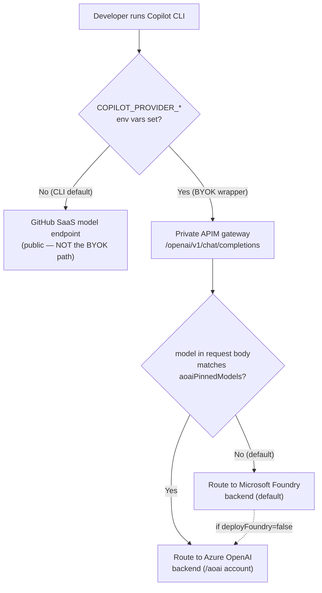

- **Foundry is the default route.** On the default API (`/openai`), every request goes to
  the Foundry backend unless its `model` matches `aoaiPinnedModels`.
- **`aoaiPinnedModels`** (comma-separated, case-insensitive) lets specific model names be
  rerouted from Foundry to the classic AOAI backend *in policy*, without the caller
  changing URLs. This is on top of the separate legacy `/aoai` path.
- **Foundry-only is the default**, and both single-backend modes are valid: `deployAoai`
  defaults to `false` so Foundry runs alone; set `deployAoai=true` to add the legacy AOAI
  backend, or `deployFoundry=false` to run only the legacy AOAI backend.
- **Foundry uses the OpenAI-compatible surface**, so its MI audience and role are
  identical to classic AOAI (`Cognitive Services OpenAI User` on
  `cognitiveservices.azure.*`). The native Foundry surface (`ai.azure.*`) is not used.
- **GitHub SaaS is never the BYOK default.** The whole point of the BYOK wrapper is to
  set `COPILOT_PROVIDER_*` so traffic goes to the private gateway. Leaving those unset is
  the only way the CLI falls back to GitHub's public model endpoint.

### Tiered auto model-routing

A developer can send the **sentinel model `auto`** (or `byok-auto`) instead of a concrete model
name to let the gateway pick the cheapest deployment that can handle the request. This deploys a
second, smaller **"mini" deployment** on each backend (the cheap tier) alongside the full model,
and adds a routing block to the APIM policy. Explicit model names always bypass routing.

| Tier | Model (Gov pilot) | Used when |
|---|---|---|
| **Full** | `gpt-5.1` (DataZoneStandard) | Coding/debugging, long or technical prompts, ambiguous prompts (fail-safe) |
| **Mini** | `gpt-4.1-mini` (DataZoneStandard) | Short, non-coding, conversational prompts |

The decision is two levels:

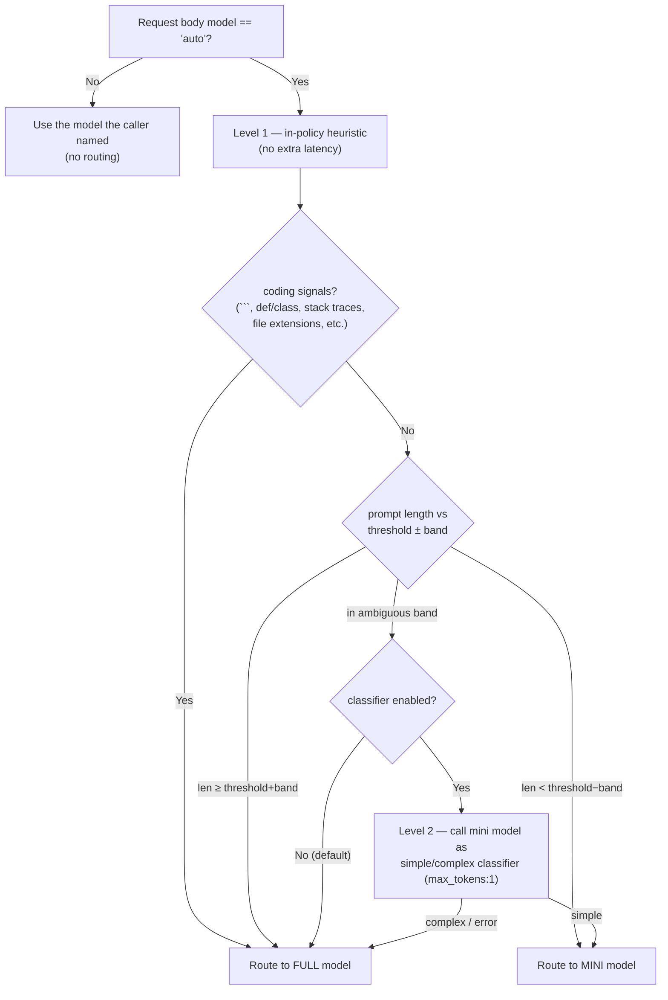

- **Level 1 (heuristic)** runs entirely in the APIM policy with zero added round-trips. It
  scopes the decision to the caller's **last user turn** — the final `role:"user"` message (or
  last user `input` item for the Responses API), *not* the whole payload. This is deliberate:
  VS Code and the CLI always prepend a large system prompt + workspace/tool context, so sizing
  the full conversation made even `what is 2+2` exceed the threshold and trip the coding regex,
  forcing the full model. It scans that user turn for coding signals via regex and compares its
  length to `autoRouteLengthThreshold` (default 500 chars) with a ± `autoRouteAmbiguousBand`
  (default 200) dead-zone. If no user turn can be isolated it falls back to the full text.
- **Level 2 (classifier)** is **off by default** (`autoRouteClassifierEnabled=false`). When on,
  *only* ambiguous-band prompts trigger a single `max_tokens:1` call to the mini deployment that
  replies `simple` or `complex`; any non-200/error fails safe to the full model. This adds one
  round-trip **only** on the ambiguous band.
- The resolved deployment name overwrites the body `model`, so the token metrics and
  `rewrite-uri` see the real model. The request metric keeps its stable `auto_route` dimension.
  Auto-routed calls also emit `copilot_byok_auto_route`, whose five dimensions record UPN,
  resolved deployment, decision, decisive reason (`short`, `coding`, `ambiguous`, `long`, or a
  classifier result), and length band. This is a separate metric because APIM allows at most five
  custom dimensions per `emit-metric` policy.
- Routing is present in **all four** policy variants (subscription-key and JWT × Foundry and AOAI).
  Tuning knobs are APIM **named values** (`auto-route-*`), so the threshold, band, and classifier
  toggle can be changed without redeploying Bicep.

### Foundry Model Router vs the free APIM router (opt-in `#76`)

The `auto` routing above is **ours** — it runs entirely in the APIM policy and costs nothing
beyond the tokens the chosen model would have used anyway. Azure also ships a **managed**
alternative, **[Foundry Model Router](https://learn.microsoft.com/en-us/azure/ai-foundry/openai/how-to/model-router)**:
a single deployable `model-router` model (one deployment, `kind=OpenAI`) that is itself a trained
classifier and picks the best underlying model per request. Both are **opt-in ways to auto-select
a model**, and a client turns either on purely by the `model` value it sends — they can even
coexist on the same gateway.

| Dimension | **APIM policy router** (`model: auto`) | **Foundry Model Router** (`model: model-router`) |
|---|---|---|
| Status here | **Built** — present in all four policy variants today | **Opt-in, not built** — gated behind `deployModelRouter` (#76) |
| Where it runs | The gateway (APIM policy) | The Foundry backend (a deployment) |
| Selection logic | Our heuristic (coding signals + length band) + optional mini-model classifier on the ambiguous band | Microsoft's trained router; **Balanced** / **Quality** / **Cost** modes, optional model subset |
| Cost | **Free** — pure policy; you pay only the routed model's tokens | **Slight markup** — "router markup on input tokens **plus** the underlying model's input/output pricing" |
| Tunability | Full — `auto-route-*` named values, our own signals, fail-safe to full | Mode + subset only (Microsoft owns the routing model) |
| Which model ran | `auto_route` request-metric dimension (`mini`/`full`/`ambiguous`/`none`) | Response `model` field names the underlying model the router picked |
| Content filter / TPM | Per underlying deployment (`byok-coding`, per-deployment caps) | Applied **at the router level**; do **not** set per-underlying-model filters/limits |
| Gov availability | ✅ runs anywhere the classic Developer SKU runs (Gov included) | ⚠️ subject to `model-router` availability in the target Gov region (preview) — verify before relying on it |

> **How a client opts in.** Both selectors are chosen by the request-body `model` value, so no
> client code changes — only config:
>
> - **VS Code (Custom Endpoint):** add a model entry whose `id` is `auto` (free router) or
>   `model-router` (managed router) to `chatLanguageModels.json`. VS Code sends that `id` verbatim
>   as the body `model`, which is exactly what each selector keys on (#75).
> - **CLI:** set the default model in `COPILOT_PROVIDER_*` to `auto` or `model-router`.
>
> The free APIM router needs **nothing** deployed (it's already in policy). The Foundry Model
> Router needs the `model-router` deployment (`deployModelRouter=true`, with a `modelRouterMode`
> of `balanced`/`quality`/`cost`) and the gateway policy passing `model: model-router` straight
> through to the deployment-scoped path (#76). Because Model Router applies its **own** content
> filter and TPM limit across all underlying models, don't double-configure those per underlying
> deployment.

## How APIM reaches the backend: managed identity vs API key

There are two ways to wire APIM to a Foundry/AOAI backend, and the Azure portal "Import
Azure OpenAI / Foundry" wizard picks the *other* one from what this project uses. They are
**two orthogonal choices** the wizard happens to bundle together:

| Axis | Portal wizard default | **This project (chosen)** |
|---|---|---|
| **Auth to the backend** | Foundry/AOAI **API key**, stored as an APIM named value / Backend secret | **Entra managed-identity bearer token** (`authentication-managed-identity` → `Authorization: Bearer`) |
| **Backend reference** | APIM **Backend entity** (Backends tab) → `set-backend-service backend-id="…"` | APIM **Backend entity** by `set-backend-service backend-id="{{…-backend-id}}"` — a single Url backend by default, a load-balanced **Pool** when multi-region is enabled |

The two axes are independent: a Backend entity can *also* carry a managed identity, and an
inline `base-url` could *also* use a key. The wizard simply ties "Backend entity" to "key".
This project deliberately uses **managed identity + a Backend entity** — taking the wizard's
resiliency-capable Backend reference but keeping MI auth instead of a key.

### Pattern A — Portal wizard: Backend entity + API key

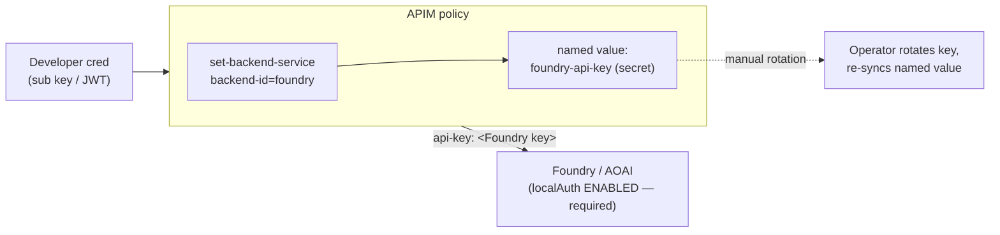

**Pros:** one-click in the portal; the Backend *entity* unlocks built-in **circuit breaker**
rules and load-balanced **backend pools** (priority/weight) for multi-region or PTU→PAYG
failover. **Cons:** requires `disableLocalAuth=false` on the account (a standing secret
exists); the key must be rotated and the named value re-synced (a classic silent-outage
source); backend logs attribute calls to an anonymous shared key, not a named identity.

### Pattern B — This project: managed identity + Backend entity

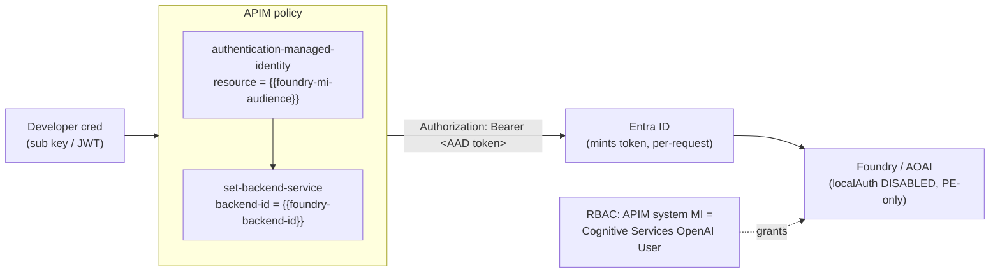

**Pros:** **no secret exists** — the account runs with `disableLocalAuth=true`, so there is
nothing to leak or rotate; tokens are minted per-request and auto-rotated by the platform;
the backend attributes every call to the APIM MI **principal** (real audit identity) gated by
least-privilege `Cognitive Services OpenAI User` RBAC; it composes cleanly with the PE-only,
zero-trust posture this design already enforces. Because routing goes through a Backend
entity, **circuit breakers and load-balanced pools are available without re-architecting** —
see the opt-in multi-region section below. **Cons:** a Backend entity is one extra resource
per account vs an inline URL (negligible), and pooling requires granting the MI RBAC on every
regional member.

### Why this project leans on managed identity

On the **auth axis the choice is decisive**: managed identity is strictly better for this
threat model. The wizard's key approach would force us to *re-enable* local auth on a PE-only
account — directly weakening the design — and add a rotation/drift burden for no benefit.
Managed identity is also Microsoft's recommended production pattern in the GenAI / AI-gateway
reference architectures. So we keep MI everywhere (all four policy variants use
`authentication-managed-identity`).

On the **backend-reference axis**, every policy now targets an APIM **Backend entity** by
`backend-id` (a named value: `foundry-backend-id` / `aoai-backend-id`). With pooling off this
is a single **Url backend** — functionally identical to the old inline base-url, but it gives
us the seam to attach resiliency primitives (circuit breaker, load-balanced pools) without
touching the policies. **Managed identity stays the auth method in every case**, single-region
or pooled: one Entra token (audience = the shared Cognitive Services audience) is valid against
*every* regional account, so pooling composes with MI for free. The only thing that ever
changes is which backend the `backend-id` named value points at.

### Multi-region backend pools (opt-in)

Set `deployBackendPool: true` and list extra regions in `foundryRegions` (and/or `aoaiRegions`)
to deploy regional AI accounts and have APIM load-balance / fail over across them — while the
managed-identity auth route is unchanged.

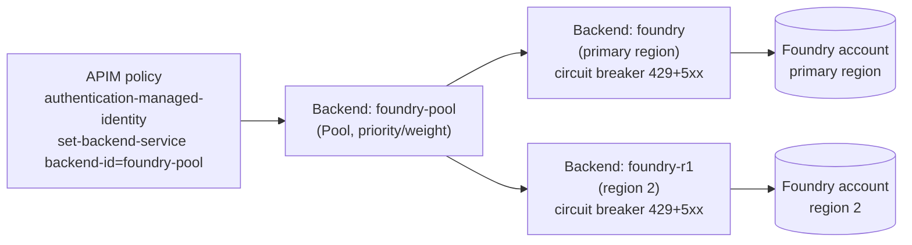

What the opt-in does, end to end:

- **Accounts** — `foundryRegions` / `aoaiRegions` each deploy a secondary Cognitive Services
  account (`infra/modules/foundry.bicep` / `aoai.bicep`, disambiguated by a `regionTag`) with
  the **same** model and mini deployment names/versions as the primary, so explicit-model and
  auto-route requests work against any member. Private endpoints land in the primary VNet's PE
  subnet (cross-region PE is supported) and register in the shared private DNS zones.
- **Backends + pool** — `infra/modules/apim-backends.bicep` creates one **Url backend** per
  region plus a **Pool backend** (`foundry-pool` / `aoai-pool`). The `backendPoolStrategy` param
  controls member distribution: `weighted` = **active/active** (every region priority 1, weight
  100 → load-balanced round-robin); `priority` (default) = **active/passive** (primary priority 1,
  secondaries priority 2+ → they serve only when higher tiers trip/are down). The
  `foundry-backend-id` named value flips from `foundry` to `foundry-pool` automatically.
- **Circuit breaker** — `enableBackendCircuitBreaker` (default on when pooling) trips a member
  out of rotation on **429 + 5xx** within `breakerInterval` and **honors `Retry-After`**, so a
  PTU 429 spills over to the next region promptly instead of failing the caller. Tune with
  `breakerFailureCount` / `breakerTripDuration`.
- **In-request retry** — the policy `<backend>` wraps `<forward-request>` in a `<retry>` on
  transient **429/5xx** (`count=2`, `first-fast-retry`). The circuit breaker isolates a bad
  region *across* requests; this retry re-selects the next healthy pool member *within the same*
  request so a single transient failure doesn't surface to the caller. It is a no-op for a single
  Url backend, so it ships safely in every deployment.
- **RBAC — the must-not-forget step** — because MI mints one token valid against all accounts,
  `infra/modules/rbac.bicep` grants the APIM MI **Cognitive Services OpenAI User** on *every*
  regional account. A member the MI lacks rights on returns 401/403 and silently poisons the
  pool.

Two caveats this design accepts: the auto-route **Level-2 classifier** still calls the
*primary* base URL directly (via `foundry-private-base-url`, retained for exactly this reason),
not the pool — fine for a `max_tokens:1` probe; and the secondary regional accounts must host
the same deployment names for routing to be uniform. With `deployBackendPool: false` (default)
none of this is created and behavior is identical to a single transparent Url backend.

#### Workflow 1 — load distribution (`backendPoolStrategy: weighted`, active/active)

Every region has equal priority/weight, so APIM round-robins each request across all members.
This spreads token throughput over multiple regional capacities (useful when one region's PTU /
quota can't absorb the whole developer fleet). The managed-identity hop is unchanged — the same
MI token is valid against every member.

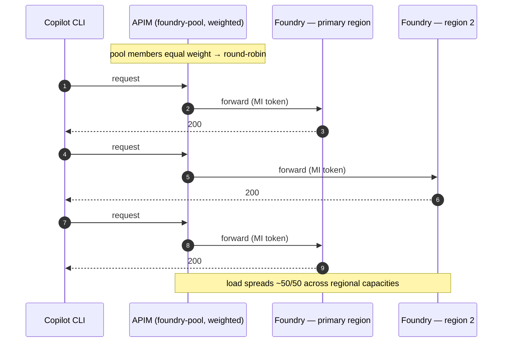

> **Verifying the split.** App Insights stamps each dependency with the **gateway's** region
> (constant), *not* the backend's — so don't judge distribution by the dependency "Region"
> property. Use the backend **host** instead (`<acct>` = primary, `<acct>r1/r2…` = regional
> members): [`monitoring/kql/requests-per-backend-region.kql`](../monitoring/kql/requests-per-backend-region.kql)
> buckets requests by `parse_url(target).Host` to show the true per-region counts.

#### Workflow 2 — resiliency / automatic failover

Two independent mechanisms keep a failing region from reaching the caller:

- **In-request retry** (every deployment, even single-region): the policy `<retry>` re-forwards a
  transient **429/5xx** onto the next healthy pool member *within the same request*, so one
  blip never surfaces.
- **Circuit breaker** (default-on with the pool): after `breakerFailureCount` failures
  (429 + 5xx) in `breakerInterval`, APIM **trips the member out of rotation** for
  `breakerTripDuration` and honors any `Retry-After`. With `backendPoolStrategy: priority` the
  secondary is **active/passive** — it serves *only* while the primary is tripped, then traffic
  returns to the primary automatically when the breaker resets.

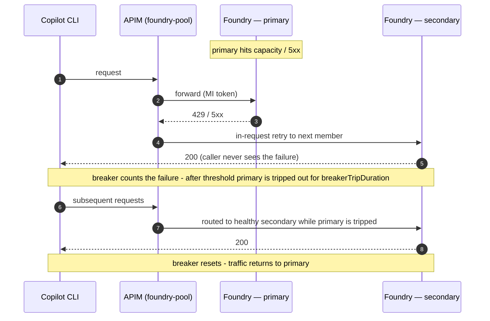

With `backendPoolStrategy: priority` this is classic **active/passive DR**; with `weighted` it is
**active/active** that simply drops the tripped member from the rotation until it recovers.

#### Does splitting a conversation across regions break consistency?

No — and it's worth understanding *why*, because it's a common worry. Chat completions are
**stateless**: the model holds no server-side memory between calls, and the client (Copilot CLI)
resends the **entire conversation** in the `messages` array on every turn. So if turn 1 lands in
region A and turn 2 lands in region B, turn 2's request already carries turn 1's question *and*
answer — region B reconstructs the full context from scratch, exactly as region A would have.
There is nothing per-region to "share."

| Factor | Shared across regions? | Why it's fine |
| --- | --- | --- |
| Conversation history | Yes — lives in the **client**, resent each turn | the stateless contract guarantees it |
| Model weights / version | Yes — same model + pinned version in every region | identical deployments |
| System prompt / sampling params | Yes — set by the caller per request | caller-controlled |
| KV-cache / attention state | No — per-request, never persisted | rebuilt from `messages` every call |

The only thing that could make regions *diverge* is a **model-version skew** — which is exactly
why every regional account must host the **same model, version, and deployment names** as the
primary (the example parameter files and the pool routing both depend on this). Output wording can
still vary run-to-run because sampling is non-deterministic (`temperature > 0`), but that is
inherent to the model, not caused by multi-region — pin `temperature: 0` + a fixed `seed` if you
need reproducibility. This design uses plain stateless completions only; it does **not** rely on
any server-side stateful feature (e.g. Assistants/`responses` threads or region-pinned prompt
caching), so traffic is safe to spread across regions.

## AI tooling (MCP servers) in the BYOK landscape

> **Status: design + posture, mostly not built yet.** This section maps where **Model Context
> Protocol (MCP)** servers fit a private BYOK gateway and what to do about each. The work is
> tracked under [`#74`](https://github.com/gwexler_microsoft/copilot-cli-byok-azure/issues/74)
> (sub-issues [`#78`](https://github.com/gwexler_microsoft/copilot-cli-byok-azure/issues/78)–[`#81`](https://github.com/gwexler_microsoft/copilot-cli-byok-azure/issues/81)).

**MCP is a *different plane* from the model path.** Everything else in this document is about
the **model** request (`CLI / VS Code → APIM → Foundry/AOAI`). MCP is about **tools**: the
Copilot CLI and VS Code Copilot (the MCP *hosts*) open a separate 1:1 connection to each MCP
*server* to fetch context and call tools. That tool traffic **does not flow through the model
gateway** by default, so per-developer model metering, token limits, and credential stripping do
**not** automatically cover it. In a private/Gov deployment that is the whole point of this
section: decide, per server, how the tool plane is reached and governed.

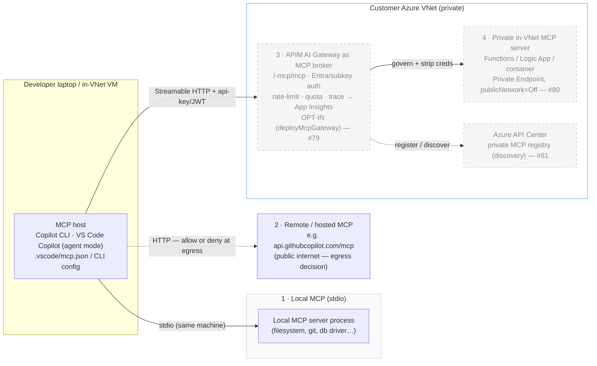

### The four postures

| # | Posture | Transport | Reaches the internet? | Governance | Issue |
|---|---|---|---|---|---|
| **1** | **Client-side local** MCP server (stdio) | stdio, same machine | Only if the tool itself calls out | OS / client trust; nothing gateway-side | [`#78`](https://github.com/gwexler_microsoft/copilot-cli-byok-azure/issues/78) |
| **2** | **Remote / hosted** MCP (e.g. GitHub's `…/mcp/`) | Streamable HTTP | **Yes** — public endpoint | An **egress-allowlist** decision (allow or deny at the network edge) | [`#78`](https://github.com/gwexler_microsoft/copilot-cli-byok-azure/issues/78) |
| **3** | **Gateway-governed** MCP (APIM as broker) | Streamable HTTP via APIM | Only as far as the broker allows | Full — same **Entra/subscription-key** auth, **rate-limit/quota**, and **App Insights** telemetry as the model path | [`#79`](https://github.com/gwexler_microsoft/copilot-cli-byok-azure/issues/79) |
| **4** | **Private in-VNet** customer-hosted MCP | Streamable HTTP, PE-only | **No** — private endpoint only | Reached only through the gateway / Private Endpoint, mirroring the model backends | [`#80`](https://github.com/gwexler_microsoft/copilot-cli-byok-azure/issues/80) |

1. **Client-side local MCP (stdio).** The simplest case: a tool server runs as a child process of
   the host on the laptop or in-VNet VM and talks over stdio. There is nothing for the gateway to
   do — but if the *tool itself* reaches out (an API client, a package registry), that egress is
   subject to the same network policy as everything else on the machine. Document which local
   servers a fully-private deployment permits.

2. **Remote / hosted MCP.** The repo already ships one in
   [`.vscode/mcp.json`](../.vscode/mcp.json): GitHub's hosted MCP at
   `https://api.githubcopilot.com/mcp/`. This is **off the model path** and is purely an **egress
   decision** — the same call that a fully-private deployment makes about `api.github.com` (see
   [github-egress-allowlist.md](github-egress-allowlist.md)). Allow it for convenience, or deny it
   at the network edge for a no-public-tool-traffic posture.

3. **Gateway-governed MCP (APIM as the MCP broker).** Azure API Management can itself **expose a
   REST API as an MCP server** *and* **govern an existing/remote MCP server**, using the same
   built-in AI gateway — and it does so on the **classic Developer SKU this project already runs**
   (MCP server management is available on classic Developer/Basic/Standard/Premium, not just v2;
   [overview](https://learn.microsoft.com/en-us/azure/api-management/mcp-server-overview)). That
   means the tool plane can inherit *exactly* the controls the model plane already has: the
   per-developer **`api-key`/JWT** credential, **`rate-limit-by-key`** + **`quota-by-key`**, IP
   filtering, and **App Insights** tracing. This is the natural extension of "one enforced
   ingress" to tools. Caveats from the platform docs: API Management currently supports MCP
   **tools** only (not MCP resources or prompts), MCP servers aren't supported in **workspaces**,
   and an MCP-server policy must **never** read `context.Response.Body` (it breaks the streaming
   transport) — set the *Frontend Response* payload-logging bytes to `0` at the all-APIs scope.

4. **Private in-VNet, customer-hosted MCP.** For tools that must never touch the public internet,
   host the MCP server inside the VNet (Azure Functions, a Logic App, or a container) with
   `publicNetworkAccess=Off` + Private Endpoint, and front it with posture 3. This mirrors the
   model-backend privacy model exactly: there is **no laptop → tool-backend direct path**; every
   tool call transits the gateway, which authenticates the developer and strips inbound creds
   before reauthenticating to the backend.

**Discovery (optional).** Rather than hand-editing `mcp.json` on every machine, approved MCP
servers (gateway-exposed and external) can be registered in **Azure API Center** to give
developers a private, enterprise MCP registry
([register/discover](https://learn.microsoft.com/en-us/azure/api-center/register-discover-mcp-server)) —
tracked in [`#81`](https://github.com/gwexler_microsoft/copilot-cli-byok-azure/issues/81).

> **Why this matters for BYOK governance.** Postures 1–2 are *client-side* — the gateway sees
> nothing — so a deployment that wants tool-call metering, allow-listing, or audit must push tool
> traffic through posture 3 (and 4 for private tools). That is the same trade-off the model path
> already makes: the single enforced ingress is what produces per-developer telemetry and
> credential containment. MCP simply extends it from *models* to *tools*.

## Cloud parameterization

The template runs in **both** Azure commercial (`AzureCloud`) and Azure Government
(`AzureUSGovernment`). A single `cloudEnv` param drives a `cloudVars` map in
[`infra/main.bicep`](../infra/main.bicep) that derives every cloud-specific endpoint;
no module hardcodes a `.us` or `.com` host. The pilot defaults to Gov because that is
the first customer — switching to Commercial is a parameter change, not a code change
(see [Targeting a different cloud](#targeting-a-different-cloud)).

| Concept | AzureCloud (Commercial) | AzureUSGovernment | Where it's set |
|---|---|---|---|
| `cloudEnv` value | `AzureCloud` | `AzureUSGovernment` | param |
| Entra login host | `login.microsoftonline.com` | `login.microsoftonline.us` | `cloudVars` |
| Microsoft Graph (scripts) | `graph.microsoft.com` | `graph.microsoft.us` | `az cloud show` (derived) |
| Resource Manager (CLI) | `management.azure.com` | `management.usgovcloudapi.net` | `az cloud set` |
| CogSvc / OpenAI MI audience | `https://cognitiveservices.azure.com` | `https://cognitiveservices.azure.us` | `cloudVars` |
| OpenAI public DNS suffix | `openai.azure.com` | `openai.azure.us` | `cloudVars` |
| OpenAI privatelink zone | `privatelink.openai.azure.com` | `privatelink.openai.azure.us` | `cloudVars` |
| Cognitive privatelink zone | `privatelink.cognitiveservices.azure.com` | `privatelink.cognitiveservices.azure.us` | `cloudVars` |
| `services.ai` privatelink zone | `privatelink.services.ai.azure.com` | *(none — Gov has no services.ai zone)* | `cloudVars` (`''` = skip) |
| APIM gateway DNS zone | `azure-api.net` | `azure-api.us` | `cloudVars` |
| Typical model deployment SKU | `GlobalStandard` | `DataZoneStandard` (GlobalStandard N/A in usgovvirginia) | param |

The Bicep takes a single `cloudEnv` param (`AzureCloud` | `AzureUSGovernment`)
and derives everything in the `cloudVars` map (`var v = cloudVars[cloudEnv]`); every
module is fed `v.*` values. **Identical across both clouds:** the RBAC role-definition
GUIDs, the injected `api-version`, the APIM Developer SKU, and all four policy XML files
(they reference cloud values only through APIM named values).

### Targeting a different cloud

Because the cloud abstraction already exists, retargeting is a values exercise, not a
rewrite. To stand the gateway up in **Commercial**:

1. **Sign in to the right cloud** before anything else:
   ```pwsh
   az cloud set --name AzureCloud      # (AzureUSGovernment for Gov)
   az login
   az account set --subscription "<commercial sub id>"
   ```
   The Entra setup and developer wrapper scripts read the active cloud automatically
   (`setup-entra` derives the Graph endpoint from `az cloud show`; the wrappers mint
   tokens via `az account get-access-token`), so no script edits are needed.
2. **Use the commercial parameters profile.** Copy
   [`infra/main.parameters.commercial.example.json`](../infra/main.parameters.commercial.example.json)
   → `infra/main.parameters.json` and fill in the `<PLACEHOLDER>` values. The important
   deltas from the Gov example are already set for you: `cloudEnv = AzureCloud`, a
   commercial `location`, and `modelDeploymentSku = GlobalStandard`.
3. **Pick a region that hosts your model + SKU.** Model availability and the
   `GlobalStandard` vs `DataZoneStandard` choice are region-specific; confirm with
   `az cognitiveservices account list-skus` / the model availability table before
   deploying.
4. **Validate first.** Run `az deployment sub what-if` (see the deployment guide). In
   Commercial this additionally exercises the **`services.ai` privatelink zone** and the
   Foundry PE A-record in it — a code path Gov never hits — so inspect the what-if to
   confirm that zone and link are planned.

Everything else (RBAC, policies, named values, networking, metrics) is cloud-neutral and
needs no change.

### Gov pilot — deployed values

| Concept | Value |
|---|---|
| Region | `usgovvirginia` |
| Model | `gpt-5.1` (version `2025-11-13`) |
| Deployment SKU | `DataZoneStandard`, capacity 50 |
| Why not GlobalStandard | `GlobalStandard` is **not available** in usgovvirginia |
| AOAI deployment name | `gpt-5.1` (this is what callers put in the `model` body field) |

### Gov pilot — resource naming convention

All resources share a per-deployment suffix `<suffix>` derived from
`substring(uniqueString(subscription().id, resourceGroup name), 0, 6)`, so the actual
values differ per environment. The pattern is:

| Resource | Name pattern |
|---|---|
| Resource group | `rg-copilot-byok-<env>` |
| VNet | `vnet-copilot-byok-<env>-<suffix>` |
| APIM | `apim-copilot-byok-<env>-<suffix>` (private IP `10.60.1.4`) |
| APIM gateway URL | `https://apim-copilot-byok-<env>-<suffix>.azure-api.us` |
| AOAI account | `aoaicopilotbyok<env><suffix>` (`https://<account>.openai.azure.us`) |
| App Insights | `appi-copilot-byok-<env>-<suffix>` |
| Test VM / Bastion | `vm-copilot-byok` (`10.60.5.4`) / `bas-copilot-byok-<env>-<suffix>` |
| Entra app | client ID + appIdUri `api://copilot-byok-gateway-<tenant-short>` (from `setup-entra`) |
| Resource suffix | `<suffix>` (e.g. the first 6 chars of `uniqueString(...)`) |


## Network

- **VNet**: `10.60.0.0/16`
- **snet-apim** `10.60.1.0/27` — APIM internal VNet integration, mandatory NSG rules.
- **snet-pe** `10.60.2.0/24` — AOAI Private Endpoint (and any future PEs).
- **snet-dns-in** `10.60.3.0/28` — reserved for future Azure Private DNS Resolver
  inbound endpoint (so VPN/on-prem clients can resolve the private names via NRPT).
- **GatewaySubnet** `10.60.255.0/27` — P2S VPN gateway (conditional, `deployVpnGateway`).
- **snet-vm** `10.60.5.0/27` — optional Windows test VM NIC (conditional, `deployTestVm`).
- **AzureBastionSubnet** `10.60.6.0/26` — optional Azure Bastion (conditional, `deployTestVm`).

### Network topology

This is the view for the customer's infrastructure team: subnets, private endpoints,
private DNS zones, and the two ways a developer reaches the gateway (P2S VPN today, the
in-VNet test VM for pre-VPN validation). Dashed = conditional / optional components.

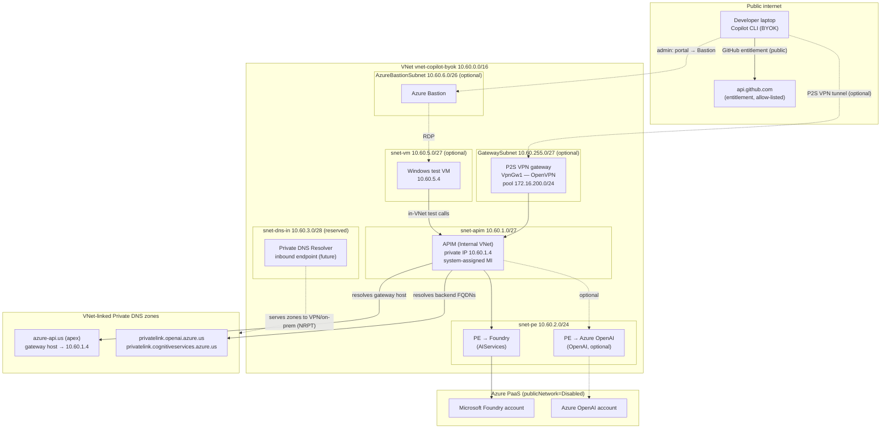

### DNS resolution of the APIM gateway

APIM in **Internal VNet mode** does not auto-register its gateway hostname. To let
in-VNet clients resolve it, a VNet-linked **Private DNS zone** (`azure-api.us` for Gov,
`azure-api.net` for Commercial) holds an A record for the gateway host → APIM's private
IP. This is the apex zone, **not** a `privatelink` zone. With the zone linked, the test
VM (and any in-VNet client) resolves the gateway through `168.63.129.16` — no hosts
entry, no DNS resolver needed.

For **off-VNet** clients (laptops over the P2S VPN), add an Azure Private DNS Resolver
inbound endpoint in `snet-dns-in` and an NRPT rule scoping `azure-api.us` (and the AOAI
`privatelink` suffix) to that resolver IP. The resolver simply serves the same
VNet-linked private zones. Gated by `deployApimPrivateDns` (default true).

### Manual test rig (ephemeral)

When `deployTestVm=true`, a Windows Server VM (`snet-vm`) plus Azure Bastion
(`AzureBastionSubnet`) are deployed so the pipeline can be exercised **from inside the
VNet before** the P2S VPN exists. With the APIM private DNS zone linked, the VM resolves
the gateway hostname directly and can call `/openai/v1/chat/completions`. This rig is
cost-gated and meant to be torn down once the VPN path is validated.

## Identity (out-of-band — Graph, not Bicep)

There are **two distinct identities** in this system, and they are independent of each
other and of which model backend serves a request:

- **Developer → gateway** (inbound): how a caller proves they may use the gateway. This
  depends on `authMode` — an Entra app + JWT (`jwt` mode, below) or an APIM subscription
  key (`subscriptionKey` mode, the default, which needs **no** app registration).
- **Gateway → backend** (outbound): the APIM managed identity, covered in [RBAC](#rbac).
  Identical for Foundry and AOAI.

The app registration below is only relevant in **`jwt` mode**. In the default
`subscriptionKey` mode you can skip `setup-entra` entirely.

`scripts/setup-entra.ps1` creates:

1. App registration `copilot-byok-gateway`.
2. Application ID URI `api://copilot-byok-gateway-<tenant>`.
3. Scope `cli.invoke` (admin consent, user assignable).
4. **Pre-authorized client**: Azure CLI = `04b07795-8ddb-461a-bbee-02f9e1bf7b46`
   for the `cli.invoke` scope. This is the trick that makes
   `az account get-access-token --resource api://...` succeed silently.
5. (Optional) Assign a security group to the app so only members can invoke it.

The script emits the resulting `appIdUri` and `clientId`, which feed into APIM
named values (`api-app-id-uri`) and the developer wrapper script.

> Note: although the app exposes `api://copilot-byok-gateway-<tenant>`, v2 access
> tokens carry `aud` = the **client-ID GUID**, so the APIM `api-audience` named value
> validated by `validate-jwt` is the GUID, not the `api://` URI.

## RBAC

The gateway authenticates to **both** model backends with its own system-assigned managed
identity — there is no key or connection string for either account. The same role
(`Cognitive Services OpenAI User`) is granted on **each** deployed backend, because the
APIM policy can route a request to either one (Foundry by default, AOAI for pinned models),
and `kind=AIServices` (Foundry) and `kind=OpenAI` (AOAI) both honour this role on the
`/openai/...` data plane.

| Principal | Role | Scope | Condition |
|---|---|---|---|
| APIM system-assigned MI | Cognitive Services OpenAI User | **Foundry account** (`kind=AIServices`) | `assignFoundry && deployFoundry` |
| APIM system-assigned MI | Cognitive Services OpenAI User | **AOAI account** (`kind=OpenAI`) | `assignAoai && deployAoai` |
| Deployer (you) | Cognitive Services OpenAI Contributor | Foundry account | `assignFoundry && deployerPrincipalId set` |
| Deployer (you) | Cognitive Services OpenAI Contributor | AOAI account | `assignAoai && deployerPrincipalId set` |
| Playground users/group | Cognitive Services OpenAI User | **Foundry account** | `playgroundPrincipalIds non-empty && deployFoundry` |
| Playground users/group | Cognitive Services OpenAI User | **AOAI account** | `playgroundPrincipalIds non-empty && deployAoai` |
| Deployer (you) | Contributor | Resource group | — |
| Devs | (Entra app role assignment, not Azure RBAC) | App `copilot-byok-gateway` | jwt mode only |

Both APIM-MI role assignments are gated by `assignAoaiRbac` (default true; the single
switch covers Foundry and AOAI). If the deployer lacks
`Microsoft.Authorization/roleAssignments/write`, set it false and have an Owner / User
Access Administrator grant the role out-of-band **on each deployed account**:

```pwsh
# Default backend — Foundry (kind=AIServices):
az role assignment create --assignee <apimPrincipalId> `
  --role "Cognitive Services OpenAI User" `
  --scope <foundryAccountResourceId>

# Optional legacy backend — AOAI (kind=OpenAI), only if deployAoai=true:
az role assignment create --assignee <apimPrincipalId> `
  --role "Cognitive Services OpenAI User" `
  --scope <aoaiAccountResourceId>
```

> The MI access token audience is the **same** for both backends
> (`https://cognitiveservices.azure.us` in Gov / `https://cognitiveservices.azure.com`
> in commercial), so the `authentication-managed-identity` policy step is identical
> regardless of which account the request is routed to — only the role *scope* differs.

### Direct playground / data-plane access for humans (expected 403 by design)

Both accounts are deployed with **`disableLocalAuth=true`** (API keys off) — intentional for
the BYOK posture. Only APIM's managed identity is granted a data-plane role, so the *normal*
gateway path works end-to-end. A **human** who opens the Azure AI / OpenAI **playground**, or
calls the account directly with an SDK, authenticates as *themselves* — not as APIM — and with
no role gets exactly this expected error:

> *Not authorized: Access to API keys is disabled and the account is missing Chat completion
> permissions. You will need the Cognitive Services OpenAI User role or higher.*

This is **not a bug** — it is the keys-off design working. There are two supported ways to grant
humans access, both ending in the same `Cognitive Services OpenAI User` role on **each** account:

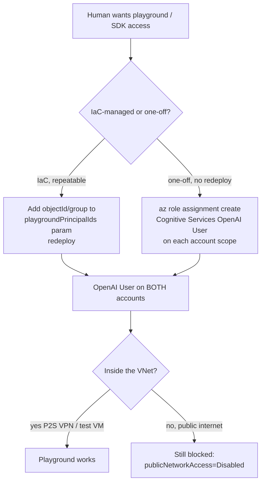

- **IaC path (recommended for a known set):** add the user/group object IDs to the
  `playgroundPrincipalIds` param (and set `playgroundPrincipalType` to `User` or `Group`).
  On deploy, each principal gets `Cognitive Services OpenAI User` on **both** the AOAI and
  Foundry accounts. Using one Entra **group** is cleanest — add/remove members in Entra with
  no redeploy. This runs even when `assignAoaiRbac=false` (the APIM-MI grant and the playground
  grant are gated independently).
- **Manual path (one-off):** `az role assignment create --assignee <upn-or-objectId> --role
  "Cognitive Services OpenAI User" --scope <accountResourceId>` on each account.
- Use **`Cognitive Services OpenAI Contributor`** instead if the person must also create/manage
  model deployments (not just run inference).

> **VNet caveat:** both accounts have `publicNetworkAccess=Disabled`. The role is necessary but
> not sufficient — the playground only reaches the data plane from **inside the VNet** (P2S VPN
> or the in-VNet test VM). A user on the open internet stays blocked even with the role.

## Metrics & observability

This section is written so a customer can both **trust** the metering (where do the
numbers come from?) and **use** it (how do I see per-developer usage?).

### How a metric is produced (end-to-end)

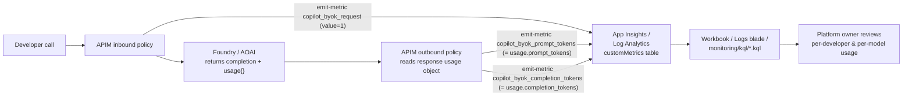

Every metric carries the same dimensions, so any of them can be sliced by developer, by
model, or (on the Foundry API) by which backend served the request. **APIM never reads
or stores prompt/response content** — token counts come straight from the backend's own
`usage` object.

> **Streaming note (compatibility injection).** Copilot CLI calls are streaming
> (`stream:true`), and streamed responses only carry a `usage` object on the final chunk when
> the request sets `stream_options.include_usage=true`. The inbound policy injects that flag
> into streaming JSON bodies so token usage is always available. This is **belt-and-suspenders,
> not a dependency**: `copilot_byok_request` (inbound) and `copilot_byok_throttled` (on-error)
> never need `usage`, and the outbound token parser is gated on `200 + application/json` and
> degrades to `0` rather than erroring if `usage` is absent.

### What is tracked

| Metric (namespace `copilot.byok`) | Emitted | Value | Dimensions |
|---|---|---|---|
| `copilot_byok_request` | inbound, per call | `1` | `developer_oid`, `developer_upn`, `deployment_name`, `backend`* |
| `copilot_byok_auto_route` | inbound, auto-routed calls only | `1` | `developer_upn`, `deployment_name`, `auto_route`, `auto_route_reason`, `auto_length_band` |
| `copilot_byok_prompt_tokens` | outbound | `usage.prompt_tokens` | same |
| `copilot_byok_completion_tokens` | outbound | `usage.completion_tokens` | same |
| `copilot_byok_throttled`† | on-error, per 429 | `1` | `developer_oid`, `developer_upn`, `deployment_name`, `backend`*, `throttle` |

\* `backend` (`aoai` \| `foundry`) is present on the default Foundry API so you can see
which backend a model-routed request landed on.

† `copilot_byok_throttled` is emitted **only in `jwt` mode** (from the jwt policies'
`<on-error>` path) so that 429 throttle rejections are attributable per Entra `oid` — gateway
logs have no `oid`, and the inbound `copilot_byok_request` metric fires before the throttles
run. The `throttle` dimension is `burst` \| `tokens` \| `quota` \| `other`. In
`subscriptionKey` mode this metric is **not** emitted: throttles live at product scope and
429s are already attributable via `ApimSubscriptionId` in the gateway log (see
[throttle-hits-per-developer.kql](../monitoring/kql/throttle-hits-per-developer.kql)).

> **Auth-mode note:** the dimension *names* never change. In `jwt` mode
> `developer_oid`/`developer_upn` carry the Entra `oid`/`upn`; in the default
> `subscriptionKey` mode they carry the APIM **subscription Id/Name**. The same
> dashboards and queries work either way — read "developer" as "the subscription" in
> subscription-key mode.

### Where it is stored

`emit-metric` writes into the Application Insights resource
(`appi-copilot-byok-<env>-<suffix>`), which is backed by a Log Analytics workspace.
The data lands in the **`customMetrics`** table; the dimensions land in
`customDimensions`. All raw APIM gateway logs (status codes, latency, API id) also flow
to the same workspace in **`ApiManagementGatewayLogs`**.

### How to view it

1. **Workbook** (deployed with the stack) — pre-built tiles for tokens/day/developer,
   tokens/day/model, and error rate.
2. **Azure Portal → App Insights / Log Analytics → Logs** — paste any of the three saved
   queries from [monitoring/kql](../monitoring/kql).
3. **APIM analytics blade** — built-in request/latency/error charts (no custom query).

> **Gov caveat:** the App Insights **query REST API is disabled** in this Gov tenant
> (`az monitor app-insights query` fails with `AADSTS500014` — the
> `api.applicationinsights.io` service principal is disabled). Use the **portal Logs
> blade / workbook**, not the CLI query command.

### What WON'T light up — known platform limits

Two App Insights / APIM portal experiences look broken on this stack but are working as designed:

- **App Insights → Live Metrics blade.** APIM's Application Insights logger *does* stream the
  real-time **Live Metrics (QuickPulse)** channel — the APIM instance shows up as a *server* in
  the blade (Requests / Dependencies / CPU / committed memory). This requires the logger to be
  configured with the **connection string** (not a bare instrumentation key): the connection
  string carries `LiveEndpoint`, which is the per-cloud QuickPulse host the APIM client must
  reach. In **Azure Government** that host is `https://live.applicationinsights.azure.us/`; with
  only an instrumentation key APIM defaults to the *Commercial* live endpoint and the Gov blade
  shows **"Not available: couldn't connect to your application"** even though classic ingestion
  (`requests`, `dependencies`, `customMetrics`) keeps flowing. The logger is wired with the
  connection string in `infra/modules/apim.bicep` for exactly this reason. There is no separate
  SDK-instrumented app in the stack — the gateway is the only emitter, and it is enough to
  populate Live Metrics. The `requests`, `dependencies`, and `customMetrics` tables — which feed
  every workbook tile and the KQL files in `monitoring/kql/` — populate within 1-5 min.
- **APIM → Monitoring → Analytics blade — sparse on low-traffic gateways.** That blade is
  powered by APIM's built-in **Reports API** (internal aggregation), which only flushes
  after several minutes and is throttled by traffic volume. A dev gateway that sees only
  a few smoke calls per hour will show "no data" for hours. Use the **Logs** blade
  (resource-specific `ApiManagementGatewayLogs` table — see below) for near-real-time
  visibility instead.

### Log Analytics destination type — *Dedicated*, not *AzureDiagnostics*

The `to-log-analytics` diagnostic setting on APIM is provisioned with
`logAnalyticsDestinationType: 'Dedicated'`. This routes gateway logs into the
resource-specific **`ApiManagementGatewayLogs`** table (and `ApiManagementWebSocketConnectionLogs`,
etc.) instead of the legacy catch-all **`AzureDiagnostics`** table. Every KQL file in
[`monitoring/kql/`](../monitoring/kql) and every query in this doc reads from
`ApiManagementGatewayLogs` — without `Dedicated` set, those queries return 0 rows even when
the gateway is processing traffic. If you ever see "diagnostics enabled but no rows in
`ApiManagementGatewayLogs`", check the destination type:

```pwsh
az monitor diagnostic-settings show --resource <apim-id> --name to-log-analytics `
  --query logAnalyticsDestinationType -o tsv
# expected: Dedicated
```

[`scripts/apply-diag-dedicated.ps1`](../scripts/apply-diag-dedicated.ps1) idempotently
patches an existing deployment to `Dedicated` without needing a full `azd up`.

### Example — per-developer usage ([tokens-per-developer.kql](../monitoring/kql/tokens-per-developer.kql))

```kusto
customMetrics
| where timestamp > ago(24h)
| where name == "copilot_byok_request"
| extend
    developer = tostring(customDimensions["developer_upn"]),
    model     = tostring(customDimensions["deployment_name"])
| summarize requests = sum(value) by bin(timestamp, 1h), developer, model
| order by timestamp asc
```

Example result (subscription-key mode — `developer` is the APIM subscription name):

| timestamp | developer | model | requests |
|---|---|---|---|
| 2026-05-30 14:00 | dev-alice | gpt-5.1 | 18 |
| 2026-05-30 14:00 | dev-bob | gpt-5.1 | 7 |
| 2026-05-30 15:00 | dev-alice | gpt-5.1 | 24 |

In `jwt` mode the same `developer` column instead shows `alice@contoso.com`.

### Example — token usage per model ([tokens-per-model.kql](../monitoring/kql/tokens-per-model.kql))

```kusto
customMetrics
| where timestamp > ago(7d)
| where name in ("copilot_byok_prompt_tokens","copilot_byok_completion_tokens")
| extend
    model = tostring(customDimensions["deployment_name"]),
    kind  = iff(name == "copilot_byok_prompt_tokens", "prompt", "completion")
| summarize tokens = sum(value) by bin(timestamp, 1d), model, kind
| order by timestamp asc
```

Example result:

| timestamp | model | kind | tokens |
|---|---|---|---|
| 2026-05-29 | gpt-5.1 | prompt | 412,300 |
| 2026-05-29 | gpt-5.1 | completion | 98,540 |
| 2026-05-30 | gpt-5.1 | prompt | 501,120 |

### Example — error rate ([error-rate.kql](../monitoring/kql/error-rate.kql))

```kusto
ApiManagementGatewayLogs
| where TimeGenerated > ago(24h)
| where ApiId == "copilot-byok-aoai"
| extend bucket = bin(TimeGenerated, 15m), status = tostring(ResponseCode)
| summarize cnt = count() by bucket, status
| order by bucket asc
```

Example result (a burst of `401`s usually means a missing/expired credential; `400`s
often mean a malformed `model` body — see the model-parsing failure mode above):

| bucket | status | cnt |
|---|---|---|
| 2026-05-30 14:00 | 200 | 142 |
| 2026-05-30 14:00 | 401 | 3 |
| 2026-05-30 14:15 | 200 | 130 |

> To chart the **default Foundry** API instead of the legacy AOAI one, change
> `ApiId == "copilot-byok-aoai"` to `ApiId == "copilot-byok-foundry"`.

### Example — throttle hits per developer ([throttle-hits-per-developer.kql](../monitoring/kql/throttle-hits-per-developer.kql))

When a developer hits a limit the gateway returns **429** from one of the three throttle
policies. Because the inbound `copilot_byok_request` metric is emitted *before* the throttles
run, a rejected call still counts as a request and `customMetrics` cannot see the 429 — the
gateway log is the only place it is visible, and `LastErrorSource` records *which* throttle
fired (so you can tell a TPM cost-guard rejection apart from a burst or monthly-quota one):

```kusto
ApiManagementGatewayLogs
| where TimeGenerated > ago(24h)
| where ApiId in ("copilot-byok-aoai", "copilot-byok-foundry")
| where ResponseCode == 429
| extend
    developerSub = tostring(ApimSubscriptionId),
    throttle = case(
        LastErrorSource has "rate-limit-by-key", "burst (calls/min)",
        LastErrorSource has "azure-openai-token-limit", "AI-cost guard (tokens/min)",
        LastErrorSource has "quota-by-key", "monthly call quota",
        strcat("other: ", LastErrorSource))
| summarize hits = count() by bin(TimeGenerated, 1h), developerSub, throttle
| order by TimeGenerated asc, hits desc
```

Example result (a developer steadily hitting the **AI-cost guard** is the signal to move them
to a higher tier or investigate a runaway agent; bursts/quota hits are usually transient):

| TimeGenerated | developerSub | throttle | hits |
|---|---|---|---|
| 2026-05-30 14:00 | dev2 | AI-cost guard (tokens/min) | 11 |
| 2026-05-30 14:00 | dev1 | burst (calls/min) | 4 |
| 2026-05-30 15:00 | dev2 | AI-cost guard (tokens/min) | 9 |

> **Identity is per auth mode.** `ApimSubscriptionId` is populated only in **subscriptionKey**
> mode. In **jwt** mode the per-developer key is the Entra `oid`, which is not in gateway logs,
> so the query above cannot attribute 429s there. Instead the jwt policies emit a
> `copilot_byok_throttled` metric from their `<on-error>` path (keyed on `developer_oid`, with a
> `throttle` dimension = `burst` \| `tokens` \| `quota`). The companion jwt-mode query is in the
> same [`.kql` file](../monitoring/kql/throttle-hits-per-developer.kql):
>
> ```kusto
> customMetrics
> | where timestamp > ago(24h)
> | where name == "copilot_byok_throttled"
> | extend developer = tostring(customDimensions["developer_upn"]),
>          throttle  = tostring(customDimensions["throttle"])
> | summarize hits = sum(value) by bin(timestamp, 1h), developer, throttle
> | order by timestamp asc, hits desc
> ```

## Policy families: which APIM policies we use, and why (no `llm-*`)

APIM exposes **three overlapping families** of policy that can each "limit" or "meter" an LLM
call. They are easy to confuse — the wizard reaches for the `llm-*` family — so this section
states exactly which family this project uses for each job and why. The headline: **this
implementation uses zero `llm-*` policies, yet still gets per-developer rate limiting *and*
reliable App Insights token metrics**, and is more robust than the wizard's `llm-*`-centric
approach because our telemetry never depends on a single policy that streaming can silence.

### The three families

| Family | Example policies | What it understands | Token-aware? |
|---|---|---|---|
| **Generic gateway** | `emit-metric`, `rate-limit-by-key`, `quota-by-key` | a flat per-request counter / call count | **no** — counts calls, not tokens |
| **GenAI — Azure OpenAI** | `azure-openai-token-limit`, `azure-openai-emit-token-metric`, `azure-openai-semantic-cache-*` | the AOAI `usage` object | yes |
| **GenAI — generic LLM** | `llm-token-limit`, `llm-emit-token-metric`, `llm-semantic-cache-*` | the broader "LLM API" abstraction (AOAI + Azure AI Model Inference + 3rd-party) | yes |

The `llm-*` family is **not** broken or "more specialized" in a way that disables it — it is
simply the newer **generalization** of the `azure-openai-*` family. `llm-token-limit` ≈
`azure-openai-token-limit`; `llm-emit-token-metric` ≈ `azure-openai-emit-token-metric`. They
share the same `usage`-parsing behaviour and the same streaming caveat (below). Choosing between
`llm-*` and `azure-openai-*` is mostly a question of which backend surface you front; it does
**not** change the pros/cons that matter here.

### What this project uses for each job

| Job | Policy we use | Family | Why this one |
|---|---|---|---|
| **Burst limit** | `rate-limit-by-key` (calls/min) | generic | forgiving primary guard; a single large coding request doesn't trip it |
| **AI-cost guard** | `azure-openai-token-limit` (tokens/min) | GenAI (AOAI) | the only limit that bounds *spend*; we pair it with the call-based guard above |
| **Monthly ceiling** | `quota-by-key` (calls/30d) | generic | hard stop on sustained overuse |
| **Request telemetry** | `emit-metric copilot_byok_request` (inbound, value=1) | generic | always fires, **streaming-independent** |
| **Token telemetry** | `emit-metric` parsing `usage` ourselves (outbound) | generic | we read `usage.prompt_tokens` / `completion_tokens` directly, gated on `200 + application/json` |
| **Throttle attribution** | `emit-metric copilot_byok_throttled` (on-error) | generic | labels which limit fired (`burst`/`tokens`/`quota`) per developer |

So we deliberately **mix**: a GenAI policy (`azure-openai-token-limit`) for the one job only it
can do (bound token spend), and generic policies for everything else — *including* token
metrics, which we emit ourselves rather than delegating to `*-emit-token-metric`.

### Pros and cons of each approach

**Generic `emit-metric` / `rate-limit-by-key` / `quota-by-key`**
- ✅ **Always emits / always counts** — does not depend on a response `usage` object, so it
  survives streaming, errors, and odd payloads. This is why request counts and throttle
  attribution are 100% reliable here.
- ✅ Full control over **custom dimensions** (`developer_oid`, `deployment_name`, `backend`,
  `auto_route`, `throttle`) — the per-developer slice Foundry's own metrics can't give.
- ✅ Works identically on every APIM tier and in Azure Government.
- ❌ **Not token-aware.** `rate-limit-by-key` caps *calls*, not tokens — a few huge requests can
  still burn capacity without tripping it. `emit-metric value=1` is a counter, not a token
  meter. (We close both gaps by pairing them with `azure-openai-token-limit` and an outbound
  `usage` parser.)

**GenAI `azure-openai-token-limit` (token throttle)**
- ✅ **Bounds real spend** — limits prompt+completion tokens/min, the only thing that scales with
  cost. Emits `remaining`/`consumed` headers.
- ✅ Standard GenAI-gateway policy; works on classic tiers and in Gov.
- ❌ With `estimate-prompt-tokens="true"` it **estimates at ingress**, so a too-low TPM 429s on a
  single large request (the exact wizard failure at `tokens-per-minute=10000`).
- ❌ Monthly **token** caps aren't natively expressible, so the monthly ceiling stays call-based
  (`quota-by-key`).

**GenAI `*-emit-token-metric` (`llm-` or `azure-openai-`) — the metric policy we *avoid***
- ✅ Zero-code token metrics with stock dimensions, *when it fires*.
- ❌ **Silent on streaming.** It only emits when the response carries a `usage` object, and
  streamed responses (Copilot CLI uses `stream:true`) **omit `usage`** unless the request sets
  `stream_options.include_usage=true`. The wizard policy didn't, so **no metrics reached App
  Insights at all** — the single most common "my dashboard is empty" failure.
- ❌ A single point of failure for *all* token telemetry: if it doesn't fire, you go blind.

### Why our split is more robust than the wizard's `llm-*` approach

The wizard leans on `llm-emit-token-metric` + `llm-token-limit` for *both* metrics and limiting.
That couples your entire telemetry to one `usage`-dependent policy and sets a token limit so low
it 429s normal traffic. Our design decouples the two concerns:

- **Limiting** uses a forgiving call-based `rate-limit-by-key` as the primary guard, with
  `azure-openai-token-limit` as a (correctly sized) cost ceiling — so big requests succeed but
  runaway spend is still bounded.
- **Metrics** never depend on `*-emit-token-metric`: an always-on inbound counter guarantees
  request telemetry, the outbound parser reads `usage` ourselves and **degrades to 0** instead of
  going silent, and the on-error metric attributes every 429. As belt-and-suspenders we also
  inject `stream_options.include_usage=true` so the `usage` object is *available* — but, as noted
  in [Metrics & observability](#metrics--observability), nothing we emit *depends* on it.

The result: no `llm-*` policies, full per-developer rate-limit coverage, and token/usage metrics
that are strictly more reliable than the wizard's because they cannot be silenced by streaming.
(For a client already on the wizard policy, the minimal fix — keep `llm-*` but add the usage
injection and raise the TPM — is shipped as
[`policies/wizard-foundry-policy-fixed.xml`](../policies/wizard-foundry-policy-fixed.xml) and its
AOAI twin, so they can adopt incrementally before moving to this split.)

### Metric inventory — what a wizard/`llm-*` policy does *not* capture

The minimal wizard policy (and the `llm-*`-based variants engineers commonly land on — e.g. a
`set-backend-service id="apim-generated-policy"` + `llm-emit-token-metric` + `llm-token-limit`
stack with the stock `API ID` / `Subscription ID` / `Product ID` / `Operation ID` / `User ID` /
`Client IP` dimensions) produces a *much* thinner telemetry set than this project's custom
`copilot_byok_*` metrics. Side by side:

| Signal | Wizard / `llm-*` policy | This project (`copilot_byok_*`) |
|---|---|---|
| Per-request count | ✅ `copilot_byok_request` (only if the wizard-fix tweak was added) — dims: `API ID`, `Subscription ID`, `Product ID`, `Operation ID` | ✅ `copilot_byok_request` — dims: `developer_oid`, `developer_upn`, `deployment_name`, `backend`, `auto_route` |
| Per-call prompt/completion tokens | ⚠️ `llm-emit-token-metric` ("GenAI Tokens") — **silent on streaming** unless `stream_options.include_usage` is injected, and **still silent on streaming `/responses`** (and on Gov where the inject 400s) | ✅ `copilot_byok_prompt_tokens` / `_completion_tokens` outbound parser — non-streaming on both surfaces; streaming chat-completions via injected usage; degrades to `0` instead of going dark |
| Token slice **by developer** | ❌ token metric carries only `User ID` / `Subscription ID` / `Client IP` — no Entra `oid`/`upn` | ✅ `developer_oid` + `developer_upn` on every metric |
| Token slice **by model** | ❌ no deployment/model dimension on the token metric | ✅ `deployment_name` on every metric |
| Backend attribution (`aoai` vs `foundry`) | ❌ none | ✅ `backend` dimension |
| Auto-route tier (`auto` → `mini`/`full`) | ❌ none (wizard has no auto-route) | ✅ `auto_route` on the request metric; reason + length band on `copilot_byok_auto_route` |
| Throttle attribution (which limit fired, per developer) | ❌ none — a 429 is anonymous | ✅ `copilot_byok_throttled` (on-error) with `throttle` = `burst`/`tokens`/`quota` |
| Limiting | `llm-token-limit` (TPM + monthly **token** quota), keyed per subscription | `rate-limit-by-key` (calls/min) + `azure-openai-token-limit` (TPM cost guard) + `quota-by-key` (monthly calls), keyed per developer |

**Net — with the wizard/`llm-*` policy you will NOT have:**

- **Per-developer or per-model token breakdowns** — the token metric has neither an Entra
  `oid`/`upn` nor a `deployment_name` dimension, so you cannot answer "tokens by developer" or
  "tokens by model" from the metric alone (only an aggregate per subscription).
- **Backend attribution** — no way to see whether a model-routed call landed on the Foundry or
  the legacy AOAI backend.
- **Auto-route attribution** — no visibility into how the `auto` sentinel resolved (mini vs full).
- **Throttle attribution** — a 429 carries no per-developer / per-limit label, so you can't tell
  a burst rejection from a token-cost or monthly-quota one.
- **Any per-call token metric for streaming traffic on Gov** — streaming chat-completions needs
  the injected `stream_options.include_usage` flag, which Gov's older completions version
  rejects; and streaming `/responses` emits usage only in the `response.completed` SSE event,
  which `llm-emit-token-metric` does not parse. In both cases the "GenAI Tokens" metric stays
  empty even though requests are succeeding.

What the wizard policy *does* keep on every surface (including Gov streaming `/responses`): the
always-on **request count** (`copilot_byok_request`, if the tweak was added) and the **call/token
limits** themselves. So governance still functions; it is the *observability* — especially the
per-developer, per-model, and throttle-attribution slices — that thins out.

## Rate limiting & per-developer governance

The gateway enforces **three independent throttles** so a single developer (or a runaway
agent) cannot burn the shared model capacity or budget:

| throttle | policy element | what it caps | why |
|---|---|---|---|
| Burst | `rate-limit-by-key` | calls per minute | stops tight request loops |
| **AI-cost guard** | `azure-openai-token-limit` | tokens/min (prompt **and** completion) | the only limit that actually bounds spend — a single huge prompt costs more than many small ones |
| Monthly ceiling | `quota-by-key` | calls per 30 days | hard stop against sustained overuse |

A request must pass **all three** counters. All three are keyed per developer (the APIM
subscription in subscriptionKey mode, the Entra `oid` in jwt mode), and each emits response
headers (`x-byok-calls-remaining`, `x-byok-tokens-remaining`, `x-byok-tokens-consumed`) so the
CLI user can see how close they are to a limit.

> **Model listing skips the cost guard.** `GET /v1/models` (see
> [Model discovery](#model-discovery--the-v1models-operation-on-the-foundry-api-61)) uses an
> operation-scoped policy with an empty outbound, so it runs **no** `emit-metric` and **no**
> `azure-openai-token-limit` — listing models has no token cost and never lands in the
> per-developer telemetry. It's reached with a normal inference key on the foundry API; the
> former dedicated `byok-discovery` product and its `discoveryCallsPerMinute` /
> `discoveryMonthlyCallQuota` knobs were consolidated away.

> When a developer crosses a limit the gateway returns **429** from the offending throttle.
> Track who is hitting which limit (and how often) with
> [`monitoring/kql/throttle-hits-per-developer.kql`](../monitoring/kql/throttle-hits-per-developer.kql) —
> it splits 429s by `LastErrorSource` so a TPM cost-guard rejection is distinguishable from a
> burst or monthly-quota one.

> A pure request-count limit (the old `calls=120`) does **not** prevent AI cost abuse — token
> limiting does, because cost scales with tokens, not request count.

### Grouping developers — where the limits live depends on auth mode

Limits live at a different policy scope per mode, so each developer gets exactly one tier with
no double-counting:

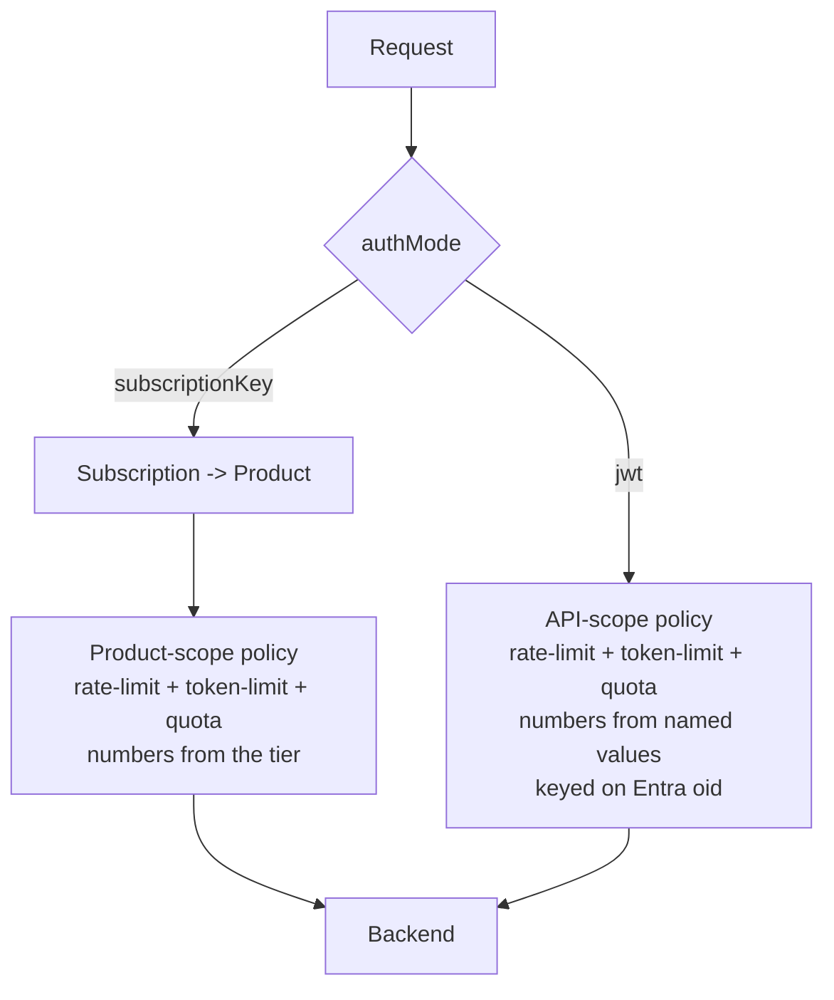

**subscriptionKey mode (default) — APIM Products = tiers.** Each tier in the `productTiers`
param becomes a published APIM **product** carrying a product-scope policy with the three
throttles. A developer is **grouped** by scoping their subscription to a product. Ship two demo
tiers:

| product | calls/min | tokens/min | monthly calls |
|---|---|---|---|
| `byok-standard` | 60 | 20,000 | 50,000 |
| `byok-power` | 120 | 60,000 | 200,000 |

`dev1` → `byok-standard`, `dev2` → `byok-power` out of the box. Move a developer between
tiers by changing the `product` on their subscription (`testSubscriptions` param) — no policy
edit. Tune a tier's numbers in `productTiers` and redeploy. Because the limits live at product
scope, the subscriptionKey API policies carry **no** rate-limit of their own (avoids
double-limiting, which would let the more restrictive scope silently win and defeat the tier
differentiation).

**jwt mode — single flat tier via named values.** There are no subscriptions/products in jwt
mode, so the jwt API policies keep their own throttles keyed on the Entra `oid`, with the
numbers sourced from named values (`jwt-calls-per-minute`, `jwt-tokens-per-minute`,
`jwt-monthly-call-quota`) set from the `jwtDefaultCallsPerMinute` / `jwtDefaultTokensPerMinute`
/ `jwtDefaultMonthlyCallQuota` params. The `Default` in the name signals there is exactly **one**
flat tier applied to every caller — jwt mode has no per-group concept. (Per-group tiers in jwt
mode would require mapping a JWT claim — e.g. a group/role — to limits; out of scope for the
pilot.)

### Where rate limiting sits between the two auth modes, and how to customize it

The two limit sets are **mutually exclusive by auth mode** — only one is ever live, so there is
no double-counting and no shared knob. Which one applies is decided entirely by the `authMode`
parameter:

| | `authMode = subscriptionKey` (default) | `authMode = jwt` |
|---|---|---|
| Where the throttle policy lives | **Product scope** (one policy per tier) | **jwt API scope** (one policy, named-value driven) |
| Per-developer key | the APIM subscription | the Entra `oid` claim |
| Grouping | **multiple tiers** (one product each) | **single flat tier** (everyone) |
| Params that set the numbers | `productTiers[].callsPerMinute` / `.tokensPerMinute` / `.monthlyCallQuota` | `jwtDefaultCallsPerMinute` / `jwtDefaultTokensPerMinute` / `jwtDefaultMonthlyCallQuota` |
| Assign a developer | set their `product` in `testSubscriptions` | n/a — all callers share the one tier |
| Active in your current config? | **yes** (`subscriptionKey`) | no (parameters exist but unused until you switch) |

**To customize in subscriptionKey mode (current):**
- Change a tier's numbers → edit the matching object in `productTiers`, redeploy.
- Add a tier → append a `{ name, displayName, description, callsPerMinute, tokensPerMinute, monthlyCallQuota }` to `productTiers`; it becomes a new product linked to all APIs.
- Move a developer between tiers → change the `product` field on their `testSubscriptions` entry.

**To customize in jwt mode:**
- Switch `authMode` to `jwt`, then set `jwtDefaultCallsPerMinute` / `jwtDefaultTokensPerMinute` /
  `jwtDefaultMonthlyCallQuota`. These flow into the `jwt-*` named values the jwt policies read,
  so no policy edit is needed.

> Both parameter sets are always present in the template regardless of mode, so flipping
> `authMode` needs no structural redeploy — the unused set simply has no effect.

> **Gov note:** `azure-openai-token-limit` is a standard APIM GenAI-gateway policy and works in
> Azure Government APIM. The TPM counter is approximate when `estimate-prompt-tokens="true"`
> (it tokenizes the prompt at ingress); completion tokens are reconciled from the backend
> response. Monthly **token** caps are not natively expressible in `quota-by-key`, so the
> monthly ceiling is call-based.

## Content filtering (responsible AI)

**What you get regardless.** Every model deployment — **both** the Azure OpenAI and the Foundry
deployment — is *always* created with a content filter; there is no "off" switch in Azure OpenAI /
Foundry. Microsoft's built-in `Microsoft.DefaultV2` baseline (Hate, Sexual, Violence, Self-harm
filtered at **Medium** on prompt **and** completion, plus prompt shields) is the platform floor and
is what every deployment inherits if you do nothing.

**The deployed default is now `byok-coding`, a tightened custom policy authored in IaC.** Rather
than ride on the Microsoft baseline, the template ships and attaches its own hardened policy by
default. It is authored as a real `Microsoft.CognitiveServices/accounts/raiPolicies` Bicep resource
on each account, from the single spec in
[scripts/content-filter.byok-coding.json](../scripts/content-filter.byok-coding.json), and the
model deployments `dependsOn` it so the policy always exists before a deployment references it.
`byok-coding` tightens the four harm categories to **severityThreshold=Low** on prompt **and**
completion (8 filters), turns on **Protected Material Text** blocking, and runs **Jailbreak**
(prompt shield) in **annotate-only mode** (`blocking: false, enabled: true`) —
`basePolicyName: Microsoft.DefaultV2`, `mode: Default`.

> **Why annotate-only Jailbreak.** VS Code Copilot's chat agent sends system prompts that
> contain phrases like *"ignore previous instructions"*, *"you are GitHub Copilot"*, and
> tool-calling preambles — these reliably trip Prompt Shields under any **blocking** Jailbreak
> policy (including `Microsoft.DefaultV2`) and surface as
> `400 content_filter / ResponsibleAIPolicyViolation { "jailbreak": { "detected": true, "filtered": true } }`.
> Annotate-only mode still emits the detection in response metadata (so you can log/inspect it
> server-side) but the call returns 200, which is the right default for a coding-assistant
> gateway. Annotate-only Prompt Shields does **not** require a modified-content-filter
> application; only **disabling** Jailbreak does.

> **`byok-strict` is the opt-in stricter sibling.** Identical to `byok-coding` except Jailbreak
> runs in blocking mode — use it for clients whose prompts do not look jailbreak-like
> (e.g. plain Copilot CLI, narrow API consumers). Spec at
> [scripts/content-filter.byok-strict.json](../scripts/content-filter.byok-strict.json).

> **Gov-validated.** The original template avoided authoring a `raiPolicies` Bicep resource over
> a concern that custom RAI policies behave differently in Azure Government. That concern was
> retired by a live stress test against the Gov Foundry account: the full composite (and every
> individual filter in it) is **accepted** by Azure US Government. Both `byok-coding` and
> `byok-strict` are now live-validated on Gov deployments (`gpt-5.1`, `gpt-4.1-mini`).

**One shared knob.** The choice is still a **single parameter plus a helper script**:

- **Bicep param `raiPolicyName`** (default `byok-coding`) — a **single** knob threaded into
  **both** model modules ([aoai.bicep](../infra/modules/aoai.bicep) and
  [foundry.bicep](../infra/modules/foundry.bicep)), so AOAI and Foundry always share the same
  filter. The two shipped names (`byok-coding`, `byok-strict`) author from their matching JSON
  spec; any other custom (non-`Microsoft.*`) name is authored on the account from the
  `byok-strict` spec; a built-in `Microsoft.*` name (e.g. `Microsoft.DefaultV2`) is used as-is
  with **no** custom resource authored.
- **`scripts/configure-content-filter.ps1` / `.sh`** — cloud-aware (reads the ARM endpoint from
  the active cloud, Gov-safe):
  - `-Show` lists the account's `raiPolicies` and which policy each deployment uses.
  - `-Apply` creates/updates a custom `raiPolicy` from a JSON spec
    (`content-filter.byok-coding.json`, `content-filter.byok-strict.json`, or
    `content-filter.sample.json`) and can repoint a deployment to it.
- **Categories** (each with a severity threshold Low/Medium/High, blocking on/off, and a
  Prompt/Completion source): Hate, Sexual, Violence, Self-harm, Jailbreak (prompt shields),
  Protected Material Text, Protected Material Code, Indirect Attack. Both shipped specs
  deliberately **omit Protected Material Code and Indirect Attack** — both are accepted by the
  platform, but in a coding CLI (which streams file contents and source code) they are the
  categories most likely to fire false-positives, so they are left as documented opt-in add-ons
  rather than on by default.

**What changing it does.** Because `raiPolicyName` is one shared value, repointing it affects
**both** models identically:

| You set `raiPolicyName` to… | Effect |
|---|---|
| `byok-coding` (default) | Both AOAI and Foundry accounts get the tightened policy with annotate-only Jailbreak, authored as a Bicep `raiPolicies` resource and attached to both deployments. Nothing to pre-create — the deployment `dependsOn` the policy. The right choice for VS Code Copilot and most agentic IDE clients. |
| `byok-strict` | Identical to `byok-coding` but with blocking Jailbreak. Use it for clients whose prompts do not look jailbreak-like. Authored from `content-filter.byok-strict.json`. |
| another custom name | The `byok-strict` spec is authored under that name on each account and both deployments attach to it. |
| `Microsoft.DefaultV2` (or any `Microsoft.*`) | Microsoft baseline on both deployments — no custom resource authored, nothing to maintain. **Warning: `Microsoft.DefaultV2` has blocking Jailbreak and will reject VS Code Copilot system prompts with `400 content_filter`.** |

> If you ever need **different** filters for AOAI vs Foundry, the single `raiPolicyName` would
> need splitting into two params; today both intentionally share one policy. The `mini`
> deployment follows `miniRaiPolicyName` (also defaulting to `byok-coding`); when it differs from
> the primary custom name a second `raiPolicies` resource is authored for it.

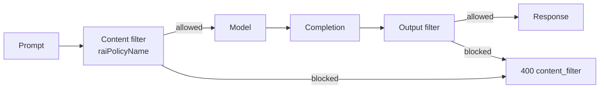

> **Approval boundary (stress-tested live in Gov).** *Tightening* (more blocking, lower
> thresholds) is always allowed — `byok-coding` and `byok-strict` at threshold `Low` apply with
> no approval. The gate on *loosening* is narrower than commonly assumed: the live test found
> that raising a category's `severityThreshold` to `High` is **accepted and stored unclamped**
> (it is *not* silently pinned back to Medium). What the platform **rejects** without an approved
> Azure OpenAI modified-content-filter application is **disabling a category**
> (`enabled: false`) or making a harm category **annotate-only** (`blocking: false`) below the
> Microsoft floor. Putting Jailbreak/Prompt-Shield in annotate-only is the **one** exception
> — it is accepted ungated and is what `byok-coding` uses.

## Roadmap — gateway content safety & budgeting (planned)

Two capabilities are planned as **phased, opt-in additions** built entirely from native Azure
components. They are *not yet in this template* —
everywhere below, **greyed / dashed boxes mean "planned, not built yet."** Each phase is
self-contained, defaults **off**, and layers on top of what already exists rather than replacing
it. Real implementation will add Bicep params + modules in a later change; this section fixes the
design and the seams so the work can land incrementally.

> **Legend for this section:** a dashed grey box = a planned resource/step not in the current
> template. Solid boxes = already deployed today (the same convention as the
> [Trust boundary](#trust-boundary) diagram).

### Why two layers already exist (and what's missing)

| Concern | Already in the template (today) | Planned addition |
|---|---|---|
| **Content safety** | Model-account content filter (`raiPolicyName=byok-coding`) enforced *inside* Foundry/AOAI — see [Content filtering](#content-filtering-responsible-ai). | **Phase 1:** a *gateway-side* screen (Azure AI Content Safety + `llm-content-safety` policy) that blocks **before** the model is reached. |
| **Spend control** | Gateway token throttles at product scope (`azure-openai-token-limit` TPM + `quota-by-key` monthly calls + `rate-limit-by-key` burst) — see [Rate limiting](#rate-limiting--per-developer-governance). | **Phase 2:** real **$ cost budgets** (Cost Management) + a **token-spend alert** (Azure Monitor) + an optional per-developer cumulative **token budget**. |

### Phase 1 — gateway-enforced content safety (Prompt Shields)

Today the only content filter is the one attached to each model deployment, so a malicious or
jailbreak prompt still travels to the backend and is billed before the model's filter rejects it.
Phase 1 adds a **second, gateway-side layer**: a private **Azure AI Content Safety** account that
the APIM policy calls via the `<llm-content-safety>` GenAI policy (with `shield-prompt="true"` for
Jailbreak / Prompt-Shield detection) **before** routing to the model. A blocked request returns
`400 Content Filtered` from the gateway and never reaches — or bills — the backend. This is
defense-in-depth, **not** a replacement for the model RAI policy: both stay on.

Planned components (all gated behind a new `deployContentSafety` param, default **false**):

- A private **Content Safety** account (`kind=ContentSafety`, `publicNetworkAccess=Disabled`) with
  its own **Private Endpoint** + DNS, same pattern as the Foundry/AOAI accounts.
- An APIM **backend** `contentsafety-backend`, with the APIM managed identity granted
  **Cognitive Services User** on the Content Safety account.
- An `<llm-content-safety>` step inserted into both gateway policies, plus an `<on-error>` branch
  that maps a content-safety block to `400 Content Filtered`.

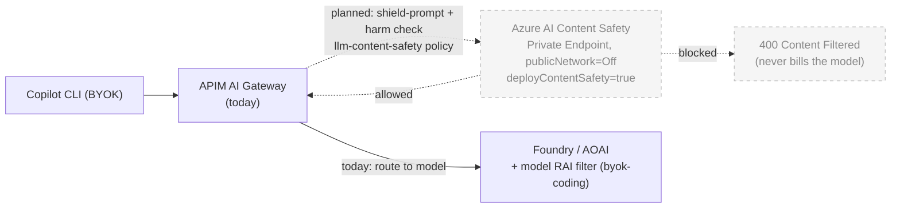

### Phase 2 — budgeting ($ cost budgets + token-spend alerts)

The gateway already caps **rate** (TPM) and **call volume** (monthly quota) per developer, but it
has no notion of **money** and no proactive alerting. Phase 2 adds monetary awareness in three
opt-in increments, all **observe-first** (alert, don't block) except the optional 2c:

- **Phase 2a — real $ cost budgets.** `Microsoft.Consumption/budgets` at **subscription** and/or
  **resource-group** scope, emailing the owner at configurable **actual** and **forecasted**
  thresholds. Pure observability over real billed spend — never blocks traffic. Planned params:
  `deployCostBudgetSubscription`, `deployCostBudgetRg`, `costBudgetAmount`, `costBudgetAlertEmails`,
  `costBudgetFirstThreshold`, `costBudgetForecastThreshold`.
- **Phase 2b — token-spend alert.** An Azure Monitor **log alert** over the existing
  `copilot.byok` token metrics (`copilot_byok_prompt_tokens` + `copilot_byok_completion_tokens`,
  pivotable by `developer_upn` / `deployment_name`) that fires an **action group** email when token
  consumption over a window crosses a threshold. Planned params: `deployTokenAlert`,
  `tokenAlertEmails`, `tokenAlertThreshold`, `tokenAlertWindow`.
- **Phase 2c — per-developer cumulative token budget (future).** A monthly per-developer token
  *ceiling* with `enforce` / `warn` / `off` modes. This project is **gateway-only** — the CLI talks
  straight to APIM, so there is no app or database tier in the request path, and the design keeps
  the counter where APIM can read it inline rather than introducing a new tier just for budgeting.
  The counter lives behind the `<cache-lookup-value>` / `<cache-store-value>` policies, keyed
  `{subId-or-oid}:{yyyy-MM}` and incremented from the tokens the
  `azure-openai-token-limit` / `emit-token-metric` policy already exposes per response. **APIM
  itself does the query/increment inline** — there is nothing else in the request path. Three
  candidate counter stores, in increasing durability:

  | Option | Counter store | Enforcement | New infra |
  |---|---|---|---|
  | **A** — approximate, APIM-only | none — reuse the existing `quota-by-key` monthly *call* ceiling as a coarse money proxy | inline hard stop, but call-based not token/$-based | zero |
  | **B** — APIM internal cache | APIM built-in cache via `cache-store-value` | inline, token-based | zero, **but** the internal cache is volatile/evictable → can undercount; good for *warn*, weak for a hard ceiling |
  | **C** — external Redis *(recommended for hard enforce)* | **Azure Cache for Redis** wired as APIM's external cache (atomic increments) | inline, token-based, durable across the month | one Redis instance (~$16+/mo Basic) |

  Deferred and greyed because Option C is a real infra/cost decision rather than a pure policy
  change; Options A/B need no new infra and can land first.

```mermaid
flowchart LR
    subgraph Now["Today"]
        APIM["APIM AI Gateway<br/>TPM + monthly-call quota<br/>per developer"]
        AI["App Insights<br/>copilot.byok token metrics"]
        APIM --> AI
    end

    AI -. "planned: log alert on token spend" .-> TA["Token-spend alert<br/>+ action group email<br/>deployTokenAlert=true"]
    BILL["Azure billed spend"] -. "planned: cost budget" .-> CB["Consumption budget (sub + RG)<br/>actual % + forecast % email<br/>deployCostBudget*=true"]
    APIM -. "planned (2c, future): cache-lookup/store-value<br/>cumulative monthly token counter" .-> TB["Per-developer token budget<br/>enforce / warn / off"]
    TB -. "hard enforce: external cache" .-> RD["Azure Cache for Redis<br/>(or APIM internal cache = warn-only)"]

    classDef planned fill:#f5f5f5,stroke:#bbbbbb,stroke-dasharray:5 5,color:#888888;
    class TA,CB,TB,BILL,RD planned;
```

### Phased delivery summary

| Phase | Capability | New components (planned) | Opt-in param | Behaviour |
|---|---|---|---|---|
| **1** | Gateway content safety (Prompt Shields) | Content Safety account + PE + DNS, `contentsafety-backend`, `llm-content-safety` policy step | `deployContentSafety` | **Block** at gateway → `400` before the model |
| **2a** | Real $ cost budgets | `Microsoft.Consumption/budgets` (sub + RG) | `deployCostBudget*` | **Observe** — email at actual/forecast thresholds |
| **2b** | Token-spend alert | Azure Monitor log alert + action group | `deployTokenAlert` | **Observe** — email on token-spend threshold |
| **2c** | Per-developer token budget *(future)* | Gateway cumulative-token counter via `cache-lookup/store-value` — APIM internal cache (*warn*) or external **Azure Cache for Redis** (*hard enforce*) | *tbd* | **Enforce / warn / off** |

## Choosing between the two auth modes

The default is `authMode=subscriptionKey` because it is the simplest starter posture —
long-lived per-developer keys that fit the CLI's static-credential model and any keys a
team may already have provisioned (see [Authentication modes](#authentication-modes)). It
is a recommended default, not a fixed decision. The trade-off, stated plainly:

- **Per-developer identity.** A subscription key identifies the developer by *convention*
  — one key issued per developer, surfaced in telemetry as the subscription Id/Name. A
  JWT identifies the developer *cryptographically* by Entra `oid`, which cannot be shared
  or spoofed. If keys get shared between developers, the subscription-key identity
  guarantee weakens; the JWT one does not.
- **Secret lifetime.** A subscription key lives in a CLI config file indefinitely and is
  rotated manually. A JWT is minted per-invocation by the wrapper script and expires in
  ~1h — but that same 1h expiry is the operational friction that pushed the customer
  toward keys in the first place.
- **Revocation.** Revoking a subscription key (or disabling the subscription) locks out
  that one developer; rotating a *shared* key affects everyone. Disabling a user in Entra
  (or removing their app-role assignment) locks them out instantly in `jwt` mode.
- **Header slot.** Copilot CLI can't send custom headers (#3399), so the credential —
  key or JWT — always rides in the `api-key` header. Both modes fit the BYOK contract
  identically.

**Recommendation:** ship the pilot on `subscriptionKey` to match what the customer
already has, and offer `jwt` as the hardening upgrade when they want true per-user
identity and instant revocation. The switch is one parameter (`authMode`) plus a
redeploy — no structural change.

## Why APIM Developer SKU for the pilot

- Internal VNet mode is supported on Developer (and Premium, and Standard v2).
- No SLA; single-instance, no zone redundancy.
- ~$50/mo vs ~$2,800/mo for Premium.
- Param-switchable to Premium when moving to prod.

## Why not call Foundry directly? (cost & capability)

A recurring question: since Copilot CLI's BYOK contract just needs an OpenAI-compatible
endpoint, and the Foundry/AOAI data plane *is* OpenAI-compatible, why route through APIM at
all — wouldn't calling Foundry directly be cheaper and still give metrics? The short answer is
that "direct" is neither reachable in this design nor cheaper in any meaningful way, and it
gives up exactly the per-developer governance the gateway exists to provide.

### Could the CLI even call Foundry directly?

Not from a developer laptop, by deliberate design:

- The Foundry and AOAI accounts are deployed **`publicNetworkAccess=Disabled`** behind private
  endpoints, so the data plane is only reachable **from inside the VNet** — a laptop cannot hit
  it directly.
- They are deployed **`disableLocalAuth=true`** (API keys off), so a direct caller would need an
  **Entra token for the Cognitive Services audience**. The CLI cannot mint or refresh that token
  itself — supplying and rotating that credential is a core reason the gateway exists (see
  [Two tokens, two issuers](#two-tokens-two-issuers-authmodejwt)).

So "direct" is really "from a VNet-resident process holding a Cognitive Services token," not
"from the developer's CLI."

### Does fronting Foundry with APIM raise Foundry's cost? No.

Putting APIM in front does **not** change the per-token inference price. You pay Foundry the
same per 1K tokens whether the request arrives directly or through the gateway. APIM is a
**separate, fixed** line item, not a surcharge on Foundry usage, and the per-request policy
compute is negligible.

| Cost item | Direct to Foundry | Through the APIM gateway |
|---|---|---|
| **Foundry / AOAI model inference (tokens)** | baseline | **identical** |
| **APIM** | $0 | ~$50/mo Developer SKU (**fixed**, not per-call) |
| **Azure Monitor platform metrics** | free | free |
| **App Insights / Log Analytics ingestion** | only if you enable diagnostic logs | low — custom token metrics are tiny numeric points, no payloads |

The **only** genuinely added cost of the gateway approach is the **fixed APIM SKU** (~$50/mo
on Developer for the pilot) plus a small amount of custom-metric ingestion. That is rounding
error next to the model spend it meters.

### "Use Foundry's own metrics instead" — what you actually get

Foundry (Cognitive Services / AOAI) does emit observability natively, but it is a different
shape than this project's `copilot.byok` metrics:

- **Platform metrics** (`ProcessedPromptTokens`, `GeneratedTokens`, `TokenTransaction`, …) flow
  to **Azure Monitor automatically and for free** — but they are **per-account aggregates**.
  The account only ever sees *one* caller (the APIM managed identity, or a single key), so it
  **cannot break usage down by developer or by client**. That per-developer slice is precisely
  what the gateway adds via `emit-metric` dimensions (`developer_oid` / `developer_upn` /
  `deployment_name`) — see [What is tracked](#what-is-tracked).
- **Diagnostic / request logs** to Log Analytics are opt-in and **cost the same ingestion** as
  any App Insights logging — so "direct" is not a free-observability path either.
- There is no `emit-metric`-style custom, dimensioned metric "from Foundry"; custom metrics are
  an APIM **policy** capability. Foundry gives you account-level counters, not
  per-developer-tagged ones.

### Net

Calling Foundry "directly" would save only the ~$50/mo APIM line, and in exchange you lose:
private-network reachability for the CLI, automatic credential minting/refresh, per-developer
identity, rate/quota/token governance, model auto-routing, attributable throttling, and the
planned gateway content-safety layer — **none of which the account's native per-account metrics
can reconstruct.** For a governed pilot that is a poor trade; the gateway cost is immaterial
next to the inference spend, and the governance it provides is the entire point.

## What this design deliberately does NOT do

- No payload inspection / no chat logging in APIM.
- No long-lived API keys on disk; tokens are minted per-invocation.
- No custom Copilot CLI fork — we work within the BYOK contract as shipped.
- No attempt to redirect GitHub entitlement traffic through Azure. That stays
  public and is documented as a firewall allowlist in `docs/github-egress-allowlist.md`.

## Open items (pilot → prod)

- P2S VPN gateway + DNS Private Resolver inbound endpoint + NRPT not yet deployed
  (`deployVpnGateway=false`); the in-VNet test rig is used instead.
- `assignAoaiRbac=false` — APIM-MI → AOAI role granted out-of-band, not in-template.
- `playgroundPrincipalIds=[]` — no humans granted direct playground/data-plane access yet;
  add user/group object IDs (or assign the role out-of-band) per the RBAC section.
- Full `az deployment sub create` is flaky on re-run (AOAI re-PUT race,
  `AccountProvisioningStateInvalid`); modules are deployed at RG scope instead.
- Developer SKU APIM has no SLA / zone redundancy; switch to Premium for prod.
- Test VM + Bastion are billable and should be torn down post-validation.
- Gateway content safety + budgeting are designed but not yet built — see
  [Roadmap](#roadmap--gateway-content-safety--budgeting-planned) (Phase 1 / Phase 2).
