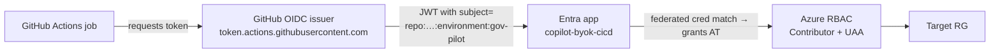
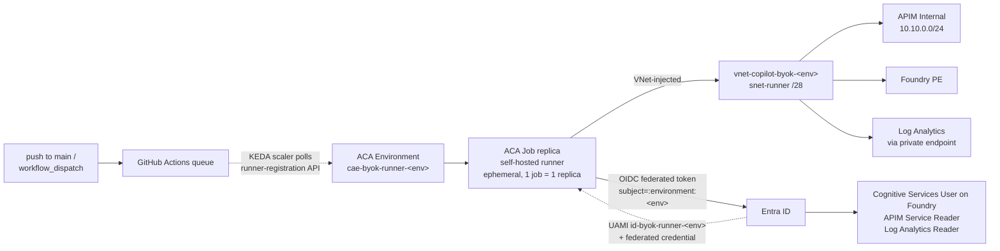
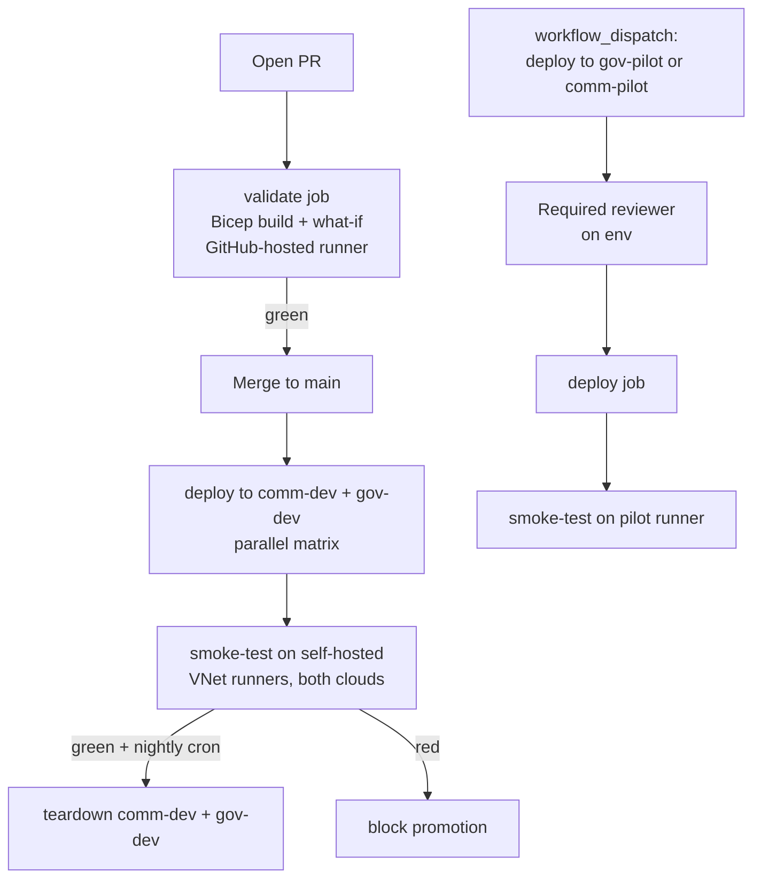

# CI/CD pipeline

How code, infrastructure, and automation get to **both** Azure clouds in this repo —
end-to-end, with audit trails, no stored secrets, and zero idle cost when nothing is
running.

> **Quick links**
> - **Manual pilot deploy** — [.github/workflows/deploy.yml](../.github/workflows/deploy.yml)
> - **Auto dev deploy** — [.github/workflows/deploy-dev.yml](../.github/workflows/deploy-dev.yml) (push-to-main → `comm-dev` + `gov-dev` in parallel → chains into smoke)
> - **PR validate (static)** — [.github/workflows/validate.yml](../.github/workflows/validate.yml) (Bicep build + wizard-vs-BYOK policy parity diff + JSON/YAML/PowerShell/bash syntax; no Azure auth, no cost)
> - **Smoke test** — [.github/workflows/smoke-test.yml](../.github/workflows/smoke-test.yml) (in-VNet self-hosted runner; called by `deploy-dev` and nightly cron)
> - **Nightly dev teardown** — [.github/workflows/teardown-dev.yml](../.github/workflows/teardown-dev.yml) (`0 4 * * *`; deletes `rg-copilot-byok-{comm,gov}-dev`; pilots never touched)
> - **Votes refresh** — [.github/workflows/refresh-project-votes.yml](../.github/workflows/refresh-project-votes.yml)
> - **Local "Step 0–3" deploy walkthrough** — [deployment-guide.md](deployment-guide.md)
>   (the CI path here just wraps the same `azd provision` invocation)

## What CI/CD does for this repo

Six pipelines live in `.github/workflows/`:

| Pipeline | Trigger | What runs | Where | Auth |
|---|---|---|---|---|
| **`validate`** | every PR to `main` | Bicep build + wizard-vs-BYOK policy parity diff + JSON/YAML/PowerShell/bash syntax | GitHub-hosted (no auth) | n/a (read-only static checks) |
| **`deploy`** | manual (`workflow_dispatch`) per cloud | Bicep build → what-if → `azd provision` | GitHub-hosted runner | OIDC federated cred → Entra app per cloud |
| **`deploy-dev`** | push to `main` + manual | matrix `azd provision` into `comm-dev` + `gov-dev`, then chains into `smoke-test` | GitHub-hosted runner | OIDC federated cred (same Entra app); `GH_RUNNER_PAT` secret on first push to bootstrap KEDA |
| **`smoke-test`** | called by `deploy-dev`, manual, nightly schedule (dev only) | call gateway from inside the VNet, assert KQL metrics arrived | **Self-hosted ACA Job runner** inside the deployed VNet | OIDC federated cred → same per-env Entra app |
| **`teardown-dev`** | nightly `0 4 * * *` + manual | `az group delete rg-copilot-byok-{comm,gov}-dev` (guardrailed — pilots never matched) | GitHub-hosted runner | OIDC federated cred |
| **`refresh-project-votes`** | daily 06:00 UTC + manual | Resync 👍 reactions → `Votes` field on project #1 | GitHub-hosted runner | PAT secret `PROJECT_TOKEN` (only thing that needs a secret because user-Projects v2 isn't exposed to OIDC) |

The reason the third pipeline exists is plain: the gateway is **APIM Internal-VNet mode**.
GitHub-hosted runners cannot reach `https://apim-…internal.azure-api.net/openai/...`, so any
real "did it actually work" assertion has to come from a runner *in* the VNet. ACA Jobs give
us that runner with scale-to-zero, VNet injection, and managed-identity auth.

## Two clouds, one pipeline

Everything is parameterized by the `cloud` workflow input. Picking `AzureUSGovernment` vs
`AzureCloud` drives:

- the `azd cloud.name` config (`AzureUSGovernment` vs `AzureCloud`)
- which committed CI param file gets staged
  (`infra/main.parameters.ci.gov.json` vs `infra/main.parameters.ci.commercial.json`)
- which **GitHub Environment** runs the job (Environments hold the per-cloud variables and
  required-reviewer gate); see [deployment-guide.md → "Create the GitHub Environments"](deployment-guide.md#one-time-setup)
- which federated credential the OIDC token matches (one per env subject)
- which **self-hosted runner pool** smoke-test jobs target (labels `gov-pilot` /
  `comm-pilot`)

There is **no code branch per cloud**. The only cloud-specific surface is the four
committed param-file deltas (region, model SKU, DNS zones).

## Environments

| Env | Purpose | Sub / RG | Auto-deploy? | Auto-teardown? |
|---|---|---|---|---|
| `comm-pilot` | Commercial pilot (canonical demo / self-test target; long-lived) | gwexler-1 / `rg-copilot-byok-comm-pilot` | Manual only via [`deploy.yml`](../.github/workflows/deploy.yml) (incremental `azd provision`, run on demand to keep in sync with `main`) | Manual only (`az group delete`, or `gh workflow run teardown-dev.yml` with an explicit pilot arg — guard-railed off by default) |
| `gov-pilot` | Sovereign-cloud pilot (canonical demo / self-test target; long-lived) | gwexler-gov-* / `rg-copilot-byok-gov-pilot` | Manual only via [`deploy.yml`](../.github/workflows/deploy.yml) | Manual only |
| `comm-dev` | Push-to-main lands here; runs full smoke suite; torn down nightly at 04:00 UTC | gwexler-1 / `rg-copilot-byok-comm-dev` | **Yes** on push-to-main via [`deploy-dev.yml`](../.github/workflows/deploy-dev.yml) | **Yes** nightly via [`teardown-dev.yml`](../.github/workflows/teardown-dev.yml) |
| `gov-dev` | Same idea, gov side | gwexler-gov-* / `rg-copilot-byok-gov-dev` | **Yes** on push-to-main | **Yes** nightly |

The two parallel CI/CD loops:

- **`*-dev`** — every push to `main` triggers `deploy-dev.yml`, which provisions both dev envs in parallel and chains into smoke-test. The companion `teardown-dev.yml` deletes both dev RGs every night at 04:00 UTC, so the dev envs only exist between a push and the next nightly run. Same Bicep as the pilots, but cheaper SKUs (Foundry only, tiny model capacity, no test VM) so they validate that *everything in the repo is still deployable* without carrying idle cost.
- **`*-pilot`** — manual-only deploys via `deploy.yml` keep the pilot RGs in sync with `main` whenever the operator runs the workflow. Same Bicep, full-size SKUs. The pilots additionally tend to keep a Windows test VM + Bastion in the RG (`deployTestStack=true` + `deployTestVm=true` in the operator-local pilot params file) so the operator can RDP in via Bastion and do interactive demos, BYOK CLI install/teardown experiments, or hand-driven probes against the private APIM gateway. **That test VM is purely an operator self-service convenience; no workflow in this repo depends on it.**

> The dev-env auto-deploy + nightly-teardown loop is the regression net; the pilots are the long-lived demo / canary targets. Pushing to `main` never disturbs the pilots.

## OIDC federation (no stored secrets)



For each `(cloud, environment)` pair we create one federated credential on the deploy app
with subject `repo:gwexler_microsoft/copilot-cli-byok-azure:environment:<env>`. The Entra
app exists **in the workload tenant**, so the gov pilot uses the gov tenant's app and the
commercial pilot uses the commercial tenant's app. Both apps look identical except for
their RBAC scope.

### Subject convention (per `#53`)

The OIDC subject is built the same way for **both clouds**, every workflow, every identity.
The issuer URL and audience are constants; only the trailing env name (and the identity
being federated to) change.

| Field | Value |
|---|---|
| Issuer | `https://token.actions.githubusercontent.com` |
| Audience | `api://AzureADTokenExchange` |
| Subject | `repo:gwexler_microsoft/copilot-cli-byok-azure:environment:<env>` |
| `<env>` values | `comm-pilot` \| `comm-dev` \| `gov-pilot` \| `gov-dev` |
| FIC display name | `fic-env-<env>` |

Two identity surfaces carry these FICs:

| Identity | Where it lives | Who manages the FICs | One FIC per |
|---|---|---|---|
| **Deploy app** (`copilot-byok-cicd`) | Entra app registration in each workload tenant (commercial tenant has commercial app; gov tenant has gov app) | [`scripts/setup-deploy-app-fics.ps1`](../scripts/setup-deploy-app-fics.ps1) / [`.sh`](../scripts/setup-deploy-app-fics.sh) — idempotent `az ad app federated-credential` wrapper. Bicep cannot create FICs on App registrations. | env in this cloud (e.g., commercial app gets `comm-pilot` + `comm-dev`) |
| **Runner UAMI** (`id-copilot-byok-runner-<env>-<suffix>`) | UserAssigned identity inside the workload sub, per env | Bicep — [`infra/modules/gh-runner.bicep`](../infra/modules/gh-runner.bicep) creates one `Microsoft.ManagedIdentity/userAssignedIdentities/federatedIdentityCredentials` per entry in `ghRunnerFicEnvSubjects` (default: this env only). Tear-down/spin-up is idempotent. | env this runner serves (default = the env it's deployed into) |

The deploy app is reused across all dispatch types (validate, deploy, smoke-test orchestration on the GitHub-hosted runner), so it accepts both `*-pilot` and `*-dev` subjects in its cloud. The runner UAMI is per-env and only accepts its own env's subject unless `ghRunnerFicEnvSubjects` is explicitly extended to share a runner pool.

### Runner UAMI subscription-scope RBAC (one-time bootstrap per cloud)

The `*-dev` legs of `deploy-dev.yml` run `azd provision` on the **`*-pilot` self-hosted ACA Job runner** (see [deploy-dev.yml](../.github/workflows/deploy-dev.yml) `runs-on: [self-hosted, "<pilot-env>"]`). That means the runner UAMI is the *deployer principal* for every dev provision and must hold:

| Role | Scope | Why |
|---|---|---|
| **Contributor** | the dev workload subscription | Create/update all RG-scoped resources (Foundry, APIM, network, etc.). |
| **User Access Administrator** | the dev workload subscription | Lets [`runner-rbac.bicep`](../infra/modules/runner-rbac.bicep) write the runner's three diagnostic role assignments (Cognitive Services User on Foundry/AOAI, APIM Service Reader, Log Analytics Reader) during each provision. |

Neither role is granted by any module in this repo — they are a **one-time human bootstrap per subscription** performed by an unconditional Owner *before* the first `deploy-dev` run targets that sub:

```powershell
$runnerOid = az identity show -g rg-copilot-byok-<pilot-env> `
  -n id-copilot-byok-runner-<pilot-env>-<suffix> --query principalId -o tsv
az role assignment create --assignee-object-id $runnerOid `
  --assignee-principal-type ServicePrincipal --role Contributor `
  --scope "/subscriptions/<subId>"
az role assignment create --assignee-object-id $runnerOid `
  --assignee-principal-type ServicePrincipal --role "User Access Administrator" `
  --scope "/subscriptions/<subId>"
```

> **ABAC-conditioned Owner (EMU / Gov tenants):** the default Owner assignment in EMU
> subscriptions ships with an ABAC condition that forbids writing role assignments for
> `Owner`, `User Access Administrator`, and `Role Based Access Control Administrator`
> (built-in role IDs `8e3af657…`, `f58310d9…`, `18d7d88d…`). That blocks the UAA grant
> above. Resolution path: a Global Administrator activates GA, calls
> `POST /providers/Microsoft.Authorization/elevateAccess` to mint an unconditional UAA
> at root scope `/`, then either (a) edits the existing Owner assignment to remove the
> condition, or (b) creates a new unconditional Owner for the operator. Once that's
> done the two grants above succeed and the pipeline self-services every future deploy
> with no further human action.

> **Bicep + FIC gotchas** (verified on `comm-pilot`, eastus2):
> - The `federatedIdentityCredentials` resource loop in [`gh-runner.bicep`](../infra/modules/gh-runner.bicep) is decorated `@batchSize(1)` because the `Microsoft.ManagedIdentity` RP rejects concurrent FIC writes under a single UAMI (`ConcurrentFederatedIdentityCredentialsWritesForSingleManagedIdentity`). Removing the decorator will fail any deploy that creates more than one FIC.
> - Bicep deploys are **`Incremental`** by default, so *removing* a subject from `ghRunnerFicEnvSubjects` does **not** delete the corresponding FIC — it just stops re-asserting it. To revoke a subject, run `az identity federated-credential delete -g <rg> --identity-name <uami> --name fic-env-<env>` (or use the `-Remove` flag in [`setup-deploy-app-fics.ps1`](../scripts/setup-deploy-app-fics.ps1) for the deploy-app side, which has the equivalent helper).

> **Runner container image supply-chain** (`#58`): the KEDA-driven runner uses
> [`myoung34/github-runner:latest`](https://github.com/myoung34/docker-github-actions-runner),
> a community-maintained image that honors the env-var bootstrap pattern KEDA expects
> (`ACCESS_TOKEN`, `REPO_URL`, `RUNNER_SCOPE`, `LABELS`, `EPHEMERAL`). It's the canonical
> choice in KEDA's own scaler docs. **Pilot envs are fine on `:latest`; production should
> pin to a SHA digest** via the `ghRunnerEventImage` Bicep parameter. The TODO to swap to
> a digest-pinned (or eventually an MCR-hosted) image is tracked under the `#52` parent.

What's **not** a secret in this repo:

- ✅ No service-principal client secret (OIDC replaces it).
- ✅ No subscription key for APIM (smoke-test reads it via managed identity from APIM at
  runtime; never written to disk).
- ✅ No `azd` env file values (committed CI param file + repo Variables).

What **is** a secret:

- 🔐 `PROJECT_TOKEN` (classic PAT, `repo` + `project` scopes) — feeds the daily
  Votes-refresh job because user-owned Projects v2 cannot be addressed by an OIDC subject.
  Rotation: every 90 days (set a calendar reminder when generating).

## Self-hosted runner (planned, `#52`)

### Why ACA Job

| Choice | Why | Cost when idle |
|---|---|---|
| **ACA Job + KEDA `github-runner` scaler** ✅ | First-party MS pattern, VNet-injected, scale-to-zero, managed-identity native, no nodes to patch | **$0** |
| VMSS + actions-runner-controller | Familiar | ~$50/mo always-on |
| Single VM + systemd runner | Simplest | ~$30/mo always-on, manual patching |
| AKS + ARC | Most flexible | Whole cluster to babysit (~$150/mo) |

### Architecture



Per cloud (and per env if we ever need it): one **ACA Environment** + one **ACA Job** +
one **user-assigned managed identity** with two federated credentials (one per env subject
that may dispatch jobs to that runner pool).

### No coupling to the operator's test VM

The smoke-test workflow runs entirely from the KEDA-driven self-hosted runner that
lives **inside the deployed env's VNet** (subnet `snet-runner`). That runner reaches
APIM Internal directly over the env's private DNS, so smoke needs none of the
`deployTestStack` / `deployTestVm` / Bastion machinery the operator may keep in a
pilot RG for manual demos. The pilot's Windows test VM is operator self-service —
for BYOK CLI install experiments, hand-driven probes, or RDP-via-Bastion demos —
not a CI dependency. CI/CD never flips `deployTestStack`, never touches the VM,
and makes no assumption about whether the VM is present.

If you want to validate the egress-allowlist NSG or run the BYOK CLI install probe
interactively, do it from the test VM on a pilot. Smoke is intentionally a gateway-only
assertion.

### Smoke-test assertions (the `#16` regression net)

The smoke-test job, once it's running inside the VNet, asserts:

1. **Discovery surface reachable** (`#61`) — `GET /discovery/v1/models` with the
   `smoke` APIM subscription key returns 200 and lists the expected model deployments
   (gpt-5.1 + gpt-4.1-mini). The `smoke` subscription is scoped *only* to the dedicated
   `byok-discovery` APIM product, which gates the `copilot-byok-discovery` API; standard
   tier subscriptions (`dev1` / `dev2`) intentionally **cannot** list models. See
   [architecture → Model discovery](../docs/architecture.md#model-discovery--separate-api-behind-a-restricted-product-61).
2. **Subscription-key auth works** — call `/openai/v1/chat/completions` with `dev1`'s and
   `dev2`'s keys; expect 200.
3. **`emit-metric` actually emitted** (this is the [issue #16](https://github.com/gwexler_microsoft/copilot-cli-byok-azure/issues/16)
   regression gate) — KQL against AppInsights `customMetrics` for
   `copilot_byok_tokens_total` over the last 5 min; fail if zero rows.
4. **Policy behaves** — call with a deliberately oversized prompt → expect 429 from
   `llm-token-limit`.
5. **Wizard-policy parity** — both `byok-*` and `wizard-*` paths return the same
   token-metric schema; diff their dimensions.

A failure in any of these flips the deploy job status red. Push-to-main never lands a
broken gateway in `*-dev`, and you find out before promoting to pilot.

## Votes refresh pipeline

Already live. See [.github/workflows/refresh-project-votes.yml](../.github/workflows/refresh-project-votes.yml).

### Why it exists

GitHub Projects v2 **cannot sort by 👍 reactions** natively. The workaround is a custom
`Votes` number field on the project, populated by [scripts/seed-project-fields.ps1](../scripts/seed-project-fields.ps1)
nightly (or on demand). With that field present, the project's `Triage` view can sort the
backlog by community demand.

### What it does

For every issue in the repo that's also an item on project #1:

- Map `priority:p*`, `theme:*`, `effort:*` labels → matching single-select project fields
- Read the issue's `THUMBS_UP` reaction count → set `Votes` number field

The script is idempotent — re-running just refreshes Votes and reapplies labels. Safe to
trigger manually at any time:

```pwsh
# Locally (uses your gh auth, which has the project scope after `gh auth refresh -s project`):
./scripts/seed-project-fields.ps1

# From CI (uses PROJECT_TOKEN secret):
gh workflow run refresh-project-votes.yml --repo gwexler_microsoft/copilot-cli-byok-azure
```

### Why it needs a PAT (not OIDC)

User-owned Projects v2 are not addressable by an OIDC subject — there's no `user/<name>`
slot in the federation contract. The only paths that work today are a classic PAT or a
GitHub App installed on the user account. The PAT is simpler for a one-person owner; if
this ever needs to graduate to an org-owned project, switch to a GitHub App.

## Promotion flow (target state after `#52` lands)



Pilots are **manual-only forever**. Auto-deploy is *only* to the cheap, ephemeral `*-dev`
envs that get torn down nightly. This keeps the pilot envs (which have keys customers
might be using) from churning underneath them.

## Operations cheatsheet

| Task | Command |
|---|---|
| Run a deploy (gov pilot) | Actions → `deploy` → `cloud=AzureUSGovernment, action=deploy` → approve |
| Run a deploy (comm pilot) | Actions → `deploy` → `cloud=AzureCloud, action=deploy` → approve |
| Push lands automatically to dev | (automatic) `deploy-dev.yml` fires on push to `main`, runs `comm-dev` + `gov-dev` matrix in parallel, then `smoke-test.yml` per env |
| Re-run dev deploy manually | `gh workflow run deploy-dev.yml --repo gwexler_microsoft/copilot-cli-byok-azure -f envs=comm-dev,gov-dev -f smoke=true` |
| Run dev teardown now (dry-run) | `gh workflow run teardown-dev.yml --repo gwexler_microsoft/copilot-cli-byok-azure -f envs=comm-dev,gov-dev -f dry_run=true` |
| Run dev teardown now (real) | `gh workflow run teardown-dev.yml --repo gwexler_microsoft/copilot-cli-byok-azure -f envs=comm-dev,gov-dev` |
| PR validation | (automatic on every PR) `validate.yml` runs Bicep build + wizard-vs-BYOK policy parity + JSON/YAML/PowerShell/bash syntax. No Azure cost. |
| Force a votes refresh | `gh workflow run refresh-project-votes.yml --repo gwexler_microsoft/copilot-cli-byok-azure` |
| Force a smoke test | `gh workflow run smoke-test.yml --repo gwexler_microsoft/copilot-cli-byok-azure -f env=comm-pilot` |
| Watch the latest run | `gh run watch --repo gwexler_microsoft/copilot-cli-byok-azure` |
| Rotate `PROJECT_TOKEN` | Generate new classic PAT (`repo`+`project`) → `gh secret set PROJECT_TOKEN --repo gwexler_microsoft/copilot-cli-byok-azure` |
| Bootstrap runner PAT (#58) | `$env:GH_RUNNER_PAT='ghp_xxx'; ./scripts/setup-gh-runner.ps1` (writes `gh-pat` secret on the ACA Job) — then re-deploy with `--parameters ghRunnerPat=$env:GH_RUNNER_PAT` so Bicep flips the Job from Manual placeholder to KEDA Event trigger. For dev envs, set `GH_RUNNER_PAT` as a repo Secret (not Variable) so `deploy-dev.yml` injects it into provision. |
| Rotate runner PAT (#58) | `./scripts/setup-gh-runner.ps1 -Token <new-pat>` (hot-rotate, no Job re-create needed — `ACCESS_TOKEN` is `secretRef: gh-pat`) |
| Validate runner pool (#58) | `./scripts/setup-gh-runner.ps1 -Action Status -EnvName comm-pilot` (lists GitHub-registered runners matching the env's labels) |
| Smoke-trigger the runner (#58) | `./scripts/setup-gh-runner.ps1 -Action Test -EnvName comm-pilot` (dispatches `smoke-test.yml` and watches for a new ACA Job execution) |
| Inspect runner pool | `az containerapp job execution list -g rg-copilot-byok-<env> -n caj-runner-<env>-<token>` |
| Tear down a dev env on demand | `gh workflow run teardown-dev.yml --repo gwexler_microsoft/copilot-cli-byok-azure -f envs=comm-dev` (or `az group delete -n rg-copilot-byok-comm-dev --yes`) |

## Roadmap

Tracked at [`#52`](https://github.com/gwexler_microsoft/copilot-cli-byok-azure/issues/52)
with phased child issues. Anything in this doc marked **(planned, `#52`)** lands as those
children close. The Votes refresh and the manual deploy pipelines are already live.
