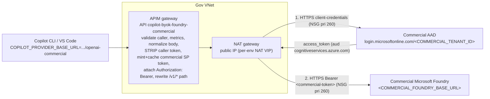

# Commercial Foundry route (parallel `/openai-commercial`)

A second, **opt-in** APIM API that lets the **Gov** gateway reach a **Commercial Microsoft
Foundry** endpoint over the public internet — **without touching the existing Gov/private
default route**. The default `/openai` route (API `copilot-byok-foundry` → private Foundry over
managed identity) is unchanged; this adds a separate `/openai-commercial` route (API
`copilot-byok-foundry-commercial` → the commercial endpoint) alongside it.

**Backend auth is cross-tenant by service principal.** The caller authenticates to Gov APIM as
today, but APIM does **not** forward the caller token to the commercial backend. Instead APIM
mints a **separate** bearer token in the **Commercial tenant**
(supplied via the `COMMERCIAL_TENANT_ID` repo Variable / `foundryCommercialTenantId` param — never committed) using a **Commercial-tenant service principal** (OAuth2
client-credentials) and calls the commercial endpoint over HTTPS with
`Authorization: Bearer <commercial-token>`. A Gov managed-identity token is rejected by the
commercial tenant (`TenantAccessDenied`), which is why a commercial SP is required.

Everything ships **off by default** (`deployFoundryCommercial=false`). Nothing about the
commercial route is created until you opt in and supply the placeholders below.

> **Status (validated 2026-07-01, gov-dev → commercial pilot Foundry).** The route works
> end-to-end cross-cloud: a Gov-internal APIM gateway call on `/openai-commercial` returned **HTTP
> 200** from a Commercial Foundry for both `/v1/chat/completions` (gpt-5.1) and `/v1/responses`
> (gpt-4.1-mini), with the caller subscription key and the RAI content-filter applied.
>
> **KEY FINDING — the secretless mode does NOT work across sovereign clouds.**
> `servicePrincipalFederated` (workload identity federation) is **rejected by Commercial Entra**
> with **`AADSTS700238`** ("Tokens issued by issuer `https://login.microsoftonline.us/<gov-tenant>/v2.0`
> may not be used for federated identity credential flows for applications … registered in this
> tenant"). A Gov Entra-tenant-issued managed-identity token cannot be a FIC assertion for a
> Commercial-tenant app. **For Gov → Commercial you must use `foundryCommercialAuthMode=servicePrincipal`
> (client secret)** or `apikey`. See [Backend auth](#backend-auth--caller-token-is-not-forwarded) and
> [servicePrincipal (secret) mode — validated step by step](#serviceprincipal-secret-mode--validated-step-by-step).
> (`servicePrincipalFederated` remains valid for *same-cloud* cross-tenant, e.g. commercial → commercial.)

---

## How it differs from the default route

| | Default route (unchanged) | Commercial route (new, opt-in) |
|---|---|---|
| APIM API name | `copilot-byok-foundry` | `copilot-byok-foundry-commercial` (`<COMMERCIAL_API_NAME>`) |
| Path | `/openai` | `/openai-commercial` (`<COMMERCIAL_API_PATH>`) |
| Backend | `foundry` Url/Pool backend (private endpoint) | `foundry-commercial` Url backend (`<COMMERCIAL_BACKEND_ID>`) |
| Reaches | private Foundry in-VNet (private endpoint) | **Commercial Foundry over the public internet** |
| Egress | intra-VNet to the private endpoint | leaves the Gov VNet via the **NAT gateway public IP `<GOV_NAT_EGRESS_IP>`** |
| Backend auth | managed identity (in-cloud) | **`servicePrincipalFederated`** (default, SECRETLESS): APIM federates its own Gov MI to a Commercial-tenant SP — no stored secret; `servicePrincipal` (secret) / `apikey` / `managedIdentity` also available (`<COMMERCIAL_BACKEND_AUTH_MODE>`) |
| Caller token to backend | n/a (MI) | **never forwarded** — stripped; a separate commercial token is attached |
| Caller auth | `subscriptionKey` / `jwt` | same `authMode` (shared with the default route) |
| Operations | `/v1/chat/completions`, `/v1/completions`, `/v1/embeddings`, `/v1/responses` | identical surface |
| Telemetry | `copilot_byok_request` / `*_prompt_tokens` / `*_completion_tokens` | **same metric names**, `backend` dimension = `foundry-commercial` |
| Throttling | product tiers (subscriptionKey) / per-oid (jwt) | same tiers (linked via `addCommercialToProductTiers`) |

The commercial policy (`policies/byok-foundry-commercial-policy*.xml`) is a faithful structural
copy of the default Foundry policy. It preserves request parsing, the 400 model-not-specified
guard, request metrics, reasoning-model normalization (`gpt-5`/`o*` sampling-param strip +
`max_tokens`→`max_completion_tokens`), the `/responses` account-root rewrite, and outbound token
metrics. The only differences are the backend it targets and the auth used to reach it.

---

## Request flow



The default `/openai` route is untouched and still routes intra-VNet to the private Foundry
endpoint.

---

## Parameters (all `infra/main.bicep`)

| Parameter | Placeholder | Default | Notes |
|---|---|---|---|
| `deployFoundryCommercial` | — | `false` | Master opt-in. Off = nothing commercial is created. |
| `foundryCommercialBaseUrl` | `<COMMERCIAL_FOUNDRY_BASE_URL>` | `''` | Public base URL of the commercial Foundry account, e.g. `https://<acct>.openai.azure.com`. **Required** when enabled. |
| `foundryCommercialApiName` | `<COMMERCIAL_API_NAME>` | `copilot-byok-foundry-commercial` | Must be unique; must differ from `copilot-byok-foundry`. |
| `foundryCommercialApiPath` | `<COMMERCIAL_API_PATH>` | `openai-commercial` | Must **not** collide with `openai`. |
| `foundryCommercialApiVersion` | `<COMMERCIAL_API_VERSION>` | `2025-04-01-preview` | Injected on deployment-scoped paths (not `/responses`). |
| `foundryCommercialAuthMode` | `<COMMERCIAL_BACKEND_AUTH_MODE>` | `servicePrincipal` | `servicePrincipal` (default) / `apikey` / `managedIdentity`. See **Backend auth** below. |
| `foundryCommercialTenantId` | `<COMMERCIAL_TENANT_ID>` | `''` | Commercial tenant whose authority mints the backend token (SP mode). In CI supplied via the `COMMERCIAL_TENANT_ID` repo Variable (no tenant ID committed). |
| `foundryCommercialClientId` | `<COMMERCIAL_CLIENT_ID>` | `''` | Commercial-tenant SP app (client) ID (SP mode). **Required** when enabled in SP mode. |
| `foundryCommercialClientSecret` (secret) | `<COMMERCIAL_CLIENT_SECRET_SECRET_REF>` | `''` | Commercial-tenant SP secret (SP mode). Supply via secure variable / Key Vault — never commit. |
| `foundryCommercialTokenResource` | `<COMMERCIAL_TOKEN_RESOURCE>` | `https://cognitiveservices.azure.com` | Token resource; policy appends `/.default` for the scope. |
| `foundryCommercialAuthorityHost` | — | `login.microsoftonline.com` | Commercial AAD authority host (token endpoint). |
| `foundryCommercialAudience` | `<COMMERCIAL_FOUNDRY_AUDIENCE>` | `''` | MI token audience; **only** used in `managedIdentity` mode. |
| `foundryCommercialApiKey` (secret) | — | `''` | Commercial Foundry key; **only** used in `apikey` mode. Supply via secure variable — never commit. |
| `foundryCommercialEgressDestinations` | `<COMMERCIAL_DESTINATION_CIDRS_OR_SERVICE_TAGS>` | `[]` | Public-IP CIDRs the APIM subnet may reach on 443. **Required** when `restrictApimEgress=true`. |
| `addCommercialToProductTiers` | — | `true` | Link the commercial API into `byok-standard` / `byok-power` so existing keys work on both routes. |

> `<COMMERCIAL_DEPLOYMENT_NAMES>` is not a Bicep parameter — it is the set of deployment names
> that exist **on the commercial Foundry account**. Callers put one of these in the request body
> `"model"`. The shared auto-route (`model: auto`) resolves to the **default route's** deployment
> names, so on the commercial route prefer **explicit** model names until commercial-specific
> auto-route deployments are parameterized (see TODO in the commercial policy files).

---

## Backend auth — caller token is NOT forwarded

Caller auth and backend auth are **separate**. The caller authenticates to **Gov APIM** with the
existing `authMode` (subscription key, or a Gov-tenant JWT validated against
`api://copilot-byok-gateway-…` / audience `<API_AUDIENCE>`). APIM establishes caller identity for
telemetry/throttling and then **strips the caller credential** (`api-key` and `Authorization` are
deleted) before calling the backend. The caller token is **never** sent to the commercial backend.

Why a separate token is mandatory: the commercial Foundry resource lives in a **different
Commercial tenant** (`<COMMERCIAL_TENANT_ID>`). A token minted in the **Gov** tenant
(including the Gov APIM managed identity) is rejected by the commercial tenant with
`TenantAccessDenied` — even though the network path (DNS, TCP 443, TLS) succeeds. APIM must
therefore present a token issued **by the commercial tenant**.

Pick the backend credential via `foundryCommercialAuthMode`:

- **`servicePrincipalFederated` (default, SECRETLESS).** Workload identity federation — no secret
  anywhere. APIM mints **its own** Gov managed-identity token with audience
  `api://AzureADTokenExchange` and presents it to the **commercial** authority as an OAuth2
  **`client_assertion`** (instead of a `client_secret`):
  1. `authentication-managed-identity resource="api://AzureADTokenExchange"` → APIM MI token.
  2. `POST https://login.microsoftonline.com/<COMMERCIAL_TENANT_ID>/oauth2/v2.0/token` with
     `grant_type=client_credentials`, `client_id=<COMMERCIAL_CLIENT_ID>`,
     `client_assertion_type=urn:ietf:params:oauth:client-assertion-type:jwt-bearer`,
     `client_assertion=<APIM MI token>`, `scope=<COMMERCIAL_TOKEN_RESOURCE>/.default`.
  3. The commercial SP carries a **federated identity credential** trusting that APIM MI
     (issuer = Gov MI issuer, subject = APIM MI object ID, audience = `api://AzureADTokenExchange`).
  4. The resulting `access_token` is **cached** per tenant+client until ~5 min before expiry; any
     failure returns **502** (`CommercialTokenFederationFailed`) and never calls the backend.

  See **Service principal + federated credential (peer setup)** below for the exact commands.

  > ⛔ **Cross-sovereign-cloud (Gov → Commercial): CONFIRMED NOT SUPPORTED.** Commercial Entra
  > rejects the Gov APIM MI token as a FIC assertion with **`AADSTS700238`**. Everything else in the
  > federation path works (the token signature is validated cross-cloud and matching reaches the
  > subject/audience checks), but the platform forbids an Entra-tenant issuer from *another sovereign
  > cloud* for FIC. Use `servicePrincipal` (secret) below. `servicePrincipalFederated` is still the
  > right choice for **same-cloud** cross-tenant (e.g. commercial → commercial).

- **`servicePrincipal` (secret — REQUIRED for Gov → Commercial; VALIDATED).** Same client-credentials
  flow but authenticated with `client_secret=<foundry-commercial-client-secret>` (secret named value,
  masked in traces). This is the **validated** cross-sovereign-cloud path — a Gov-internal call
  returned 200 from the commercial Foundry. A Gov managed-identity token is still rejected by the
  commercial tenant (`TenantAccessDenied`), so a **Commercial-tenant SP** (with a secret) is required.
  See [servicePrincipal (secret) mode — validated step by step](#serviceprincipal-secret-mode--validated-step-by-step).
- **`apikey`.** APIM sends `foundry-commercial-api-key` in the `api-key` header (only if the
  commercial account permits key auth).
- **`managedIdentity`.** APIM mints an MI token for `foundryCommercialAudience`. **Not** valid
  cross-tenant (kept for same-tenant edge cases).

Either way the SP must be granted a data-plane role (e.g. `Cognitive Services OpenAI User`) on the
**commercial** Foundry account.

> **APIM design note.** APIM policy has no native "acquire SP/federated token" action
> (`authentication-managed-identity` only mints APIM's own MI token). Both SP modes are therefore
> implemented with `send-request` + `cache-store-value`/`cache-lookup-value`. In federated mode the
> `client_assertion` is exactly APIM's MI token (audience `api://AzureADTokenExchange`), so no
> secret exists anywhere — the trust is the federated identity credential on the commercial SP.

> The optional Level 2 auto-route classifier `send-request` still assumes MI; leave the classifier
> disabled (`autoRouteClassifierEnabled=false`, the default) on the commercial route unless you
> refactor it for SP/api-key. It is off by default.

---

## Service principal + federated credential (peer setup)

Hand this to whoever owns the **commercial** tenant. **No secret is created or shared.**

**You (Gov side) provide two values from the running Gov APIM:**
```bash
# FIC subject = the APIM system-assigned managed-identity object (principal) ID
az apim show -g <gov-rg> -n <gov-apim-name> --query identity.principalId -o tsv
# FIC issuer — the Gov APIM MI mints a **v2** token (CONFIRMED by decoding a live token):
#   https://login.microsoftonline.us/<gov-tenant>/v2.0   (ver=2.0; NOT the v1 sts.windows.net form)
# NOTE: this peer setup only applies to SAME-CLOUD cross-tenant federation. For Gov → Commercial the
# federated path is blocked (AADSTS700238) — skip to servicePrincipal (secret) mode instead.
```

**Scripted (recommended).** All four steps below are codified in
[`scripts/setup-commercial-backend.ps1`](../scripts/setup-commercial-backend.ps1) (and the bash
twin [`scripts/setup-commercial-backend.sh`](../scripts/setup-commercial-backend.sh)). They are
idempotent and cannot be an azd hook on the Gov deployment because they are directory + RBAC writes
in a **different tenant and cloud**. Run them once, signed in to the **commercial** tenant.

First read the two Gov inputs (signed in to `AzureUSGovernment`, in the Gov subscription):
```bash
# FIC subject = the Gov APIM system-assigned MI object id (changes on every APIM recreate)
az apim show -g <gov-rg> -n <gov-apim> --query identity.principalId -o tsv
# Gov gateway NAT egress IP to allowlist on the commercial Foundry firewall
az network public-ip show -g <gov-rg> -n pip-natgw-copilot-byok-<env>-<suffix> --query ipAddress -o tsv
```
Then, signed in to the **commercial** tenant (`az cloud set --name AzureCloud; az login`):
```pwsh
./scripts/setup-commercial-backend.ps1 `
  -FoundryAccountName <commercial-foundry-account> -FoundryResourceGroup <commercial-rg> `
  -GovTenantId <gov-tenant-guid> -GovApimMiObjectId <gov-apim-mi-object-id> `
  -GovEgressIp <gov-nat-egress-ip> -AllowGovEgressIp
```
```bash
./scripts/setup-commercial-backend.sh \
  --foundry-account-name <commercial-foundry-account> --foundry-resource-group <commercial-rg> \
  --gov-tenant-id <gov-tenant-guid> --gov-apim-mi-object-id <gov-apim-mi-object-id> \
  --gov-egress-ip <gov-nat-egress-ip> --allow-gov-egress-ip
```
The script creates the app + SP (no secret), adds **both** a v1 (`sts.windows.net`) and v2
(`login.microsoftonline.us`) federated credential to hedge the Gov MI token format, grants
`Cognitive Services OpenAI User`, optionally allowlists the Gov egress IP, and prints
`COMMERCIAL_CLIENT_ID` / `COMMERCIAL_TENANT_ID` (also pushed to the azd env / `$GITHUB_ENV`). Set
`COMMERCIAL_CLIENT_ID` as `foundryCommercialClientId` on the Gov side. Omit `-AllowGovEgressIp` /
`--allow-gov-egress-ip` to leave the Foundry firewall untouched.

**Worked example (gov-dev → comm-pilot Foundry, validated):**
```pwsh
./scripts/setup-commercial-backend.ps1 `
  -FoundryAccountName <commercial-foundry-account> -FoundryResourceGroup <commercial-rg> `
  -GovTenantId <GOV_TENANT_ID> `
  -GovApimMiObjectId <GOV_APIM_MI_OBJECT_ID> `
  -GovEgressIp <GOV_NAT_EGRESS_IP> -AllowGovEgressIp
```

**By hand (equivalent steps), if you prefer the raw CLI:**
```bash
# 1. App registration + service principal — NO secret, NO certificate
az ad app create --display-name copilot-byok-commercial-backend
APPID=$(az ad app list --display-name copilot-byok-commercial-backend --query "[0].appId" -o tsv)
az ad sp create --id "$APPID"

# 2. Federated identity credential trusting the Gov APIM managed identity
az ad app federated-credential create --id "$APPID" --parameters '{
  "name": "gov-apim-fed",
  "issuer": "https://sts.windows.net/<GOV_TENANT_ID>/",
  "subject": "<GOV_APIM_MI_OBJECT_ID>",
  "audiences": ["api://AzureADTokenExchange"]
}'

# 3. Data-plane role on the commercial Foundry account so the token can call it
az role assignment create --assignee "$APPID" \
  --role "Cognitive Services OpenAI User" \
  --scope "<commercial Foundry account resource ID>"

# 4. Allow the Gov egress IP on the Foundry resource firewall (per-env NAT IP), then enable PNA
az cognitiveservices account network-rule add \
  -g <commercial-rg> -n <commercial-foundry-name> --ip-address <gov-nat-egress-ip>
az resource update --ids <commercial Foundry account resource ID> \
  --set properties.publicNetworkAccess=Enabled
```

They return the **app (client) ID** → set it as `foundryCommercialClientId`.

> **The NAT egress IP is per-environment.** Each environment's NAT gateway has its **own** public
> IP. Always read it live (`az network public-ip show … pip-natgw-…`) for the environment you are
> wiring — never reuse another environment's value.

**Cross-cloud caveat — RESOLVED (2026-07-01): federation is BLOCKED Gov → Commercial.** The Gov APIM
MI mints a **v2** token (issuer `https://login.microsoftonline.us/<gov-tenant>/v2.0`). Commercial
Entra validates its signature cross-cloud and matches FICs by subject/audience, but then **rejects it
with `AADSTS700238`** — an Entra-tenant issuer from *another sovereign cloud* may not be used for a
FIC. No FIC configuration fixes this (it is a platform restriction). **Use `servicePrincipal` (secret)
below for Gov → Commercial.** (The federated peer setup above is still correct for **same-cloud**
cross-tenant scenarios.)

> Diagnostic breadcrumbs, in case you re-verify: FIC audience must be the literal
> `api://AzureADTokenExchange` (a custom value → `AADSTS700214` at runtime); only **one** FIC is
> allowed per subject (a v1+v2 hedge → `AADSTS700263`); and the final wall is `AADSTS700238`.

---

## servicePrincipal (secret) mode — validated step by step

This is the **working, validated** path for **Gov → Commercial**. It reuses the same SP as the
federated setup (data-plane role + firewall allow are identical); the only difference is a **client
secret** instead of a federated credential.

**1. Commercial tenant** — create the SP (if not already) and a client secret. The
[`scripts/setup-commercial-backend.*`](../scripts/setup-commercial-backend.ps1) script does the app +
SP + role + firewall; add the secret with `-CreateSecret` (or by hand):
```bash
# signed in to the COMMERCIAL tenant (az cloud set --name AzureCloud; az login)
APPID=$(az ad app list --display-name copilot-byok-commercial-backend --query "[0].appId" -o tsv)
az ad app credential reset --id "$APPID" --display-name gov-backend --years 1 --append --query password -o tsv
# grant the SP a data-plane role + allow the Gov NAT IP on the Foundry firewall (as in peer setup):
az role assignment create --assignee "$APPID" --role "Cognitive Services OpenAI User" \
  --scope "<commercial Foundry account resource ID>"
az cognitiveservices account network-rule add -g <commercial-rg> -n <commercial-foundry> \
  --ip-address <gov-nat-egress-ip>
az resource update --ids "<commercial Foundry account resource ID>" \
  --set properties.publicNetworkAccess=Enabled            # keep networkAcls.defaultAction=Deny
```

**2. Gov deployment** — set the auth mode + supply the secret out-of-band, then provision:
```jsonc
"deployFoundryCommercial":       { "value": true },
"foundryCommercialBaseUrl":      { "value": "https://<acct>.cognitiveservices.azure.com" },
"foundryCommercialAuthMode":     { "value": "servicePrincipal" },
"foundryCommercialTenantId":     { "value": "${COMMERCIAL_TENANT_ID}" },
"foundryCommercialClientId":     { "value": "${COMMERCIAL_CLIENT_ID}" },
"foundryCommercialClientSecret": { "value": "${COMMERCIAL_FOUNDRY_CLIENT_SECRET}" },  // secure var / KV
"foundryCommercialEgressDestinations": { "value": [ "<FOUNDRY_DATA_CIDR>", "<AAD_LOGIN_CIDR>" ] }
```
APIM then does OAuth2 client-credentials at `https://login.microsoftonline.com/<COMMERCIAL_TENANT_ID>/oauth2/v2.0/token`
with `client_id` + `client_secret` + `scope=https://cognitiveservices.azure.com/.default`, caches the
token per tenant+client, and calls the commercial Foundry with `Authorization: Bearer <token>`.

**Validated result (gov-dev → commercial pilot Foundry, 2026-07-01):** both surfaces returned **200**
from inside the Gov VNet (internal APIM, source = the gateway's private IP):
```
POST /openai-commercial/v1/chat/completions {"model":"gpt-5.1",...}   → 200  content:"pong"  (model gpt-5.1-2025-11-13, content-filter applied)
POST /openai-commercial/v1/responses        {"model":"gpt-4.1-mini",...} → 200  (usage.total_tokens 15)
```

> **Secret lifecycle.** Rotate with `az ad app credential reset --append` in the commercial tenant and
> update `foundry-commercial-client-secret` (prefer a Key Vault-backed named value so rotation is a
> single secret-set, no redeploy; the token cache re-mints on the next request). `apikey` mode is the
> alternative when the commercial account permits key auth.

---

## Why not VNet peering / private cross-cloud connectivity?

The route deliberately goes over the **public internet** (pinned to the Gov NAT egress IP, TLS 1.2+,
IP-allowlisted on the Foundry) because **there is no private network path between Azure Government and
Azure Commercial**:

- **VNet peering / Global VNet peering — unsupported across clouds.** Peering only works within a
  single cloud and a single Entra environment. The peering API cannot reference a VNet resource ID in
  the other cloud (Gov `usgov*` ↔ Commercial `AzureCloud` are separate sovereign backbones + separate
  Resource Manager + Entra environments).
- **Private Endpoint / Private Link — also cannot cross clouds.** A Gov private endpoint cannot target
  a Commercial `cognitiveservices` account (and vice-versa); private DNS zones don't span clouds. This
  is why the commercial Foundry's `privatelink.cognitiveservices.azure.com` CNAME is *not* intercepted
  by the Gov VNet (which links the Gov `…azure.us` zones) and resolves publicly instead.
- **ExpressRoute — no cross-cloud circuit** between Gov and Commercial for this.
- **Site-to-Site IPsec VPN — technically possible but not worth it here.** You would stand up a VPN
  gateway in each cloud and tunnel over the public internet; it keeps private addressing but still
  traverses the public internet, and the Commercial Foundry would need a private endpoint inside the
  Commercial VNet for the tunnel to terminate against. For a single APIM → Foundry HTTPS path that is
  far more moving parts than the TLS + IP-allowlist + SP-token design here.

So the supported topology is: **public egress via the Gov NAT gateway IP → allowlisted on the commercial
Foundry firewall → TLS to the commercial data + AAD endpoints**, with the SP secret providing the
cross-tenant identity. The `Network / egress` section below is what enforces that path.

---

## Network / egress

When `restrictApimEgress=true` (the Gov default), the APIM subnet is private and denies all
internet egress except the Azure-internal service tags APIM needs. The commercial endpoint is on
the public internet, so it must be **explicitly allowlisted**:

- Setting `foundryCommercialEgressDestinations` adds NSG rule **`Allow-Out-FoundryCommercial`**
  (priority **260**, TCP 443) to the APIM subnet, evaluated **before** the priority-4000
  `Deny-Out-Internet` rule.
- In **`servicePrincipalFederated`** / **`servicePrincipal`** mode the allowlist must cover **two** commercial destinations: the
  Foundry **data** endpoint (`<COMMERCIAL_FOUNDRY_BASE_URL>`) **and** the commercial **AAD token**
  endpoint (`login.microsoftonline.com`). The Gov `AzureActiveDirectory` service tag resolves to
  **Gov** AAD only, so commercial AAD must be added by CIDR. Coordinate source-IP allowlisting of
  `<GOV_NAT_EGRESS_IP>` on **both** the commercial Foundry resource firewall and any conditional-access /
  named-location policy on the SP.
- Allowed traffic leaves via the shared **NAT gateway**, whose static public IP is
  **`<GOV_NAT_EGRESS_IP>`** — this is the source IP the commercial endpoint sees.
- **NSGs cannot match FQDNs.** Supply the commercial endpoint's **public-IP CIDRs**. Resolve the
  host (`nslookup <COMMERCIAL_FOUNDRY_BASE_URL host>`) or use the published AzureCloud/region
  ranges, and refresh them if they drift. The cleaner long-term option for FQDN-based egress is
  Azure Firewall application rules (consistent with `infra/modules/firewall.bicep`); the NSG CIDR
  allowlist is the minimal change that works today.

> If `restrictApimEgress=false`, no deny rule exists and the commercial endpoint is reachable
> without this allowlist — but then egress is **not** guaranteed to leave via `<GOV_NAT_EGRESS_IP>`.

---

## Environments & CI wiring

The route is a **Gov-side** feature: the `gov-*` environments **host** the `/openai-commercial` API and
authenticate to the backend; the `comm-*` environments only **provide the Foundry** it calls. So the
consumer config lives on the Gov environments and the backend-firewall config lives on the Commercial
ones. Each environment's CI values come from **GitHub environment-scoped** Variables/Secrets (so no real
tenant/client IDs are committed — the param files use `${...}` substitution).

| Environment | Role | Param file | Deployed by | Commercial-route settings |
|---|---|---|---|---|
| **gov-dev** | Route **consumer** (dev) | `main.parameters.ci.gov-dev.json` | [deploy-dev.yml](../.github/workflows/deploy-dev.yml) (push/dispatch) | Vars `COMMERCIAL_TENANT_ID`, `COMMERCIAL_CLIENT_ID`, `COMMERCIAL_FOUNDRY_BASE_URL` + Secret `COMMERCIAL_FOUNDRY_CLIENT_SECRET` |
| **gov-pilot** | Route **consumer** (pilot) | `main.parameters.ci.gov.json` | [deploy.yml](../.github/workflows/deploy.yml) (manual dispatch) | same three Vars + the Secret |
| **comm-pilot** | Backend **Foundry** (stable) | `main.parameters.ci.commercial.json` | deploy.yml (manual dispatch) | Var `FOUNDRY_PUBLIC_INGRESS_IPS` = the gov NAT egress IP(s) to allowlist |
| **comm-dev** | Backend **Foundry** (ephemeral) | `main.parameters.ci.commercial-dev.json` | deploy-dev.yml (push/dispatch, nightly teardown) | Var `FOUNDRY_PUBLIC_INGRESS_IPS` **optional** — set only to exercise the ingress hook in CI |

**Both gov environments target the `comm-pilot` Foundry** (long-lived, stable name) as the shared
backend — `comm-pilot`'s firewall therefore allowlists **both** gov NAT egress IPs (dev + pilot).
`comm-dev` is not on the route's data path; its `FOUNDRY_PUBLIC_INGRESS_IPS` is set purely so each
ephemeral `comm-dev` deploy runs the ingress hook and catches script regressions before they reach
`comm-pilot`.

### CI Variables / Secret (per environment)

| Name | Kind | Set on | Feeds param | Purpose |
|---|---|---|---|---|
| `COMMERCIAL_TENANT_ID` | Variable | gov-dev, gov-pilot | `foundryCommercialTenantId` | Commercial tenant that mints the backend token |
| `COMMERCIAL_CLIENT_ID` | Variable | gov-dev, gov-pilot | `foundryCommercialClientId` | Commercial-tenant SP app (client) id |
| `COMMERCIAL_FOUNDRY_BASE_URL` | Variable | gov-dev, gov-pilot | `foundryCommercialBaseUrl` | Commercial Foundry account URL (no account name committed) |
| `COMMERCIAL_FOUNDRY_CLIENT_SECRET` | **Secret** | gov-dev, gov-pilot | `foundryCommercialClientSecret` | SP client secret (servicePrincipal mode) |
| `FOUNDRY_PUBLIC_INGRESS_IPS` | Variable | comm-pilot (+ comm-dev opt-in) | — (consumed by the hook) | Space/comma-separated gov NAT egress IPs to allowlist on this deploy's Foundry firewall |

The workflows export these into the `azd provision` steps (`deploy.yml`, `deploy-dev.yml`); an unset
value substitutes empty, so the route stays off / the hook no-ops on environments that don't opt in.

### Backend firewall hook

The commercial Foundry pins `publicNetworkAccess: 'Disabled'` in Bicep (private-endpoint-only default).
The post-provision hook [`scripts/allow-foundry-ingress-ips.*`](../scripts/allow-foundry-ingress-ips.ps1)
(wired in [azure.yaml](../azure.yaml)) runs on the **Commercial** deploy, reads `FOUNDRY_PUBLIC_INGRESS_IPS`,
and — only when non-empty — sets `publicNetworkAccess=Enabled` (defaultAction stays `Deny`) with those
IPs in `ipRules`. The comm-pilot's own private-endpoint path is unaffected (PE bypasses `networkAcls`);
Bicep clears `ipRules` each provision and the hook re-adds the current list, so removed IPs converge out.
It **no-ops** (and touches nothing) when the variable is empty — so Gov deploys and non-participating
Commercial deploys are never affected.

> **Per-environment NAT IP.** Each Gov environment's NAT gateway has its **own** egress IP; the commercial
> Foundry firewall must list **each** one that routes to it. Read them live
> (`az network public-ip show … pip-natgw-copilot-byok-<env>-<suffix>`).

---

## Deploy

1. In your gov parameters file (`infra/main.parameters.json`, copied from
   `infra/main.parameters.gov.example.json`) set:
   ```jsonc
   "deployFoundryCommercial":             { "value": true },
   "foundryCommercialBaseUrl":            { "value": "https://<acct>.services.ai.azure.com" },
   "foundryCommercialAuthMode":           { "value": "servicePrincipalFederated" },
   "foundryCommercialTenantId":           { "value": "${COMMERCIAL_TENANT_ID}" },
   "foundryCommercialClientId":           { "value": "<COMMERCIAL_CLIENT_ID>" },
   "foundryCommercialEgressDestinations": { "value": [ "<FOUNDRY_DATA_CIDR>", "<AAD_LOGIN_CIDR>" ] }
   ```
   First complete the **Service principal + federated credential (peer setup)** above — running
   [`scripts/setup-commercial-backend.*`](../scripts/setup-commercial-backend.ps1) is the
   recommended way (no secret needed; it also handles the source-IP allowlist on the commercial
   Foundry firewall with `-AllowGovEgressIp`).
2. `azd provision` (or your `az deployment sub create` flow). The default `/openai` route is
   unaffected. In federated mode there is **no secret to supply** — that's the point.

---

## Configure clients

Same credential model as the default route — only the base URL path changes.

**Copilot CLI** (helper script auto-detects the `/openai-commercial` suffix):
```bash
APIM_SUBSCRIPTION_KEY=<dev-key> source ./scripts/copilot-cli-byok.sh \
  https://<apim-gateway>/openai-commercial <model>
```
Or set the env directly:
```bash
export COPILOT_PROVIDER_BASE_URL="https://<apim-gateway>/openai-commercial"
export COPILOT_PROVIDER_API_KEY="<dev subscription key or Entra JWT>"
export COPILOT_MODEL="<COMMERCIAL_DEPLOYMENT_NAMES>"   # an explicit commercial deployment name
```

**VS Code (Custom Endpoint provider, 1.122+):** point the base URL at
`https://<apim-gateway>/openai-commercial`; the `/v1/responses` operation is supported for the
`apiType: responses` selection.

> A tier-scoped key (`byok-standard` / `byok-power`) works on **both** `/openai` and
> `/openai-commercial` when `addCommercialToProductTiers=true`.

---

## Validation checklist

1. **Template compiles:** `az bicep build --file infra/main.bicep --stdout >/dev/null`.
2. **API exists:**
   `az apim api show -g <rg> --service-name <apim> --api-id copilot-byok-foundry-commercial`
   → path `openai-commercial`.
3. **Operations present:** `chat-completions`, `completions`, `embeddings`, `responses`.
4. **Policy attached:** `az apim api policy show --api-id copilot-byok-foundry-commercial ...`
   → references `{{foundry-commercial-backend-id}}` and the commercial auth block.
5. **Backend exists:** `az apim backend show --backend-id foundry-commercial ...` → commercial URL.
6. **Named values set:** `foundry-commercial-base-url`, `-backend-id`, `-api-version`,
   `-auth-mode` (=`servicePrincipal`), `-tenant-id`, `-client-id`, `-token-resource`,
   `-authority-host`, plus secrets `-client-secret` and `-api-key`.
7. **Product association:** the commercial API is listed under `byok-standard` / `byok-power`.
8. **NAT egress IP:**
   `az network public-ip show -g <rg> --name pip-natgw-copilot-byok-<env>-<suffix> --query ipAddress`
   → `<GOV_NAT_EGRESS_IP>`.
9. **Egress allow rule:** the APIM NSG has `Allow-Out-FoundryCommercial` (priority 260) with your
   CIDRs; confirm the commercial endpoint's access logs / NSG flow logs show source `<GOV_NAT_EGRESS_IP>`.
10. **Routing — chat:**
    ```bash
    curl -sS https://<apim-gateway>/openai-commercial/v1/chat/completions \
      -H "api-key: <key>" -H "content-type: application/json" \
      -d '{"model":"<commercial-deployment>","messages":[{"role":"user","content":"ping"}]}'
    ```
    → 200 from the commercial backend.
11. **Routing — responses:**
    ```bash
    curl -sS https://<apim-gateway>/openai-commercial/v1/responses \
      -H "api-key: <key>" -H "content-type: application/json" \
      -d '{"model":"<commercial-deployment>","input":"ping"}'
    ```
    → 200 (rewritten to `/openai/v1/responses`, no dated api-version).
12. **Metrics:** `copilot_byok_request` (and token metrics) emit with dimension
    `backend = foundry-commercial` (Application Insights / `copilot.byok` namespace).
13. **Default route untouched:** the `/openai` smoke test still passes unchanged.
14. **Token acquisition (SP mode):** trigger one commercial request and confirm a 200 (not 502
    `CommercialTokenAcquisitionFailed`). A 502 means the SP credentials are wrong or the commercial
    AAD token endpoint is not in the egress allowlist. In an APIM **trace** (Ocp-Apim-Trace), the
    `send-request` to `login.microsoftonline.com/<tenant>/oauth2/v2.0/token` returns 200 and the
    `client_secret` is masked.
15. **Bearer backend call:** the outbound request to the commercial backend carries
    `Authorization: Bearer …` (the commercial SP token) and **no** `api-key`; the caller credential
    is absent (stripped).
16. **TLS-only:** both the token endpoint and the backend URLs are `https://`; the backend
    succeeds with certificate validation on (no `validateCertificate*: false`).
17. **Caller token NOT forwarded:** with a caller JWT that passes Gov validation, confirm via trace
    that the backend never receives it (the `api-key` / `Authorization` caller headers are deleted
    before the backend call).
18. **Caller JWT still works to Gov APIM:** `az account get-access-token --resource
    api://copilot-byok-gateway-<GOV_TENANT_SHORT>` → use as the `api-key`; Gov `validate-jwt` accepts it and
    the request reaches the backend with the **commercial** token instead.

---

## Risks & follow-ups

- **SP secret lifecycle.** The client secret expires; rotate it (`az ad sp credential reset` in the
  commercial tenant) and update `foundry-commercial-client-secret`. Prefer a Key Vault-backed named
  value so rotation is a single secret-set with no redeploy. The token cache re-mints automatically
  on the next request after a rotation (cache key includes tenant+client).
- **Secret in the token-request body.** The client-credentials body is built in a policy expression
  with the secret named value URL-encoded; APIM masks secret named values in traces. If a future SP
  secret value contains a `"`, use the Key Vault-backed named value path.
- **NSG CIDR drift.** Commercial Foundry **and** commercial AAD IPs can change; NSG can't match
  FQDNs. Track the ranges or migrate APIM egress to Azure Firewall application rules.
- **Auto-route deployment names** are shared with the default route. Use explicit model names on
  the commercial route, or parameterize commercial-specific auto-route deployments
  (`<COMMERCIAL_DEPLOYMENT_NAMES>`).
- **Data residency / compliance.** Sending Gov-originated traffic to a Commercial Foundry endpoint
  crosses a cloud boundary — confirm this is permitted for your data classification before enabling.
