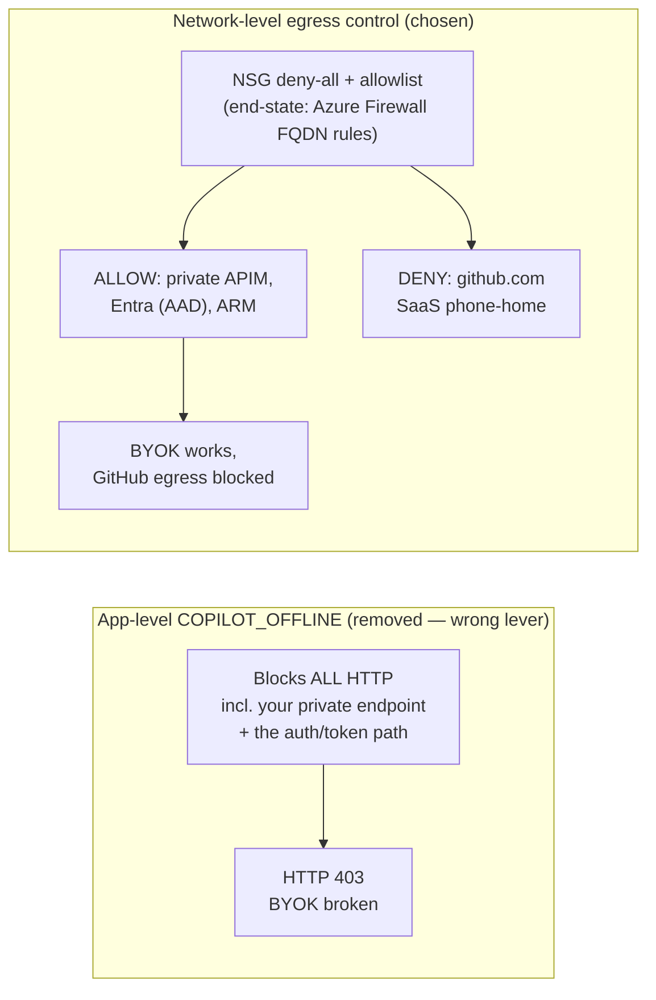

# GitHub egress allowlist (corporate proxy / Azure Firewall)

> **Empirically verified (Gov test VM, 2026-06-01):** with BYOK, the Copilot CLI does
> **NOT** require GitHub login or an active Copilot subscription at runtime. A clean-room
> VM with no `.copilot` config, no `GH_TOKEN`/`GITHUB_TOKEN`, and only the four
> `COPILOT_PROVIDER_*` vars set ran `copilot -p "..."` successfully end-to-end (exit 0,
> real token usage through the private APIM → AOAI). So `github.com` / `api.github.com`
> egress is **not** needed for the BYOK inference path. GitHub egress only matters for:
> 1. **Installation** — `npm i -g @github/copilot` pulls from `registry.npmjs.org` (a CDN),
>    NOT github.com; Node itself comes from `nodejs.org`. So even install mostly needs the
>    npm/nodejs CDNs, not github.com directly.
> 2. **Optional** update checks / telemetry / Actions integration if you leave them on.
>
> Bottom line: a fully-private BYOK runtime can run with GitHub egress **denied**. The lists
> below are kept for environments that want install-time reachability or that run the CLI in
> non-BYOK mode.

## Why not `COPILOT_OFFLINE`? (enforce privacy at the network, not the app)

A tempting shortcut to "stop the CLI from talking to GitHub" is an app-level offline switch.
The CLI historically honored an **undocumented `COPILOT_OFFLINE`** env var (it is **not** in
the public GitHub Copilot CLI docs), and this repo's wrapper scripts briefly set it. **We
removed it** — it is the wrong lever, and it actively breaks BYOK.

`COPILOT_OFFLINE` is a **blunt, process-wide kill switch for *all* outbound HTTP**. It is not
selective: it cannot tell your **private model endpoint** apart from GitHub's SaaS phone-home,
so it blocks both — including the **auth/token path** the CLI still runs to mint the credential
it presents to the gateway.

**Symptom when it was on: `HTTP 403` against the private APIM, not a timeout.** A 403
(`Forbidden`) rather than a connection error is the tell — the request *did* leave the box but
arrived **without a valid credential**, because offline mode suppressed the identity/token
acquisition. APIM's `validate-jwt` / subscription-key check then rejected the unauthenticated
call. So offline mode doesn't just block GitHub chatter; it breaks the one path BYOK depends on.

The correct control is **network-layer egress filtering**, which *is* selective: it keeps the
private APIM / model / AAD / ARM paths open while denying GitHub SaaS. That is exactly the
`deployNatGateway` + `restrictVmEgress` allowlist below (and the desired-end-state Azure
Firewall FQDN rules). It is strictly better than an app-level flag because it is
**allow-list-driven rather than all-or-nothing**.



> Empirically (Gov test VM, 2026-06-01): with GitHub egress **denied at the NSG** but the
> private paths allowed, `copilot -p "..."` ran end-to-end (exit 0, real token usage). The
> CLI's GitHub phone-home is best-effort, not a hard dependency for inference — so you get the
> privacy guarantee *without* sacrificing the model path that `COPILOT_OFFLINE` would have killed.

> **Observed launch behavior (2026-06-02): a non-fatal `api.github.com:443` timeout.** When
> GitHub egress is denied at the NSG, launching `copilot` logs a startup error like
> `api.github.com:443 time out 10000ms` **and then responds to chat prompts normally**. This
> is the expected, healthy state: the NSG **silently drops** (blackholes) the entitlement
> phone-home rather than sending a TCP reset, so the client waits out its ~10 s connect
> timeout, logs the line, and **degrades gracefully** — inference still flows to the private
> `COPILOT_PROVIDER_BASE_URL` (APIM → model), which never touches GitHub. The timeout is
> **cosmetic, not functional**, and is in fact the cleanest proof that `api.github.com` is
> best-effort. The only side effect is a ~10 s startup delay on each launch (the cost of a
> *dropped* vs *reset* connection). To make it fail fast instead, a firewall/proxy in path
> would need to `reject` the connection (return RST); an NSG alone cannot, so under NSG
> deny-all the delay is unavoidable but harmless.

## What this repo now implements (opt-in, test-VM subnet)

NSG rules are **IP / service-tag based and cannot match FQDNs**. There is no Azure service
tag for GitHub, npm, or nodejs, so an NSG allowlist for them means hardcoding CDN CIDR
ranges that drift over time. True FQDN allowlisting needs **Azure Firewall** (application
rules). To start small and *observe what is actually required*, `infra/modules/network.bicep`
adds two opt-in params (default `false`, so existing deployments are unchanged):

| Param | Effect |
|---|---|
| `deployNatGateway` | NAT Gateway + static PIP on `snet-vm` → deterministic egress SNAT IP (replaces the **deprecated** Azure default-outbound the VM otherwise silently relies on). |
| `restrictVmEgress` | Egress-allowlist NSG on `snet-vm`: allow only GitHub / npm+nodejs CDN CIDRs / `AzureResourceManager` / `AzureActiveDirectory` on 443 + intra-VNet, then **deny all other internet egress**. |

The Azure platform channel (`168.63.129.16`: DNS, IMDS, guest agent / `az vm run-command`)
is **not** subject to NSG egress rules, so management stays reachable even under deny-all —
which is what makes this safe to use as a discovery tool.

CIDR lists live in the `githubEgressCidrs` and `npmNodeEgressCidrs` module params. When a
CLI action fails under deny-all, the missing destination shows up in NSG flow logs and tells
you exactly what to add.

### CIDR-tightening decision (2026-06-01) — what we chose and why

The first cut of `npmNodeEgressCidrs` used the **published Cloudflare + Fastly ranges**
(`104.16.0.0/13`, `172.64.0.0/13`, `151.101.0.0/16`, etc.). Those work, but they are huge
(millions of addresses) and shared by countless unrelated sites. We confirmed the problem
with a **negative control**: under the deny-all NSG, `example.com` and `api.ipify.org` were
*still reachable* because they too are Cloudflare-fronted and fell inside `104.16.0.0/13`.

We then resolved the targets from inside the VNet (`Resolve-DnsName` on the test VM) and
mapped each A record to its enclosing `/20`:

| Host | Observed A records (2026-06-01) | Enclosing prefix |
|---|---|---|
| `registry.npmjs.org` | `104.16.0–11.x` | `104.16.0.0/20` |
| `nodejs.org` | `104.16.212–213.x` | `104.16.208.0/20` |
| `example.com` (neg) | `104.20.23.154`, `172.66.147.243` | `104.20.x` / `172.66.x` — **excluded** |
| `api.ipify.org` (neg) | `104.26.x`, `172.67.x` | **excluded** |

So `npmNodeEgressCidrs` is now just the **two `/20`s** that currently serve npm + nodejs:

```bicep
param npmNodeEgressCidrs array = [
  '104.16.0.0/20'   // registry.npmjs.org
  '104.16.208.0/20' // nodejs.org
]
```

**Verified result** after re-provision: `nodejs.org`, `registry.npmjs.org`, `github.com`,
`api.github.com`, `raw.githubusercontent.com` → `HTTP 200`; `example.com` and
`api.ipify.org` (negative controls) → **timeout / blocked**. The allowlist is now tight
enough to pass the negative-control test.

### Known limitation & desired end-state

These two `/20`s are still **Cloudflare-owned shared infrastructure**, and Cloudflare can
re-map the npm/node zones to different prefixes at any time — so this list **will drift** and
must be re-verified by re-resolving the hostnames. IP-based NSG egress can *never* be a true
hostname allowlist.

**Desired end-state:** replace the `npmNodeEgressCidrs` / `githubEgressCidrs` NSG rules with
**Azure Firewall application rules** that allow `registry.npmjs.org`, `nodejs.org`,
`*.githubusercontent.com`, etc. by **FQDN**. That removes the drift problem entirely and is
the correct control for production subnets. The current NSG approach is intentionally kept as
a low-cost discovery tool for the test-VM subnet only.


### Enable on the test VM

Set these in your active `infra/main.parameters.json` (they default to `false`):

```jsonc
"deployTestVm":     { "value": true },
"deployNatGateway": { "value": true },
"restrictVmEgress": { "value": true },
```

then `azd provision`.

> Pair `restrictVmEgress` with `deployNatGateway`: under deny-all-internet the allowed
> traffic still needs an egress path, and default-outbound is retired.

## Corporate-network / Azure Firewall FQDN allowlist (workstations)

For developer workstations or an Azure Firewall (FQDN application rules), allow these
outbound (HTTPS 443):

| FQDN | Purpose |
|---|---|
| `api.github.com` | Entitlement + API |
| `github.com` | Login + entitlement redirect |
| `objects.githubusercontent.com` | Static assets |
| `copilot-proxy.githubusercontent.com` | Copilot service proxy (used for non-BYOK; harmless when reachable) |
| `api.githubcopilot.com` | Copilot service API (entitlement) |
| `vscode-auth.github.com` | Auth callback (if devs sign in via VS Code) |
| `default.exp-tas.com` | Treatment Assignment Service (feature flags) |
| `*.actions.githubusercontent.com` | Optional, used if Actions integration is on |
| `update.code.visualstudio.com` | VS Code updates (helpful, not required) |

For Azure Firewall: create an Application Rule Collection with the above as
target FQDNs, source = the AzureVPN client pool (or your corporate proxy egress
range), protocol HTTPS:443.

## Verification

```pwsh
foreach ($h in 'api.github.com','github.com','api.githubcopilot.com') {
  $r = Test-NetConnection -ComputerName $h -Port 443
  '{0,-40} {1}' -f $h, ($(if($r.TcpTestSucceeded){'OK'}else{'BLOCKED'}))
}
```

## Notes

- This list is **outside** Bicep — it's a corporate-network change.
- We do not allow-list `*.openai.azure.com` / `*.openai.azure.us` outbound.
  AOAI traffic stays inside the VNet; the laptop reaches AOAI **only** via
  APIM at its private FQDN.
