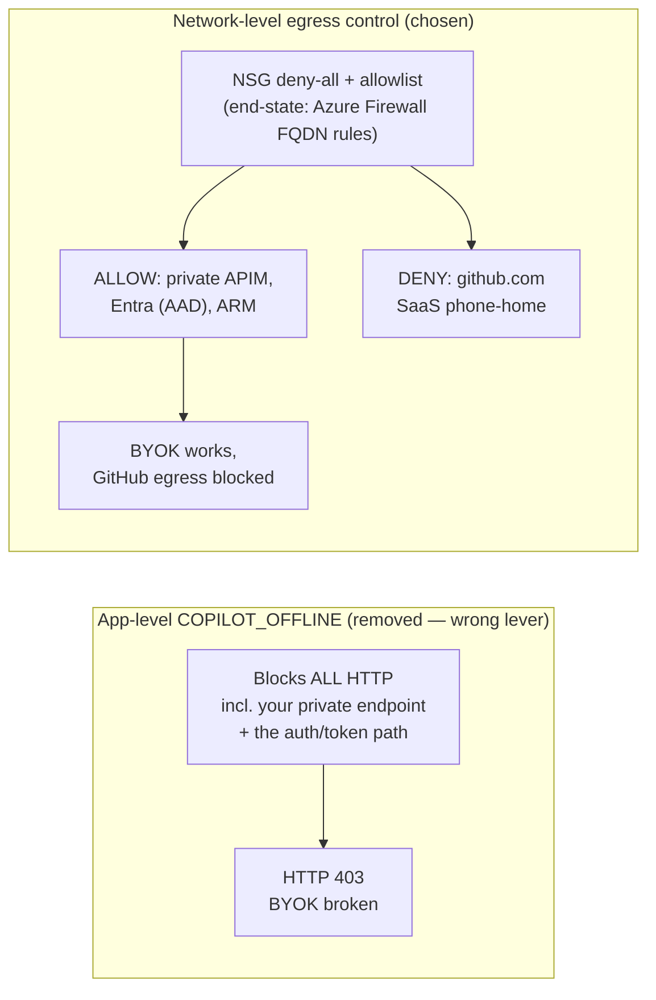

# GitHub egress allowlist (corporate proxy / Azure Firewall)

> **Empirically verified (Gov test VM, 2026-06-01):** with BYOK, the Copilot CLI does
> **NOT** require GitHub login or an active Copilot subscription at runtime. A clean-room
> VM with no `.copilot` config, no `GH_TOKEN`/`GITHUB_TOKEN`, and only the four
> `COPILOT_PROVIDER_*` vars set ran `copilot -p "..."` successfully end-to-end (exit 0,
> real token usage through the private APIM → AOAI). So `github.com` / `api.github.com`
> egress is **not** needed for the BYOK inference path. GitHub egress only matters for:
> 1. **Installation** — `npm i -g @github/copilot` pulls from `registry.npmjs.org` (a CDN),
>    NOT github.com; Node itself comes from `nodejs.org`. So even install mostly needs the
>    npm/nodejs CDNs, not github.com directly.
> 2. **Optional** update checks / telemetry / Actions integration if you leave them on.
>
> Bottom line: a fully-private BYOK runtime can run with GitHub egress **denied**. The lists
> below are kept for environments that want install-time reachability or that run the CLI in
> non-BYOK mode.

## Why not `COPILOT_OFFLINE`? (enforce privacy at the network, not the app)

A tempting shortcut to "stop the CLI from talking to GitHub" is an app-level offline switch.
The CLI historically honored an **undocumented `COPILOT_OFFLINE`** env var (it is **not** in
the public GitHub Copilot CLI docs), and this repo's wrapper scripts briefly set it. **We
removed it** — it is the wrong lever, and it actively breaks BYOK.

`COPILOT_OFFLINE` is a **blunt, process-wide kill switch for *all* outbound HTTP**. It is not
selective: it cannot tell your **private model endpoint** apart from GitHub's SaaS phone-home,
so it blocks both — including the **auth/token path** the CLI still runs to mint the credential
it presents to the gateway.

**Symptom when it was on: `HTTP 403` against the private APIM, not a timeout.** A 403
(`Forbidden`) rather than a connection error is the tell — the request *did* leave the box but
arrived **without a valid credential**, because offline mode suppressed the identity/token
acquisition. APIM's `validate-jwt` / subscription-key check then rejected the unauthenticated
call. So offline mode doesn't just block GitHub chatter; it breaks the one path BYOK depends on.

The correct control is **network-layer egress filtering**, which *is* selective: it keeps the
private APIM / model / AAD / ARM paths open while denying GitHub SaaS. That is exactly the
`deployNatGateway` + `restrictVmEgress` allowlist below (and the desired-end-state Azure
Firewall FQDN rules). It is strictly better than an app-level flag because it is
**allow-list-driven rather than all-or-nothing**.



> Empirically (Gov test VM, 2026-06-01): with GitHub egress **denied at the NSG** but the
> private paths allowed, `copilot -p "..."` ran end-to-end (exit 0, real token usage). The
> CLI's GitHub phone-home is best-effort, not a hard dependency for inference — so you get the
> privacy guarantee *without* sacrificing the model path that `COPILOT_OFFLINE` would have killed.

> **Observed launch behavior (2026-06-02): a non-fatal `api.github.com:443` timeout.** When
> GitHub egress is denied at the NSG, launching `copilot` logs a startup error like
> `api.github.com:443 time out 10000ms` **and then responds to chat prompts normally**. This
> is the expected, healthy state: the NSG **silently drops** (blackholes) the entitlement
> phone-home rather than sending a TCP reset, so the client waits out its ~10 s connect
> timeout, logs the line, and **degrades gracefully** — inference still flows to the private
> `COPILOT_PROVIDER_BASE_URL` (APIM → model), which never touches GitHub. The timeout is
> **cosmetic, not functional**, and is in fact the cleanest proof that `api.github.com` is
> best-effort. The only side effect is a ~10 s startup delay on each launch (the cost of a
> *dropped* vs *reset* connection). To make it fail fast instead, a firewall/proxy in path
> would need to `reject` the connection (return RST); an NSG alone cannot, so under NSG
> deny-all the delay is unavoidable but harmless.

## VS Code 1.122+ Copilot Chat: there is no `COPILOT_OFFLINE` equivalent

The VS Code Custom Endpoint provider is the **chat-only** counterpart to the CLI's
`COPILOT_PROVIDER_*` env vars. Microsoft never shipped a single master kill switch for it,
and an env-var like `COPILOT_OFFLINE` does not exist for VS Code. VS Code Copilot is a
multi-service client — chat, inline completions, model catalog, telemetry, auth, marketplace
updates — and the controls Microsoft does expose are **per-feature settings**, not one
process-wide switch. Like the CLI, the **real privacy guarantee comes from network-layer
egress filtering** (the same `restrictVmEgress` allowlist below); the VS Code settings are
honor-system, the firewall is enforcement.

The two surfaces in one table:

| Concern | CLI (we use) | VS Code 1.122+ |
|---|---|---|
| **Master "offline" env var** | `COPILOT_OFFLINE` existed (undocumented) but **broke BYOK**, see above — removed | **Does not exist.** No single env var or VS Code setting silences everything. |
| **Redirect inference path to BYOK gateway** | `COPILOT_PROVIDER_BASE_URL` + 3 friends | `chat.languageModels.providers` (`samples/vscode/`) — covers **chat only**, NOT inline completions |
| **MS engine telemetry** | n/a (CLI has no MS telemetry of its own) | `"telemetry.telemetryLevel": "off"` — also silences all VS Code extensions |
| **Ghost-text / inline completions** (still hits public GitHub Copilot proxy even after Custom Endpoint is set!) | n/a (CLI is chat-only) | `"github.copilot.enable": { "*": false }` (or status-bar "Disable Completions") |
| **"Allow my code for product improvements"** | n/a | Org admin policy on github.com (Off by default for Business/Enterprise) |
| **"Block public-code matches"** | n/a | Org admin policy on github.com |
| **Marketplace auto-update** | n/a | `"extensions.autoUpdate": false` + `"extensions.autoCheckUpdates": false` |

A minimal "BYOK-only mode" `settings.json` for VS Code:

```jsonc
{
  // Kill MS engine + all extension telemetry.
  "telemetry.telemetryLevel": "off",

  // Custom Endpoint only covers CHAT. Inline completions still hit
  // the public Copilot proxy unless you turn them off explicitly.
  "github.copilot.enable": { "*": false },

  // Don't churn against the marketplace if egress is locked anyway.
  "extensions.autoUpdate": false,
  "extensions.autoCheckUpdates": false
}
```

### Why the same network-layer argument still wins for VS Code

The CLI argument above ("blunt app-level switch vs selective NSG allowlist") applies even
more strongly to VS Code, because the Custom Endpoint provider **only redirects chat /
responses**. With Custom Endpoint configured, VS Code still wants to call:

| Host (VS Code, default config) | What it's for | Behavior under our `restrictVmEgress` deny-all |
|---|---|---|
| `*.individual.githubcopilot.com` / `*.business.githubcopilot.com` | Inline completions (separate from chat) | Blocked → completions silently disabled (status bar shows error) |
| `api.github.com` | Catalog refresh, entitlement, telemetry | Blocked → ~10 s connect timeout on first call, then cached catalog is used |
| `vortex.data.microsoft.com` | Engine telemetry | Blocked → telemetry batches dropped |
| `marketplace.visualstudio.com` | Extension manifest / update check | Blocked → extensions stop auto-updating until on an unrestricted network |
| **`<your-apim>.azure-api.us`** (Gov) / **`<your-apim>.azure-api.net`** (Commercial) | **Chat / Responses via Custom Endpoint** | **Allowed** (private FQDN, resolves to APIM PE inside VNet) |

That last row is the entire point: with the NSG allowlist, **only** the BYOK gateway is
reachable; everything else fails closed. This is the same posture as the CLI's `restrictVmEgress`
+ NAT-gateway pattern — *one allowed path through APIM, all other Copilot-adjacent
hostnames blocked by default*. The settings in the table above are defense-in-depth on the
client side; the NSG is the actual control.

> **Verified gracefully-degrading behavior (Gov test VM, 2026-06):** with `restrictVmEgress`
> on and only the GitHub/npm/nodejs/ARM/AAD service tags + the APIM private FQDN in the
> allowlist, VS Code Copilot Chat using Custom Endpoint **works for chat** (inference flows
> through APIM → AOAI), the **inline completions feature is dark** (which is the desired
> outcome — they would have phoned home to GitHub SaaS), and **telemetry batches silently
> drop**. No user-visible auth errors, no broken chat, no phone-home.

### Anti-pattern: don't try to allow GitHub Copilot's SaaS proxy "just in case"

A natural temptation is to add `*.githubcopilot.com` / `copilot-proxy.githubusercontent.com`
to the allowlist so inline completions work "as a fallback". **Don't** — that defeats the
entire privacy guarantee. Either:
- Run VS Code in **chat-only BYOK mode** (settings above, inline completions off), OR
- Allow GitHub SaaS for completions and accept that completions are NOT BYOK (they bypass
  your APIM and send code suggestions through GitHub's proxy with default GHCP policy).

Pick one. Don't mix.

## Inverse pattern: open internet + deny-list the Copilot phone-home

Most customers don't run with `restrictVmEgress`-style deny-all egress. They have **open
internet** for `git`/`gh`/`npm`/`pip`/`apt`/`dependabot`/web browsing/etc., and just want
to make sure that — even though the Copilot CLI and VS Code Copilot Chat *could* phone
home to GitHub SaaS — they don't. This is the symmetric complement to the allowlist
pattern above: instead of *blocking everything and allowing the BYOK gateway*, you
*allow everything and deny just the Copilot SaaS surfaces*. Same end result for BYOK
(all inference flows through your private APIM → model), but it preserves normal
internet access for everything that isn't Copilot.

This is the right control for an **Azure Firewall** (FQDN application rules) or any
FQDN-aware corporate secure-web-gateway (Zscaler, Netskope, Palo Alto, Forcepoint).
**NSGs cannot do this** — they're IP-based, and these targets are all CDN-fronted
shared addresses.

### Deny list

Block **outbound HTTPS 443** to exactly these FQDNs:

| FQDN | Category | What breaks when blocked | Safe to block? |
|---|---|---|---|
| `*.individual.githubcopilot.com` | Inline completions (consumer plan) | VS Code / JetBrains ghost-text disabled; status bar shows error | ✅ Desired |
| `*.business.githubcopilot.com` | Inline completions (Business plan) | Same | ✅ Desired |
| `*.enterprise.githubcopilot.com` | Inline completions (Enterprise plan) | Same | ✅ Desired |
| `proxy.individual.githubcopilot.com` / `proxy.business.githubcopilot.com` / `proxy.enterprise.githubcopilot.com` | Per-tier completion proxy | Same | ✅ Desired |
| `copilot-proxy.githubusercontent.com` | Copilot Chat SaaS proxy (used when Custom Endpoint is **not** configured) | Chat falls through to whatever provider is set (your BYOK gateway). If neither is configured, chat is dark. | ✅ Desired — this is the whole point |
| `origin-tracker.githubusercontent.com` | Copilot origin / "public-code matches" telemetry | The "block matches to public code" check is skipped client-side (harmless if your org policy already disables it server-side) | ✅ Desired |
| `telemetry.individual.githubcopilot.com` / `telemetry.business.githubcopilot.com` | Explicit Copilot client telemetry | Copilot client telemetry batches dropped silently | ✅ Desired |
| `default.exp-tas.com` | Microsoft Treatment Assignment Service (Copilot A/B feature flag overrides) | Copilot won't get experiment overrides; purely cosmetic | ✅ Desired |
| `vortex.data.microsoft.com` | VS Code engine-wide telemetry (the whole IDE, not just Copilot) | All VS Code + extension telemetry dropped | ✅ Desired (pair with `telemetry.telemetryLevel=off` so the client also stops generating events) |

### Do NOT block — these are shared, normal-GitHub traffic

| FQDN | Why you must keep it open |
|---|---|
| `api.github.com` | Used by `git` / `gh` CLI / dependabot / GHAS / repo automation. **Also** used by Copilot for entitlement (best-effort, BYOK doesn't need it). Blocking it breaks all of GitHub. |
| `github.com` | Web UI, git over HTTPS, OAuth login |
| `objects.githubusercontent.com` | Release assets, raw file content (Copilot is NOT served from here) |
| `raw.githubusercontent.com` | Raw repo file fetches |
| `codeload.github.com` | Tarball / zipball downloads |
| `gist.githubusercontent.com` | Gist content |

### The `api.github.com` caveat (shared subdomain)

GitHub did **not** separate Copilot entitlement onto its own subdomain — entitlement
goes to `api.github.com/copilot_internal/v2/token` and
`api.github.com/copilot_internal/user`. Three ways to handle it:

| Option | Where | Cost | Recommended? |
|---|---|---|---|
| **1. Tolerate it.** Let entitlement calls succeed. They mint a short-lived JWT for the user — **no source code leaves on these calls**. BYOK still works without them. | Anywhere | Zero | ✅ Default choice. The Copilot SaaS *inference* path is already blocked via `*.githubcopilot.com`. Entitlement is auth, not telemetry. |
| **2. L7 path-block at a real proxy.** Zscaler / Netskope / Palo Alto / Forcepoint can deny `api.github.com/copilot_internal/*` while allowing all other `api.github.com` paths. | Existing SWG | Low if SWG is already in path | ✅ If you already run TLS-inspecting SWG |
| **3. TLS-intercepting reverse proxy** in front of `api.github.com` doing path-based block. | New infra | High (cert pinning breaks `gh` CLI; lots of operational drag) | ❌ Not worth it |

**Azure Firewall cannot do path-level matching on FQDN rules.** Its application rules
are FQDN-only. So if AzFW is your only egress control, **option 1 is the only choice**
— which is fine, because entitlement is auth and `*.githubcopilot.com` block already
covers everything that carries code.

### Defense in depth: deny on the wire + off on the client

Network deny stops the bytes at the firewall. The client will still *try* on every
keystroke / startup and rack up failed-connection log noise. Pair the firewall rule
with the VS Code settings from the previous section:

```jsonc
{
  "github.copilot.enable": { "*": false },     // stops the inline-completion client from even trying
  "telemetry.telemetryLevel": "off"            // stops the VS Code engine telemetry client
}
```

CLI side stays exactly the same as the allowlist pattern — env vars point at the BYOK
gateway, `COPILOT_OFFLINE` intentionally **not** set (see top of this file).

### Azure Firewall application-rule snippet

A DENY rule collection at higher priority (lower number) than your blanket ALLOW rules:

```jsonc
// Higher-priority DENY: copilot phone-home
{
  "name": "deny-copilot-phonehome",
  "priority": 100,
  "action": { "type": "Deny" },
  "rules": [{
    "name": "copilot-saas-and-telemetry",
    "protocols": [{ "protocolType": "Https", "port": 443 }],
    "sourceAddresses": ["<your subnet CIDRs>"],
    "targetFqdns": [
      "*.individual.githubcopilot.com",
      "*.business.githubcopilot.com",
      "*.enterprise.githubcopilot.com",
      "copilot-proxy.githubusercontent.com",
      "origin-tracker.githubusercontent.com",
      "default.exp-tas.com",
      "vortex.data.microsoft.com"
    ]
  }]
}
// Lower-priority ALLOW: existing rules continue to allow github.com,
// api.github.com, marketplace.visualstudio.com, npm/pypi/etc.
```

### Quick verification (laptop or test VM behind the firewall)

```pwsh
$blocked = @(
  'proxy.individual.githubcopilot.com',
  'copilot-proxy.githubusercontent.com',
  'origin-tracker.githubusercontent.com',
  'default.exp-tas.com',
  'vortex.data.microsoft.com'
)
$allowed = @(
  'api.github.com',
  'github.com',
  'raw.githubusercontent.com'
)
"=== Should FAIL (blocked) ==="
foreach ($h in $blocked) {
  $r = Test-NetConnection -ComputerName $h -Port 443 -InformationLevel Quiet -WarningAction SilentlyContinue
  '{0,-50} {1}' -f $h, ($(if($r){'!!! UNEXPECTED OK !!!'}else{'BLOCKED (good)'}))
}
"=== Should SUCCEED (open) ==="
foreach ($h in $allowed) {
  $r = Test-NetConnection -ComputerName $h -Port 443 -InformationLevel Quiet -WarningAction SilentlyContinue
  '{0,-50} {1}' -f $h, ($(if($r){'OK'}else{'!!! UNEXPECTED BLOCKED !!!'}))
}
```

Then validate BYOK end-to-end: `copilot -p "say hi"` against your gateway, and VS Code
Copilot Chat against the Custom Endpoint. Both should work; Copilot inline completions
should be dark.

## What this repo now implements (opt-in, test-VM subnet)

NSG rules are **IP / service-tag based and cannot match FQDNs**. There is no Azure service
tag for GitHub, npm, or nodejs, so an NSG allowlist for them means hardcoding CDN CIDR
ranges that drift over time. True FQDN allowlisting needs **Azure Firewall** (application
rules). To start small and *observe what is actually required*, `infra/modules/network.bicep`
adds two opt-in params (default `false`, so existing deployments are unchanged):

| Param | Effect |
|---|---|
| `deployNatGateway` | NAT Gateway + static PIP on `snet-vm` → deterministic egress SNAT IP (replaces the **deprecated** Azure default-outbound the VM otherwise silently relies on). |
| `restrictVmEgress` | Egress-allowlist NSG on `snet-vm`: allow only GitHub / npm+nodejs CDN CIDRs / `AzureResourceManager` / `AzureActiveDirectory` on 443 + intra-VNet, then **deny all other internet egress**. |

The Azure platform channel (`168.63.129.16`: DNS, IMDS, guest agent / `az vm run-command`)
is **not** subject to NSG egress rules, so management stays reachable even under deny-all —
which is what makes this safe to use as a discovery tool.

CIDR lists live in the `githubEgressCidrs` and `npmNodeEgressCidrs` module params. When a
CLI action fails under deny-all, the missing destination shows up in NSG flow logs and tells
you exactly what to add.

### CIDR-tightening decision (2026-06-01) — what we chose and why

The first cut of `npmNodeEgressCidrs` used the **published Cloudflare + Fastly ranges**
(`104.16.0.0/13`, `172.64.0.0/13`, `151.101.0.0/16`, etc.). Those work, but they are huge
(millions of addresses) and shared by countless unrelated sites. We confirmed the problem
with a **negative control**: under the deny-all NSG, `example.com` and `api.ipify.org` were
*still reachable* because they too are Cloudflare-fronted and fell inside `104.16.0.0/13`.

We then resolved the targets from inside the VNet (`Resolve-DnsName` on the test VM) and
mapped each A record to its enclosing `/20`:

| Host | Observed A records (2026-06-01) | Enclosing prefix |
|---|---|---|
| `registry.npmjs.org` | `104.16.0–11.x` | `104.16.0.0/20` |
| `nodejs.org` | `104.16.212–213.x` | `104.16.208.0/20` |
| `example.com` (neg) | `104.20.23.154`, `172.66.147.243` | `104.20.x` / `172.66.x` — **excluded** |
| `api.ipify.org` (neg) | `104.26.x`, `172.67.x` | **excluded** |

So `npmNodeEgressCidrs` is now just the **two `/20`s** that currently serve npm + nodejs:

```bicep
param npmNodeEgressCidrs array = [
  '104.16.0.0/20'   // registry.npmjs.org
  '104.16.208.0/20' // nodejs.org
]
```

**Verified result** after re-provision: `nodejs.org`, `registry.npmjs.org`, `github.com`,
`api.github.com`, `raw.githubusercontent.com` → `HTTP 200`; `example.com` and
`api.ipify.org` (negative controls) → **timeout / blocked**. The allowlist is now tight
enough to pass the negative-control test.

### Known limitation & desired end-state

These two `/20`s are still **Cloudflare-owned shared infrastructure**, and Cloudflare can
re-map the npm/node zones to different prefixes at any time — so this list **will drift** and
must be re-verified by re-resolving the hostnames. IP-based NSG egress can *never* be a true
hostname allowlist.

**Desired end-state:** replace the `npmNodeEgressCidrs` / `githubEgressCidrs` NSG rules with
**Azure Firewall application rules** that allow `registry.npmjs.org`, `nodejs.org`,
`*.githubusercontent.com`, etc. by **FQDN**. That removes the drift problem entirely and is
the correct control for production subnets. The current NSG approach is intentionally kept as
a low-cost discovery tool for the test-VM subnet only.

### Incident (2026-06-24): `restrictRunnerEgress` NSG breaks the GitHub-Actions runner — DISABLED

We tried to apply the same NSG egress-allowlist (`restrictRunnerEgress=true`) to the
**self-hosted GitHub Actions runner** subnet (`snet-runner`). **It took comm-pilot CI fully
offline** and must not be re-enabled until Azure Firewall FQDN rules exist.

- **Symptom 1:** `azd deploy register` failed mid-deploy with
  `ClientAssertionCredential: fetching federated token ... Get "https://run-actions-1-azure-eastus.actions.githubusercontent.com/.../idtoken/...": dial tcp 20.85.130.105:443: i/o timeout`.
- **Symptom 2:** a fresh ephemeral runner job stayed **queued for 5+ minutes and never came
  online** — the runner agent couldn't reach the Actions broker to register.
- **Root cause:** the GitHub **Actions control plane** (OIDC token endpoint + runner broker,
  `*.actions.githubusercontent.com`) lives in **vast, constantly-drifting Azure IP space**
  (hundreds of `20.x` / `52.x` / `57.x` /16–/17 CIDRs in `api.github.com/meta` → `actions`),
  which is **NOT** the small `githubEgressCidrs` core list. NSG IP-allowlisting **cannot**
  express this destination. (`azd auth login` earlier in the deploy succeeds only because the
  NSG isn't live yet; the next federated-token fetch hits the just-applied deny.)
- **Recovery:** disassociated the runner NSG from `snet-runner` out-of-band via local `az`
  (`az network vnet subnet update -g <rg> --vnet-name <vnet> -n snet-runner --remove networkSecurityGroup`),
  which restored NAT-gateway egress; the next runner came online immediately.
- **Decision:** `restrictRunnerEgress` is set to **`false`** in both pilots'
  `main.parameters.ci.*.json`. The durable win — `useAcrRunnerImage=true` (pre-baked ACR
  runner image, issue #94) — is **kept**: it removes runtime tool-install egress without
  touching the Actions control-plane path. A real runner lockdown requires **Azure Firewall
  FQDN rules** for `*.actions.githubusercontent.com` (+ the lists above), tracked separately.

### Prototype: Azure Firewall for runner egress (`deployRunnerFirewall`, ships dormant)

The correct egress control for the runner is an **Azure Firewall** with **FQDN application
rules** — the L7 primitive that *can* express `*.actions.githubusercontent.com` and friends,
which an L4 NSG cannot. This is prototyped in [infra/modules/firewall.bicep](../infra/modules/firewall.bicep)
and wired behind `deployRunnerFirewall` (default **`false`** — it has a real fixed cost and
must not turn on silently). When enabled it:

- adds `AzureFirewallSubnet` + `AzureFirewallManagementSubnet` (`/26` each, at `<base>.7.0/26`
  and `<base>.8.0/26`),
- creates a firewall policy whose application rule collection allowlists the GitHub Actions
  control plane + the Azure control plane the deploy workflow drives (see the module for the
  exact FQDN list; extend per-env via `runnerFirewallAdditionalFqdns`),
- attaches a route table to `snet-runner` sending `0.0.0.0/0` → the firewall private IP, and
  **drops the NAT gateway** from `snet-runner` (the firewall SNATs via its own public IP).

The route table targets the **deterministic** firewall private IP (`cidrHost(AzureFirewallSubnet, 3)`
= subnet base + 4, the address Azure Firewall always takes) so the UDR has *no dependency* on
the firewall resource — that is what breaks the otherwise-circular VNet⟷routeTable⟷firewall ref.

#### Pricing (retail, pulled 2026-06-24 via the Azure Retail Prices API)

Two charges per firewall: a fixed **deployment $/hour** + a **$/GB data-processed** meter.
Monthly fixed = hourly × 730. CI runner egress is tens of GB/mo, so data-processed is a few
dollars — the cost is essentially the fixed deployment charge.

| Tier | Commercial (eastus2) | Gov (usgovvirginia) |
|---|---|---|
| **Basic** | $0.395/hr → **~$288/mo** + $0.065/GB | $0.494/hr → **~$361/mo** + $0.0812/GB |
| **Standard** | $1.25/hr → **~$913/mo** + $0.016/GB | $1.5625/hr → **~$1,141/mo** + $0.02/GB |
| **Premium** | $1.75/hr → **~$1,278/mo** + $0.016/GB | $2.187/hr → **~$1,597/mo** + $0.02/GB |

**comm-pilot and gov-pilot are isolated clouds — a firewall cannot span them, so a full
rollout needs ONE PER PILOT (additive):**

| Tier (both pilots) | Combined fixed $/mo | ≈ $/yr |
|---|---|---|
| **Basic** | $288 + $361 = **~$649/mo** | **~$7.8k/yr** |
| **Standard** | $913 + $1,141 = **~$2,054/mo** | **~$24.6k/yr** |
| **Premium** | $1,278 + $1,597 = **~$2,875/mo** | **~$34.5k/yr** |

**Tier choice:** **Basic** is the cheapest tier that supports FQDN application rules and is
sufficient here (CI throughput ≪ 250 Mbps). It is the prototype default. Note Basic
**mandates** the management subnet + a second public IP (both auto-provisioned). Standard
adds throughput/threat-intel at ~3× the cost; Premium (TLS inspection/IDPS) is overkill.

#### Enable (per pilot)

In the target pilot's `infra/main.parameters.ci.<cloud>.json` (keep `restrictRunnerEgress` =
`false` — the firewall replaces the NSG, don't stack them):

```jsonc
"deployGhRunner":        { "value": true },
"deployRunnerFirewall":  { "value": true },
"runnerFirewallTier":    { "value": "Basic" }
```

Then `azd provision` (or dispatch the deploy workflow). The FQDN allowlist in the module is a
**validated starting point, not exhaustive** — watch the firewall's `AzureFirewallApplicationRule`
logs for denies on first runs and add any missing endpoints via `runnerFirewallAdditionalFqdns`.

### Enable on the test VM

Set these in your active `infra/main.parameters.json` (they default to `false`):

```jsonc
"deployTestVm":     { "value": true },
"deployNatGateway": { "value": true },
"restrictVmEgress": { "value": true },
```

then `azd provision`.

> Pair `restrictVmEgress` with `deployNatGateway`: under deny-all-internet the allowed
> traffic still needs an egress path, and default-outbound is retired.

## AI tooling (MCP servers) egress

The Copilot CLI and VS Code agent mode can attach **MCP servers** for tools. That traffic is a
**separate plane** from the model path (see
[architecture.md → AI tooling (MCP servers)](architecture.md#ai-tooling-mcp-servers-in-the-byok-landscape))
and lands on egress as its own decision — independent of whether BYOK inference works.

| MCP posture | Egress target | Under deny-all `restrictVmEgress` | Recommendation |
|---|---|---|---|
| **Local (stdio)** server | none (child process) — *unless the tool itself calls out* | unaffected for the transport; the tool's own egress follows the normal allowlist | Allowed; audit which local servers are permitted |
| **Remote / hosted**, e.g. GitHub's `https://api.githubcopilot.com/mcp/` (shipped in [`.vscode/mcp.json`](../.vscode/mcp.json)) | `api.githubcopilot.com` (HTTPS 443) | **Blocked** — `api.githubcopilot.com` matches the `*.githubcopilot.com` deny rule above | **Decide explicitly.** Deny for a no-public-tool posture, or allow `api.githubcopilot.com` *and accept that those tool calls leave your network* |
| **Gateway-governed** via APIM (MCP broker, `#79`) | `<your-apim>.azure-api.us/.net` (private FQDN) | **Allowed** (private FQDN → APIM PE in-VNet) | Preferred for governed tools — same auth/quota/telemetry as the model path |
| **Private in-VNet** customer-hosted MCP (`#80`) | in-VNet Private Endpoint | **Allowed** (never leaves the VNet) | Preferred for tools that must not touch the internet |

> **Watch the overlap with the deny-list.** `api.githubcopilot.com` is the **same host** used
> for Copilot **entitlement** and, with the wildcard deny `*.githubcopilot.com`, is blocked by
> the privacy posture above. The remote GitHub MCP server therefore inherits that block: if you
> want GitHub's hosted MCP tools, you must **carve `api.githubcopilot.com` out of the deny rule**
> (and accept the tool traffic leaving your network) — there is no path-level split between
> entitlement and MCP on that host for FQDN-only firewalls. For a fully-private posture, prefer
> the **gateway-governed** or **in-VNet** MCP postures instead.

## Corporate-network / Azure Firewall FQDN allowlist (workstations)

For developer workstations or an Azure Firewall (FQDN application rules), allow these
outbound (HTTPS 443):

| FQDN | Purpose |
|---|---|
| `api.github.com` | Entitlement + API |
| `github.com` | Login + entitlement redirect |
| `objects.githubusercontent.com` | Static assets |
| `copilot-proxy.githubusercontent.com` | Copilot service proxy (used for non-BYOK; harmless when reachable) |
| `api.githubcopilot.com` | Copilot service API (entitlement) |
| `vscode-auth.github.com` | Auth callback (if devs sign in via VS Code) |
| `default.exp-tas.com` | Treatment Assignment Service (feature flags) |
| `*.actions.githubusercontent.com` | Optional, used if Actions integration is on |
| `update.code.visualstudio.com` | VS Code updates (helpful, not required) |

For Azure Firewall: create an Application Rule Collection with the above as
target FQDNs, source = the AzureVPN client pool (or your corporate proxy egress
range), protocol HTTPS:443.

## Verification

```pwsh
foreach ($h in 'api.github.com','github.com','api.githubcopilot.com') {
  $r = Test-NetConnection -ComputerName $h -Port 443
  '{0,-40} {1}' -f $h, ($(if($r.TcpTestSucceeded){'OK'}else{'BLOCKED'}))
}
```

## Notes

- This list is **outside** Bicep — it's a corporate-network change.
- We do not allow-list `*.openai.azure.com` / `*.openai.azure.us` outbound.
  AOAI traffic stays inside the VNet; the laptop reaches AOAI **only** via
  APIM at its private FQDN.
