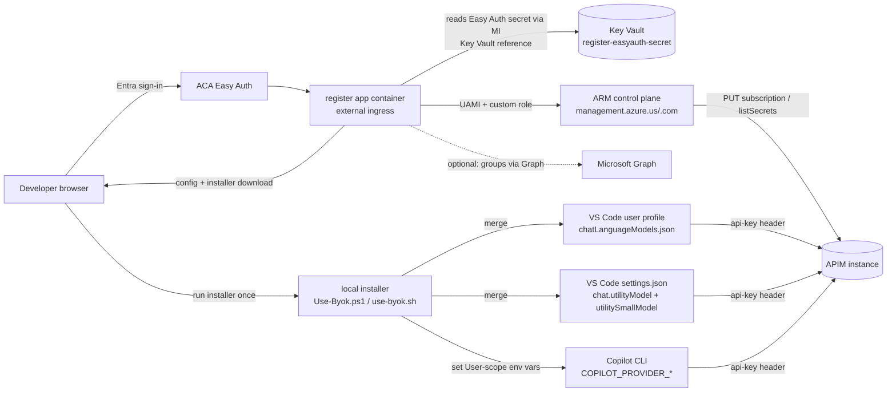

# Implementation plan — Self-serve developer onboarding ("register app")

> Tracks parent issue **#64** and sub-issues **#65–#72**. This document fixes the
> technology choices and the concrete implementation details for each sub-issue, the
> repo layout, the Bicep wiring, the per-cloud (Commercial/Government) parameterization,
> the security model, and the delivery sequence. It is the single source of truth the
> implementation PRs build against.

---

## 1. Goal (recap)

Take a developer from zero to a working BYOK setup with **one sign-in and one click**:

1. Developer opens the app, **signs in with Entra ID** (Easy Auth).
2. App validates the token, derives identity (`oid` / `upn`), and **idempotently
   provisions their own per-user APIM subscription** scoped to a product tier
   (`byok-standard`, or `byok-power` by group membership).
3. App returns the subscription **primary key** (show-once + regenerate).
4. App **generates the developer's config** pre-filled with the APIM host + the developer's
   key and hands it over via a tiny local installer that wires up **both clients**: it merges
   `chatLanguageModels.json` **and** the utility-model `settings.json` for **VS Code**, and
   sets the `COPILOT_PROVIDER_*` **User-scope** environment variables for the **Copilot CLI**.

End state: `VS Code → DNS → APIM → policy → MI → backend` is fully wired after one
sign-in and one button click — no admin tickets, no hand-edited JSON.

---

## 2. Architecture



Key property (from #64/#68): the app talks **only to the ARM management plane** (a public
control-plane endpoint). It never touches the **private APIM data-plane gateway**, so it
needs **no VNet injection** and is unaffected by the internal-ingress L7 routing bug
documented for VNet-injected ACA (see user memory `aca-internal-l7-bug`). The browser
never touches ARM — only the backend (with its managed identity) does.

**Easy Auth secret lives in Key Vault.** When the register stack is deployed
(`deployRegisterApp=true`) a dedicated **RBAC Key Vault** ([register-kv.bicep](../infra/modules/register-kv.bicep))
holds the app registration's client secret (`register-easyauth-secret`). The
[setup-register-entra](../scripts/setup-register-entra.ps1) script mints the secret and writes
it there; the Container App reads it at runtime through a **managed-identity Key Vault
reference** (register UAMI → *Key Vault Secrets User*), so the secret never flows through a
Bicep parameter or azd state. The vault is register-only today but is positioned as a
platform-wide secret store for future needs.

**One installer, three local artifacts.** The downloaded installer (`Use-Byok.ps1` /
`use-byok.sh`) wires up *both* clients in a single run: it merges the VS Code
**`chatLanguageModels.json`** (provider + models), merges the VS Code **`settings.json`**
utility-model pair (`chat.utilityModel` / `chat.utilitySmallModel` → BYOK `gpt-4.1-mini`)
**and the telemetry/call-home lockdown block** (editor chatter + inline-completion call-home
off), and sets the **Copilot CLI** `COPILOT_PROVIDER_*` environment variables in the
**developer's User scope** (per-dev, HKCU / shell profile — never machine-wide, so keys are
never shared between devs on a multi-user host). All three surfaces carry the same
per-developer key to APIM. The CLI is **never** put in `COPILOT_OFFLINE` mode (it breaks
BYOK); privacy is enforced at the network layer (see
[github-egress-allowlist.md](github-egress-allowlist.md)).

---

## 3. Technology choices

| Concern | Choice | Why |
|---|---|---|
| **App (UI + API in one)** | **.NET 8 Blazor Web App, `InteractiveServer` render mode** | One project, one container, one Easy Auth front. The "fancy" interactive UI the team wants, while **all** privileged work (UAMI, ARM provision, `listSecrets`, the key itself) stays **server-side** in the Blazor circuit — the key is only streamed to the rendered component over the already-TLS'd SignalR connection, never shipped as a downloadable bundle or exposed to client JS. Minimal-API endpoints (`/api/config`, `/api/installer`) are mapped in the same host for the file downloads. |
| **ARM/gov support** | `Azure.ResourceManager` + `Azure.Identity` | First-class gov-cloud support (`ArmEnvironment.AzureGovernment`, `AzureAuthorityHosts.AzureGovernment`). Strong typing for the subscription `PUT`/`listSecrets` shapes. |
| **Clipboard / show-once** | Blazor **JS interop** (`navigator.clipboard.writeText`) | Copy-to-clipboard button on the show-once key; trivial one-line interop, no SPA framework. |
| **ARM access** | `Azure.ResourceManager.ApiManagement` + raw `armClient` generic resource calls for `listSecrets` | `listSecrets` is an action; use `GenericResource`/`ArmClient.GetGenericResource(...).Post(...)` or a typed `SubscriptionContractResource.GetSecrets()` where available. |
| **Identity at runtime** | **User-assigned managed identity** (#66) via `ManagedIdentityCredential` (client-id pinned) | UAMI can be created before the app and granted the custom role; pinning the client id avoids ambiguity when multiple identities are present. |
| **Sign-in** | **ACA Easy Auth** (`containerApps/authConfigs`) + independent in-app JWT validation | Platform rejects unauthenticated requests before app code; app re-validates audience/issuer as defense-in-depth. |
| **Hosting** | **Azure Container Apps**, external ingress, no VNet injection (#68) | Matches existing runner infra; control-plane-only means no private networking. |
| **Config delivery** | **Download + one-shot local installer** (`Use-Byok.ps1` / `use-byok.sh`) — option (a) | **A web app — Blazor Server _or_ WASM — cannot write to `%APPDATA%\Code\User\`.** That path is outside the browser sandbox; "client-hosted" Blazor (WASM) is *more* sandboxed, not less. The only browser-native write is a Downloads-folder download or the Chromium File System Access API (user manually picks a folder each time, can't silently target `%APPDATA%`, often blocked on managed gov browsers). So the **local installer script is required regardless of UI tech** — Blazor only changes the UI, not the disk-write capability. The installer merges our provider block into the VS Code user path. Intune/GPO unattended path (b) documented for managed fleets. |
| **IaC** | **Bicep**, new modules under `infra/modules/`, wired into `infra/main.bicep`, deployed by **azd** as a new `services:` entry in `azure.yaml` | Matches the entire repo. |
| **CI build** | Container image built + pushed by azd (`az acr build` / azd container packaging) | No new pipeline tech; reuse existing azd flow. |

> **Hosting note for Blazor Server:** `InteractiveServer` needs a persistent SignalR
> WebSocket. ACA external ingress supports WebSockets, and Easy Auth completes before the
> SignalR upgrade, so the pattern works behind Easy Auth on ACA. If WebSocket affinity ever
> becomes a concern at fleet scale, the same project can be switched to `InteractiveAuto` /
> WASM with the privileged logic moved behind the `/api/*` minimal-API endpoints (which exist
> anyway for the downloads) — no architectural change.
>
> Alternative considered: Node/TypeScript + static JS. Equally viable and gov-capable;
> rejected to keep one language, lean on the strongest typed ARM SDK, and get the richer UI
> the team asked for from Blazor.

---

## 4. Repository layout (new)

```
app/
  register/
    src/
      Program.cs                 # Blazor Web App host + Easy Auth + minimal-API download endpoints
      Components/
        App.razor / Routes.razor
        Pages/Register.razor       # sign-in state, register button, show-once key + copy, downloads
        Layout/MainLayout.razor
      Endpoints/
        ConfigEndpoints.cs         # GET /api/config (rendered chatLanguageModels.json), GET /api/installer
      Services/
        IdentityContext.cs         # parse Easy Auth principal + validate JWT (oid/upn/groups)
        ApimProvisioner.cs         # idempotent ARM PUT subscription + listSecrets + regenerate/delete
        TierResolver.cs            # group object id -> product mapping (groups claim or Graph)
        ConfigRenderer.cs          # render VS Code chatLanguageModels.json + settings.json utility-model pair + CLI env-var map from host+key
      wwwroot/                     # static assets (css, js interop for clipboard)
      appsettings.json             # non-secret config (apim name, TierMap, cloud)
      register.csproj
    Dockerfile
    README.md
scripts/
  Use-Byok.ps1                   # local installer (Windows): merge chatLanguageModels.json + settings.json into VS Code user path, set COPILOT_PROVIDER_* User env vars
  use-byok.sh                    # local installer (macOS/Linux): same, persisting CLI vars to the shell profile
  setup-register-entra.ps1 / .sh # idempotent, cloud-aware: create app reg + redirect URI + groups claim, mint secret -> register Key Vault
infra/modules/
  register-app.bicep             # ACA env (reuse) + app + Easy Auth + UAMI attach (#68)
  register-acr.bicep             # gated Standard ACR (AcrPull to register UAMI) for the app image
  register-kv.bicep              # RBAC Key Vault for the Easy Auth client secret (MI reference)
  apim-register-role.bicep       # least-privilege custom role def + assignment to UAMI (#66)
docs/
  plan-register-app.md           # this file
  register-app-runbook.md        # admin + developer runbook (#71)
```

`azure.yaml` gains a `services:` block (azd) pointing at `app/register` with
`host: containerapp` and `language: dotnet` (Blazor Web App), so `azd deploy register` builds
and ships the image. The register/provision logic lives in Blazor server-side handlers; the
`/api/config` and `/api/installer` minimal-API endpoints are mapped in the same host for the
file downloads.

---

## 5. Per-sub-issue implementation detail

### #65 — Backend `/register` API (Entra-validated, idempotent provision + listSecrets)

**Endpoint:** `POST /api/register` (also `POST /api/regenerate`, `POST /api/revoke` for #72).

**Identity (`IdentityContext`):**
- Read the Easy Auth principal from header `X-MS-CLIENT-PRINCIPAL` (base64 JSON of claims)
  AND validate the bearer token independently against the per-cloud OpenID metadata
  (`https://{entraLoginHost}/{tenantId}/v2.0/.well-known/openid-configuration`) checking
  `aud` = the app registration's API audience and `iss` = the tenant issuer.
- Extract `oid` (immutable), `preferred_username`/`upn`, and `groups` (if present).

**Idempotency:**
- `sid = "byok-" + oid` (lowercased, non-alphanumerics → `-`) → stable, ≤ 80 chars, valid APIM
  resource name. Keying on the immutable `oid` (not the UPN) means a developer always maps to the
  same subscription even after a UPN rename — re-calling `/register` returns the existing
  subscription (key fetched via `listSecrets`), never mints a duplicate. This is the no-key-sprawl
  guarantee. (`DisplayName` is set to the UPN for telemetry + portal readability.)

**Provision (`ApimProvisioner`), via ARM control plane:**
```
PUT https://{armBase}/subscriptions/{subId}/resourceGroups/{rg}/providers/
    Microsoft.ApiManagement/service/{apim}/subscriptions/{sid}?api-version=2024-05-01
body:
{
  "properties": {
    "displayName": "{upn}",                       // <-- telemetry developer_upn (see note)
    "scope": ".../products/{tier}",               // tier from #67
    "state": "active",
    "allowTracing": false
  }
}
```
**Telemetry note (verified against `policies/byok-aoai-policy-subkey.xml`):** the subkey
policy sets `developerUpn = context.Subscription?.Name`, and APIM's
`context.Subscription.Name` returns the **displayName**. So the subscription
**displayName must be the UPN** for `developer_upn` to be meaningful — `sid` is the hash,
`displayName` is the UPN. (The existing test Bicep uses `displayName = '<name> (BYOK ...)'`;
the register app deliberately uses the UPN instead.)

**Return the key:**
```
POST .../subscriptions/{sid}/listSecrets?api-version=2024-05-01
-> { "primaryKey": "...", "secondaryKey": "..." }
```
Return `{ tier, apimHost, primaryKey }` to the caller. **Never log the key**; scrub it from
exceptions and telemetry.

**Acceptance (#65):** two calls with the same identity → same `sid`, no duplicate; returned
key gets `200` on a chat-completions probe through the gateway.

---

### #66 — Least-privilege custom RBAC role + managed identity (Bicep)

**`infra/modules/apim-register-role.bicep`:**
- **User-assigned managed identity** `id-{prefix}-register-{suffix}` (created here or in the
  network/identity layer so it exists before the app).
- **Custom role definition** scoped to the APIM resource id, `actions`:
  - `Microsoft.ApiManagement/service/subscriptions/read`
  - `Microsoft.ApiManagement/service/subscriptions/write`
  - `Microsoft.ApiManagement/service/subscriptions/delete`  *(offboarding, #72)*
  - `Microsoft.ApiManagement/service/subscriptions/listSecrets/action`
  - `Microsoft.ApiManagement/service/products/read`  *(validate target product scope)*
  - `Microsoft.ApiManagement/service/read`  *(resolve the service for SDK calls)*
- **Role assignment** of that custom role to the UAMI principal, scoped to the APIM resource.
- **Explicitly NOT** "API Management Service Contributor" (far too broad).

Pattern follows `infra/modules/rbac.bicep` (deterministic `guid()` assignment names,
`roleDefinitionId` via `subscriptionResourceId`/custom def id).

**Acceptance (#66):** the MI can create a subscription + list its secrets; the MI **cannot**
modify APIs, policies, named values, or any other APIM/sub-resource (verify with a negative
test — e.g. an attempted policy `PUT` returns `403`).

---

### #67 — Tier gating via Entra group membership → product mapping

**`TierResolver`:**
- Default tier = `byok-standard`.
- Grant `byok-power` if the developer is a member of a designated Entra group.
  - **Primary:** read the `groups` claim from the validated token.
  - **Fallback:** when the claim is absent (group overage `_claim_names`/`_claim_sources`)
    or for nested groups, call Microsoft Graph
    `POST /v1.0/me/checkMemberGroups` (or `getMemberGroups`) using the app's own token for
    Graph (`graph.microsoft.com` / `graph.microsoft.us`), `scope = .default` or
    `GroupMember.Read.All` as appropriate.
- **Config-driven mapping** (not hard-coded), from `appsettings`/env:
  ```json
  "TierMap": [
    { "groupObjectId": "<byok-power-group-GUID>", "product": "byok-power" }
  ],
  "DefaultProduct": "byok-standard"
  ```
- **How the group object id correlates with the tier map (mechanism):** the validated JWT's
  `groups` claim is an **array of Entra group _object ids_** the developer belongs to. The
  app registration is configured with `groupMembershipClaims: "SecurityGroup"` so that array
  is emitted. `TierResolver` walks `TierMap` and, if any `groupObjectId` is present in
  `token.groups`, assigns that product (highest tier wins on multiple matches); otherwise
  `DefaultProduct`. Because the claim carries **object ids**, the map stores **object ids** —
  a direct GUID comparison, no display-name lookup, immune to group renames. That is exactly
  why the object id is the right key (same reasoning as the admin group — see §9).
  - **Overage fallback:** if a developer is in >200 groups Entra omits the `groups` claim and
    emits `_claim_names`/`_claim_sources` instead; in that case (or for nested/transitive
    groups) call Microsoft Graph `POST /v1.0/me/checkMemberGroups` with the TierMap group ids
    to test membership, using the app's own token for Graph (`graph.microsoft.com` /
    `graph.microsoft.us`).
- Product names must exist in `infra/modules/apim-products.bicep` (`byok-standard`,
  `byok-power`). Changing a developer's tier later = re-`PUT` the subscription with a new
  `scope` (`products/{newTier}`) — **no key reissue** required.

**Acceptance (#67):** power-group member → `byok-power` scope; non-member → `byok-standard`;
tier change is a scope move with the same key.

---

### #68 — ACA hosting (external ingress + Easy Auth, no VNet injection)

**`infra/modules/register-app.bicep`:**
- **ACA Environment**: external (`internal` not set / public). No VNet injection,
  `publicNetworkAccess` default. (Reuse the runner env pattern from `gh-runner.bicep` for
  Log Analytics wiring, but this env is **external** because inbound HTTPS is required.)
- **Container App**: `ingress { external: true, targetPort: 8080, transport: 'auto' }`,
  image from ACR, **UAMI from #66** attached, env vars: `APIM_NAME`, `APIM_RESOURCE_GROUP`,
  `SUBSCRIPTION_ID`, `APIM_HOST`, `CLOUD_ENV`, `TENANT_ID`, `UAMI_CLIENT_ID`, `TierMap`.
- **Easy Auth** (`Microsoft.App/containerApps/authConfigs@...`):
  - `platform.enabled = true`, `globalValidation.unauthenticatedClientAction = 'RedirectToLoginPage'`.
  - `identityProviders.azureActiveDirectory` with per-cloud
    `openIdIssuer = https://{entraLoginHost}/{tenantId}/v2.0` and the app registration's
    `clientId`; client secret stored as a container-app secret (or use the federated/MI
    auth flow where available).
- **Per-cloud parameterization** mirrors `cloudVars` in `main.bicep` (see §6).

**Acceptance (#68):** unauthenticated request → 401/redirect from Easy Auth; authenticated
request reaches app and provisions via the MI; no private DNS/VNet dependency.

> **Prereq:** an **Entra app registration** for the web app (redirect URI =
> `https://{appFqdn}/.auth/login/aad/callback`, ID token enabled, API audience exposed).
> This is created out-of-band (script `scripts/setup-entra.ps1` already exists for the
> tenant — extend it, or add a `setup-register-entra.ps1`). The runbook (#71) documents it.

---

### #69 — Frontend (sign-in, register, show-once key, regenerate)

**`wwwroot/` (static):**
- On load, call `GET /.auth/me` (Easy Auth) to show signed-in identity; if anonymous, the
  platform already redirected to login.
- **Register** button → `POST /api/register` → render: assigned **tier**, **APIM host**, and
  the **key shown once** with a **copy-to-clipboard** button + explicit "you won't see this
  again" warning. The **same key is also baked into the downloadable config** (below), so the
  developer gets both surfaces: copy-now for the impatient, config-file for the hands-off
  path. (Both modes enabled — see §9.)
- **Regenerate** button → `POST /api/regenerate` (#72) → new key shown once.
- **Download config** + **Download installer** buttons (#70): `GET /api/config` and
  `GET /api/installer?os=win|mac|linux`.
- No client-side secrets; the browser never calls ARM. Optionally, the key is materialized
  **only into the downloaded config artifact** and not shown in the DOM (open question #64 —
  see §9), to reduce copy/paste leakage.

**Acceptance (#69):** a developer with no prior setup signs in, clicks register, and obtains
a working key + config in one session.

---

### #70 — VS Code + Copilot CLI config generator + local installer

**`ConfigRenderer`** renders the existing templates
(`samples/vscode/chatLanguageModels.foundry.json` / `.aoai.json`) substituting:
- `<APIM_HOSTNAME>` → per-cloud host (`apim-...azure-api.us` / `.net`),
- `<APIM_SUBSCRIPTION_KEY>` → the developer's key,
- `?_vscodeauth=openai.azure` on each model `url` (makes VS Code send the key as the
  `api-key` header APIM validates; replaces the old per-model `requestHeaders` — see issue #96),
- provider-level `apiKey` set to the key.

The rendered config **must include a mini model group** (e.g. `gpt-4.1-mini`) so the
utility-model settings (§6a) have a valid BYOK target; the existing foundry template already
carries `gpt-4.1-mini`.

`GET /api/config` returns the rendered JSON. `GET /api/installer` returns the matching
one-shot script with the config inlined (or a companion file).

**Installer scripts** (`scripts/Use-Byok.ps1`, `scripts/use-byok.sh`) — written to disk by
the **developer**, not the browser:
- Resolve the VS Code user path:
  - Windows: `%APPDATA%\Code\User\chatLanguageModels.json`
  - macOS: `~/Library/Application Support/Code/User/chatLanguageModels.json`
  - Linux: `~/.config/Code/User/chatLanguageModels.json`
  - plus Insiders variants (`Code - Insiders`).
- **Merge, don't clobber:** parse any existing file; replace/insert only our provider
  block(s) (matched by the `name` group label, e.g. `BYOK Foundry (...)`), preserving
  unrelated providers. Idempotent re-runs.
- **Merge VS Code `settings.json`** in the same User folder: insert/replace only
  `chat.utilityModel` and `chat.utilitySmallModel` (→ BYOK `gpt-4.1-mini`), preserving every
  other setting. ON by default; `-SkipUtilityModels` to opt out.
- **Merge the telemetry / call-home lockdown block** into the same `settings.json` (ON by
  default; `-SkipPrivacyLockdown` to opt out). Writes the canonical keys that silence the
  editor's Microsoft-side chatter and the Copilot inline-completion call-home:
  `telemetry.telemetryLevel: "off"`, `update.mode: "none"`, `update.showReleaseNotes: false`,
  `extensions.autoCheckUpdates: false`, `extensions.autoUpdate: false`,
  `workbench.enableExperiments: false`, `workbench.settings.enableNaturalLanguageSearch: false`,
  `npm.fetchOnlinePackageInfo: false`, `json.schemaDownload.enable: false`,
  `redhat.telemetry.enabled: false`, and — critically for a pure-BYOK fleet —
  `github.copilot.enable: { "*": false }` to stop inline completions (which have **no BYOK
  path** and otherwise hit the public Copilot proxy even when chat is on Custom Endpoint).
  Canonical block + rationale: [deployment-guide.md → Lock down VS Code editor "chatter"](deployment-guide.md#lock-down-vs-code-editor-chatter-fully-private--no-call-home-posture)
  and [github-egress-allowlist.md](github-egress-allowlist.md). These settings are
  **honor-system defense-in-depth**; the firewall/egress allowlist is the real enforcement.
- **Set the Copilot CLI env vars in the developer's User scope** — per-dev, **never**
  machine-wide, so keys are never shared between devs on a multi-user host. Mirrors the
  variable contract of the existing `scripts/copilot-cli-byok.ps1`, but **persists** to the
  User environment instead of the current shell only:
  - `COPILOT_PROVIDER_TYPE=azure`, `COPILOT_PROVIDER_BASE_URL=https://<apim-host>/openai`,
    `COPILOT_PROVIDER_API_KEY=<key>`, plus `COPILOT_PROVIDER_MAX_PROMPT_TOKENS` /
    `COPILOT_PROVIDER_MAX_OUTPUT_TOKENS` (defaults `272000` / `32768`).
  - **Does NOT set `COPILOT_OFFLINE`.** That undocumented kill switch is a process-wide block
    on *all* outbound HTTP that **breaks BYOK** — it suppresses the identity/token call so
    requests reach the gateway with no credential. The CLI's privacy guarantee is enforced at
    the **network layer** (egress allowlist), not an app switch. See
    [github-egress-allowlist.md](github-egress-allowlist.md). (Under egress deny-all the CLI
    logs a cosmetic ~10 s `api.github.com:443` timeout at launch and then works normally.)
  - Windows: `[Environment]::SetEnvironmentVariable(name, value, 'User')` (HKCU — **not**
    `Machine`, which would need admin and leak the key to every user on the box).
  - macOS/Linux: append `export …` lines to the user's shell profile (`~/.zshrc` /
    `~/.bashrc` / `~/.profile`), wrapped in a `# >>> BYOK >>> … # <<< BYOK <<<` marker block
    so re-runs **replace** the block rather than append duplicates.
  - ON by default; `-SkipCliEnv` to opt out.
- Print next step: reload the VS Code window and open a **new** terminal (so the CLI env vars
  load); the `BYOK …` models appear in the picker and `copilot` reaches the gateway.

**Is `chatLanguageModels.json` enough, or do we also write a VS Code _setting_?** (the
team's explicit question — answered against the current VS Code docs, June 2026):

| Concern | Where it lives | Does the installer touch it? |
|---|---|---|
| The BYOK **provider + models** (the gateway, key, model list) | `chatLanguageModels.json` in the **User** folder, **auto-discovered** by VS Code | **Yes** — this is the primary artifact. No `settings.json` pointer is needed for models to appear; a window reload (or restart) registers them. |
| **Utility models** (title generation, commit messages, intent detection) | `settings.json`: `chat.utilityModel`, `chat.utilitySmallModel` | **Yes — written ON by default.** Per docs, when BYOK is used **without** signing into a GitHub account — the air-gapped posture this fleet uses (§6a) — the built-in utility models are **unavailable**, so these MUST be wired to a BYOK model or title/commit/intent generation silently fails. The installer points both at the **BYOK `gpt-4.1-mini` group** (VS Code → APIM → Foundry mini) and writes them every run. A `-SkipUtilityModels` opt-**out** flag exists only for the rare fleet that *also* signs into Copilot and prefers the built-in utility models. |
| Optional: default model for **inline chat** | `settings.json`: `inlineChat.defaultModel` | Optional convenience; documented in the runbook, not written by default. |
| **Telemetry / call-home lockdown** (editor chatter + inline-completion call-home) | `settings.json`: `telemetry.telemetryLevel:"off"`, `update.mode:"none"`, `extensions.autoUpdate/autoCheckUpdates:false`, `workbench.enableExperiments:false`, `github.copilot.enable:{"*":false}`, … | **Yes — written ON by default** (`-SkipPrivacyLockdown` to opt out). Honor-system; the egress allowlist is the real enforcement. Canonical block: [deployment-guide.md](deployment-guide.md#lock-down-vs-code-editor-chatter-fully-private--no-call-home-posture). |
| **Copilot CLI** provider (BYOK from the terminal) | **User-scope environment variables** `COPILOT_PROVIDER_*` (HKCU on Windows; shell-profile marker block on *nix) | **Yes — set ON by default.** Per-developer, never machine-wide. `-SkipCliEnv` to opt out. **Never sets `COPILOT_OFFLINE`** (breaks BYOK — see [github-egress-allowlist.md](github-egress-allowlist.md)); CLI privacy is network-layer. |
| **Org BYOK enablement** (Copilot Business/Enterprise) | **GitHub.com org policy** — "Bring Your Own Language Model Key in VS Code" | **No** — not a local file. This is an **admin prerequisite**: if the policy is disabled org-wide, no `chatLanguageModels.json` will work. Called out in the runbook (#71) as a gate before rollout. |

So: the **models JSON is sufficient for the models themselves** (the team's core worry), and
the installer **also writes the two utility-model settings by default** so background tasks
(title/commit/intent generation) run through the BYOK mini instead of failing. The installer
therefore touches **three** local surfaces on every run: VS Code `chatLanguageModels.json`
(provider/models), VS Code `settings.json` (utility-model pair **+** the telemetry/call-home
lockdown block), **plus** the Copilot CLI `COPILOT_PROVIDER_*` **User-scope** environment
variables — all with the same merge-don't-clobber discipline. Opt-outs: `-SkipUtilityModels`
(utility-model settings), `-SkipPrivacyLockdown` (telemetry/call-home block), and `-SkipCliEnv`
(the CLI env vars). The CLI **never** gets `COPILOT_OFFLINE` (it breaks BYOK); CLI/editor
privacy is enforced at the network layer per [github-egress-allowlist.md](github-egress-allowlist.md).

**Delivery model:** option (a) download + run installer (default). Option (b) Intune/GPO
unattended push documented in the runbook (#71). (Resolves the #64 open question — see §9.)

**Acceptance (#70):** after running the installer, VS Code shows the `BYOK …` models after a
reload and a chat probe returns `200`; a **new terminal** has `COPILOT_PROVIDER_*` set so
`copilot` reaches the gateway; the telemetry/call-home lockdown keys (incl.
`telemetry.telemetryLevel:"off"` and `github.copilot.enable:{"*":false}`) are present and
inline completions are off; `COPILOT_OFFLINE` is **not** set; re-running is idempotent and
preserves unrelated providers, settings, and environment.

---

### #72 — Idempotency, key regeneration, revocation/offboarding

- **Idempotency:** guaranteed by `sid = "byok-" + oid` (#65). `PUT` is upsert; re-register is a
  no-op that returns the existing key.
- **Regenerate:** `POST /api/regenerate` → ARM
  `POST .../subscriptions/{sid}/regeneratePrimaryKey` (or `regenerateSecondaryKey`), then
  `listSecrets` → return the new key (show-once). Old key invalid immediately.
- **Revoke / offboard:** `POST /api/revoke` (admin-gated) →
  `PATCH/PUT .../subscriptions/{sid}` with `state: 'suspended'` (reversible) or
  `DELETE .../subscriptions/{sid}` (permanent). Offboarding playbook in the runbook.
- **Self-service guardrail:** a developer may regenerate **their own** key only (sid derived
  from their token); revoke is restricted to an admin group (separate Easy Auth role check).

**Acceptance (#72):** regenerate invalidates the old key and returns a working new one;
revoke/suspend blocks the gateway for that key only.

---

### #71 — Docs + fleet rollout runbook (`docs/register-app-runbook.md`)

- **Developer quickstart:** sign in → register → run installer → start chatting.
- **Admin runbook:**
  - deploy the register app (azd / Bicep) per cloud (comm/gov) — same app, only per-cloud
    endpoints differ,
  - create/configure the Entra app registration + Easy Auth, set the group→tier map (#67),
  - assign the least-privilege custom role to the UAMI (#66),
  - fleet distribution of the installer (manual vs Intune/GPO) (#70),
  - offboarding/revocation procedure (#72).
- **Telemetry / call-home lockdown:** document (and have the installer write) the VS Code
  `settings.json` block that turns off editor telemetry, auto-update, experiments, and
  Settings Sync \u2014 the canonical block now lives in
  [deployment-guide.md \u2192 Lock down VS Code editor "chatter"](deployment-guide.md#lock-down-vs-code-editor-chatter-fully-private--no-call-home-posture)
  and is cross-linked from [samples/vscode/README.md](../samples/vscode/README.md) and
  [operations-runbook.md \u00a72](operations-runbook.md). Pair with network-layer enforcement per
  [github-egress-allowlist.md](github-egress-allowlist.md).
- **Auth-mode rationale:** link `docs/feature-request-byok-credential-refresh.md` explaining
  why **subkey mode** (long-lived key, native APIM validation) is the fleet default, not JWT
  (~60-min expiry → hourly `401` fleet-wide).
- **Capacity note:** APIM supports 10,000 subscriptions/instance (Developer SKU) and 1,000
  per product — a few hundred per-developer keys is well within limits.
- Update `samples/vscode/README.md` to point at the self-serve flow as the recommended path
  (manual paste becomes the fallback).

---

## 6. Per-cloud parameterization (Commercial / Government)

The app is cloud-agnostic; only these per-cloud constants change (mirrors `cloudVars` in
`infra/main.bicep`):

| Constant | AzureCloud (Commercial) | AzureUSGovernment |
|---|---|---|
| ARM management base | `https://management.azure.com` | `https://management.usgovcloudapi.net` |
| Entra login host | `login.microsoftonline.com` | `login.microsoftonline.us` |
| Microsoft Graph base | `https://graph.microsoft.com` | `https://graph.microsoft.us` |
| APIM gateway DNS zone | `azure-api.net` | `azure-api.us` |
| `Azure.Identity` authority | `AzureAuthorityHosts.AzurePublicCloud` | `AzureAuthorityHosts.AzureGovernment` |
| `Azure.ResourceManager` env | `ArmEnvironment.AzurePublicCloud` | `ArmEnvironment.AzureGovernment` |

Driven by a single `CLOUD_ENV` env var (`AzureCloud` / `AzureUSGovernment`), exactly like
the Bicep `cloudEnv` param. No cloud is privileged.

---

## 6a. Air-gapped / no-call-home posture (fully private network)

This fleet runs **fully private, internal-network-aware, with no calls to github.com**. The
design supports that, with precise boundaries (verified against the VS Code docs, June 2026).

### What stays entirely on internal APIM
- **All chat model traffic.** Every request goes only to the `url` in `chatLanguageModels.json`
  (the APIM host). Chat completions never transit github.com. BYOK chat is documented to work
  *"entirely with your own models … without a GitHub account, without a Copilot plan, and
  without an internet connection."*
- **Utility tasks** (title generation, commit messages, intent/rename) — **once wired to a
  BYOK model** via `chat.utilityModel` / `chat.utilitySmallModel` → the BYOK `gpt-4.1-mini`
  group → APIM → Foundry mini deployment. This is the answer to "wire the small model through
  APIM to a Foundry mini": **yes, supported, and required in this posture** (without a GitHub
  sign-in the built-in utility models are unavailable, so these settings are mandatory, not
  optional). The installer writes them by default here.

### What does NOT work air-gapped (Copilot-service features, not BYOK)
These require the GitHub/Copilot backend and have **no BYOK path** — they will attempt egress
and simply won't function on a disconnected fleet. Plan to **not use / disable** them:
- **Semantic search** (`#codebase` / workspace embeddings),
- **Inline code completions** (ghost-text suggestions),
- **Any embeddings-based feature.**
The agentic **chat** experience with our models is unaffected.

### Editor-platform egress (Microsoft, not github.com) — control at the fleet level
The VS Code editor itself (Chromium/Electron) independently reaches Microsoft endpoints for
update, marketplace, telemetry, experiments, and settings sync — e.g.
`update.code.visualstudio.com`, `marketplace.visualstudio.com`, `*.vscode-cdn.net`,
`default.exp-tas.com`, `vscode-sync.trafficmanager.net`. None are github.com and none are in
the model data path, but a locked-down fleet should neutralize them via settings. The
canonical `settings.json` block lives in
[deployment-guide.md → Lock down VS Code editor "chatter"](deployment-guide.md#lock-down-vs-code-editor-chatter-fully-private--no-call-home-posture)
(summary: `telemetry.telemetryLevel: "off"`, `update.mode: "none"`,
`extensions.autoCheckUpdates/autoUpdate: false`, `workbench.enableExperiments: false`,
`workbench.settings.enableNaturalLanguageSearch: false`, plus turning off Settings Sync and
pre-staging extensions from an internal gallery / VSIX). The register app's installer writes
these by default in the air-gapped posture (`-SkipPrivacyLockdown` to opt out). The same block
also sets `github.copilot.enable: { "*": false }` to stop inline completions (no BYOK path).

### Hardening recommendations (defense-in-depth)
- **Do not sign into Copilot at all** (pure BYOK). Signing into Copilot Business/Enterprise
  keeps a Copilot session and enforces the BYOK policy gate via github.com — a call-home. Pure
  BYOK / no sign-in avoids it. (If the org *must* sign in, the "Bring Your Own Language Model
  Key in VS Code" org policy must be enabled — a one-time github.com control-plane action, not
  a runtime data-path call.)
- **`chat.agent.networkFilter` + Trusted Domains** (org-managed): restrict agent fetch/browser
  egress to only the APIM host, so even agent tools can't reach the internet.
- Confirm the APIM host resolves to its **private** IP on every dev machine (in-VNet private
  DNS or P2S VPN pushing the privatelink zone) — same prerequisite as manual setup.

### Net answer
`chatLanguageModels.json` **does** tie the model + utility-model traffic to the internal APIM
with no github.com in the data path. The only residual egress is (a) three Copilot-service
features that are out of scope here and (b) editor-platform Microsoft endpoints, both handled
outside our app by fleet policy. The register app generates a posture-correct config +
installer (utility models wired to the Foundry mini through APIM) so a developer lands in the
fully-private state by default.

---

## 7. Security model

- **Browser never touches ARM.** Only the backend, with its UAMI, calls the management plane.
- **Least privilege:** custom role limited to APIM subscription CRUD + `listSecrets` +
  `products/read` (#66); not Service Contributor.
- **Defense in depth:** Easy Auth blocks anonymous traffic at the platform; the app
  independently validates `aud`/`iss` of the token.
- **No key sprawl:** `sid = hash(oid)` caps each developer to exactly one subscription.
- **Key hygiene:** keys never logged; scrubbed from telemetry/exceptions; show-once in UI
  (or only materialized into the config artifact — see §9).
- **Self vs admin:** developers act only on their own sid; revoke/offboard is admin-group
  gated.
- **Idempotent infra:** deterministic `guid()` role-assignment names; upsert ARM `PUT`.

---

## 8. Build, wiring, and deploy

- **`azure.yaml`** gains a `services.register` entry (`project: app/register`,
  `host: containerapp`, `language: dotnet`) so `azd deploy register` packages and pushes the
  image; `azd provision` deploys the Bicep modules.
- **`infra/main.bicep`** gains:
  - a `deployRegisterApp bool = false` param (opt-in, like `deployGhRunner`),
  - `module registerRole 'modules/apim-register-role.bicep'` (UAMI + custom role),
  - `module registerApp 'modules/register-app.bicep'` (ACA env + app + Easy Auth),
  - outputs: `registerAppUrl`, `registerUamiClientId`.
- **Pre-req script:** extend `scripts/setup-entra.ps1`/`.sh` (or add
  `scripts/setup-register-entra.ps1`) to create the Entra app registration + redirect URI +
  API audience, emitting values for the Easy Auth params.
- **CI:** reuse the existing azd-based flow; no new pipeline technology. The smoke test
  (`scripts/smoke-test.ps1`) gains an optional step that registers via the app and probes the
  returned key.

---

## 9. Open questions — resolutions & remaining decisions

| #64 open question | Resolution in this plan |
|---|---|
| Where does the config-write step run? | **Option (a)** default: app emits a downloadable config + a one-shot local installer the dev runs once. **Option (b)** Intune/GPO unattended documented for managed fleets (#70/#71). A browser (Blazor incl.) cannot write `%APPDATA%` — installer is required regardless of UI tech. |
| Merge vs overwrite existing `chatLanguageModels.json`? | **Merge** our provider block(s) by `name` label; preserve unrelated providers; idempotent. Installer **also writes by default** `chat.utilityModel`/`chat.utilitySmallModel` into `settings.json` (#70), merge-don't-clobber. |
| Key handling: show-once vs only-in-file? | **Both, enabled together** (team decision): **show-once in the UI with copy-to-clipboard** AND **materialized into the downloaded config/installer**. No `configOnly`-only mode for v1. |

**Two Entra group object ids are required as config inputs before coding (M1).** Both are
the immutable **object id** (GUID) of an Entra security group, not the display name — the
`groups` claim only carries object ids, so matching by id needs zero Graph lookups and is
immune to group renames. They are **config values, not secrets**.

| Config key | Group | Purpose | App behaviour |
|---|---|---|---|
| `AdminGroupId` | **Admin / offboard group** | Operators allowed to run the **revoke/offboard** flow (#71) — delete/disable a departed dev's APIM subscription so their key stops working. | Caller's `groups` claim must contain this id to see the offboard/revoke UI + endpoint; everyone else only gets self-service registration (separate Easy Auth role check, §7). |
| `TierMap[].groupObjectId` (for `byok-power`) | **`byok-power` group** | Members get the **power tier** (higher APIM product/quota) instead of the default `byok-standard`. | `TierResolver` provisions the APIM subscription scoped to `byok-power` when this id is in the caller's groups; otherwise falls back to `DefaultProduct: "byok-standard"` (mechanism in §5). |

Prereq: the app registration must set `groupMembershipClaims: "SecurityGroup"` so the ids are
emitted in the token.

Obtain the GUIDs (per cloud — run against the right `--cloud` / tenant):
```powershell
az ad group show --group "<admin/offboard group name>" --query id -o tsv   # -> AdminGroupId
az ad group show --group "byok-power"                  --query id -o tsv   # -> TierMap byok-power groupObjectId
```

**Remaining decisions needing your confirmation before coding:**
1. **Revoke/offboard admin group** — confirmed approach (see table above). Need the
   **object id** of that group.
2. **`byok-power` group** — need the **object id** of the power-tier Entra group for `TierMap`
   (#67).

**Resolved:** utility models are written **ON by default** — the installer always merges
`chat.utilityModel` / `chat.utilitySmallModel` (→ BYOK `gpt-4.1-mini` → APIM → Foundry mini)
into `settings.json`, because the built-in utility models are unavailable without a GitHub
sign-in. An explicit `-SkipUtilityModels` opt-out exists only for a fleet that also signs into
Copilot.

---

## 10. Delivery sequence (milestones)

1. **M1 — Infra skeleton (#66, #68): ✅ done (`0203c30`).** UAMI + custom role + ACA app
   (placeholder image) + Easy Auth + Entra app registration. Acceptance: unauth → redirect;
   MI can list a product.
2. **M2 — Backend register (#65, #67, #72): ✅ done.** `/api/register` idempotent provision +
   `listSecrets`, tier resolver, regenerate/revoke. Acceptance: same identity → same sid;
   returned key probes `200`.
3. **M3 — Frontend + config (#69, #70): ✅ done.** Static-SSR register UI + fetch-driven
   JS (#69), `/api/config` + `/api/installer` rendering, installer scripts with merge (#70),
   plus the azd deploy wiring (gated ACR, AcrPull, `services.register`, targeted
   `azd deploy register`). Acceptance: end-to-end one-session onboarding; VS Code picker
   shows BYOK models.
4. **M4 — Docs + rollout (#71): ✅ done.** New
   [register-app-runbook.md](register-app-runbook.md) (developer quickstart + admin
   deploy/Easy Auth/tier/offboard runbook, per-cloud + Gov caveats); `samples/vscode/README.md`
   now points at the self-serve flow as the recommended path (manual paste = fallback);
   `operations-runbook.md §2` + root `README.md` cross-link the runbook; smoke-test (`.ps1`/`.sh`)
   gained a best-effort **register-app** `/healthz` assertion (SKIPs when the env has no register
   app). Acceptance: an operator can stand up + offboard from docs alone; smoke covers liveness.

Each milestone is an independent PR (or PR stack) referencing its sub-issues.

### Implementation notes (as built)

- **Target framework is `net10.0`** (only the .NET 10 SDK is installed on the build host),
  not `net8` — the Blazor Web App + minimal-API surface is otherwise unchanged.
- **NuGet:** `Azure.Identity` 1.13.2, `Azure.ResourceManager` 1.14.0,
  `Azure.ResourceManager.ApiManagement` 1.3.1.
- **CS0433 collision:** the transitive `Azure.Core` 1.53.0 also exports
  `DefaultAzureCredential`/`DefaultAzureCredentialOptions`/`AzureAuthorityHosts` in the
  `Azure.Identity` namespace. Resolved with an **extern alias** on the `Azure.Identity`
  package (`Aliases="AzureIdentity"`), confined to `CloudCredentialFactory.cs` which exposes a
  cloud-aware `TokenCredential` to the rest of the app.
- **SDK enum** for subscription state is `SubscriptionState.Active`; key listing returns
  `SubscriptionKeysContract.PrimaryKey`.
- **`sid` is derived from the immutable Entra `oid`** (`byok-<oid>`), not the UPN, so a UPN
  rename never orphans a subscription or mints a duplicate key. `DisplayName` is still set to the
  UPN (telemetry `developer_upn` reads `context.Subscription.Name` = DisplayName, and it keeps the
  resource human-readable in the portal). Self-revoke deletes by `oid`; **admin offboarding by
  UPN** (`?upn=`) finds the subscription by matching `DisplayName` (no Graph user lookup needed).
- **Group-overage fallback (#67):** the Easy Auth token inlines the `groups` claim only up to the
  per-token cap (~200 groups for JWT). When a developer exceeds it, Entra omits `groups` and emits
  an overage signal (`_claim_names` / `hasgroups`); `IdentityContext.HasGroupOverage` detects this
  and `GroupMembershipResolver` resolves membership via Microsoft Graph
  `POST /users/{oid}/getMemberGroups` (`securityEnabledOnly`, paged). Graph host is cloud-aware
  (`graph.microsoft.com` / `graph.microsoft.us`, overridable via `Byok:GraphHost` for DoD). Graph
  failures **degrade to the least-privileged default tier** — they can never escalate.
  - **Requires a Graph app permission on the register UAMI:** `GroupMember.Read.All` (or
    `Directory.Read.All`) with tenant admin consent. This is a Microsoft Graph app-role
    assignment, separate from the APIM ARM custom role (#66). It is **not** done in Bicep
    (granting a Graph app permission needs Global Admin / Privileged Role Administrator,
    which the azd deploy principal usually lacks — especially in Gov). Instead it ships as
    the idempotent, cloud-aware pair `scripts/grant-register-graph-perms.ps1` / `.sh`, wired
    as an azd `postprovision` hook (after `grant-apim-mi-rbac`). When the deployer isn't a
    tenant admin the script prints the exact standalone command + required role and **exits
    0** (deployment still succeeds); a Global Admin re-runs it later. Same cloud-detection
    (`az cloud show`) makes it identical in Commercial and Gov.
  - **Cheaper alternative to consider per-tenant:** configure the app registration's groups
    optional claim to *"Groups assigned to the application"* (or assign just the `byok-power`
    group to the app). Then overage never triggers, the Graph permission is unnecessary, and
    the `postprovision` grant can be skipped entirely.
- **Config binding:** runtime settings are injected as `Byok__*` env vars (CloudEnv,
  SubscriptionId, ResourceGroup, ApimName, ApimGatewayUrl, TenantId, UamiClientId) and bound
  to `ByokOptions`; `AZURE_CLIENT_ID` is kept for `DefaultAzureCredential` MI pickup. The
  group-object-id inputs (`Byok:AdminGroupId`, `Byok:TierMap[].GroupId`) are config-only and
  can be filled per environment with no code change.
- **M3 frontend (#69) — as built:** the app is **static SSR** (the `InteractiveServer` render
  mode was removed from `App.razor`). The privileged provisioning lives in the minimal-API
  JSON routes, which always have an `HttpContext` (Easy Auth cookie) — a Blazor interactive
  *circuit* runs in a separate DI scope where the scoped `IdentityContext` would see a null
  `HttpContext`, so static SSR + `fetch` sidesteps that entirely. `Register.razor` SSRs the
  signed-in UPN from `IdentityContext` and an inline `<script>` drives register / regenerate
  (show-once key + copy) and the config/installer downloads via `window.location`. The JSON
  `POST`s don't trip `UseAntiforgery` (it only validates form-content requests).
- **M3 config/installer (#70) — as built:** `ConfigRenderer` loads three templates from
  `Installers/` under the content root (`chatLanguageModels.foundry.json`, `Use-Byok.ps1`,
  `use-byok.sh`) and substitutes the APIM host + the caller's subscription key + base URL.
  `/api/config` returns the rendered `chatLanguageModels.json`; `/api/installer?os=win|mac|linux`
  returns the per-OS installer, which merges into VS Code (`chatLanguageModels.json` +
  `settings.json`, backed up to `.byok.bak`, never clobbered) and the Copilot CLI env. Templates
  publish via `Content/None Update` items in `register.csproj` (a glob `Content Include` collided
  with the SDK.Web default `.json` Content item → `NETSDK1022`).
- **M3 deploy wiring — as built:** the register app is an **opt-in azd service**. A gated
  `modules/register-acr.bicep` (Standard ACR, `adminUserEnabled:false`) is created only when
  `deployRegisterApp=true`; the register UAMI gets **AcrPull** and the Container App declares a
  `registries` entry pulling via that identity (no registry password). `main.bicep` outputs
  `AZURE_CONTAINER_REGISTRY_ENDPOINT` (empty when the stack is off) so azd knows where to push.
  `azure.yaml` declares `services.register` (`host: containerapp`, `language: docker`,
  `project: app/register`, context `.`, **`remoteBuild: true`**), resolved to the Container
  App by its `azd-service-name: register` tag. `remoteBuild` is required: declaring a `docker`
  service makes azd's required-tools check demand a local Docker daemon for *every* command
  (including `azd provision`), which the CI runners don't have — `remoteBuild` builds in ACR
  Tasks instead, so no agent ever needs Docker. Because the stack is opt-in, deployment is a
  **targeted** `azd deploy register` (after a `deployRegisterApp=true` provision) — register-less
  environments must use `azd provision`, not a blanket `azd up`, since azd would otherwise try
  to build/push this service with no registry. The deployer pushes with their own AAD token
  (`az acr login`); the Contributor/Owner required by the preprovision gate already includes
  AcrPush.
- **Easy Auth secret in Key Vault — as built:** a gated `modules/register-kv.bicep` (RBAC-mode
  Key Vault, created only when `deployRegisterApp=true`) holds the app registration's client
  secret (`register-easyauth-secret`). The register UAMI gets **Key Vault Secrets User** and the
  Container App secret is a **managed-identity Key Vault reference** (`keyVaultUrl` + `identity`)
  rather than an inline value, so the secret never flows through a Bicep parameter or azd state
  (`registerEasyAuthSecretKeyVaultUri` supersedes the legacy inline `registerEasyAuthClientSecret`).
  The two-phase bring-up — provision (hosting + KV) → `azd deploy register` → `setup-register-entra`
  (mint app reg + secret → KV) → provision (attach Easy Auth) — is wired into both CI deploy
  workflows and degrades to a printed manual command when the deploy principal lacks directory
  rights (expected in Gov). The vault is register-only today but is a natural platform-wide
  secret store (e.g. a future `jwt`-mode refresh credential).


---

## 11. Testing strategy

- **Unit:** `sid` derivation determinism; tier resolution (claim present / overage / Graph
  fallback); config render substitution; installer merge (existing-providers-preserved,
  idempotent re-run).
- **Negative RBAC:** UAMI attempt to `PUT` a policy / named value → `403` (proves least
  privilege).
- **Integration (in-VNet runner):** register → fetch key → chat-completions probe `200`;
  regenerate → old key `401`, new key `200`; revoke/suspend → `401`.
- **Per-cloud:** run the integration suite on both comm and gov param sets (endpoints from
  §6).
