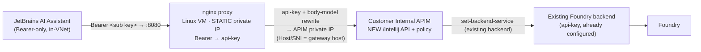

# IntelliJ BYOK bolt-on (standalone) — design & implementation plan

> **Status: BUILT — end-to-end validated against a pilot (2026-07-08).** Agreed design (**Option A**).
> The APIM pack + Foundry path is proven (`/v1/models` and `/v1/chat/completions` return `200` through
> the deployed policy). The nginx hop needs subnet egress to install (see §8 / Phase 6 for air-gapped subnets).

A self-contained deployment an operator runs against a **customer tenant** to add **JetBrains
AI Assistant (IntelliJ)** BYOK support to an **existing Internal APIM that already fronts Foundry**.
It carries **none** of the main repo's stack (no runner, register app, VPN, gov/comm harness, jwt,
managed identity, private DNS, reconciler).

**Design in one line:** one small **Linux VM running nginx on a static private IP** + a **dedicated
`/intellij` API + policy** added to the existing APIM. Nothing else.

> **Relationship to the pilots.** The main repo's proxy is an ACI + a self-healing DNS reconciler
> (right for our PaaS-first pilots). This bolt-on is a **deliberate divergence** optimized for a
> networking-averse customer: a VM with a **fixed IP** removes the reconciler *and* the private DNS
> zone entirely. The two designs are intentionally different, not drift.

---

## Prerequisites

### Network go/no-go validation

**Complete this gate before editing deployment parameters or creating resources.** This standalone
package assumes the APIM gateway is internal-only and that the proxy can be placed on a private
network path between JetBrains and APIM. A VM that merely exists or can be managed through Bastion
is not sufficient; Bastion is a management channel, not application data-plane connectivity.

All rows must be **PASS** before deployment:

| Requirement | PASS condition |
|---|---|
| **APIM ingress** | APIM is in Internal VNet mode or uses an inbound private endpoint. Its gateway hostname and private IP are known. Public-APIM upstream mode is not implemented by this package. |
| **Proxy network attachment** | Either the deployment can create a NIC in an approved subnet, or the network team supplies a validated customer-owned NIC through `proxyNicId`/`proxy_nic_id`. The NIC has one static private IP, no public IP, and can route to APIM. |
| **Client → proxy** | Every JetBrains workstation/remote VM has a private route to the planned proxy IP on TCP 8080 (same VNet, peering, VPN, or ExpressRoute). |
| **Proxy → APIM** | The proxy subnet can reach the APIM private IP on TCP 443; NSGs, UDRs, and firewalls allow the flow. |
| **TLS identity** | The APIM gateway hostname is available for the nginx `Host` header and TLS SNI even though nginx connects to APIM by private IP. |
| **Deployment access** | For deployment-created NICs, the operator can read/join the subnet. For customer NICs, the operator can read and attach that NIC to the VM. VM-RG Contributor and API Management Service Contributor are still required as listed below. |
| **Boot path** | The proxy subnet has temporary package egress for nginx installation, **or** a compatible pre-baked gallery image is ready (§9). |
| **No public HTTP** | The proxy will remain private. Do not expose port 8080 through a public IP, public load balancer, or public firewall rule; the APIM key is carried in the Bearer header over this hop. |

Gather and inspect the APIM topology (PowerShell shown; the same `az` commands work in bash):

```pwsh
$ApimRg   = '<apim-resource-group>'
$ApimName = '<apim-name>'
$SubnetId = '<proxy-subnet-resource-id>'
$ProxyIp  = '<reserved-private-ip>'

az apim show -g $ApimRg -n $ApimName --query '{
  gatewayUrl:gatewayUrl,
  virtualNetworkType:virtualNetworkType,
  privateIpAddresses:privateIpAddresses,
  publicNetworkAccess:publicNetworkAccess
}' -o json

az network vnet subnet show --ids $SubnetId --query '{
  id:id,
  addressPrefix:addressPrefix,
  delegations:delegations[].serviceName,
  nsg:networkSecurityGroup.id,
  routeTable:routeTable.id
}' -o json
```

For the usual classic Internal APIM deployment, expect `virtualNetworkType: "Internal"` and at least
one `privateIpAddresses` value. For private-endpoint APIM, obtain the approved private endpoint NIC IP
and confirm private DNS/topology with the network owner. Record the gateway host from `gatewayUrl`.

Check that the planned static IP is free:

```pwsh
# Parse the VNet name/RG from SubnetId, then:
az network vnet check-ip-address -g <vnet-rg> -n <vnet-name> --ip-address $ProxyIp -o json
# expect: "available": true
```

From an **existing test host with the same network path as the planned proxy**, verify private APIM
TLS reachability before deployment:

```bash
APIM_HOST=<gateway-host-without-https>   # e.g. apim-name.azure-api.us
APIM_IP=<apim-private-ip>
curl -sk --connect-timeout 10 \
  --resolve "$APIM_HOST:443:$APIM_IP" \
  -o /dev/null -w 'APIM HTTP %{http_code}\n' \
  "https://$APIM_HOST/status-0123456789abcdef"
# expect HTTP 200
```

The customer network owner must also confirm the intended JetBrains source subnet/CIDR can reach the
planned proxy subnet on TCP 8080. That listener does not exist until deployment, so the final proof is
the post-deploy client-side curl in §8.

**STOP and do not deploy** if any of these are true:

- No client-reachable private subnet/static IP can be provided for the proxy.
- The operator can create a VM but cannot attach its NIC to the approved subnet.
- The planned proxy network cannot reach APIM privately on 443.
- The only proposed access is Bastion management or a public HTTP endpoint on port 8080.
- The APIM private topology, NSG/UDR ownership, or source-to-proxy route is still unknown.

Next steps are owned by the customer network/platform team: provide an approved subnet and free IP,
grant the least-privilege subnet-join role below, add/verify peering or VPN/ExpressRoute, and approve
the NSG/UDR flows **JetBrains source → proxy:8080** and **proxy → APIM private IP:443**. Resume only
after the gate is documented as PASS. Do not partially deploy the APIM pack/VM while the network path
is unresolved.

#### Customer-created NIC handoff

If the deployment identity cannot create/join a NIC but the network team can provide one, use the
existing-NIC mode instead of stopping the whole deployment:

1. The network team creates a **private-only NIC** in the approved subnet and VM region.
2. The NIC has exactly one IP configuration, **Static** private allocation, the reserved proxy IP,
  no public IP, and is not attached to another VM.
3. The network team returns the full NIC resource ID and confirms both network flows in the gate.
4. Set Bicep `proxyNicId` (Terraform `proxy_nic_id`) to that ID and set
  `proxyStaticPrivateIp` / `proxy_static_private_ip` to the NIC's private IP.
5. `vmSubnetId` / `vm_subnet_id` can be empty in this mode. The deployment creates the VM and attaches
  the supplied NIC; it creates **no NIC** and never takes ownership of or deletes the customer NIC.

Example network-team creation (adjust names, cloud, and IP):

```pwsh
$NicRg    = '<network-resource-group>'
$NicName  = 'nic-byok-intellij-proxy'
$Location = '<region>'
$SubnetId = '<approved-subnet-resource-id>'
$ProxyIp  = '<reserved-private-ip>'

az network nic create `
  -g $NicRg -n $NicName -l $Location `
  --subnet $SubnetId `
  --private-ip-address $ProxyIp `
  --accelerated-networking false

$ProxyNicId = az network nic show -g $NicRg -n $NicName --query id -o tsv
```

The deploying principal needs the VM write permissions plus
`Microsoft.Network/networkInterfaces/read` and
`Microsoft.Network/networkInterfaces/join/action` on the supplied NIC.
If the supplied NIC is in a different resource group, grant the required NIC-level access there; do
not grant subnet-join rights to the deployment identity merely to consume a NIC that is already joined.
The deploy scripts stop before ARM if the NIC is missing, cross-subscription, wrong-region, dynamic,
public, has multiple IP configurations, has a different private IP, lacks a subnet, or is attached to
another VM. An existing attachment to the intended proxy VM is accepted for idempotent reruns.

### Tools on the operator's workstation
| Tool | Why | Notes |
|---|---|---|
| **Azure CLI (`az`) ≥ 2.55** | Runs the deployment and all preflight checks. | Sovereign clouds: `az cloud set --name AzureUSGovernment` (or `AzureChinaCloud`) then `az login`. |
| **Bicep** | Compiles `main.bicep` at deploy time. | Bundled with recent `az`; if missing run `az bicep install`. |
| **PowerShell 7+ (`pwsh`)** *or* **bash + `jq`** | `deploy.ps1` needs pwsh; `deploy.sh` needs bash **and `jq`** (parses the params file). | Pick one path. On Windows, pwsh is simplest. |
| **OpenSSH (`ssh-keygen`)** | Generate the VM admin key pair (`vmAdminSshPublicKey`). | Ships with Windows 10+/most Linux/macOS. |
| **`curl`** | The post-deploy validation calls (run from an in-VNet host). | — |

The deploy scripts keep secrets out of the params file: the **App Insights connection string** is read
by the template itself from `appInsightsName` + `appInsightsResourceGroup` (an existing App Insights in
the **same subscription** as APIM), and the **Foundry api-key** (when the backend needs it — see
§2) is passed inline (`-FoundryApiKey`) — so neither lands in the params file.

### Azure access the operator needs
| Scope | Role | For |
|---|---|---|
| **Subscription** | **Contributor** | Creating the proxy VM's resource group (the deployment is subscription-scoped). *Or* pre-create that RG and grant Contributor on it instead. |
| **APIM** | **API Management Service Contributor** | Adding the `/intellij` API, policies, named values, logger, product link. |
| The **VM subnet** | **`Microsoft.Network/virtualNetworks/subnets/join/action`** (+ `.../read`) on that subnet | Attaching the proxy NIC. A **custom role scoped to the single subnet** is enough — full **Network Contributor is NOT required**, and it can be scoped to just that subnet, not the whole VNet. |
| A **customer-created proxy NIC** (alternative) | `Microsoft.Network/networkInterfaces/read` + `Microsoft.Network/networkInterfaces/join/action` on that NIC | Required only when `proxyNicId` / `proxy_nic_id` is supplied. The NIC remains customer-owned and is not managed by the deployment. |
| The **existing App Insights** | **Reader** | The template reads its connection string for metrics. |
| Foundry | **none** | The bolt-on never touches Foundry — it reuses the existing APIM backend. |

> **Least-privilege subnet access.** If the customer won't grant Network Contributor, a custom role
> scoped to just the one subnet is sufficient — the deployment only needs to *join* the subnet:
> ```jsonc
> // az role definition create --role-definition <this>; then assign it at the subnet scope
> {
>   "Name": "BYOK Proxy Subnet Join",
>   "IsCustom": true,
>   "Description": "Join a NIC to one subnet for the IntelliJ BYOK proxy VM.",
>   "Actions": [
>     "Microsoft.Network/virtualNetworks/subnets/read",
>     "Microsoft.Network/virtualNetworks/subnets/join/action"
>   ],
>   "NotActions": [],
>   "DataActions": [],
>   "NotDataActions": [],
>   "AssignableScopes": ["/subscriptions/<sub>/resourceGroups/<vnet-rg>/providers/Microsoft.Network/virtualNetworks/<vnet>/subnets/<subnet>"]
> }
> ```

### Azure resource providers (registered on the target subscription)
`Microsoft.Compute`, `Microsoft.Network`, `Microsoft.ApiManagement`, `Microsoft.Insights`. Register any
missing one with `az provider register --namespace <ns>`. (APIM/Insights are already present if the
customer's APIM + App Insights exist.)

### Additional prerequisites for the Phase 6 image build (§9, air-gapped only)
Same `az` + pwsh/bash, run in a **subscription/region that HAS outbound egress**, with **Contributor**
to create a throwaway build VM and an **Azure Compute Gallery**. Nothing else — no Packer, no
container registry (ACR/MCR): this produces a **VM image**, not a container.

### Resource groups
The bolt-on touches up to four resource groups — most already exist:

| Resource group | Existing or created | Holds |
|---|---|---|
| **APIM RG** (`apimResourceGroup`) | existing | The customer's APIM. The `/intellij` API, named values, policies, logger, and diagnostic are **sub-resources of the APIM service**, so they always live in this RG. |
| **App Insights RG** | existing | The Application Insights the metrics flow to (referenced by `appInsightsName` + `appInsightsResourceGroup` in Bicep / `app_insights_name` + `app_insights_resource_group` in Terraform; **same subscription as APIM**). **Nothing is created here.** |
| **Proxy VM RG** (`vmResourceGroup`) | **created or existing** | The proxy VM + NIC. Created by default; set **`createVmResourceGroup=false`** (Bicep) / **`create_vm_resource_group=false`** (Terraform) to deploy into an **existing** RG. |
| **Images RG** (Phase 6 only) | created by the build script | The Azure Compute Gallery for the pre-baked image (`-GalleryResourceGroup`). One-time, separate from the per-customer deploy. |

**Constrained access / one-RG deployments:** if you only have **Contributor on a single RG**, set
`vmResourceGroup` to that RG and `createVmResourceGroup=false` (you don't need subscription-level
RG-create rights). To put **everything in one RG**, point `vmResourceGroup` at the **APIM RG**
(`vmResourceGroup = apimResourceGroup`) with `createVmResourceGroup=false` — the VM then lands beside
APIM, and the only remaining cross-RG reference is the **existing** App Insights (read-only).

---

## Deploy — step by step

> One deploy adds the `/intellij` API + policy to the existing APIM **and** stands up the proxy VM.
> Everything is driven by a params file; the script resolves secrets and prints the client URL.

**0. Pass the [Network go/no-go validation](#network-gono-go-validation).** Record the APIM private
IP/gateway host, approved subnet, reserved proxy IP, required routes, NSG/UDR owners, and subnet-join
permission. Stop here if any item is unresolved.

**1. Sign in to the target cloud/subscription.**
```pwsh
az cloud set --name AzureCloud          # or AzureUSGovernment / AzureChinaCloud
az login
az account set --subscription <sub-id>
```

**2. Gather the values** (details + how-to in §4 Part B). You need:
- APIM **name** + **resource group**; the APIM **private IP** and **gateway host** (`<apim>.azure-api.net`, or `.us` in Gov). Private IP: the internal APIM's private DNS `A` record, or `az apim show`/the NIC.
- The **existing Foundry backend name** on that APIM (reused via `set-backend-service`), and every **product** whose subscription keys must authorize IntelliJ (for example, standard + power tiers).
- The **App Insights name + resource group** to send metrics to (an existing one in the same subscription as APIM).
- The **subnet resource ID** for the proxy VM + one **free private IP** in it; a **region** and a **resource-group name** for the VM.
- *(optional)* the **mini** + **full** Foundry deployment names for auto-route (e.g. `gpt-4.1-mini` / `gpt-5.1`); leave blank to disable tiering.

**3. Generate the proxy VM SSH key** (public key goes in the params; private key stays with you):
```pwsh
ssh-keygen -t ed25519 -f byok-proxy-key -N '""'
```

**4. Fill in the params.** Copy the template and edit it (`main.parameters.json` is gitignored):
```pwsh
Copy-Item main.parameters.example.json main.parameters.json
# set apim*, existingBackendName, existingProductName/additionalProductNames,
# appInsightsName, appInsightsResourceGroup, location,
# vmResourceGroup, vmSubnetId, proxyStaticPrivateIp, apimPrivateIp, apimGatewayHost,
# autoRouteMiniDeployment/FullDeployment (or blank), and paste byok-proxy-key.pub into vmAdminSshPublicKey
```

**5. *(air-gapped subnets only)* Build the pre-baked image** (§9), then set `proxyImageId` in the params:
```pwsh
./scripts/build-proxy-image.ps1 -GalleryResourceGroup rg-byok-images -GalleryName byokImages -Location <region>
```

**6. Preview (optional), then deploy.** `-FoundryApiKey` supplies the key the bolt-on uses to reach Foundry — **required unless the existing backend already carries its own credential** (the bolt-on uses api-key auth, not managed identity):
```pwsh
./deploy.ps1 -ParametersFile ./main.parameters.json -WhatIf          # preview
./deploy.ps1 -ParametersFile ./main.parameters.json                  # deploy
```
The script preflights access + params, deploys, and prints the **client base URL** (`http://<proxy-ip>:8080/intellij/v1`).

**7. Validate** from an in-VNet host (see §8) — `GET /v1/models` and a chat call should return `200`.

**8. Configure JetBrains AI Assistant** on an in-VNet workstation using the profile below.

### JetBrains post-deployment configuration

Open **Settings → Tools → AI Assistant → Providers & API keys**. Under **Third-party AI providers**,
set these fields exactly:

| Field | Recommended value | Why |
|---|---|---|
| **Provider** | `OpenAI-compatible` | The bolt-on exposes OpenAI-shaped `/v1/models`, chat-completions, completions, embeddings, and responses operations. |
| **URL** | `http://<proxy-private-ip>:8080/intellij/v1` | Use the deployment's `clientBaseUrl` output, with **one slash** before `intellij` and no trailing slash. The standalone proxy accepts only this configured API path; `/openai/*` and all other paths return 404. |
| **API Key** | The developer's existing **APIM subscription key** | This is not the Foundry key. JetBrains sends it as `Authorization: Bearer`; nginx converts it to APIM's `api-key` subscription header. The key's product must be included in `existingProductName`/`additionalProductNames` (Terraform: `existing_product_name`/`additional_product_names`). |
| **Tool calling** | **Off initially** | Gives predictable single-turn chat behavior and the cleanest cost/route test. Enable only when the user needs MCP/tool or agent workflows; tool selection and tool-result continuation can legitimately add model calls. |

Click **Test Connection** and expect success, then configure **Model Assignment** on the same page:

| Assignment | Recommended value | Why |
|---|---|---|
| **Core features** | `OpenAIAPI/auto` | Core chat, in-editor generation, and commit-message requests use the APIM mini/full router. If auto-routing is disabled at deployment, select the explicit full deployment instead. |
| **Instant helpers** | `OpenAIAPI/<mini-deployment>` (for example `OpenAIAPI/gpt-4.1-mini`) | JetBrains uses this role for context collection, chat titles, and name suggestions. Pinning it to mini avoids sending every internal helper prompt through `auto`, where code/context markers can promote inexpensive helper work to full. |
| **Completion model** | Leave unassigned if the IDE permits it; otherwise use `OpenAIAPI/<mini-deployment>` only as a placeholder and disable inline completion below | JetBrains requires a Fill-in-the-Middle (FIM) model for inline completion; this bolt-on does not deploy one. Do not assign `auto` or the full chat model. If a compatible FIM deployment is added later, select it explicitly and re-enable inline completion. |
| **Context window** | `64000` initially | A conservative starting point that limits oversized IDE context. Increase only when the deployed model capacity and workload require it; JetBrains trims attachments relative to this value. |

For this BYOK-only profile, open **Settings → Editor → General → Code Completion → Inline** and
clear **Enable inline completion using language models**, or select a local-only completion option.
The supplied `gpt-5.1` and `gpt-4.1-mini` deployments are chat models, not FIM completion models.

Click **Apply/OK**, open a **new AI Chat** (existing chats can retain model state), and select
`OpenAIAPI/auto` in the chat model picker. The provider's `auto`, full, and mini models should appear
under the `OpenAIAPI` group after Test Connection. If they do not, Apply the settings, reopen the IDE,
and Test Connection again; in IDE versions that expose a separate AI Assistant **Models** page, ensure
those provider models are enabled. Start with `What is 2+2?` while Tool calling is off.

#### Expected traffic and validation

- `GET /intellij/v1/models` is normal during Test Connection, settings changes, and IDE startup.
- One visible JetBrains action can produce multiple HTTP requests because Core features, Instant helpers,
  Completion, and tool/agent loops are separate workloads. APIM/nginx do not duplicate requests.
- `copilot_byok_request` counts **all** inference calls. Application Insights pre-aggregates identical
  calls per minute, so inspect `valueCount` (shown as `calls` in the supplied KQL), not row count.
- `copilot_byok_auto_route` counts only requests whose body model was `auto`; explicit helper/other-model
  calls intentionally do not appear in that metric.
- Run [`monitoring/kql/intellij-auto-route-decisions.kql`](../../../monitoring/kql/intellij-auto-route-decisions.kql)
  after 1–3 minutes to see mini/full, reason, length band, and APIM subscription name without prompt text.

**Diagnostic profile for one-call testing:** Core=`auto`, Instant helpers=`gpt-4.1-mini`, cloud inline
completion disabled, Tool calling off, new chat. After that baseline is clean, enable Tool calling only
for users who need tools. Do not set all three assignment roles to `auto`: testing showed one simple
visible chat action fan out into 12 separately billed requests, mostly internal code/context prompts.

The standalone proxy is intentionally IntelliJ-specific. Clients using the normal full BYOK deployment
must use that deployment's normal gateway URL/path, not this proxy.

> Re-deploys: APIM/policy changes re-apply cleanly; changing the **proxy VM's** cloud-init needs a VM recreate (see the `customData` note in §8). `bash`/`deploy.sh` is the equivalent on Linux/macOS (needs `jq`).

---

## 1. What the customer gets

JetBrains **AI Assistant** points its OpenAI-compatible provider at the proxy with the **existing
APIM subscription key**:

```
Base URL : http://<proxy-static-ip>:8080/intellij/v1     (or http://proxy.byok.internal:8080/... if a DNS record is added)
API Key  : <existing APIM subscription key>
Core     : auto
Helpers  : <mini deployment> (for example gpt-4.1-mini)
Complete : disabled unless a compatible FIM deployment is provided
Tools    : off initially; enable only for tool/agent workflows
```

AI Assistant sends the key as `Authorization: Bearer` (its only option). The **nginx proxy** rewrites
it to the `api-key` header the Internal APIM requires and forwards to APIM **by private IP**; the
**dedicated `/intellij` policy** does the OpenAI-shape work (dynamic `/v1/models`, reasoning-param
strip, optional auto-route + metrics) and hands off to the customer's **existing Foundry backend**.
The standalone proxy accepts **only `/intellij/*`**; other APIM paths (for example `/openai/*`) return
404 so a client cannot silently bypass the bolt-on policy.

See **JetBrains post-deployment configuration** above for the authoritative provider, model-assignment,
Tool calling, completion, and validation settings.



**No DNS, no reconciler, no managed identity, no Foundry permissions, no dedicated/delegated subnet.**

---

## 2. Design decisions

| Topic | Decision |
|---|---|
| Proxy compute | **Linux VM** (Ubuntu `B2s`, no public IP) with a **static private IP**. Runs stock nginx (installed via cloud-init). |
| DNS | **None on our side.** Fixed IP &rarr; clients use `http://<ip>:8080/...` directly; a friendly `proxy.byok.internal` A record is **optional and owned by the customer**. |
| Reconciler | **Removed** — the IP never changes, so there is nothing to reconcile. |
| APIM reach | nginx accepts **only `/intellij/*`**, then `proxy_pass`es to the **APIM private IP** with `Host` + TLS SNI = the gateway hostname. All other paths return 404. **No DNS resolution needed by the VM.** |
| Foundry auth | **Reuse the customer's existing APIM Foundry backend** via `set-backend-service`, authenticated by **api-key** — supply `foundryApiKey`/`foundry_api_key` **unless that backend entity already carries its own credential**. **Deliberately NOT managed identity:** the standard BYOK deployment authenticates to Foundry with APIM's managed identity (+ Cognitive Services User RBAC); the bolt-on adds **no identity and no RBAC on Foundry**, riding on the customer's existing backend instead. If the key is missing when required, Foundry returns `401 "Access denied due to invalid subscription key or wrong API endpoint"`. |
| APIM API | **Dedicated** `/intellij` API (`subscriptionRequired=true`), isolated from the existing APIs. |
| Subscriptions | **Reuse the existing keys** — attach the `/intellij` API to every configured **existing product**. Create no product/subscriptions. |
| Value-adds | Dynamic `/v1/models` (runtime-discovered) + reasoning-param strip **always**; **App Insights metrics always on** (reuse an existing App Insights); auto-route **opt-in**. |
| Images | **No ACR / no build.** Stock nginx via cloud-init. |

---

## 3. What it builds

**A. APIM (config on the existing Internal APIM):**
- Named values (prefixed `intellij-*` to avoid collisions): `intellij-api-version`; if auto-route: sentinel + `mini`/`full` deployment names.
- **API** `intellij-byok` (path `/intellij`, `subscriptionRequired=true`) + operations `POST /v1/chat/completions`, `GET /v1/models` (+ optional `completions`/`embeddings`/`responses`).
- **Policies** (trimmed copies): inference (subkey) + models. The inference policy `set-backend-service`s to the **existing Foundry backend** (name is a parameter) and injects the **Foundry api-key** (`foundryApiKey`/`foundry_api_key`) as the `api-key` header — **required unless that backend entity already carries its own credential**. The bolt-on uses **api-key auth, not managed identity** (a deliberate divergence from the standard BYOK deployment, which authenticates to Foundry via APIM's managed identity).
- **Product associations:** add the API to each configured existing product so all intended key tiers work.
- **Metrics (always on):** an APIM **logger** &rarr; an **existing** App Insights + an **API-scoped diagnostic** on `/intellij`. **No App Insights is created** — it reuses the customer's existing one (in the **same subscription** as APIM, any resource group). The template reads the connection string itself from its name + resource group.

**B. Proxy VM (in the provided subnet):**
- **VM** (Ubuntu `B2s`, no public IP) + **NIC with a static private IP**.
- **cloud-init** installs nginx and drops the `nginx.conf`: `/intellij/*` only, `Authorization: Bearer <key>` &rarr; `api-key`, `proxy_pass https://<apimPrivateIp>` with `Host`/SNI = gateway host, SSE streaming; all other paths return 404.

---

## 4. Customer intake

### Part A — What needs to be set up or decided
1. **Proxy VM** — permit a small Linux VM (Ubuntu `B2s`, no public IP) running only nginx; provide a **subnet** for it and **reserve one free private IP**; confirm the subnet allows in-VNet clients &rarr; VM `:8080` and VM &rarr; APIM `:443`, and brief **outbound** to install nginx (or flag air-gapped &rarr; pre-baked image). Who owns **VM patching**?
2. **Subscription keys** — confirm every **APIM product** whose keys must authorize IntelliJ (for example, standard + power tiers).
3. *(opt)* **Auto-routing** — provide **full** + **mini** deployment names, or skip and pass through the client's model.
4. **Metrics** — provide the **name + resource group of an existing Application Insights** (in the same subscription as APIM). We create none; the `/intellij` API logs there via an API-scoped diagnostic.
5. *(opt)* **Friendly name** — add `proxy.byok.internal` &rarr; the IP in a customer-owned DNS zone if wanted.
6. **Deploy access** — the deployer needs **Contributor** on the target RG + the VM subnet, and **API Management Service Contributor** on APIM. **No Foundry permissions.**

### Part B — Values provided at deploy time (script parameters)
- APIM **name** + resource group
- APIM **private IP** + **gateway hostname**
- Existing **Foundry backend name** in APIM, and the **Foundry api-key** — required **unless that backend entity already carries its own credential** (the bolt-on authenticates to Foundry by api-key, not managed identity)
- The primary **product name**, plus any additional product tiers whose keys must authorize IntelliJ
- The **VM subnet** (resource ID) + the **reserved static IP**
- Or the customer-created **proxy NIC resource ID** + its static private IP (subnet ID may be empty)
- **Region** + **resource group** for the VM
- *(opt)* auto-route **full** + **mini** deployment names
- **Application Insights** name + resource group (required — metrics are always on; reuse an existing one in the same subscription as APIM)

---

## 5. Package layout (`samples/intellij/standalone/`)

```
samples/intellij/standalone/
  README.md                     # this doc → operator runbook
  main.bicep                    # subscription-scoped: proxy VM (own RG) + APIM /intellij pack
  main.parameters.example.json
  deploy.ps1 / deploy.sh        # preflight → deploy → print base URL → smoke test
  cloud-init.yaml               # installs nginx + writes nginx.conf (Bearer→api-key, →APIM private IP)
  cloud-init.prebaked.yaml      # config-only (no apt) for the pre-baked image path (§9)
  modules/
    intellij-apim.bicep         # API + ops + policies + backend reference + named values + product assoc + (opt) logger
    proxy-vm.bicep              # VM + NIC(static IP) + cloud-init
  policies/                     # SHARED across Bicep + Terraform
    intellij-inference.xml      # trimmed subkey inference policy (set-backend-service → existing backend)
    intellij-models.xml         # dynamic /v1/models policy
  scripts/                      # SHARED (az-native, IaC-agnostic)
    build-proxy-image.ps1 / .sh # (Phase 6) bake nginx into an Azure Compute Gallery image
  terraform/                    # Terraform route (reuses ../policies, ../cloud-init*, ../scripts) — see terraform/README.md
```

**Two IaC routes, one set of assets.** The default route is **Bicep** (`main.bicep` + `deploy.ps1/.sh`).
Teams that deploy strictly with **Terraform** use [`terraform/`](terraform/README.md) instead — it consumes
the **same** `policies/`, `cloud-init*.yaml`, and `scripts/` via `file()`/`replace()`, so the policy logic
and nginx bootstrap are identical; only the resource wiring differs. Everything is **self-contained**, not
referencing `infra/modules/`.

---

## 6. Implementation phases

- **Phase 0 — Scaffold.** Folder, `main.parameters.example.json`, this README. *(doc-only)*
- **Phase 1 — APIM pack.** `intellij-apim.bicep` + the two policies + backend reference + product associations. **Validate** each intended product-tier key with a direct `api-key` call to `https://<apim>/intellij/v1/chat/completions` and `GET .../v1/models` from an in-VNet host.
- **Phase 2 — Proxy VM.** `proxy-vm.bicep` + `cloud-init.yaml` (nginx). **Validate** Bearer&rarr;api-key end-to-end and that nginx reaches the Internal APIM **by IP**.
- **Phase 3 — Deploy script.** `deploy.ps1`/`deploy.sh`: preflight (access + param checks) &rarr; `az deployment sub create` &rarr; print the client base URL &rarr; smoke test. Plus the params example.
- **Phase 4 — Metrics.** APIM logger + API-scoped diagnostic to an **existing** App Insights (reused, not created). *(done)*
- **Phase 5 — Runbook + dry run.** Operator runbook + AI Assistant client-config (§1) + validation/troubleshooting (§8), and a full **end-to-end dry-run against the gov-pilot** (Internal APIM + Foundry): deploy succeeded, `/v1/models` + `/v1/chat/completions` returned `200` through the policy (reasoning-strip verified on `gpt-5.1`). *(done)*
- **Phase 6 — Air-gapped path.** Pre-baked Azure Compute Gallery image (nginx already installed) for subnets with no package egress — built by `scripts/build-proxy-image.ps1/.sh`, selected via the `proxyImageId` param. *(done — see §9; validated end-to-end on an air-gapped pilot subnet: VM boots, nginx serves `:8080`, client path returns `200`)*

---

## 7. Open items / risks

- **api-key location:** confirm whether the Foundry api-key sits on the **backend entity** (we inherit it via `set-backend-service`) or in the **policy** (we reference the same named value). Small policy detail; handled by a param.
- **APIM private reachability:** the VM must reach the APIM **private IP** on 443 with the gateway host as SNI — verified at deploy from the VM.
- **VM patching/compliance:** the customer owns the VM; offer auto-patch. Air-gapped subnets need the Phase 6 pre-baked image.
- **Backend path shape:** the existing Foundry backend URL must be the account root (our policy appends the deployment-scoped path); confirm at Phase 1.

---

## 8. Operator validation & troubleshooting

The proxy and APIM are private, so validate from an **in-VNet host**. The single most useful check
reproduces exactly what nginx does — send the `api-key` header to the APIM **private IP** with the
gateway host as SNI/Host:

```bash
H=<apim-gateway-host>                 # e.g. apim-xxx.azure-api.us (or .net)
curl -sk --resolve $H:443:<apim-private-ip> https://$H/intellij/v1/models \
  -H "api-key: <APIM-subscription-key>"
# expect HTTP 200 and {"object":"list","data":[ ...deployments... ]}
```

Then the same for a completion (send the body from a file to avoid shell-quoting corruption):

```bash
printf '%s' '{"model":"<deployment>","messages":[{"role":"user","content":"say hi"}]}' > /tmp/req.json
curl -sk --resolve $H:443:<apim-private-ip> https://$H/intellij/v1/chat/completions \
  -H "api-key: <APIM-subscription-key>" -H "Content-Type: application/json" --data-binary @/tmp/req.json
```

Once nginx is up, the client-facing check is `curl http://<proxy-ip>:8080/intellij/v1/models -H "Authorization: Bearer <key>"`.

Also verify the boundary: `curl -o /dev/null -w '%{http_code}\n' http://<proxy-ip>:8080/openai/v1/models`
must return **404**. In JetBrains, enter the base URL with one slash:
`http://<proxy-ip>:8080/intellij/v1`.

| Symptom | Cause / fix |
|---|---|
| `HTTP 400 ModelNotSpecified` | The JSON body didn't reach the policy intact — usually shell-quoting. Send the body from a file (`--data-binary @file`). |
| nginx `inactive`, `apt` cannot reach `azure.archive.ubuntu.com`, egress on 80/443 = `000` | **Air-gapped subnet.** cloud-init can't install nginx. Use the **Phase 6 pre-baked image**, or deploy the VM to a subnet with brief outbound egress. The `/intellij` APIM pack is unaffected. |
| `SkuNotAvailable` for the VM size | The default `Standard_B2s` isn't offered in every region (e.g. `usgovvirginia`). Pass an available `vmSize` (e.g. `Standard_D2as_v6`). |
| One visible JetBrains prompt produces many model calls | JetBrains runs separate Core, Instant-helper, Completion, and optional tool/agent tasks. Do **not** assign all roles to `auto`: use Core=`auto`, Instant helpers=`<mini deployment>`, Completion=`<FIM-capable deployment>` or disable it; disable Tool calling for single-turn tests. The gateway routes each HTTP request independently and does not duplicate calls. |
| Backend preflight WARN on a sovereign cloud | Ensure the deploy script derives ARM from `az cloud show` (fixed) rather than the commercial endpoint. |
| `Changing property 'osProfile.customData' is not allowed` on redeploy | The proxy's cloud-init is immutable once the VM exists. **APIM-only changes still apply** (the VM module fails but the APIM module succeeds). To change the proxy's nginx config, either recreate the VM (delete it, then redeploy) or edit `/etc/nginx/conf.d/byok-proxy.conf` on the VM and `sudo systemctl reload nginx`. |

---

## 9. Air-gapped subnets (pre-baked image)

Many locked-down subnets deny outbound internet (e.g. an NSG `Deny-Out-Internet` rule), so cloud-init
cannot `apt install nginx` at boot — the VM comes up with **nothing on `:8080`**. For those, bake nginx
into an **Azure Compute Gallery** image once and deploy from it. No ACR/MCR, no container registry —
this is a **VM image**, not a container.

**1. Build the image** (once per cloud, in a subscription that HAS egress):

```pwsh
./scripts/build-proxy-image.ps1 -GalleryResourceGroup rg-byok-images -GalleryName byokImages -Location <region>
# prints the image version resource id, e.g.
#   /subscriptions/.../galleries/byokImages/images/byok-proxy-nginx/versions/1.0.0
```

The script spins up a throwaway build VM (with egress), installs nginx, generalizes it, captures the
gallery image version, and deletes the build VM. The gallery image persists. Replicate to more
regions later with `az sig image-version update --target-regions`.

**2. Deploy using it** — set `proxyImageId` to that resource id (in the params file or wherever you keep
it). `proxy-vm.bicep` then boots the VM from the gallery image and uses `cloud-init.prebaked.yaml`,
which only writes the per-customer nginx config and restarts nginx — **no package egress required**.
Leave `proxyImageId` empty to keep the default install-at-boot behaviour for subnets that do have egress.

> **Validated** on an air-gapped pilot subnet (NSG `Deny-Out-Internet`): the VM booted from the image,
> nginx came up on `:8080` with **no outbound access**, and `curl http://localhost:8080/intellij/v1/models`
> through the proxy returned **HTTP 200** end-to-end (Bearer→api-key→APIM→Foundry).
>
> Build gotchas baked into the scripts: keep the install a **single line** (a multi-line here-string carries
> CRLF and silently no-ops on the VM); the image definition declares **`DiskControllerTypes=SCSI,NVMe`**
> (v6 sizes are NVMe-only) and **`SecurityType=TrustedLaunch`**; the gallery path uses **`patchMode: ImageDefault`**
> (captured images aren't registered for platform guest-patching).
